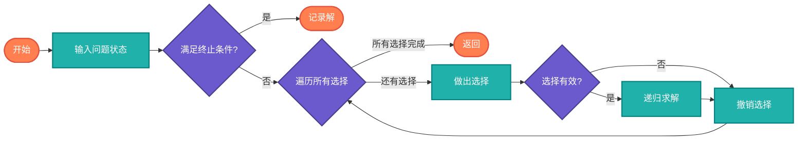

# 回溯算法（Backtracking）

> 一种通过探索所有可能的候选解来找出所有解的算法，如果候选解被确认不是一个解，就回溯到上一步。

## 算法原理

### 核心思想

```
1. 做出一个选择
2. 递归地尝试解决剩余问题
3. 如果当前选择导致无解，撤销选择（回溯）
4. 尝试其他选择
```

### 经典问题

| 问题 | 描述 | 约束条件 |
|------|------|----------|
| N皇后 | 在N×N棋盘上放置N个皇后 | 不互相攻击 |
| 数独求解 | 填充9×9网格 | 行列宫不重复 |
| 全排列 | 输出数组的所有排列 | 无重复元素 |
| 子集和 | 找出和为目标值的子集 | 元素和等于目标 |
| 图着色 | 用最少的颜色给图着色 | 相邻节点不同色 |

---

## 复杂度分析

| 问题 | 时间复杂度 | 空间复杂度 |
|------|-----------|-----------|
| N皇后 | O(N!) | O(N) |
| 全排列 | O(N!) | O(N) |
| 子集枚举 | O(2^N) | O(N) |

## 算法流程



---

## 适用场景

- **组合优化**：排列、组合、子集问题
- **约束满足**：N皇后、数独、填字游戏
- **路径搜索**：迷宫、游戏树
- **图问题**：哈密尔顿路径、图着色

---

## 实现列表

| 语言 | 文件名 | 说明 |
|------|--------|------|
| C | [nqueens.c](./nqueens.c) | N皇后实现 |
| Java | [NQueens.java](./NQueens.java) | 类封装 |
| Go | [backtracking.go](./backtracking.go) | 简洁实现 |
| Python | [backtracking.py](./backtracking.py) | 简洁实现 |
| JavaScript | [backtracking.js](./backtracking.js) | 递归实现 |
| TypeScript | [Backtracking.ts](./Backtracking.ts) | 类型安全 |
| Rust | [backtracking.rs](./backtracking.rs) | 内存安全 |

---

## 使用示例

### Python 版本
```python
# N皇后
solutions = solve_n_queens(4)
# [[".Q..","...Q","Q...","..Q."], ["..Q.","Q...","...Q",".Q.."]]

# 全排列
perms = permutations([1, 2, 3])
# [[1,2,3], [1,3,2], [2,1,3], [2,3,1], [3,1,2], [3,2,1]]
```

---

## 扩展阅读

- 剪枝优化
- 分支限界法
- Dancing Links算法
