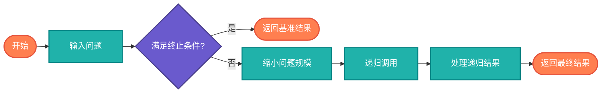

# 递归基础（Basic Recursion）

> 递归基本概念和简单示例，帮助理解递归的思维模式。

## 算法原理

### 递归三要素

1. **终止条件**：递归何时结束
2. **递归调用**：函数调用自身
3. **缩小问题规模**：每次调用向终止条件靠近

### 经典示例

| 示例 | 描述 | 终止条件 |
|------|------|----------|
| 计数 | 从n数到1 | n <= 0 |
| 求和 | 1+2+...+n | n == 1 |
| 数组求和 | 数组元素累加 | 空数组 |
| 字符串反转 | 字符倒序 | 空串 |

---

## 复杂度分析

| 指标 | 复杂度 | 说明 |
|------|--------|------|
| **时间复杂度** | 视问题而定 | 取决于递归次数 |
| **空间复杂度** | O(递归深度) | 调用栈占用 |

## 算法流程



---

## 适用场景

- **分治算法**：将问题分解为子问题
- **树/图遍历**：天然递归结构
- **数学计算**：阶乘、斐波那契等
- **问题求解**：回溯、动态规划

---

## 实现列表

| 语言 | 文件名 | 说明 |
|------|--------|------|
| C | [basic_recursion.c](./basic_recursion.c) | 基础示例 |
| Java | [BasicRecursion.java](./BasicRecursion.java) | 类封装 |
| Go | [basic_recursion.go](./basic_recursion.go) | 简洁实现 |
| Python | [basic_recursion.py](./basic_recursion.py) | 多种示例 |
| JavaScript | [basic_recursion.js](./basic_recursion.js) | 函数式风格 |
| TypeScript | [BasicRecursion.ts](./BasicRecursion.ts) | 类型安全 |
| Rust | [basic_recursion.rs](./basic_recursion.rs) | 内存安全 |

---

## 使用示例

### Python 版本
```python
# 递归计数
countdown(5)  # 5 4 3 2 1

# 数组求和
result = array_sum([1, 2, 3, 4, 5])  # 15

# 字符串反转
result = reverse_string("hello")  # "olleh"
```

---

## 扩展阅读

- 尾递归优化
- 递归vs迭代
- 调用栈原理
