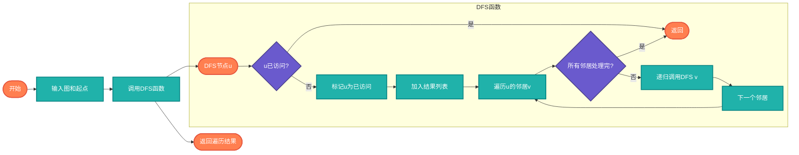

# 递归实现DFS/BFS（DFS/BFS Recursion）

> 使用递归实现深度优先搜索和广度优先搜索。

## 算法原理

### 递归DFS

DFS天然适合递归实现：
```
1. 标记当前节点为已访问
2. 对每个未访问的邻居递归调用DFS
3. 递归返回时回溯
```

### 递归BFS

BFS通常用队列迭代实现，但也可以用递归模拟：
```
1. 按层处理节点
2. 递归处理下一层
```

---

## 复杂度分析

| 指标 | 复杂度 | 说明 |
|------|--------|------|
| **时间复杂度** | O(V+E) | V顶点数，E边数 |
| **空间复杂度** | O(V) | 递归栈或队列 |

## 算法流程（递归DFS）



---

## 适用场景

- **树遍历**：递归DFS是标准做法
- **连通分量**：查找连通区域
- **路径搜索**：寻找有效路径
- **拓扑排序**：依赖关系处理

---

## 实现列表

| 语言 | 文件名 | 说明 |
|------|--------|------|
| C | [dfs_bfs_recursive.c](./dfs_bfs_recursive.c) | 递归实现 |
| Java | [DFS_BFS.java](./DFS_BFS.java) | 递归实现 |
| Go | [dfs_bfs_recursive.go](./dfs_bfs_recursive.go) | 递归实现 |
| Python | [dfs_bfs_recursive.py](./dfs_bfs_recursive.py) | 递归实现 |
| JavaScript | [dfs_bfs_recursive.js](./dfs_bfs_recursive.js) | 递归实现 |
| TypeScript | [DFS_BFS_Recursive.ts](./DFS_BFS_Recursive.ts) | 类型安全 |
| Rust | [dfs_bfs_recursive.rs](./dfs_bfs_recursive.rs) | 递归实现 |

---

## 使用示例

### Python 版本
```python
# 递归DFS
dfs_recursive(graph, 0, visited)

# 递归BFS
bfs_recursive(graph, [0], visited)
```

---

## 扩展阅读

- 迭代vs递归实现对比
- 尾递归优化
- 图的遍历应用
