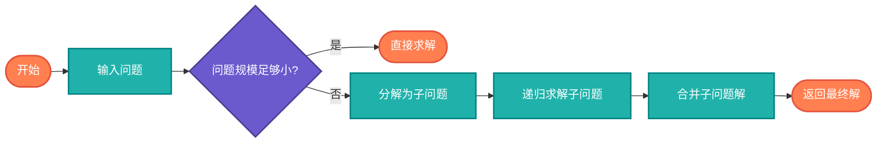

# 分治算法（Divide and Conquer）

> 将问题分解为若干子问题，递归解决子问题，合并子问题结果得到原问题解。

## 算法原理

### 分治三步法

1. **分解**：将问题分为若干子问题
2. **解决**：递归地解决子问题
3. **合并**：将子问题的解合并为原问题的解

### 经典应用

| 算法 | 分解方式 | 合并方式 |
|------|----------|----------|
| 归并排序 | 数组分两半 | 合并两个有序数组 |
| 快速排序 | 按枢轴分组 | 无需合并（原地） |
| 二分查找 | 中间元素 | 返回结果 |
| 最大子数组 | 分三部分 | 取最大值 |

---

## 复杂度分析

| 算法 | 时间复杂度 | 空间复杂度 |
|------|-----------|-----------|
| 归并排序 | O(n log n) | O(n) |
| 快速排序 | O(n log n) | O(log n)栈 |
| 二分查找 | O(log n) | O(log n)栈 |

## 算法流程



---

## 适用场景

- **排序算法**：归并排序、快速排序
- **搜索算法**：二分查找
- **几何问题**：最近点对
- **矩阵运算**：Strassen算法
- **傅里叶变换**：FFT

---

## 实现列表

| 语言 | 文件名 | 说明 |
|------|--------|------|
| C | [divide_conquer.c](./divide_conquer.c) | 多种算法 |
| Java | [DivideConquer.java](./DivideConquer.java) | 类封装 |
| Go | [divide_conquer.go](./divide_conquer.go) | 简洁实现 |
| Python | [divide_conquer.py](./divide_conquer.py) | 多种示例 |
| JavaScript | [divide_conquer.js](./divide_conquer.js) | 递归实现 |
| TypeScript | [DivideConquer.ts](./DivideConquer.ts) | 类型安全 |
| Rust | [divide_conquer.rs](./divide_conquer.rs) | 泛型实现 |

---

## 使用示例

### Python 版本
```python
# 归并排序
result = merge_sort([3, 1, 4, 1, 5, 9, 2, 6])
# [1, 1, 2, 3, 4, 5, 6, 9]

# 最大子数组（分治版）
result = max_subarray_dc([-2, 1, -3, 4, -1, 2, 1, -5, 4])
# 6 (子数组 [4, -1, 2, 1])
```

---

## 扩展阅读

- 主定理（复杂度分析）
- Karatsuba乘法
- Strassen矩阵乘法
