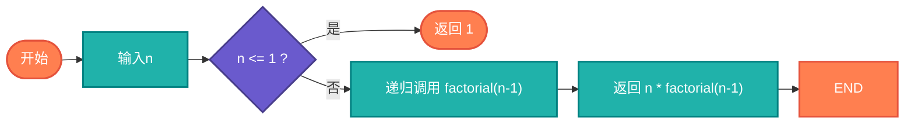

# 阶乘计算（Factorial）

> 阶乘是递归的经典入门示例，展示了递归和迭代两种实现方式。

## 算法原理

### 定义

```
n! = n × (n-1) × (n-2) × ... × 1
0! = 1

递归定义:
n! = n × (n-1)!  (n > 0)
0! = 1
```

### 实现方式

| 方式 | 代码 | 特点 |
|------|------|------|
| 递归 | `return n * factorial(n-1)` | 直观，有栈溢出风险 |
| 迭代 | 循环累积乘积 | 高效，无栈溢出 |
| 尾递归 | 带累加器的递归 | 可优化为迭代 |

---

## 复杂度分析

| 指标 | 复杂度 | 说明 |
|------|--------|------|
| **时间复杂度** | O(n) | n次乘法 |
| **空间复杂度** | O(n)递归/O(1)迭代 | 递归栈深度 |

## 算法流程



---

## 适用场景

- **组合数学**：排列组合计算
- **概率统计**：概率分布公式
- **泰勒展开**：e^x, sin(x)等展开
- **教学演示**：递归入门示例

---

## 实现列表

| 语言 | 文件名 | 说明 |
|------|--------|------|
| C | [factorial.c](./factorial.c) | 递归/迭代 |
| Java | [Factorial.java](./Factorial.java) | 类封装 |
| Go | [factorial.go](./factorial.go) | 简洁实现 |
| Python | [factorial.py](./factorial.py) | 递归实现 |
| JavaScript | [factorial.js](./factorial.js) | 多种方法 |
| TypeScript | [Factorial.ts](./Factorial.ts) | 类型安全 |
| Rust | [factorial.rs](./factorial.rs) | 泛型实现 |

---

## 使用示例

### Python 版本
```python
# 递归版本
result = factorial_recursive(5)  # 120

# 迭代版本
result = factorial_iterative(5)  # 120
```

---

## 扩展阅读

- 斯特林公式（阶乘近似）
- Gamma函数（阶乘扩展）
- 大数阶乘处理
