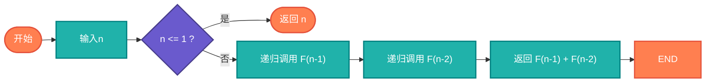

# 递归斐波那契（Fibonacci Recursion）

> 使用递归计算斐波那契数列，经典的递归示例。

## 算法原理

### 递归定义

```
F(0) = 0, F(1) = 1
F(n) = F(n-1) + F(n-2)  (n ≥ 2)
```

### 调用树

```
F(5)
├── F(4)
│   ├── F(3)
│   │   ├── F(2)
│   │   └── F(1)
│   └── F(2)
└── F(3)
    ├── F(2)
    └── F(1)
```

---

## 复杂度分析

| 实现方式 | 时间复杂度 | 空间复杂度 |
|----------|-----------|-----------|
| 朴素递归 | O(2^n) | O(n)栈空间 |
| 记忆化递归 | O(n) | O(n) |

## 算法流程



---

## 适用场景

- **递归教学**：经典递归示例
- **算法分析**：展示递归低效性
- **动态规划**：引入DP优化

---

## 实现列表

| 语言 | 文件名 | 说明 |
|------|--------|------|
| C | [fibonacci_recursive.c](./fibonacci_recursive.c) | 递归实现 |
| Java | [FibonacciRecursive.java](./FibonacciRecursive.java) | 记忆化版本 |
| Go | [fibonacci_recursive.go](./fibonacci_recursive.go) | 递归实现 |
| Python | [fibonacci_recursive.py](./fibonacci_recursive.py) | lru_cache |
| JavaScript | [fibonacci_recursive.js](./fibonacci_recursive.js) | 递归实现 |
| TypeScript | [FibonacciRecursive.ts](./FibonacciRecursive.ts) | 类型安全 |
| Rust | [fibonacci_recursive.rs](./fibonacci_recursive.rs) | 递归实现 |

---

## 使用示例

### Python 版本
```python
# 朴素递归（慢）
result = fibonacci_recursive(10)  # 55

# 记忆化递归（快）
result = fibonacci_memo(100)  # 354224848179261915075
```

---

## 扩展阅读

- 记忆化技术
- 尾递归优化
- 迭代替代方案
