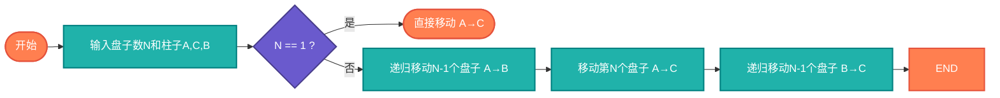

# 汉诺塔（Hanoi Tower）

> 经典的递归问题，展示分治思想的完美示例。

## 算法原理

### 问题描述

有三根柱子和N个大小不同的盘子，盘子按大小顺序叠放（小在上）。目标是将所有盘子从A柱移动到C柱，规则：
1. 每次只能移动一个盘子
2. 大盘子不能放在小盘子上面

### 递归解法

```
将N个盘子从A移动到C（借助B）:
1. 将N-1个盘子从A移动到B（借助C）
2. 将第N个盘子从A移动到C
3. 将N-1个盘子从B移动到C（借助A）

递归出口: N=1时，直接移动
```

### 移动步骤示例（3个盘子）

```
1. A → C
2. A → B
3. C → B
4. A → C
5. B → A
6. B → C
7. A → C
```

---

## 复杂度分析

| 指标 | 复杂度 | 说明 |
|------|--------|------|
| **时间复杂度** | O(2^N) | 移动次数2^N-1 |
| **空间复杂度** | O(N) | 递归栈深度 |

## 算法流程



---

## 适用场景

- **递归教学**：经典递归示例
- **分治思想**：问题分解示范
- **智力游戏**：逻辑训练
- **算法竞赛**：递归思维考察

---

## 实现列表

| 语言 | 文件名 | 说明 |
|------|--------|------|
| C | [hanoi.c](./hanoi.c) | 递归实现 |
| Java | [Hanoi.java](./Hanoi.java) | 类封装 |
| Go | [hanoi.go](./hanoi.go) | 简洁实现 |
| Python | [hanoi.py](./hanoi.py) | 递归实现 |
| JavaScript | [hanoi.js](./hanoi.js) | 可视化版本 |
| TypeScript | [Hanoi.ts](./Hanoi.ts) | 类型安全 |
| Rust | [hanoi.rs](./hanoi.rs) | 迭代器实现 |

---

## 使用示例

### Python 版本
```python
# 移动盘子并打印步骤
hanoi(3, 'A', 'C', 'B')
# 输出7步移动过程

# 只计算移动次数
count = hanoi_count(3)  # 7
```

---

## 扩展阅读

- 最少移动次数证明（2^N-1）
- 非递归实现（栈模拟）
- 四柱汉诺塔（Frame-Stewart算法）
