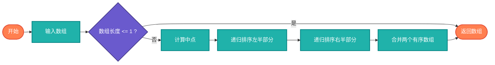

# 递归排序算法（Recursive Sorting）

> 使用递归实现的排序算法，包括归并排序和快速排序。

## 算法原理

### 归并排序（Merge Sort）

```
1. 将数组从中间分成两半
2. 递归地对两半进行排序
3. 合并两个有序数组
```

### 快速排序（Quick Sort）

```
1. 选择枢轴元素
2. 将数组分为小于枢轴和大于枢轴两部分
3. 递归地对两部分进行排序
```

---

## 复杂度分析

| 算法 | 平均时间 | 最坏时间 | 空间复杂度 |
|------|----------|----------|-----------|
| 归并排序 | O(n log n) | O(n log n) | O(n) |
| 快速排序 | O(n log n) | O(n²) | O(log n)栈 |

## 算法流程（归并排序）



---

## 适用场景

- **大规模数据**：时间复杂度稳定
- **链表排序**：归并排序适合
- **内存受限**：快速排序原地排序
- **稳定性需求**：归并排序稳定

---

## 实现列表

| 语言 | 文件名 | 说明 |
|------|--------|------|
| C | [merge_sort_recursive.c](./merge_sort_recursive.c) | 归并排序 |
| C | [quick_sort_recursive.c](./quick_sort_recursive.c) | 快速排序 |
| Java | [RecursiveSort.java](./RecursiveSort.java) | 两种排序 |
| Go | [sorting_recursive.go](./sorting_recursive.go) | 递归排序 |
| Python | [sorting_recursive.py](./sorting_recursive.py) | 递归排序 |
| JavaScript | [sorting_recursive.js](./sorting_recursive.js) | 递归排序 |
| TypeScript | [SortingRecursive.ts](./SortingRecursive.ts) | 类型安全 |
| Rust | [sorting_recursive.rs](./sorting_recursive.rs) | 泛型实现 |

---

## 使用示例

### Python 版本
```python
# 归并排序
result = merge_sort([3, 1, 4, 1, 5, 9, 2, 6])
# [1, 1, 2, 3, 4, 5, 6, 9]

# 快速排序
result = quick_sort([3, 1, 4, 1, 5, 9, 2, 6])
# [1, 1, 2, 3, 4, 5, 6, 9]
```

---

## 扩展阅读

- 非递归版本实现
- 三路快排优化
- TimSort（归并+插入）
