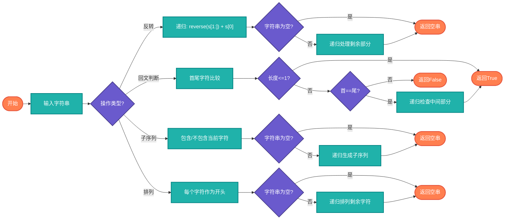

# 字符串递归操作（String Recursion）

> 使用递归处理字符串相关问题。

## 算法原理

### 常见递归操作

| 操作 | 递归定义 | 终止条件 |
|------|----------|----------|
| 反转 | reverse(s) = reverse(s[1:]) + s[0] | 空串 |
| 回文判断 | 首字符==尾字符且中间是回文 | 长度<=1 |
| 子序列 | 包含/不包含当前字符 | 空串 |
| 排列 | 每个字符作为开头 | 空串 |

---

## 复杂度分析

| 操作 | 时间复杂度 | 空间复杂度 |
|------|-----------|-----------|
| 字符串反转 | O(n) | O(n)栈 |
| 回文判断 | O(n) | O(n)栈 |
| 全排列 | O(n!) | O(n)栈 |
| 子序列 | O(2^n) | O(n)栈 |

## 算法流程



---

## 适用场景

- **字符串处理**：反转、回文、子串
- **模式匹配**：递归正则表达式
- **生成问题**：排列、组合、子集
- **解析器实现**：语法树递归下降

---

## 实现列表

| 语言 | 文件名 | 说明 |
|------|--------|------|
| C | [string_recursion.c](./string_recursion.c) | 递归实现 |
| Java | [StringRecursion.java](./StringRecursion.java) | 类封装 |
| Go | [string_recursion.go](./string_recursion.go) | 递归实现 |
| Python | [string_recursion.py](./string_recursion.py) | 递归实现 |
| JavaScript | [string_recursion.js](./string_recursion.js) | 递归实现 |
| TypeScript | [StringRecursion.ts](./StringRecursion.ts) | 类型安全 |
| Rust | [string_recursion.rs](./string_recursion.rs) | 递归实现 |

---

## 使用示例

### Python 版本
```python
# 字符串反转
result = reverse_string("hello")  # "olleh"

# 回文判断
result = is_palindrome("racecar")  # True

# 所有子序列
result = all_subsequences("abc")
# ['', 'a', 'b', 'c', 'ab', 'ac', 'bc', 'abc']
```

---

## 扩展阅读

- 迭代vs递归字符串处理
- 尾递归优化
- 字符串动态规划
