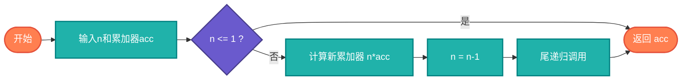

# 尾递归（Tail Recursion）

> 一种特殊的递归形式，递归调用是函数的最后操作，可以被编译器优化为迭代。

## 算法原理

### 尾递归定义

递归调用是函数的最后一步，且返回值不依赖于递归调用：

```python
# 尾递归：可以优化
def factorial(n, acc=1):
    if n <= 1: return acc
    return factorial(n-1, n*acc)  # 最后操作

# 非尾递归：无法直接优化
def factorial(n):
    if n <= 1: return 1
    return n * factorial(n-1)  # 需要n乘以递归结果
```

### 优化原理

编译器可以将尾递归转换为循环，避免栈溢出：
```
尾递归 → 循环（O(1)空间）
```

---

## 复杂度分析

| 类型 | 时间复杂度 | 空间复杂度 |
|------|-----------|-----------|
| 普通递归 | O(n) | O(n)栈 |
| 尾递归 | O(n) | O(1)可优化 |

## 算法流程



---

## 适用场景

- **函数式编程**：Haskell、Scheme等语言
- **栈安全**：避免递归深度过大
- **递归转迭代**：手动优化参考

---

## 实现列表

| 语言 | 文件名 | 说明 |
|------|--------|------|
| C | [tail_recursion.c](./tail_recursion.c) | GCC优化 |
| Java | [TailRecursion.java](./TailRecursion.java) | 模拟实现 |
| Go | [tail_recursion.go](./tail_recursion.go) | 循环模拟 |
| Python | [tail_recursion.py](./tail_recursion.py) | 装饰器优化 |
| JavaScript | [tail_recursion.js](./tail_recursion.js) | 蹦床函数 |
| TypeScript | [TailRecursion.ts](./TailRecursion.ts) | 类型安全 |
| Rust | [tail_recursion.rs](./tail_recursion.rs) | 编译器优化 |

---

## 使用示例

### Python 版本
```python
# 尾递归阶乘
def factorial_tail(n, acc=1):
    if n <= 1:
        return acc
    return factorial_tail(n-1, n*acc)

# 蹦床优化（避免栈溢出）
def trampoline(func):
    def wrapper(*args):
        result = func(*args)
        while callable(result):
            result = result()
        return result
    return wrapper
```

---

## 扩展阅读

- 延续传递风格（CPS）
- 蹦床函数（Trampoline）
- 不同语言的尾递归支持
