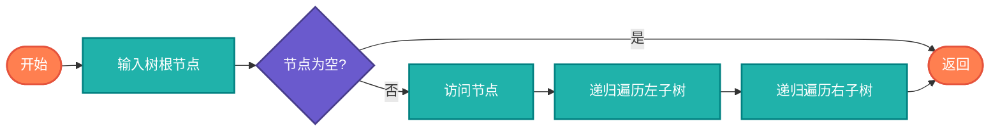

# 树递归（Tree Recursion）

> 递归在树结构中的自然应用，树的前序、中序、后序遍历。

## 算法原理

### 树的递归结构

树由根节点和若干子树组成，天然适合递归：
```
Tree:
  root
  /   \
left  right
```

### 遍历方式

| 遍历 | 顺序 | 应用 |
|------|------|------|
| 前序 | 根-左-右 | 复制树、序列化 |
| 中序 | 左-根-右 | BST排序输出 |
| 后序 | 左-右-根 | 删除树、计算高度 |
| 层序 | 按层 | BFS实现 |

---

## 复杂度分析

| 指标 | 复杂度 | 说明 |
|------|--------|------|
| **时间复杂度** | O(n) | 访问每个节点一次 |
| **空间复杂度** | O(h) | h为树高度，递归栈 |

## 算法流程（前序遍历）



---

## 适用场景

- **树遍历**：所有遍历方式
- **表达式树**：求值、打印
- **文件系统**：目录遍历
- **DOM操作**：HTML/XML处理

---

## 实现列表

| 语言 | 文件名 | 说明 |
|------|--------|------|
| C | [tree_recursion.c](./tree_recursion.c) | 递归遍历 |
| Java | [TreeRecursion.java](./TreeRecursion.java) | 类封装 |
| Go | [tree_recursion.go](./tree_recursion.go) | 递归实现 |
| Python | [tree_recursion.py](./tree_recursion.py) | 递归遍历 |
| JavaScript | [tree_recursion.js](./tree_recursion.js) | 递归实现 |
| TypeScript | [TreeRecursion.ts](./TreeRecursion.ts) | 类型安全 |
| Rust | [tree_recursion.rs](./tree_recursion.rs) | 递归实现 |

---

## 使用示例

### Python 版本
```python
class TreeNode:
    def __init__(self, val=0, left=None, right=None):
        self.val = val
        self.left = left
        self.right = right

# 前序遍历
def preorder(root):
    if not root: return []
    return [root.val] + preorder(root.left) + preorder(root.right)

# 中序遍历
def inorder(root):
    if not root: return []
    return inorder(root.left) + [root.val] + inorder(root.right)
```

---

## 扩展阅读

- Morris遍历（O(1)空间）
- 树的序列化与反序列化
- 递归转迭代（栈模拟）
