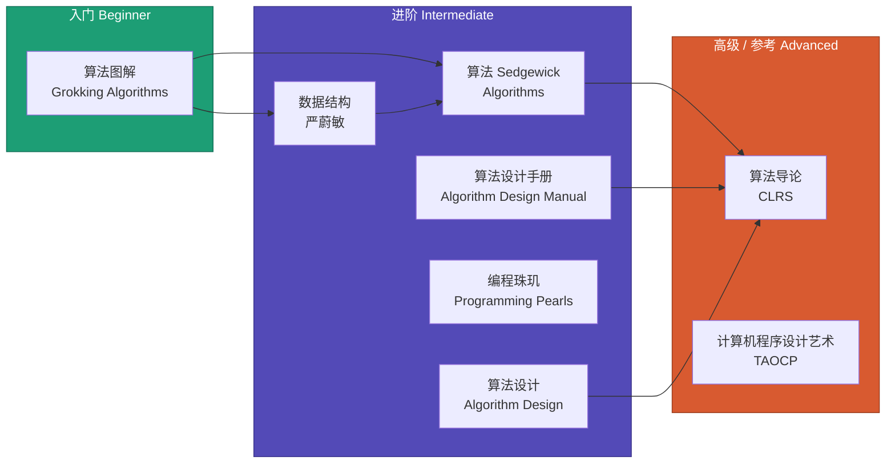

# 算法与数据结构经典书籍推荐

> 读书不是为了记住每一页，而是为了在遇到问题时，知道答案藏在哪本书里。

学算法，光刷题不够，还得读几本好书。好的算法书不只教你"怎么做"，更教你"怎么想"——这才是算法学习的核心。

下面推荐 8 本经过时间检验的经典书籍，从入门到进阶到参考手册，覆盖不同阶段的学习需求。

---

## 快速导航

---

## 推荐书籍一览

| 书名 | 作者 | 难度 | 侧重点 | 详情 |
|------|------|------|--------|------|
| 《算法图解》 | Aditya Bhargava | 入门 | 图解入门，直觉建立 | [查看](./grokking-algorithms.md) |
| 《数据结构（C语言版）》 | 严蔚敏 | 入门/进阶 | 数据结构基础，中文经典教材 | [查看](./data-structures-yan-weimin.md) |
| 《算法》 | Sedgewick & Wayne | 进阶 | 系统学习，配套 Princeton 课程 | [查看](./algorithms-sedgewick.md) |
| 《算法设计手册》 | Steven Skiena | 进阶 | 实战导向，工程问题解决 | [查看](./algorithm-design-manual.md) |
| 《编程珠玑》 | Jon Bentley | 进阶 | 算法思维训练，问题分析方法 | [查看](./programming-pearls.md) |
| 《算法设计》 | Kleinberg & Tardos | 进阶 | 算法设计范式，理论与实践结合 | [查看](./algorithm-design.md) |
| 《算法导论》 | Cormen et al. (CLRS) | 高级/参考 | 全面参考手册，数学严谨 | [查看](./introduction-to-algorithms.md) |
| 《计算机程序设计艺术》 | Donald Knuth | 高级/参考 | 计算机科学的圣经级著作 | [查看](./art-of-computer-programming.md) |

---

## 按难度分级

### 入门级（Beginner）

刚接触算法，需要建立直觉和信心：

- **[《算法图解》](./grokking-algorithms.md)** — 用图画讲算法，零基础也能看懂，Python 示例
- **[《数据结构（C语言版）》](./data-structures-yan-weimin.md)** — 国内 CS 专业标配教材，打好数据结构基本功

### 进阶级（Intermediate）

有一定编程基础，想系统深入：

- **[《算法》Sedgewick](./algorithms-sedgewick.md)** — 配合 Coursera 课程，Java 实现，理论与实践平衡
- **[《算法设计手册》](./algorithm-design-manual.md)** — 从工程实战角度讲算法，附有问题分类目录
- **[《编程珠玑》](./programming-pearls.md)** — 教你怎么"想"问题，经典思维训练
- **[《算法设计》](./algorithm-design.md)** — 聚焦算法设计范式，Cornell 等名校教材

### 高级 / 参考（Advanced / Reference）

需要严谨全面的参考，或深入研究特定主题：

- **[《算法导论》CLRS](./introduction-to-algorithms.md)** — 算法领域的"百科全书"，MIT 教材
- **[《计算机程序设计艺术》TAOCP](./art-of-computer-programming.md)** — Knuth 毕生心血，计算机科学的丰碑

---

## 怎么选书？

| 你的情况 | 推荐 | 理由 |
|---------|------|------|
| 完全没学过算法，想入门 | 《算法图解》 | 图文并茂，门槛最低 |
| CS 科班学生，上数据结构课 | 《数据结构》严蔚敏 | 国内高校标准教材 |
| 想系统学算法，有 Java 基础 | 《算法》Sedgewick | 配套 Coursera 视频，体系完整 |
| 工作中遇到算法问题，需要实用参考 | 《算法设计手册》 | "战争故事"来自真实项目 |
| 想提升算法思维和问题分析能力 | 《编程珠玑》 | 教你把问题想清楚再动手 |
| 准备面试或竞赛，需要设计技巧 | 《算法设计》 | 设计范式讲解深入透彻 |
| 需要查阅某个算法的严谨分析 | 《算法导论》CLRS | 最全面的算法参考手册 |
| 对算法底层理论有极致追求 | 《TAOCP》 | 不求读完，但值得翻阅 |

---

## 返回

- [资源与素材](../README.md)
- [入门指南](../../start-here/)
- [项目首页](../../README.md)
