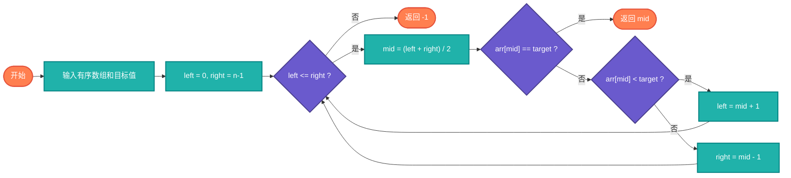

# 二分查找（Binary Search）

> 在有序数组中高效查找目标元素，时间复杂度O(log n)。

## 算法原理

### 核心思想

通过不断将搜索范围减半来快速定位目标：
```
1. 确定中间元素
2. 如果等于目标，返回位置
3. 如果目标较小，在左半部分继续查找
4. 如果目标较大，在右半部分继续查找
5. 重复直到找到或范围为空
```

### 边界处理

| 变体 | 查找目标 | 返回 |
|------|----------|------|
| 标准 | 目标值 | 索引或-1 |
| 下界 | 第一个≥目标 | 插入位置 |
| 上界 | 第一个>目标 | 插入位置 |

---

## 复杂度分析

| 指标 | 复杂度 | 说明 |
|------|--------|------|
| **时间复杂度** | O(log n) | 每次减半 |
| **空间复杂度** | O(1) | 迭代实现 |

## 算法流程



---

## 适用场景

- **有序数组查找**：数据库索引
- **范围查询**：查找区间
- **最优值搜索**：单调函数求根
- **旋转数组**：变形问题

---

## 实现列表

| 语言 | 文件名 | 说明 |
|------|--------|------|
| C | [binary_search.c](./binary_search.c) | 迭代实现 |
| Java | [BinarySearch.java](./BinarySearch.java) | Arrays.binarySearch |
| Go | [binary_search.go](./binary_search.go) | sort.Search |
| Python | [binary_search.py](./binary_search.py) | bisect模块 |
| JavaScript | [binary_search.js](./binary_search.js) | 迭代实现 |
| TypeScript | [BinarySearch.ts](./BinarySearch.ts) | 类型安全 |
| Rust | [binary_search.rs](./binary_search.rs) | 标准库 |

---

## 使用示例

### Python 版本
```python
# 标准二分查找
index = binary_search([1, 3, 5, 7, 9], 5)  # 2

# 查找插入位置
pos = lower_bound([1, 3, 5, 7], 4)  # 2
```

---

## 扩展阅读

- 三分搜索（单峰函数）
- 指数搜索
- 插值搜索
