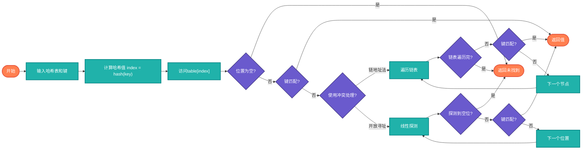

# 哈希查找（Hash Search）

> 利用哈希表实现O(1)时间复杂度的查找。

## 算法原理

### 核心思想

通过哈希函数将键映射到数组索引：
```
1. 计算键的哈希值：index = hash(key) % size
2. 直接访问对应位置
3. 处理冲突（链地址法或开放寻址法）
```

### 冲突处理

| 方法 | 说明 | 特点 |
|------|------|------|
| 链地址法 | 每个桶存储链表 | 简单，内存灵活 |
| 开放寻址 | 冲突时探测下一个位置 | 无指针，缓存友好 |

---

## 复杂度分析

| 指标 | 平均 | 最坏 | 说明 |
|------|------|------|------|
| **查找** | O(1) | O(n) | 冲突严重时退化 |
| **插入** | O(1) | O(n) | 需扩容时O(n) |
| **删除** | O(1) | O(n) | |

## 算法流程（查找）



---

## 适用场景

- **快速查找**：键值对存储
- **去重判断**：集合实现
- **缓存系统**：LRU Cache
- **数据库索引**：哈希索引

---

## 实现列表

| 语言 | 文件名 | 说明 |
|------|--------|------|
| C | [hash_search.c](./hash_search.c) | 手动实现 |
| Java | [HashSearch.java](./HashSearch.java) | HashMap |
| Go | [hash_search.go](./hash_search.go) | map实现 |
| Python | [hash_search.py](./hash_search.py) | dict |
| JavaScript | [hash_search.js](./hash_search.js) | Map对象 |
| TypeScript | [HashSearch.ts](./HashSearch.ts) | Map类型 |
| Rust | [hash_search.rs](./hash_search.rs) | HashMap |

---

## 使用示例

### Python 版本
```python
# 使用内置dict
hash_table = {'apple': 5, 'banana': 3}
value = hash_table.get('apple')  # 5

# 手动实现
class HashTable:
    def __init__(self):
        self.size = 100
        self.table = [[] for _ in range(self.size)]
    
    def put(self, key, value):
        index = hash(key) % self.size
        self.table[index].append((key, value))
```

---

## 扩展阅读

- 一致性哈希
- 布隆过滤器
- 完美哈希
