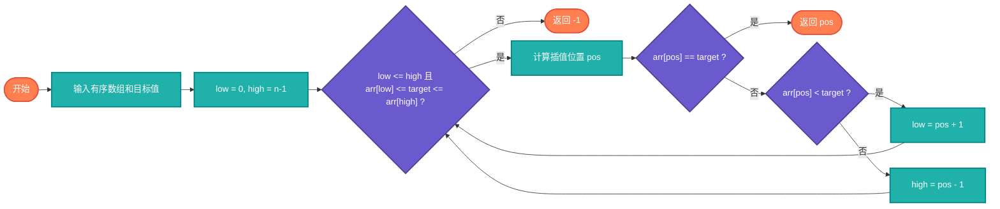

# 插值查找（Interpolation Search）

> 针对均匀分布的有序数组的改进查找算法，通过插值预测位置。

## 算法原理

### 核心思想

根据目标值与边界的比例估算位置：
```
pos = low + (target - arr[low]) × (high - low) / (arr[high] - arr[low])
```

适用于均匀分布的数据，可以更快定位目标。

---

## 复杂度分析

| 指标 | 复杂度 | 说明 |
|------|--------|------|
| **平均时间** | O(log log n) | 均匀分布数据 |
| **最坏时间** | O(n) | 极度不均匀 |
| **空间复杂度** | O(1) | 原地查找 |

## 算法流程



---

## 适用场景

- **均匀分布数据**：如电话号码簿
- **大型有序数组**：比二分查找更快
- **数值数据**：适合插值计算

---

## 实现列表

| 语言 | 文件名 | 说明 |
|------|--------|------|
| C | [interpolation_search.c](./interpolation_search.c) | 基础实现 |
| Java | [InterpolationSearch.java](./InterpolationSearch.java) | 类封装 |
| Go | [interpolation_search.go](./interpolation_search.go) | 简洁实现 |
| Python | [interpolation_search.py](./interpolation_search.py) | 简单实现 |
| JavaScript | [interpolation_search.js](./interpolation_search.js) | 迭代实现 |
| TypeScript | [InterpolationSearch.ts](./InterpolationSearch.ts) | 类型安全 |
| Rust | [interpolation_search.rs](./interpolation_search.rs) | 实现 |

---

## 使用示例

### Python 版本
```python
# 均匀分布数据
arr = [i * 10 for i in range(1000)]  # [0, 10, 20, ...]
index = interpolation_search(arr, 500)  # 50
```

---

## 扩展阅读

- 指数查找
- 斐波那契查找
