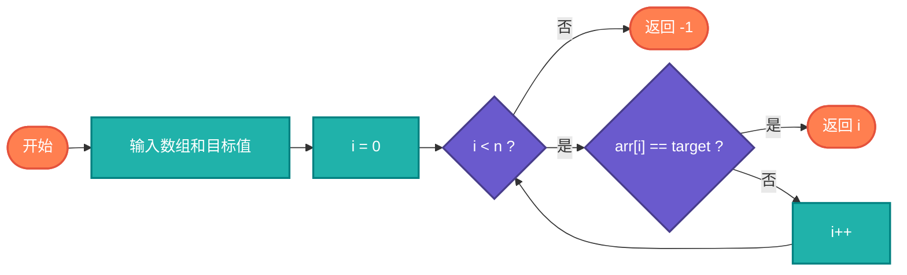

# 线性查找（Linear Search）

> 顺序遍历数组查找目标元素，简单直接的查找方法。

## 算法原理

### 核心思想

逐个检查数组元素直到找到目标：
```
for i from 0 to n-1:
    if arr[i] == target:
        return i
return -1
```

---

## 复杂度分析

| 指标 | 复杂度 | 说明 |
|------|--------|------|
| **时间复杂度** | O(n) | 最坏遍历全部 |
| **空间复杂度** | O(1) | 原地查找 |

## 算法流程



---

## 适用场景

- **无序数据**：无法二分查找时
- **小规模数据**：简单高效
- **链表结构**：不支持随机访问
- **单次查询**：不值得排序

---

## 实现列表

| 语言 | 文件名 | 说明 |
|------|--------|------|
| C | [linear_search.c](./linear_search.c) | 基础实现 |
| Java | [LinearSearch.java](./LinearSearch.java) | 类封装 |
| Go | [linear_search.go](./linear_search.go) | 简洁实现 |
| Python | [linear_search.py](./linear_search.py) | 简单实现 |
| JavaScript | [linear_search.js](./linear_search.js) | indexOf |
| TypeScript | [LinearSearch.ts](./LinearSearch.ts) | 类型安全 |
| Rust | [linear_search.rs](./linear_search.rs) | 迭代器实现 |

---

## 使用示例

### Python 版本
```python
index = linear_search([3, 1, 4, 1, 5], 4)  # 2
index = linear_search([3, 1, 4, 1, 5], 9)  # -1
```

---

## 扩展阅读

- 哨兵线性查找
- 并行线性查找
