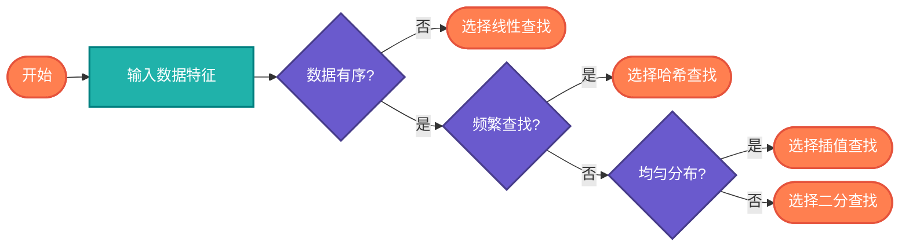

# 查找算法对比（Search Comparison）

> 对比不同查找算法的性能特点，帮助选择合适的算法。

## 算法原理

| 算法 | 时间复杂度 | 空间复杂度 | 数据要求 | 特点 |
|------|-----------|-----------|----------|------|
| **线性查找** | O(n) | O(1) | 无要求 | 简单，通用 |
| **二分查找** | O(log n) | O(1) | 有序数组 | 高效，最常用 |
| **插值查找** | O(log log n)~O(n) | O(1) | 均匀分布 | 特定场景更快 |
| **哈希查找** | O(1) | O(n) | 无要求 | 最快，需额外空间 |
| **跳跃查找** | O(√n) | O(1) | 有序数组 | 分块查找 |
| **指数查找** | O(log n) | O(1) | 有序数组 | 无边界数组 |
| **斐波那契查找** | O(log n) | O(1) | 有序数组 | 分割比例不同 |

### 时间复杂度可视化

```
n=10^6时:
线性查找:    1,000,000 次比较
二分查找:          ~20 次比较
插值查找:          ~4 次比较（均匀分布）
哈希查找:          ~1 次操作
```

## 算法流程（算法选择）



---

## 适用场景

| 场景 | 推荐算法 | 原因 |
|------|----------|------|
| 小规模无序数据 | 线性查找 | 无需排序开销 |
| 静态有序数据 | 二分查找 | 最优时间复杂度 |
| 均匀分布大数据 | 插值查找 | 平均更快 |
| 频繁查找 | 哈希查找 | O(1)最快 |
| 内存受限 | 二分/插值 | O(1)空间 |
| 链表结构 | 线性查找 | 无法随机访问 |

---

## 实现列表

| 语言 | 文件名 | 说明 |
|------|--------|------|
| C | [search_comparison.c](./search_comparison.c) | 性能测试 |
| Java | [SearchComparison.java](./SearchComparison.java) | 对比测试 |
| Go | [search_comparison.go](./search_comparison.go) | 基准测试 |
| Python | [search_comparison.py](./search_comparison.py) | 对比分析 |
| JavaScript | [search_comparison.js](./search_comparison.js) | 性能对比 |
| TypeScript | [SearchComparison.ts](./SearchComparison.ts) | 类型安全对比 |
| Rust | [search_comparison.rs](./search_comparison.rs) | 性能基准 |

---

## 使用示例

### Python 版本
```python
from search_comparison import compare_algorithms

# 对比所有查找算法
results = compare_algorithms(
    data=[i for i in range(1000000)],
    target=500000
)
# 输出各算法查找时间和比较次数
```

---

## 扩展阅读

- 算法选择决策树
- 实际性能测试方法
- 缓存对查找性能的影响
