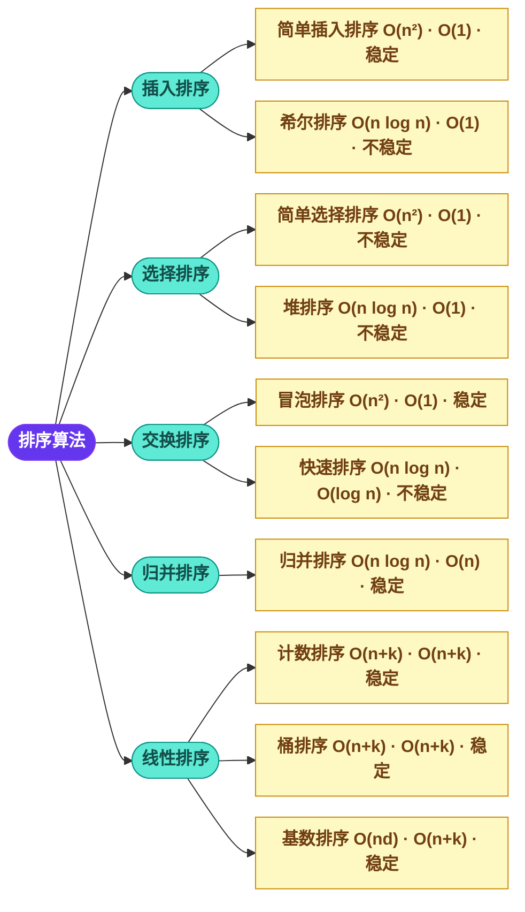

# 十大排序算法全解：C/Java/Python/Go/JS 等多语言源码仓库

> 10大经典排序算法，多种语言实现，多种解法思路，是学习算法思想、对比语言特性、掌握编程基础的绝佳资源库。

---

## 🔥 10大排序算法详解
- 仓库地址  [https://github.com/microwind/algorithms](https://github.com/microwind/algorithms)



---

### 仓库特色

- ✅ **10大经典算法全覆盖**：从基础到高级，循序渐进，彻底搞懂算法基础原理，不在糊里糊涂
- ✅ **10多种编程语言**：C/C++/Java/Python/JavaScript/Go/Rust/Swift/Kotlin/TypeScript/Dart，有助于理解语言特性
- ✅ **多种实现思路**：每种算法提供2-6种不同的实现方式，通过不同思路可以更好地思考问题
- ✅ **详细注释说明**：算法思路、时间复杂度、空间复杂度分析，理解每一种思路的差异
- ✅ **性能对比测试**：实际运行时间对比，直观感受算法差异
- ✅ **可视化输出**：部分算法提供排序过程可视化，理解排序的过程

---

## 多种编程语言实现

| 排序算法 | C | C++ | Java | Python | JS | TS | Go | Rust | Swift | Kotlin | Dart | 适用场景 |
|---------|--------|--------|---------|---------|-------------|-------------|-----|------|------|--------|------|--------|
| [冒泡排序 bubble sort](https://github.com/microwind/algorithms/tree/main/sorting/bubblesort/) | [C](https://github.com/microwind/algorithms/blob/main/sorting/bubblesort/bubble_sort.c) | [C++](https://github.com/microwind/algorithms/blob/main/sorting/bubblesort/BubbleSort.cpp) | [Java](https://github.com/microwind/algorithms/blob/main/sorting/bubblesort/BubbleSort.java) | [Python](https://github.com/microwind/algorithms/blob/main/sorting/bubblesort/bubble_sort.py) | [JS](https://github.com/microwind/algorithms/blob/main/sorting/bubblesort/bubble_sort.js) | [TS](https://github.com/microwind/algorithms/blob/main/sorting/bubblesort/BubbleSort.ts) | [Go](https://github.com/microwind/algorithms/blob/main/sorting/bubblesort/bubble_sort.go) | [Rust](https://github.com/microwind/algorithms/blob/main/sorting/bubblesort/bubble_sort.rs) | [Swift](https://github.com/microwind/algorithms/blob/main/sorting/bubblesort/BubbleSort.swift) | [Kotlin](https://github.com/microwind/algorithms/blob/main/sorting/bubblesort/BubbleSort.kt) | [Dart](https://github.com/microwind/algorithms/blob/main/sorting/bubblesort/BubbleSort.dart) | 适用于小规模数据排序，教学用途 |
| [插入排序 insert sort](https://github.com/microwind/algorithms/tree/main/sorting/insertsort/) | [C](https://github.com/microwind/algorithms/blob/main/sorting/insertsort/insert_sort.c) | [C++](https://github.com/microwind/algorithms/blob/main/sorting/insertsort/InsertSort.cpp) | [Java](https://github.com/microwind/algorithms/blob/main/sorting/insertsort/InsertSort.java) | [Python](https://github.com/microwind/algorithms/blob/main/sorting/insertsort/insert_sort.py) | [JS](https://github.com/microwind/algorithms/blob/main/sorting/insertsort/insert_sort.js) | [TS](https://github.com/microwind/algorithms/blob/main/sorting/insertsort/InsertSort.ts) | [Go](https://github.com/microwind/algorithms/blob/main/sorting/insertsort/insert_sort.go) | [Rust](https://github.com/microwind/algorithms/blob/main/sorting/insertsort/insert_sort.rs) | [Swift](https://github.com/microwind/algorithms/blob/main/sorting/insertsort/InsertSort.swift) | [Kotlin](https://github.com/microwind/algorithms/blob/main/sorting/insertsort/InsertSort.kt) | [Dart](https://github.com/microwind/algorithms/blob/main/sorting/insertsort/InsertSort.dart) | 适用于小规模数据，少量元素已基本有序的情况 |
| [选择排序 selection sort](https://github.com/microwind/algorithms/tree/main/sorting/selectionsort/) | [C](https://github.com/microwind/algorithms/blob/main/sorting/selectionsort/selection_sort.c) | [C++](https://github.com/microwind/algorithms/blob/main/sorting/selectionsort/SelectionSort.cpp) | [Java](https://github.com/microwind/algorithms/blob/main/sorting/selectionsort/SelectionSort.java) | [Python](https://github.com/microwind/algorithms/blob/main/sorting/selectionsort/selection_sort.py) | [JS](https://github.com/microwind/algorithms/blob/main/sorting/selectionsort/selection_sort.js) | [TS](https://github.com/microwind/algorithms/blob/main/sorting/selectionsort/SelectionSort.ts) | [Go](https://github.com/microwind/algorithms/blob/main/sorting/selectionsort/selection_sort.go) | [Rust](https://github.com/microwind/algorithms/blob/main/sorting/selectionsort/selection_sort.rs) | [Swift](https://github.com/microwind/algorithms/blob/main/sorting/selectionsort/SelectionSort.swift) | [Kotlin](https://github.com/microwind/algorithms/blob/main/sorting/selectionsort/SelectionSort.kt) | [Dart](https://github.com/microwind/algorithms/blob/main/sorting/selectionsort/SelectionSort.dart) | 适用于小规模数据，数据交换次数较少 |
| [堆排序 heap sort](https://github.com/microwind/algorithms/tree/main/sorting/heapsort/) | [C](https://github.com/microwind/algorithms/blob/main/sorting/heapsort/heap_sort.c) | [C++](https://github.com/microwind/algorithms/blob/main/sorting/heapsort/HeapSort.cpp) | [Java](https://github.com/microwind/algorithms/blob/main/sorting/heapsort/HeapSort.java) | [Python](https://github.com/microwind/algorithms/blob/main/sorting/heapsort/heap_sort.py) | [JS](https://github.com/microwind/algorithms/blob/main/sorting/heapsort/heap_sort.js) | [TS](https://github.com/microwind/algorithms/blob/main/sorting/heapsort/HeapSort.ts) | [Go](https://github.com/microwind/algorithms/blob/main/sorting/heapsort/heap_sort.go) | [Rust](https://github.com/microwind/algorithms/blob/main/sorting/heapsort/heap_sort.rs) | [Swift](https://github.com/microwind/algorithms/blob/main/sorting/heapsort/HeapSort.swift) | [Kotlin](https://github.com/microwind/algorithms/blob/main/sorting/heapsort/HeapSort.kt) | [Dart](https://github.com/microwind/algorithms/blob/main/sorting/heapsort/HeapSort.dart) | 适用于优先队列、TOP K问题 |
| [快速排序 quick sort](https://github.com/microwind/algorithms/tree/main/sorting/quicksort/) | [C](https://github.com/microwind/algorithms/blob/main/sorting/quicksort/quick_sort.c) | [C++](https://github.com/microwind/algorithms/blob/main/sorting/quicksort/QuickSort.cpp) | [Java](https://github.com/microwind/algorithms/blob/main/sorting/quicksort/QuickSort.java) | [Python](https://github.com/microwind/algorithms/blob/main/sorting/quicksort/quick_sort.py) | [JS](https://github.com/microwind/algorithms/blob/main/sorting/quicksort/quick_sort.js) | [TS](https://github.com/microwind/algorithms/blob/main/sorting/quicksort/QuickSort.ts) | [Go](https://github.com/microwind/algorithms/blob/main/sorting/quicksort/quick_sort.go) | [Rust](https://github.com/microwind/algorithms/blob/main/sorting/quicksort/quick_sort.rs) | [Swift](https://github.com/microwind/algorithms/blob/main/sorting/quicksort/QuickSort.swift) | [Kotlin](https://github.com/microwind/algorithms/blob/main/sorting/quicksort/QuickSort.kt) | [Dart](https://github.com/microwind/algorithms/blob/main/sorting/quicksort/QuickSort.dart) | 适用于一般排序场景，性能优异但不稳定 |
| [归并排序 merge sort](https://github.com/microwind/algorithms/tree/main/sorting/mergesort/) | [C](https://github.com/microwind/algorithms/blob/main/sorting/mergesort/merge_sort.c) | [C++](https://github.com/microwind/algorithms/blob/main/sorting/mergesort/MergeSort.cpp) | [Java](https://github.com/microwind/algorithms/blob/main/sorting/mergesort/MergeSort.java) | [Python](https://github.com/microwind/algorithms/blob/main/sorting/mergesort/merge_sort.py) | [JS](https://github.com/microwind/algorithms/blob/main/sorting/mergesort/merge_sort.js) | [TS](https://github.com/microwind/algorithms/blob/main/sorting/mergesort/MergeSort.ts) | [Go](https://github.com/microwind/algorithms/blob/main/sorting/mergesort/merge_sort.go) | [Rust](https://github.com/microwind/algorithms/blob/main/sorting/mergesort/merge_sort.rs) | [Swift](https://github.com/microwind/algorithms/blob/main/sorting/mergesort/MergeSort.swift) | [Kotlin](https://github.com/microwind/algorithms/blob/main/sorting/mergesort/MergeSort.kt) | [Dart](https://github.com/microwind/algorithms/blob/main/sorting/mergesort/MergeSort.dart) | 适用于大数据量排序，适合外部排序 |
| [计数排序 counting sort](https://github.com/microwind/algorithms/tree/main/sorting/countingsort/) | [C](https://github.com/microwind/algorithms/blob/main/sorting/countingsort/counting_sort.c) | [C++](https://github.com/microwind/algorithms/blob/main/sorting/countingsort/CountingSort.cpp) | [Java](https://github.com/microwind/algorithms/blob/main/sorting/countingsort/CountingSort.java) | [Python](https://github.com/microwind/algorithms/blob/main/sorting/countingsort/counting_sort.py) | [JS](https://github.com/microwind/algorithms/blob/main/sorting/countingsort/counting_sort.js) | [TS](https://github.com/microwind/algorithms/blob/main/sorting/countingsort/CountingSort.ts) | [Go](https://github.com/microwind/algorithms/blob/main/sorting/countingsort/counting_sort.go) | [Rust](https://github.com/microwind/algorithms/blob/main/sorting/countingsort/counting_sort.rs) | [Swift](https://github.com/microwind/algorithms/blob/main/sorting/countingsort/CountingSort.swift) | [Kotlin](https://github.com/microwind/algorithms/blob/main/sorting/countingsort/CountingSort.kt) | [Dart](https://github.com/microwind/algorithms/blob/main/sorting/countingsort/CountingSort.dart) | 适用于数据范围有限的整数排序 |
| [基数排序 radix sort](https://github.com/microwind/algorithms/tree/main/sorting/radixsort/) | [C](https://github.com/microwind/algorithms/blob/main/sorting/radixsort/radix_sort.c) | [C++](https://github.com/microwind/algorithms/blob/main/sorting/radixsort/RadixSort.cpp) | [Java](https://github.com/microwind/algorithms/blob/main/sorting/radixsort/RadixSort.java) | [Python](https://github.com/microwind/algorithms/blob/main/sorting/radixsort/radix_sort.py) | [JS](https://github.com/microwind/algorithms/blob/main/sorting/radixsort/radix_sort.js) | [TS](https://github.com/microwind/algorithms/blob/main/sorting/radixsort/RadixSort.ts) | [Go](https://github.com/microwind/algorithms/blob/main/sorting/radixsort/radix_sort.go) | [Rust](https://github.com/microwind/algorithms/blob/main/sorting/radixsort/radix_sort.rs) | [Swift](https://github.com/microwind/algorithms/blob/main/sorting/radixsort/RadixSort.swift) | [Kotlin](https://github.com/microwind/algorithms/blob/main/sorting/radixsort/RadixSort.kt) | [Dart](https://github.com/microwind/algorithms/blob/main/sorting/radixsort/RadixSort.dart) | 适用于大规模整数排序，如身份证号、手机号排序 |
| [桶排序 bucket sort](https://github.com/microwind/algorithms/tree/main/sorting/bucketsort/) | [C](https://github.com/microwind/algorithms/blob/main/sorting/bucketsort/bucket_sort.c) | [C++](https://github.com/microwind/algorithms/blob/main/sorting/bucketsort/BucketSort.cpp) | [Java](https://github.com/microwind/algorithms/blob/main/sorting/bucketsort/BucketSort.java) | [Python](https://github.com/microwind/algorithms/blob/main/sorting/bucketsort/bucket_sort.py) | [JS](https://github.com/microwind/algorithms/blob/main/sorting/bucketsort/BucketSort.js) | [TS](https://github.com/microwind/algorithms/blob/main/sorting/bucketsort/BucketSort.ts) | [Go](https://github.com/microwind/algorithms/blob/main/sorting/bucketsort/bucket_sort.go) | [Rust](https://github.com/microwind/algorithms/blob/main/sorting/bucketsort/bucket_sort.rs) | [Swift](https://github.com/microwind/algorithms/blob/main/sorting/bucketsort/BucketSort.swift) | [Kotlin](https://github.com/microwind/algorithms/blob/main/sorting/bucketsort/BucketSort.kt) | [Dart](https://github.com/microwind/algorithms/blob/main/sorting/bucketsort/BucketSort.dart) | 适用于数据范围均匀分布的排序 |
| [希尔排序 shell sort](https://github.com/microwind/algorithms/tree/main/sorting/shellsort/) | [C](https://github.com/microwind/algorithms/blob/main/sorting/shellsort/shell_sort.c) | [C++](https://github.com/microwind/algorithms/blob/main/sorting/shellsort/ShellSort.cpp) | [Java](https://github.com/microwind/algorithms/blob/main/sorting/shellsort/ShellSort.java) | [Python](https://github.com/microwind/algorithms/blob/main/sorting/shellsort/shell_sort.py) | [JS](https://github.com/microwind/algorithms/blob/main/sorting/shellsort/shell_sort.js) | [TS](https://github.com/microwind/algorithms/blob/main/sorting/shellsort/ShellSort.ts) | [Go](https://github.com/microwind/algorithms/blob/main/sorting/shellsort/shell_sort.go) | [Rust](https://github.com/microwind/algorithms/blob/main/sorting/shellsort/shell_sort.rs) | [Swift](https://github.com/microwind/algorithms/blob/main/sorting/shellsort/ShellSort.swift) | [Kotlin](https://github.com/microwind/algorithms/blob/main/sorting/shellsort/ShellSort.kt) | [Dart](https://github.com/microwind/algorithms/blob/main/sorting/shellsort/ShellSort.dart) | 适用于中等规模数据排序，适合半有序数据 |

---

## 每种算法的多种解法

### 冒泡排序的多种实现

1. **基础冒泡排序**：标准的相邻比较交换
2. **优化冒泡排序**：记录最后交换位置
3. **双向冒泡排序**：鸡尾酒排序，双向遍历
4. **递归冒泡排序**：递归实现版本
5. **并行冒泡排序**：多线程优化版本

### 快速排序的多种实现

1. **Lomuto分区方案**：标准教科书实现
2. **Hoare分区方案**：更高效的分区算法
3. **三路快速排序**：优化重复元素处理
4. **随机化快速排序**：避免最坏情况
5. **尾递归优化**：减少递归深度
6. **迭代快速排序**：非递归实现

### 堆排序的多种实现

1. **原地堆排序**：使用输入数组
2. **优先队列版本**：使用标准库
3. **索引堆排序**：处理对象排序
4. **二项堆排序**：理论优化版本
5. **斐波那契堆排序**：高级数据结构

### 桶排序的多种实现

1. **基础桶排序**：等宽桶分配
2. **自适应桶排序**：根据数据分布
3. **负数处理版本**：支持负数
4. **浮点数版本**：处理小数
5. **实时排序版本**：边分配边排序
6. **分布式桶排序**：处理大数据

---

## 源码仓库使用指南

### 目录结构

```
/algorithms/
├── sorting/
│   ├── bubblesort/          # 冒泡排序
│   ├── selectionsort/       # 选择排序
│   ├── insertionsort/       # 插入排序
│   ├── shellsort/           # 希尔排序
│   ├── mergesort/           # 归并排序
│   ├── quicksort/           # 快速排序
│   ├── heapsort/            # 堆排序
│   ├── countingsort/        # 计数排序
│   ├── bucketsort/          # 桶排序
│   └── radixsort/           # 基数排序
├── data-structures/         # 数据结构
├── searching/               # 搜索算法
├── graph/                   # 图算法
└── README.md
```

### 如何使用

#### 1. 选择算法
```bash
cd sorting/shellsort  # 选择希尔排序
```

#### 2. 选择语言
```bash
ls  # 查看可用语言实现
# BubbleSort.java  bubble_sort.c  bubble_sort.go  ...
```

#### 3. 编译运行
```bash
# Java
javac ShellSort.java && java ShellSort

# C
gcc shell_sort.c -o shell_sort && ./shell_sort

# Go
go run shell_sort.go

# Python
python3 shell_sort.py

# JavaScript
node shell_sort.js

# Rust
rustc shell_sort.rs && ./shell_sort

# Swift
swift shell_sort.swift

# Kotlin
kotlinc ShellSort.kt -include-runtime -d ShellSort.jar && java -jar ShellSort.jar

# TypeScript
ts-node ShellSort.ts

# Dart
dart ShellSort.dart
```

### 输出格式

- **性能测试**：不同算法版本的运行时间对比
- **算法对比总结**：各版本优缺点分析
- **调试输出**：部分算法提供详细排序过程
- **结果验证**：确保排序结果正确性

## 相关链接
- AI时代，重温10大经典排序算法  [https://github.com/microwind/algorithms/blob/main/sorting/AI-Era-Top-10-Sorting-Algorithms.md](https://github.com/microwind/algorithms/blob/main/sorting/AI-Era-Top-10-Sorting-Algorithms.md)
- AI时代下，程序员必知必会的算法思想大全 [https://github.com/microwind/algorithms/blob/main/algorithmic-thinking/AI-Era-Algorithm-Design-Guide.md](https://github.com/microwind/algorithms/blob/main/algorithmic-thinking/AI-Era-Algorithm-Design-Guide.md)
- AI时代更需要学习数据结构与算法  [https://microwind.github.io/algorithms](https://microwind.github.io/algorithms)
- AI编程核心资源库 [https://microwind.github.io](https://microwind.github.io)