# AI时代，十大经典排序算法详解

> AI时代，AI实现这些算法轻而易举，那么我们还有学习的必要吗？但是肯定的，很有必要。AI可以帮你写出任何一种排序算法的代码。但关键在于：当你面对一个具体场景时，你能判断该用哪种算法以及为什么吗？

AI时代不在于你还能手写这十种排序，而是在于理解它们背后的思想——分治、贪心、空间换时间、分桶映射。掌握这些思想，你就能在AI编程时代做出正确的技术决策。

## 一、为什么AI时代还要学排序算法？

### 排序无处不在

信息流、搜索结果、商品列表、好友排名，背后都有排序算法在工作。数据库的ORDER BY、搜索引擎的结果排序、推荐系统的优先级队列——排序是整个计算世界的基石操作。

### AI会写代码，但不做决策

AI能在几秒钟内生成一个快速排序的实现，但它无法替你判断：

- 这100万条订单数据，应该用快速排序还是归并排序？
- 用户ID是纯数字且范围有限，能不能用计数排序把O(n log n)优化到O(n)？
- 这个排序结果要传给下游服务做二次排序，稳定性重不重要？

这些决策需要你理解排序算法的原理和适用场景，而不是会写代码。

### 排序算法是算法思想的缩影

十大排序算法不是孤立的十个程序，它们是几种核心算法思想的具体体现：

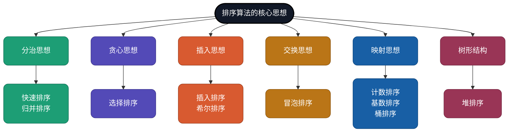

学会这些思想，你面对的就不仅仅是排序问题——而是所有需要"分解、组合、选择、映射"的工程问题。

---

## 二、排序算法全景图

### 排序算法分类体系

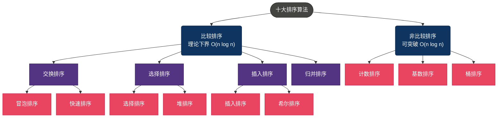

**比较排序**通过元素间的比较来确定顺序，信息论证明了其时间复杂度下界为O(n log n)——无论多聪明的比较策略，都无法突破这个极限。

**非比较排序**另辟蹊径，利用元素本身的数值特性（如位数、范围）直接确定位置，可以达到线性时间O(n)，但对数据有额外约束。

### 一览表

| 算法 | 平均时间 | 最坏时间 | 空间 | 稳定 | 一句话特点 |
|------|---------|---------|------|------|-----------|
| [冒泡排序](https://github.com/microwind/algorithms/tree/main/sorting/bubblesort) | O(n²) | O(n²) | O(1) | 稳定 | 相邻交换，大数下沉 |
| [选择排序](https://github.com/microwind/algorithms/tree/main/sorting/selectionsort) | O(n²) | O(n²) | O(1) | 不稳定 | 每轮选最小，交换次数最少 |
| [插入排序](https://github.com/microwind/algorithms/tree/main/sorting/insertsort) | O(n²) | O(n²) | O(1) | 稳定 | 扑克牌式，近乎有序时最快 |
| [希尔排序](https://github.com/microwind/algorithms/tree/main/sorting/shellsort) | O(n^1.3) | O(n²) | O(1) | 不稳定 | 分组插入，突破O(n²) |
| [快速排序](https://github.com/microwind/algorithms/tree/main/sorting/quicksort) | O(n log n) | O(n²) | O(log n) | 不稳定 | 分治+分区，实际最快 |
| [归并排序](https://github.com/microwind/algorithms/tree/main/sorting/mergesort) | O(n log n) | O(n log n) | O(n) | 稳定 | 分治+合并，稳定可靠 |
| [堆排序](https://github.com/microwind/algorithms/tree/main/sorting/heapsort) | O(n log n) | O(n log n) | O(1) | 不稳定 | 堆结构选择，原地排序 |
| [计数排序](https://github.com/microwind/algorithms/tree/main/sorting/countingsort) | O(n + k) | O(n + k) | O(n + k) | 稳定 | 计数定位，整数专用 |
| [基数排序](https://github.com/microwind/algorithms/tree/main/sorting/radixsort) | O(n × d) | O(n × d) | O(n + k) | 稳定 | 逐位排序，多位数利器 |
| [桶排序](https://github.com/microwind/algorithms/tree/main/sorting/bucketsort) | O(n + k) | O(n²) | O(n + k) | 稳定 | 分桶+桶内排序，均匀分布最快 |

---

## 三、十大排序算法详解

### 1. 冒泡排序（Bubble Sort）— 最朴素的交换

反复遍历数组，比较相邻元素，如果顺序错了就交换。每一轮遍历都会把当前最大的元素"冒泡"到数组末尾，就像汽水里的气泡一样往上浮。

> **生活类比**：体育课排队，老师让相邻两人比身高，矮的站前面，高的站后面。一轮下来，最高的人一定到了队尾。

#### 流程图

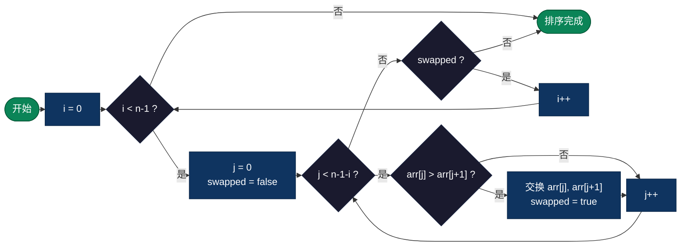

#### 伪代码

```js
function BubbleSort(arr):
    n = length(arr)
    for i = 0 to n - 2:                    // 外层循环：共 n-1 轮
        swapped = false
        for j = 0 to n - 2 - i:            // 内层循环：每轮少比一个
            if arr[j] > arr[j + 1]:         // 相邻比较
                swap(arr[j], arr[j + 1])    // 逆序则交换
                swapped = true
        if not swapped:                     // 本轮无交换，已有序
            break
    return arr
```

#### 实际应用

- **教学入门**：几乎所有算法教材的第一个排序算法
- **近乎有序的小数据**：加上swapped优化后，对基本有序的数据只需O(n)
- **嵌入式设备**：代码极简，ROM占用极小

#### 复杂度

| 最好 | 平均 | 最坏 | 空间 | 稳定性 |
|------|------|------|------|--------|
| O(n) | O(n²) | O(n²) | O(1) | 稳定 |

> Donald Knuth曾说："冒泡排序似乎没有什么值得推荐的，除了一个好记的名字。"——但作为理解排序思想的起点，它的价值不可替代。

---

### 2. 选择排序（Selection Sort）— 最少的交换

每一轮从未排序区域找到最小（或最大）的元素，放到已排序区域的末尾。不管数据怎么分布，比较次数永远是O(n²)，但交换次数最多只有O(n)。

> **生活类比**：教练选球员。扫一眼整支队伍，挑出最矮的排第一，再从剩下的人里挑最矮的排第二，依此类推。

#### 流程图

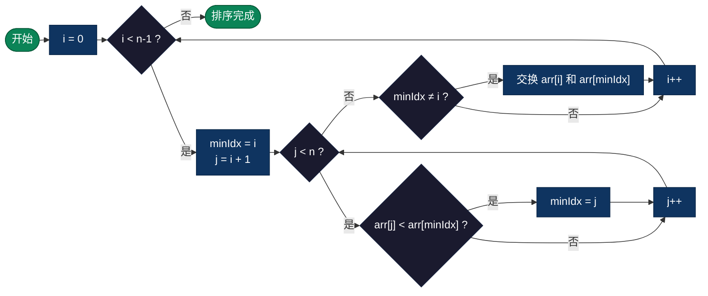

#### 伪代码

```js
function SelectionSort(arr):
    n = length(arr)
    for i = 0 to n - 2:                    // 遍历每个位置
        minIdx = i                          // 假设当前位置是最小值
        for j = i + 1 to n - 1:            // 在未排序区间找最小值
            if arr[j] < arr[minIdx]:
                minIdx = j                  // 更新最小值位置
        if minIdx != i:
            swap(arr[i], arr[minIdx])       // 只交换一次
    return arr
```

#### 实际应用

- **写入代价高的存储介质**：如Flash存储器，每次写入都有损耗，选择排序的交换次数最少
- **小数据集**：实现简单，n很小时性能差异不明显
- **找Top-K的朴素方案**：选择排序做K轮就能找到前K小的元素

#### 复杂度

| 最好 | 平均 | 最坏 | 空间 | 稳定性 |
|------|------|------|------|--------|
| O(n²) | O(n²) | O(n²) | O(1) | 不稳定 |

> 选择排序不稳定的原因：交换操作可能改变相等元素的相对顺序。比如 `[5a, 5b, 3]`，第一轮会把3和5a交换，变成 `[3, 5b, 5a]`，5a和5b的顺序被颠倒了。

---

### 3. 插入排序（Insertion Sort）— 扑克牌式排序

就像打扑克牌时整理手牌：每摸一张新牌，从右往左找到合适的位置插进去。已排好序的牌始终保持有序。

> **生活类比**：这是人类最自然的排序方式。你整理书架上的书、给考试卷子按分数排列，用的都是插入排序的思路。

#### 流程图

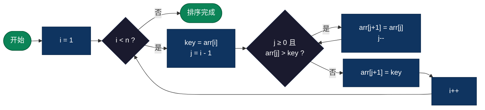

#### 伪代码

```js
function InsertionSort(arr):
    n = length(arr)
    for i = 1 to n - 1:                    // 从第2个元素开始
        key = arr[i]                        // 取出待插入的牌
        j = i - 1
        while j >= 0 and arr[j] > key:     // 从右往左找位置
            arr[j + 1] = arr[j]            // 比key大的元素后移
            j = j - 1
        arr[j + 1] = key                   // 插入到正确位置
    return arr
```

#### 实际应用

- **小规模数据排序**：n < 50时，插入排序的常数因子极小，实际速度往往最快
- **Timsort的子过程**：Python的`sorted()`和Java的`Collections.sort()`底层都用插入排序处理小分区
- **在线排序**：数据流式到达，每来一个新元素就插入到已排序序列中
- **近乎有序的数据**：最好情况O(n)，这是所有简单排序算法中最优的

#### 复杂度

| 最好 | 平均 | 最坏 | 空间 | 稳定性 |
|------|------|------|------|--------|
| O(n) | O(n²) | O(n²) | O(1) | 稳定 |

---

### 4. 希尔排序（Shell Sort）— 跳跃式插入

插入排序的进化版。核心洞察：插入排序在数据基本有序时非常快，那能不能先让数据"大致有序"再做插入排序？希尔排序的做法是先用较大的步长（gap）将数组分成若干组，对每组做插入排序；然后逐步缩小gap，最终gap=1时就是普通的插入排序——但此时数据已经基本有序了。

> **生活类比**：整理一堆乱放的书。先粗略地按类别大致归位（大步长），然后在每个类别内精细排列（小步长），最后微调。比一本一本从头排要快得多。

#### 流程图

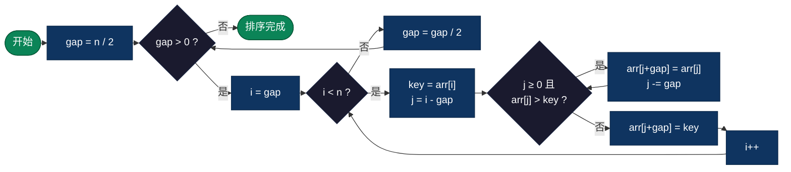

#### 伪代码

```js
function ShellSort(arr):
    n = length(arr)
    gap = n / 2                             // 初始步长
    while gap > 0:                          // 逐步缩小步长
        for i = gap to n - 1:              // 对每个分组做插入排序
            key = arr[i]
            j = i - gap
            while j >= 0 and arr[j] > key: // 组内插入排序
                arr[j + gap] = arr[j]
                j = j - gap
            arr[j + gap] = key
        gap = gap / 2                       // 步长减半
    return arr
```

#### 实际应用

- **嵌入式系统**：原地排序、代码简单、性能远超O(n²)算法
- **中等规模数据**：比简单排序快很多，又不像快排那样需要递归栈空间
- **Linux内核**：部分版本使用希尔排序处理中等规模数据

#### 复杂度

| 最好 | 平均 | 最坏 | 空间 | 稳定性 |
|------|------|------|------|--------|
| O(n log n) | O(n^1.3) | O(n²) | O(1) | 不稳定 |

> 希尔排序的时间复杂度取决于gap序列的选取。Donald Shell最初提出的 n/2, n/4, ..., 1 序列最坏是O(n²)；Hibbard序列 1, 3, 7, 15, ... 可以达到O(n^1.5)；Sedgewick序列可以做到接近O(n^(4/3))。gap序列的最优选取至今仍是一个未完全解决的数学问题。

---

### 5. 快速排序（Quick Sort）— 分治的经典

选一个基准元素（pivot），把数组分成"比pivot小"和"比pivot大"两部分，然后对这两部分递归排序。这是分治思想的经典应用：大问题拆成小问题，小问题解决了，大问题自然解决。

1959年，Tony Hoare在莫斯科大学做机器翻译时发明了快速排序。他需要对俄语单词排序，发现插入排序太慢，于是想出了"按基准分区"的思路。这个发明后来成为了实际应用中最快的通用排序算法。

> **生活类比**：一群人要按身高排队。找一个人站中间当"标杆"，比他矮的站左边，比他高的站右边。然后左右两边各自再找标杆继续分，直到每个人都站到了正确的位置。

#### 流程图

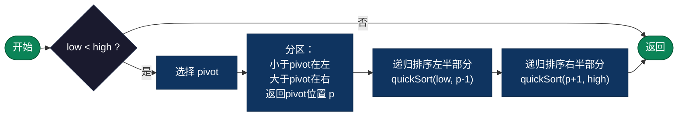

#### 伪代码

```js
function QuickSort(arr, low, high):
    if low < high:
        p = Partition(arr, low, high)       // 分区，返回pivot的最终位置
        QuickSort(arr, low, p - 1)          // 递归排序左半部分
        QuickSort(arr, p + 1, high)         // 递归排序右半部分

function Partition(arr, low, high):
    pivot = arr[high]                       // 选最后一个元素作为基准
    i = low - 1                             // i 指向"小于pivot区域"的末尾
    for j = low to high - 1:
        if arr[j] <= pivot:                 // 当前元素比pivot小
            i = i + 1
            swap(arr[i], arr[j])            // 放到左边区域
    swap(arr[i + 1], arr[high])             // pivot放到中间
    return i + 1                            // 返回pivot的位置
```

#### 实际应用

- **通用排序的首选**：C标准库的`qsort()`、Java的`Arrays.sort()`（基本类型）都基于快速排序
- **数据库引擎**：内存中的排序操作大量使用快速排序
- **大数据处理**：MapReduce的Shuffle阶段使用快速排序的变体
- **为什么实际最快**：缓存友好（在连续内存上操作）、内层循环极其紧凑、原地排序节省内存

#### 复杂度

| 最好 | 平均 | 最坏 | 空间 | 稳定性 |
|------|------|------|------|--------|
| O(n log n) | O(n log n) | O(n²) | O(log n) | 不稳定 |

> **避免最坏情况的实战技巧**：随机选pivot（避免有序数据退化）、三数取中法（取首尾中间三个数的中位数）、小分区切换插入排序（n<10~16时用插入排序）、三路划分（处理大量重复元素）。生产环境的快速排序实现都会综合使用这些优化。

---

### 6. 归并排序（Merge Sort）— 稳定的分治

把数组不断二分，直到每个子数组只有一个元素（自然有序），然后两两合并。合并时用两个指针分别扫描两个有序子数组，每次取较小的放入结果数组。

这是1945年冯·诺依曼为EDVAC计算机编写的第一个程序——人类历史上第一个计算机算法实现就是归并排序。

> **生活类比**：把一大叠试卷分给10个老师各自按分数排好，然后两两合并。两个人各拿一叠排好的试卷，每次比较两叠最上面的那张，小的先放下来，自然就合成了一叠有序的试卷。

#### 流程图

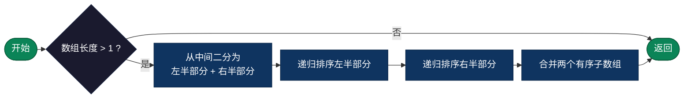

#### 伪代码

```js
function MergeSort(arr):
    if length(arr) <= 1:
        return arr                          // 单个元素自然有序
    mid = length(arr) / 2
    left = MergeSort(arr[0 : mid])          // 递归排序左半部分
    right = MergeSort(arr[mid : end])       // 递归排序右半部分
    return Merge(left, right)               // 合并两个有序数组

function Merge(left, right):
    result = []
    i = 0, j = 0
    while i < length(left) and j < length(right):
        if left[i] <= right[j]:             // 取较小者（等号保证稳定性）
            result.append(left[i])
            i++
        else:
            result.append(right[j])
            j++
    result.append(left[i:])                 // 追加剩余元素
    result.append(right[j:])
    return result
```

#### 实际应用

- **需要稳定排序的场景**：数据库多字段排序、UI列表渲染保持相同元素的原始顺序
- **外部排序**：海量数据无法一次装入内存时，分块排序再合并，天然适合归并思想
- **链表排序**：链表上做归并排序不需要额外空间（不需要随机访问），比快速排序更合适
- **Python / Java标准库**：Python的`sorted()`和Java的`Collections.sort()`底层都使用归并排序的变体（Timsort）

#### 复杂度

| 最好 | 平均 | 最坏 | 空间 | 稳定性 |
|------|------|------|------|--------|
| O(n log n) | O(n log n) | O(n log n) | O(n) | 稳定 |

> 归并排序是唯一一个在最好、平均、最坏情况下都保持O(n log n)且稳定的比较排序算法。代价是需要O(n)的额外空间。这就是算法设计中经典的**时间-空间权衡**。

---

### 7. 堆排序（Heap Sort）— 树形选择

利用堆（完全二叉树）这种数据结构来排序。先把数组构建成一个大顶堆（每个父节点都大于等于子节点），然后不断取出堆顶（最大值）放到数组末尾，再重新调整堆。

堆的精妙之处在于：用数组就能表示一棵完全二叉树。对于位置i的元素，其左子节点在2i+1，右子节点在2i+2，父节点在(i-1)/2。不需要任何指针。

> **生活类比**：公司的锦标赛选拔。先进行淘汰赛选出冠军（建堆），冠军选出后拿走，剩下的人重新比赛选出新冠军（堆化），如此重复。

#### 流程图

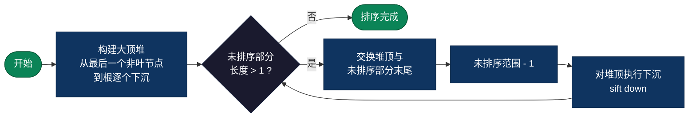

#### 伪代码

```js
function HeapSort(arr):
    n = length(arr)
    // 建堆：从最后一个非叶节点开始，自底向上堆化
    for i = n/2 - 1 downto 0:
        SiftDown(arr, i, n)

    // 排序：反复取堆顶放到末尾
    for i = n - 1 downto 1:
        swap(arr[0], arr[i])                // 堆顶（最大值）放到末尾
        SiftDown(arr, 0, i)                 // 对剩余元素重新堆化

function SiftDown(arr, parent, size):
    while 2 * parent + 1 < size:            // 还有子节点
        child = 2 * parent + 1              // 左子节点
        if child + 1 < size and arr[child + 1] > arr[child]:
            child = child + 1               // 选较大的子节点
        if arr[parent] >= arr[child]:
            break                           // 父节点已经最大，停止
        swap(arr[parent], arr[child])       // 下沉
        parent = child
```

#### 实际应用

- **优先队列**：操作系统的进程调度、网络包调度，底层都是堆
- **Top-K问题**：从10亿条数据中找最大的100个，维护一个大小为100的小顶堆，O(n log k)
- **内存受限环境**：原地排序，O(1)额外空间，且最坏情况也是O(n log n)
- **定时器管理**：Nginx、Go runtime的定时器都基于堆实现

#### 复杂度

| 最好 | 平均 | 最坏 | 空间 | 稳定性 |
|------|------|------|------|--------|
| O(n log n) | O(n log n) | O(n log n) | O(1) | 不稳定 |

> 堆排序在理论上很完美（O(n log n)原地排序），但实际性能通常不如快速排序。原因是堆化操作在数组中的跳跃访问模式对CPU缓存不友好——父节点和子节点在内存中的距离越来越远，导致大量cache miss。

---

### 8. 计数排序（Counting Sort）— 用空间换时间

不做任何比较！直接统计每个值出现了多少次，然后按顺序输出。这就像统计考试分数：建一个0-100的表格，遍历一遍试卷把每个分数的计数加1，然后从0分到100分依次输出，每个分数出现几次就输出几次。

> **生活类比**：选举计票。不需要两两比较谁的票多，直接数每个候选人各有多少票，按票数排列就行。

#### 流程图


#### 伪代码

```js
function CountingSort(arr):
    max_val = max(arr)                      // 找到最大值
    count = array of (max_val + 1) zeros    // 创建计数数组

    for x in arr:                           // 统计每个值的出现次数
        count[x] = count[x] + 1

    for i = 1 to max_val:                   // 前缀和：count[i]变为"<=i的元素总数"
        count[i] = count[i] + count[i - 1]

    output = array of length(arr)
    for i = length(arr) - 1 downto 0:       // 反向遍历保证稳定性
        output[count[arr[i]] - 1] = arr[i]
        count[arr[i]] = count[arr[i]] - 1

    return output
```

#### 实际应用

- **年龄排序**：范围0-150，非常适合计数排序
- **考试成绩排序**：分数0-100的有限范围
- **字符频率统计**：ASCII码范围0-127，统计字符出现频率
- **基数排序的子过程**：基数排序每一位的排序通常用计数排序实现

#### 复杂度

| 最好 | 平均 | 最坏 | 空间 | 稳定性 |
|------|------|------|------|--------|
| O(n + k) | O(n + k) | O(n + k) | O(n + k) | 稳定 |

> k是数据的值域范围。当k = O(n)时，计数排序是线性的——比任何比较排序都快。但如果k远大于n（比如对10个数排序，但值域是0到10亿），空间开销就不可接受了。

---

### 9. 基数排序（Radix Sort）— 逐位排序

不比较元素大小，而是按"位"来排序。从最低位（个位）开始，对每一位用一次稳定排序（通常是计数排序），逐位处理到最高位。因为每一轮都是稳定排序，低位的排序结果在高位排序时不会被破坏。

这个思想最早可以追溯到1887年Herman Hollerith为美国人口普查设计的打孔卡片分拣机——比电子计算机还早了半个多世纪。

> **生活类比**：图书馆整理书籍编号。先按编号的最后一位数字分成10堆收回来，再按倒数第二位分堆收回来……最终按第一位分堆收回来，书就按编号排好了。

#### 流程图

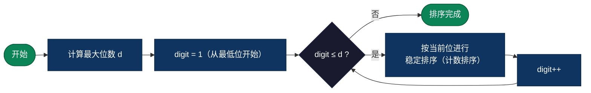

#### 伪代码

```js
function RadixSort(arr):
    max_val = max(arr)
    d = number_of_digits(max_val)           // 最大位数

    exp = 1                                 // 当前位的权重：1, 10, 100, ...
    for digit = 1 to d:
        CountingSortByDigit(arr, exp)       // 按当前位做稳定排序
        exp = exp * 10

function CountingSortByDigit(arr, exp):
    count = array of 10 zeros               // 0-9 十个桶
    output = array of length(arr)

    for x in arr:
        digit = (x / exp) % 10             // 取出当前位
        count[digit]++

    for i = 1 to 9:
        count[i] += count[i - 1]            // 前缀和

    for i = length(arr) - 1 downto 0:       // 反向遍历保证稳定性
        digit = (arr[i] / exp) % 10
        output[count[digit] - 1] = arr[i]
        count[digit]--

    copy output to arr
```

#### 实际应用

- **手机号排序**：11位数字的定长字符串，基数排序的效率是O(11n)，远快于O(n log n)
- **IP地址排序**：4段数字，天然适合基数排序
- **身份证号排序**：定长数字串
- **大规模整数排序**：当整数位数d相对固定且不大时，O(dn)接近线性

#### 复杂度

| 最好 | 平均 | 最坏 | 空间 | 稳定性 |
|------|------|------|------|--------|
| O(n × d) | O(n × d) | O(n × d) | O(n + k) | 稳定 |

> d = 最大位数，k = 基数（十进制k=10）。基数排序有两种方式：LSD（Least Significant Digit，从低位到高位）和MSD（Most Significant Digit，从高位到低位）。LSD更常用，实现更简单；MSD适合变长字符串排序。

---

### 10. 桶排序（Bucket Sort）— 分桶映射

把数据按值域范围均匀地分配到若干个"桶"里，每个桶内部用其他排序算法（通常是插入排序）排好，然后按桶的顺序依次把元素拼接起来。

桶排序的核心假设是：数据分布大致均匀。如果分布均匀，每个桶里的元素很少，桶内排序的代价很低，总体接近O(n)。极端情况下（所有数据落入同一个桶），退化为桶内排序算法的复杂度。

> **生活类比**：超市整理商品。先按价格区间分到不同货架（0-10元、10-20元、20-50元……），然后每个货架内部按具体价格排列，最后从第一个货架到最后一个货架依次取出，就是按价格排好的商品。

#### 流程图

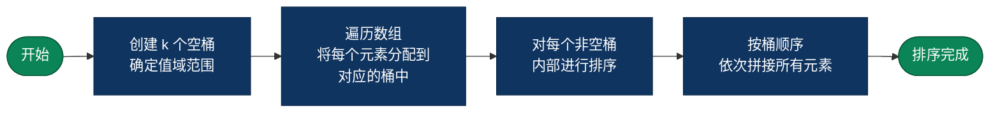

#### 伪代码

```js
function BucketSort(arr):
    n = length(arr)
    min_val = min(arr)
    max_val = max(arr)
    bucket_count = n                        // 桶数量通常取n
    bucket_size = (max_val - min_val + 1) / bucket_count

    buckets = array of bucket_count empty lists

    for x in arr:                           // 将元素分配到桶中
        idx = (x - min_val) / bucket_size
        buckets[idx].append(x)

    for each bucket in buckets:             // 桶内排序（通常用插入排序）
        InsertionSort(bucket)

    result = concatenate all buckets        // 按桶顺序拼接
    return result
```

#### 实际应用

- **均匀分布的浮点数排序**：如0-1之间的随机浮点数，分桶后几乎是线性时间
- **成绩分段统计**：按分数段分桶，天然的桶排序应用
- **颜色直方图**：图像处理中按像素值分桶统计
- **负载均衡**：将请求按特征值分桶分配到不同服务器

#### 复杂度

| 最好 | 平均 | 最坏 | 空间 | 稳定性 |
|------|------|------|------|--------|
| O(n + k) | O(n + k) | O(n²) | O(n + k) | 稳定 |

> 桶排序的性能高度依赖数据分布。2025年发表在Springer *Discover Computing* 上的一项系统性研究（Sundaramoorthy & Karunanidhi）表明，在均匀分布的数据集上，桶排序的实际执行速度超过了所有其他排序算法。不过该研究也指出，数据量超过10万时桶排序的优势减弱，归并排序和堆排序凭借更稳定的复杂度表现出更好的扩展性。

---

## 四、复杂度对比与选型指南

### 算法复杂度总表

| 算法 | 最好 | 平均 | 最坏 | 空间 | 稳定 | 核心思想 |
|------|------|------|------|------|------|---------|
| 冒泡排序 | O(n) | O(n²) | O(n²) | O(1) | 稳定 | 相邻交换 |
| 选择排序 | O(n²) | O(n²) | O(n²) | O(1) | 不稳定 | 选最小值 |
| 插入排序 | O(n) | O(n²) | O(n²) | O(1) | 稳定 | 有序插入 |
| 希尔排序 | O(n log n) | O(n^1.3) | O(n²) | O(1) | 不稳定 | 分组插入 |
| 快速排序 | O(n log n) | O(n log n) | O(n²) | O(log n) | 不稳定 | 分治+分区 |
| 归并排序 | O(n log n) | O(n log n) | O(n log n) | O(n) | 稳定 | 分治+合并 |
| 堆排序 | O(n log n) | O(n log n) | O(n log n) | O(1) | 不稳定 | 堆结构选择 |
| 计数排序 | O(n + k) | O(n + k) | O(n + k) | O(n + k) | 稳定 | 计数定位 |
| 基数排序 | O(n × d) | O(n × d) | O(n × d) | O(n + k) | 稳定 | 逐位排序 |
| 桶排序 | O(n + k) | O(n + k) | O(n²) | O(n + k) | 稳定 | 分桶映射 |

### 稳定性分类

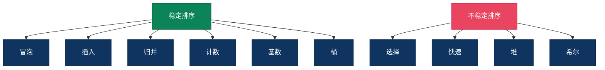

### 场景选型决策

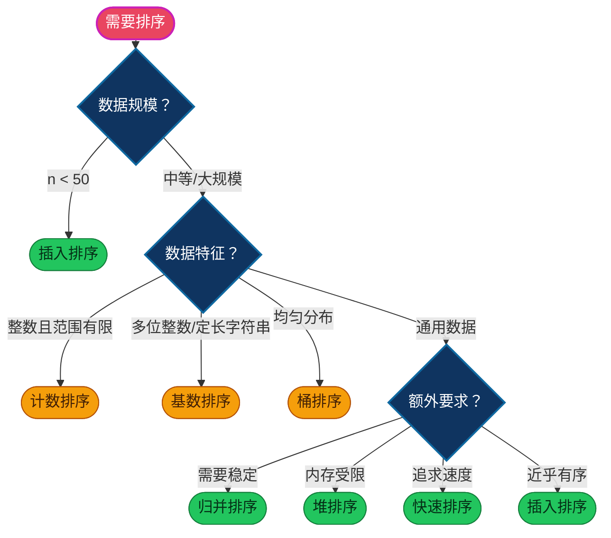

---

## 五、AI时代如何用排序思想驱动编程

### 不是让你手写，而是让你会选择

AI时代学排序算法，不是要你在白板上默写快速排序的分区函数。而是当你面对一个具体场景时，能够：

1. 识别问题：这是一个排序问题吗？什么数据？什么规模？什么约束？
2. 选择方案：哪种排序算法最适合？为什么？
3. 指导AI：用精确的算法思想引导AI生成正确的代码
4. 验证结果：AI生成的排序代码，复杂度对不对？稳定性对不对？边界处理对不对？

### 指导AI的正确姿势

| 方式 | 差的指令 | 好的指令 |
|------|---------|---------|
| 模糊 vs 精确 | "帮我排个序" | "用快速排序，三数取中选pivot，分区小于16个元素时切换插入排序" |
| 无约束 vs 有约束 | "排序这些数据" | "这是100万条int32订单ID，范围0-1000万，用计数排序实现O(n)排序" |
| 不验证 vs 验证 | "排好了就行" | "需要稳定排序，相同金额的订单保持原始时间顺序，请用归并排序并验证稳定性" |

### 排序思想在工程决策中的迁移

排序算法背后的思想，远不止排序本身：

| 算法思想 | 排序中的体现 | 工程中的迁移应用 |
|---------|------------|----------------|
| **分治** | 快速排序、归并排序 | MapReduce分布式计算、微服务拆分、CDN分层缓存 |
| **空间换时间** | 计数排序、桶排序 | Redis缓存、布隆过滤器、倒排索引 |
| **分层渐进** | 希尔排序（大步长到小步长） | 渐进式加载、多级缓存（L1→L2→L3→磁盘） |
| **堆/优先队列** | 堆排序 | 任务调度、Top-K实时计算、定时器管理 |
| **稳定性** | 归并排序 | 多维排序、数据库索引、UI列表渲染 |

### 提醒
> AI是很厉害，知识面和速度都超远人类，但**选择用什么排序、在什么场景下用**，仍然是人类的决策

---

## 六、多语言实现源码

以下是十大排序算法的多语言实现，每种语言都有其独特性，可以对比着来看，还能学习到语言特性。

### 源码链接总表

> 源码仓库：https://github.com/microwind/algorithms/tree/main/sorting

| 排序算法 | C | Java | Go | Python | JavaScript | TypeScript | Rust |
|---------|---|------|----|--------|------------|------------|------|
| **冒泡排序** | [C](https://github.com/microwind/algorithms/tree/main/sorting/bubblesort/bubble_sort.c) | [Java](https://github.com/microwind/algorithms/tree/main/sorting/bubblesort/BubbleSort.java) | [Go](https://github.com/microwind/algorithms/tree/main/sorting/bubblesort/bubble_sort.go) | [Python](https://github.com/microwind/algorithms/tree/main/sorting/bubblesort/bubble_sort.py) | [JS](https://github.com/microwind/algorithms/tree/main/sorting/bubblesort/bubble_sort.js) | [TS](https://github.com/microwind/algorithms/tree/main/sorting/bubblesort/BubbleSort.ts) | [Rust](https://github.com/microwind/algorithms/tree/main/sorting/bubblesort/bubble_sort.rs) |
| **选择排序** | [C](https://github.com/microwind/algorithms/tree/main/sorting/selectionsort/selection_sort.c) | [Java](https://github.com/microwind/algorithms/tree/main/sorting/selectionsort/SelectionSort.java) | [Go](https://github.com/microwind/algorithms/tree/main/sorting/selectionsort/selection_sort.go) | [Python](https://github.com/microwind/algorithms/tree/main/sorting/selectionsort/selection_sort.py) | [JS](https://github.com/microwind/algorithms/tree/main/sorting/selectionsort/selection_sort.js) | [TS](https://github.com/microwind/algorithms/tree/main/sorting/selectionsort/SelectionSort.ts) | [Rust](https://github.com/microwind/algorithms/tree/main/sorting/selectionsort/selection_sort.rs) |
| **插入排序** | [C](https://github.com/microwind/algorithms/tree/main/sorting/insertsort/insert_sort.c) | [Java](https://github.com/microwind/algorithms/tree/main/sorting/insertsort/InsertSort.java) | [Go](https://github.com/microwind/algorithms/tree/main/sorting/insertsort/insert_sort.go) | [Python](https://github.com/microwind/algorithms/tree/main/sorting/insertsort/insert_sort.py) | [JS](https://github.com/microwind/algorithms/tree/main/sorting/insertsort/insert_sort.js) | [TS](https://github.com/microwind/algorithms/tree/main/sorting/insertsort/InsertSort.ts) | [Rust](https://github.com/microwind/algorithms/tree/main/sorting/insertsort/insert_sort.rs) |
| **希尔排序** | [C](https://github.com/microwind/algorithms/tree/main/sorting/shellsort/shell_sort.c) | [Java](https://github.com/microwind/algorithms/tree/main/sorting/shellsort/ShellSort.java) | [Go](https://github.com/microwind/algorithms/tree/main/sorting/shellsort/shell_sort.go) | [Python](https://github.com/microwind/algorithms/tree/main/sorting/shellsort/shell_sort.py) | [JS](https://github.com/microwind/algorithms/tree/main/sorting/shellsort/shell_sort.js) | [TS](https://github.com/microwind/algorithms/tree/main/sorting/shellsort/ShellSort.ts) | [Rust](https://github.com/microwind/algorithms/tree/main/sorting/shellsort/shell_sort.rs) |
| **快速排序** | [C](https://github.com/microwind/algorithms/tree/main/sorting/quicksort/quick_sort.c) | [Java](https://github.com/microwind/algorithms/tree/main/sorting/quicksort/QuickSort.java) | [Go](https://github.com/microwind/algorithms/tree/main/sorting/quicksort/quick_sort.go) | [Python](https://github.com/microwind/algorithms/tree/main/sorting/quicksort/quick_sort.py) | [JS](https://github.com/microwind/algorithms/tree/main/sorting/quicksort/quick_sort.js) | [TS](https://github.com/microwind/algorithms/tree/main/sorting/quicksort/QuickSort.ts) | [Rust](https://github.com/microwind/algorithms/tree/main/sorting/quicksort/quick_sort.rs) |
| **归并排序** | [C](https://github.com/microwind/algorithms/tree/main/sorting/mergesort/merge_sort.c) | [Java](https://github.com/microwind/algorithms/tree/main/sorting/mergesort/MergeSort.java) | [Go](https://github.com/microwind/algorithms/tree/main/sorting/mergesort/merge_sort.go) | [Python](https://github.com/microwind/algorithms/tree/main/sorting/mergesort/merge_sort.py) | [JS](https://github.com/microwind/algorithms/tree/main/sorting/mergesort/merge_sort.js) | [TS](https://github.com/microwind/algorithms/tree/main/sorting/mergesort/MergeSort.ts) | [Rust](https://github.com/microwind/algorithms/tree/main/sorting/mergesort/merge_sort.rs) |
| **堆排序** | [C](https://github.com/microwind/algorithms/tree/main/sorting/heapsort/heap_sort.c) | [Java](https://github.com/microwind/algorithms/tree/main/sorting/heapsort/HeapSort.java) | [Go](https://github.com/microwind/algorithms/tree/main/sorting/heapsort/heap_sort.go) | [Python](https://github.com/microwind/algorithms/tree/main/sorting/heapsort/heap_sort.py) | [JS](https://github.com/microwind/algorithms/tree/main/sorting/heapsort/heap_sort.js) | [TS](https://github.com/microwind/algorithms/tree/main/sorting/heapsort/HeapSort.ts) | [Rust](https://github.com/microwind/algorithms/tree/main/sorting/heapsort/heap_sort.rs) |
| **计数排序** | [C](https://github.com/microwind/algorithms/tree/main/sorting/countingsort/counting_sort.c) | [Java](https://github.com/microwind/algorithms/tree/main/sorting/countingsort/CountingSort.java) | [Go](https://github.com/microwind/algorithms/tree/main/sorting/countingsort/counting_sort.go) | [Python](https://github.com/microwind/algorithms/tree/main/sorting/countingsort/counting_sort.py) | [JS](https://github.com/microwind/algorithms/tree/main/sorting/countingsort/counting_sort.js) | [TS](https://github.com/microwind/algorithms/tree/main/sorting/countingsort/CountingSort.ts) | [Rust](https://github.com/microwind/algorithms/tree/main/sorting/countingsort/counting_sort.rs) |
| **基数排序** | [C](https://github.com/microwind/algorithms/tree/main/sorting/radixsort/radix_sort.c) | [Java](https://github.com/microwind/algorithms/tree/main/sorting/radixsort/RadixSort.java) | [Go](https://github.com/microwind/algorithms/tree/main/sorting/radixsort/radix_sort.go) | [Python](https://github.com/microwind/algorithms/tree/main/sorting/radixsort/radix_sort.py) | [JS](https://github.com/microwind/algorithms/tree/main/sorting/radixsort/radix_sort.js) | [TS](https://github.com/microwind/algorithms/tree/main/sorting/radixsort/RadixSort.ts) | [Rust](https://github.com/microwind/algorithms/tree/main/sorting/radixsort/radix_sort.rs) |
| **桶排序** | [C](https://github.com/microwind/algorithms/tree/main/sorting/bucketsort/bucket_sort.c) | [Java](https://github.com/microwind/algorithms/tree/main/sorting/bucketsort/BucketSort.java) | [Go](https://github.com/microwind/algorithms/tree/main/sorting/bucketsort/bucket_sort.go) | [Python](https://github.com/microwind/algorithms/tree/main/sorting/bucketsort/bucket_sort.py) | [JS](https://github.com/microwind/algorithms/tree/main/sorting/bucketsort/bucket_sort.js) | [TS](https://github.com/microwind/algorithms/tree/main/sorting/bucketsort/BucketSort.ts) | [Rust](https://github.com/microwind/algorithms/tree/main/sorting/bucketsort/bucket_sort.rs) |

## 总结

十大排序算法，从最朴素的冒泡到精巧的基数排序，每一种都体现了前人解决问题的智慧——怎样更快、更省、更稳地把一组数据排好序。

在AI时代，你不需要手写这些算法。但你需要理解：

- 为什么快速排序是实际最快的通用排序？（缓存友好+分治思想）
- 什么时候应该放弃O(n log n)去用O(n)的计数排序？（整数且范围有限）
- 怎么判断AI生成的排序代码是否正确？（稳定性、边界条件、复杂度分析）

> 这些判断力，来自于对算法思想的理解，而不是对代码的记忆。

---

### 相关链接
- [《程序员必备的算法思想指南》](https://github.com/microwind/algorithms/blob/main/start-here/AI-Era-Programmers-Need-Algorithmic-Thinking.md)
- [AI时代，人人都是算法思想工程师](https://github.com/microwind/algorithms/blob/main/start-here/AI-Era-Programmers-as-Algorithmic-Thinkers.md)
- [AI时代，人人都是Agent工程师](https://github.com/microwind/algorithms/blob/main/start-here/AI-Era-Programmers-as-Agent-Engineers.md)
- [排序算法概述](https://github.com/microwind/algorithms/blob/main/sorting/README.md)
- [算法与数据结构源码](https://github.com/microwind/algorithms)
