# AI时代，重温十大经典排序算法

> AI可以轻松生成任何排序算法代码，那么我们还必要学习算法吗？

AI时代，不需要人工手写排序算法了，但我们需要理解算法背后的思想——分治、贪心、空间换时间以及分桶映射等。掌握这些思想，有利于我们与AI协作时给出正确的决策和指导。

## 一、为什么还要学排序算法？

### 排序无处不在

信息流、搜索结果、商品列表、好友排名，背后都有排序算法在工作。数据库的 ORDER BY、搜索引擎的结果排序、推荐系统的优先级队列——排序是计算世界中最基础、最常见的计算。

实现排序算法并非难事，难的是遇到实际场景时能做出合理的判断和决策：

- 100万条订单数据，应该用快速排序还是归并排序？为什么？
- 用户ID是纯数字且范围有限，能不能用计数排序把O(n log n)优化到O(n)？
- 排序结果传递给下游做二次排序好还是提前排好再给下游？性能和稳定性哪个更重要？

这些决策需要我们理解排序算法的原理和适用场景，而不是只会实现代码。

### 排序算法是算法思想的缩影

十大排序算法并不只是十个简单的程序，它们背后浓缩了计算机大师们的心血，是几种核心算法思想的具体体现：


学会这些思想，我们面对的就不仅仅是排序问题——而是所有需要"分解、组合、选择、映射"的工程问题。

---

## 二、排序算法全景图

### 排序算法分类体系

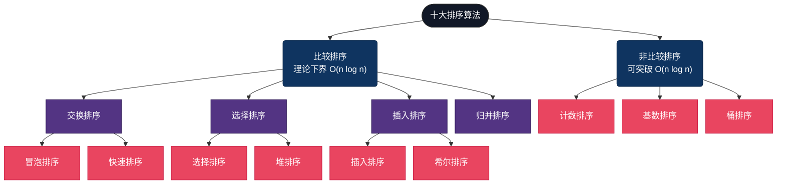

**排序可以分为两大类别：**

**1. 比较排序**：通过元素之间两两比较来排顺序。它的时间复杂度有个下限是 O(n log n)，不管用多聪明的比较方法，都很难突破这个极限。

**2. 非比较排序**：是利用数据本身的特点（比如数字范围、位数这些）直接确定位置，它可以做到线性时间 O(n)。不过它对数据有一些要求，比如数值范围不能太大、能拆分，或者能映射到固定的区间。

---

## 三、十大排序算法详解

### 1. 冒泡排序（Bubble Sort）— 最朴素的交换

**算法原理**：遍历数组，相邻元素两两比较，将大的项交换到右侧。每一轮遍历都会把当前最大的元素"冒泡"到数组末尾，就像汽水里的气泡一样往上浮。如果某一轮没有发生交换，说明数组已经有序，可以提前结束。

它和选择排序的思路正好相反：选择排序是“每次选出一个最小（或最大）放到末尾”，而冒泡排序是“逐步交换，让最大（或最小）冒到末尾”。

> **生活类比**：体育课排队，让相邻两人比身高，矮的站前面，高的站后面。一轮下来，最高的人一定到了队尾。

#### 流程图

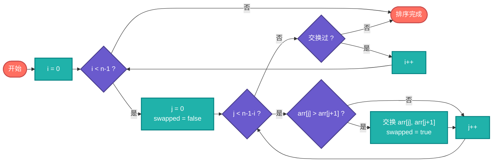

#### 伪代码

```js
function BubbleSort(arr):
    n = length(arr)
    for i = 0 to n - 2:                     // 外层循环：共 n-1 轮
        swapped = false
        for j = 0 to n - 2 - i:             // 内层循环：每轮减少一个
            if arr[j] > arr[j + 1]:         // 相邻比较
                swap(arr[j], arr[j + 1])    // 逆序则交换
                swapped = true
        if not swapped:                     // 本轮无交换，已有序
            break
    return arr
```

#### 应用场景

- **教学入门**：几乎所有算法教材的第一个排序算法
- **近乎有序的小数据**：加上swapped优化后，对基本有序的数据只需O(n)
- **嵌入式设备**：代码极简，ROM占用极小

#### 复杂度

| 最好 | 平均 | 最坏 | 空间 | 稳定性 |
|------|------|------|------|--------|
| O(n) | O(n²) | O(n²) | O(1) | 稳定 |

> 冒泡排序非常好理解，性能也很稳定，虽然现实中使用不多，但是因为很简单、很形象，所以通常是学习排序算法的第一课。

---

### 2. 选择排序（Selection Sort）— 最少的交换

**算法原理**：遍历数组，每一轮在未排序区域中选出最小（或最大）的元素，放到已排序区域的末尾。整体需要进行大量比较，但交换次数很少，每一轮最多只交换一次。

它和插入排序的思路正好相反：选择排序是“先选一个，再放过去”；而插入排序是“从未排序中取一个，按顺序插入到已排序里”。

> **生活类比**：就像从一堆没有次序的苹果里，每次都挑出最小（或最大）的一个，放到一边按大小排好。每次只挑一个，慢慢就把所有苹果按顺序排好了。

#### 流程图

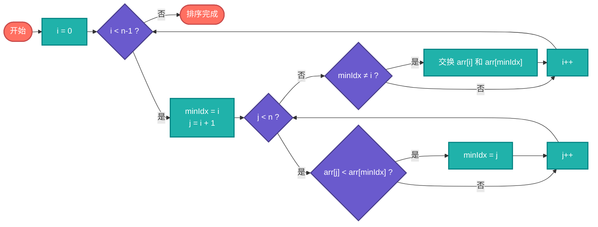

#### 伪代码

```js
function SelectionSort(arr):
    n = length(arr)
    for i = 0 to n - 2:                     // 遍历每个位置
        minIdx = i                          // 假设当前位置是最小值
        for j = i + 1 to n - 1:             // 在未排序区间找最小值
            if arr[j] < arr[minIdx]:
                minIdx = j                  // 更新最小值位置
        if minIdx != i:
            swap(arr[i], arr[minIdx])       // 只交换一次
    return arr
```

#### 应用场景

- **存储介质写入**：如Flash存储器，每次写入都有损耗，选择排序的交换次数最少
- **小数据集**：实现简单，n很小时性能差异不明显
- **找Top-K的朴素方案**：选择排序做K轮就能找到前K小的元素

#### 复杂度

| 最好 | 平均 | 最坏 | 空间 | 稳定性 |
|------|------|------|------|--------|
| O(n²) | O(n²) | O(n²) | O(1) | 不稳定 |

> 选择排序不太稳定，因为交换时可能把原本顺序相同的元素颠倒掉。比如 `[5, 5, 4]`，第一轮把4和第一个5交换，第一个5就跑到最后面了。选择排序也是非常好理解的方式，每次从剩下的一堆里把最大或最小的挑出来，放到已排序里面去。

---

### 3. 插入排序（Insertion Sort）— 扑克牌式排序

**算法原理**：遍历数组，把数组分为已排序和未排序两部分，每次从未排序中取出一个元素，插入到已排序部分的合适位置，已排序元素右移腾出位置。

> 生活类比：就像打扑克牌一样，把牌分成两堆——**已排好序的牌**和**未排的牌**。一开始，第一张牌算作已排序部分，其余都是未排序部分。然后每次从未排序中拿一张牌，插入到已排序中的正确位置，已排序的牌往右移一位，未排序的牌则减少一张。

#### 流程图

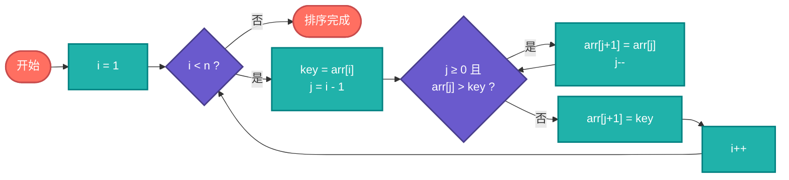

#### 伪代码

```js
function InsertionSort(arr):
    n = length(arr)
    for i = 1 to n - 1:                    // 从第2个元素开始
        key = arr[i]                       // 取出待插入的牌
        j = i - 1
        while j >= 0 and arr[j] > key:     // 从右往左找位置
            arr[j + 1] = arr[j]            // 比key大的元素后移
            j = j - 1
        arr[j + 1] = key                   // 插入到正确位置
    return arr
```

#### 应用场景

- **小规模数据排序**：n < 50时，插入排序的常数因子极小，实际速度往往最快
- **Timsort的子过程**：Python的`sorted()`和Java的`Collections.sort()`底层都用插入排序处理小分区
- **在线排序**：数据流式到达，每来一个新元素就插入到已排序序列中
- **近乎有序的数据**：最好情况O(n)，这是所有简单排序算法中最优的

#### 复杂度

| 最好 | 平均 | 最坏 | 空间 | 稳定性 |
|------|------|------|------|--------|
| O(n) | O(n²) | O(n²) | O(1) | 稳定 |

> 插入排序稳定、直观，对小规模或几乎有序的数据特别高效，就像整理扑克牌一样，这是我们大家都会的方式，是经过实践检验的经典算法。

---

### 4. 希尔排序（Shell Sort）— 跳跃式插入

**算法原理**：希尔排序是插入排序的改进版，先用较大的步长（gap）把数组分成若干组并分别做插入排序，再逐步缩小gap，最后gap=1完成整体排序。因此希尔相比插入会多一个gap的循环。

希尔排序针对插入排序的两点特性而提出改进：
- 插入排序在对几乎已经排好序的数据操作时效率较高，可以达到线性排序的效率。
- 插入排序对于不规则数列来说是相对低效，因为插入排序每次只能挪动一个数据。

> 生活类比：就像整理扑克牌，如果手里有很多牌，一次只按相隔一定间距（比如每隔10张牌）把牌插入到已排好的位置，先把大块牌大致排好序，再缩小间距，一次次精细调整，最后整个牌堆就排好了。相比插入排序“每次拿一张牌插入”，希尔排序就像先粗略排，再精细排，效率更高。

#### 流程图

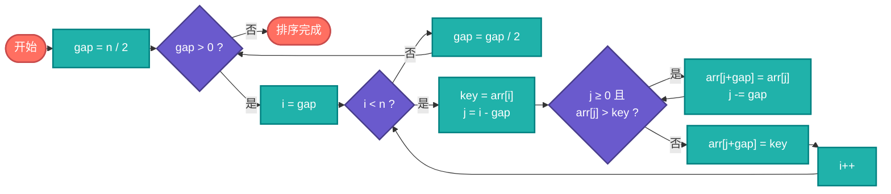

#### 伪代码

```js
function ShellSort(arr):
    n = length(arr)
    gap = n / 2                             // 初始步长
    while gap > 0:                          // 逐步缩小步长
        for i = gap to n - 1:               // 对每个分组做插入排序
            key = arr[i]
            j = i - gap
            while j >= 0 and arr[j] > key:  // 组内插入排序
                arr[j + gap] = arr[j]
                j = j - gap
            arr[j + gap] = key
        gap = gap / 2                       // 步长减半
    return arr
```

#### 应用场景

- **嵌入式系统**：原地排序、代码简单、性能远超O(n²)算法
- **中等规模数据**：比简单排序快很多，又不像快排那样需要递归栈空间
- **Linux内核**：部分版本使用希尔排序处理中等规模数据

#### 复杂度

| 最好 | 平均 | 最坏 | 空间 | 稳定性 |
|------|------|------|------|--------|
| O(n log n) | O(n^1.3) | O(n²) | O(1) | 不稳定 |

> 希尔排序的时间复杂度取决于步长（gap）的选择。希尔建议的初始步长是 N/2，即每次把数组分成两半进行排序。这种取法在大多数情况下比直接插入排序效率高，但也并不是最优选择。希尔排序给我们的启迪是将大量数据拆分成小组来处理。

---

### 5. 快速排序（Quick Sort）— 分治的经典

**算法原理**：选一个基准元素（pivot），把数组划分成两部分：一部分比它小，一部分比它大，然后分别对这两部分继续做同样的操作。通过不断拆分，直到每一部分都有序，整体自然就排好序了。快速排序时分治思想的体现：先把大问题拆成小问题，再逐个击破。

> **生活类比**：就像给一群人排队，先选一个人当“基准”，比他矮的站左边，比他高的站右边，然后左右两边也重复这个过程。随着不断分组，每一小组都会越来越有序，直到每组只剩下一个人时，整个队伍就排好了。

#### 流程图

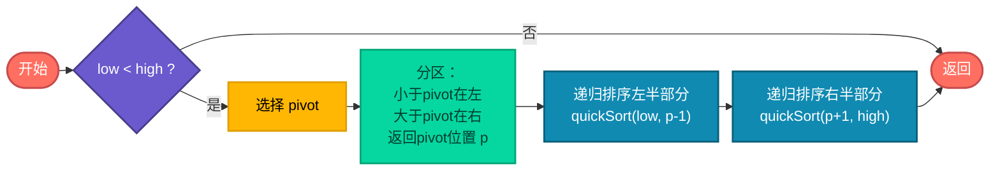

#### 伪代码

```js
function QuickSort(arr, low, high):
    if low < high:
        p = Partition(arr, low, high)       // 分区，返回pivot的最终位置
        QuickSort(arr, low, p - 1)          // 递归排序左半部分
        QuickSort(arr, p + 1, high)         // 递归排序右半部分

function Partition(arr, low, high):
    pivot = arr[high]                       // 选最后一个元素作为基准
    i = low - 1                             // i 指向"小于pivot区域"的末尾
    for j = low to high - 1:
        if arr[j] <= pivot:                 // 当前元素比pivot小
            i = i + 1
            swap(arr[i], arr[j])            // 放到左边区域
    swap(arr[i + 1], arr[high])             // pivot放到中间
    return i + 1                            // 返回pivot的位置
```

#### 应用场景

- **通用排序的首选**：C标准库的`qsort()`、Java的`Arrays.sort()`（基本类型）都基于快速排序
- **数据库引擎**：内存中的排序操作大量使用快速排序
- **大数据处理**：MapReduce的Shuffle阶段使用快速排序的变体
- **为什么实际最快**：缓存友好（在连续内存上操作）、内层循环极其紧凑、原地排序节省内存

#### 复杂度

| 最好 | 平均 | 最坏 | 空间 | 稳定性 |
|------|------|------|------|--------|
| O(n log n) | O(n log n) | O(n²) | O(log n) | 不稳定 |

> 快速排序高效而优雅，通过不断选取基准、拆分左右区间，把复杂问题层层拆解，是开发实践中最常用的排序算法之一。看似简单的“分一分”，却蕴含着强大的力量，这也是分治思想的体现。

---

### 6. 归并排序（Merge Sort）— 稳定的分治

**算法原理**：每次将数组一分为二，递归对左右两半继续拆分，直到每个子数组只有一个元素（自然有序）。然后从最底层开始，逐层向上合并，将两个有序子数组合并成一个更大的有序数组，最终得到完整排序的数组。

> **生活类比**：先把一筐苹果**分成两篮**，再每篮**分成两篮**……直到每篮只有一个苹果。然后从底层开始合并，每次合并按大小排序，直到所有苹果排好。

#### 流程图

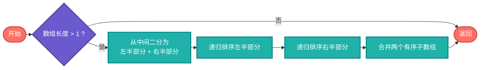

#### 伪代码

```js
function MergeSort(arr):
    if length(arr) <= 1:
        return arr                          // 单个元素自然有序
    mid = length(arr) / 2
    left = MergeSort(arr[0 : mid])          // 递归排序左半部分
    right = MergeSort(arr[mid : end])       // 递归排序右半部分
    return Merge(left, right)               // 合并两个有序数组

function Merge(left, right):
    result = []
    i = 0, j = 0
    while i < length(left) and j < length(right):
        if left[i] <= right[j]:             // 取出小的
            result.append(left[i])
            i++
        else:
            result.append(right[j])
            j++
    result.append(left[i:])                 // 追加剩余元素
    result.append(right[j:])
    return result
```

#### 应用场景

- **需要稳定排序的场景**：数据库多字段排序、UI列表渲染保持相同元素的原始顺序
- **外部排序**：海量数据无法一次装入内存时，分块排序再合并，天然适合归并思想
- **链表排序**：链表上做归并排序不需要额外空间（不需要随机访问），比快速排序更合适
- **Python / Java标准库**：Python的`sorted()`和Java的`Collections.sort()`底层都使用归并排序的变体（Timsort）

#### 复杂度

| 最好 | 平均 | 最坏 | 空间 | 稳定性 |
|------|------|------|------|--------|
| O(n log n) | O(n log n) | O(n log n) | O(n) | 稳定 |

> 归并排序是唯一一个在最好、平均、最坏情况下都保持O(n log n)且稳定的比较排序算法，代价是需要额外空间。这就是算法设计中经典的**时间-空间权衡**。

---

### 7. 堆排序（Heap Sort）— 树形选择

**算法原理**：利用堆（完全二叉树）这种数据结构来排序。先把数组构建成一个大顶堆（每个父节点都大于等于子节点），然后不断取出堆顶（最大值）放到数组末尾，再重新调整堆。

堆的精妙之处在于：利用的是完全二叉树的结构，用数组直接表示，父子节点关系通过索引计算完成。对于位置i的元素，其左子节点在2i+1，右子节点在2i+2，父节点在(i-1)/2，无需额外指针。

1. 先把数组构建成大顶堆（每个父节点 ≥ 子节点）。
2. 每次取出堆顶（最大值）放到数组末尾，然后缩小堆的范围并重新调整堆，使剩余元素依然保持大顶堆性质。
3. 重复上述步骤，直到所有元素排序完成。

> **生活类比**：就像整理一堆水果，把最大的放在顶上，每次取出最顶上的水果放到盘子里，然后让剩下的水果重新“自动堆成一座山”，下一次再取最大的。不断重复，最终就把所有水果从大到小排好。


#### 流程图

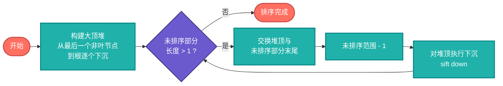

#### 伪代码

```js
function HeapSort(arr):
    n = length(arr)
    // 建堆：从最后一个非叶节点开始，自底向上堆化
    for i = n/2 - 1 downto 0:
        SiftDown(arr, i, n)

    // 排序：反复取堆顶放到末尾
    for i = n - 1 downto 1:
        swap(arr[0], arr[i])                // 堆顶（最大值）放到末尾
        SiftDown(arr, 0, i)                 // 对剩余元素重新堆化

function SiftDown(arr, parent, size):
    while 2 * parent + 1 < size:            // 还有子节点
        child = 2 * parent + 1              // 左子节点
        if child + 1 < size and arr[child + 1] > arr[child]:
            child = child + 1               // 选较大的子节点
        if arr[parent] >= arr[child]:
            break                           // 父节点已经最大，停止
        swap(arr[parent], arr[child])       // 下沉
        parent = child
```

#### 应用场景

- **优先队列**：操作系统的进程调度、网络包调度，底层都是堆
- **Top-K问题**：从10亿条数据中找最大的100个，维护一个大小为100的小顶堆，O(n log k)
- **内存受限环境**：原地排序，O(1)额外空间，且最坏情况也是O(n log n)
- **定时器管理**：Nginx、Go runtime的定时器都基于堆实现

#### 复杂度

| 最好 | 平均 | 最坏 | 空间 | 稳定性 |
|------|------|------|------|--------|
| O(n log n) | O(n log n) | O(n log n) | O(1) | 不稳定 |

> 堆排序理论上非常理想——原地排序且时间复杂度稳定为 O(n log n)，但在实际应用中通常比快速排序慢。原因在于堆化操作需要在数组中频繁跳跃访问父子节点，父节点和子节点在内存中相距较远，CPU 缓存命中率低，导致效率下降。

---

### 8. 计数排序（Counting Sort）— 用空间换时间

**算法原理**：不做任何比较，直接统计每个元素出现的次数，然后按顺序输出。这种方法适合元素取值范围不大的情况，时间复杂度可接近 O(n)。

> **生活类比**： 就像统计考试分数：准备一个 0–100 的计数表，遍历所有试卷，把每个分数出现的次数加 1。最后从 0 分到 100 分依次输出，每个分数出现几次就写几次，这样就得到排序好的成绩单。


#### 流程图


#### 伪代码

```js
function CountingSort(arr):
    max_val = max(arr)                      // 找到最大值
    count = array of (max_val + 1) zeros    // 创建计数数组

    for x in arr:                           // 统计每个值的出现次数
        count[x] = count[x] + 1

    for i = 1 to max_val:                   // 前缀和：count[i]变为"<=i的元素总数"
        count[i] = count[i] + count[i - 1]

    output = array of length(arr)
    for i = length(arr) - 1 downto 0:       // 反向遍历保证稳定性
        output[count[arr[i]] - 1] = arr[i]
        count[arr[i]] = count[arr[i]] - 1

    return output
```

#### 应用场景

- **年龄排序**：范围0-150，非常适合计数排序
- **考试成绩排序**：分数0-100的有限范围
- **字符频率统计**：ASCII码范围0-127，统计字符出现频率
- **基数排序的子过程**：基数排序每一位的排序通常用计数排序实现

#### 复杂度

| 最好 | 平均 | 最坏 | 空间 | 稳定性 |
|------|------|------|------|--------|
| O(n + k) | O(n + k) | O(n + k) | O(n + k) | 稳定 |

> 计数排序高效、直接，不依赖比较，尤其适合数值范围有限的数据，就像统计考试分数一样，是一种巧妙且实用的排序方法。

---

### 9. 基数排序（Radix Sort）— 逐位排序

**算法原理**：不直接比较数字的大小，而是把数字按个十百千位来分别处理。从最低位（个位）开始，对每一位用稳定排序（通常是计数排序），逐位向高位处理。每轮都是稳定排序，保证低位顺序在高位处理时不被破坏，最终得到完整有序序列。

> **生活类比**：就像整理邮政编码的信件，先按最后一位数字分堆，再按倒数第二位分堆……逐位处理，直到按完整邮编顺序排列好所有信件。

#### 流程图

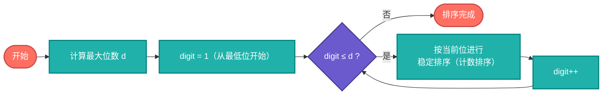

#### 伪代码

```js
function RadixSort(arr):
    max_val = max(arr)
    d = number_of_digits(max_val)           // 最大位数

    exp = 1                                 // 当前位的权重：1, 10, 100, ...
    for digit = 1 to d:
        CountingSortByDigit(arr, exp)       // 按当前位做稳定排序
        exp = exp * 10

function CountingSortByDigit(arr, exp):
    count = array of 10 zeros               // 0-9 十个桶
    output = array of length(arr)

    for x in arr:
        digit = (x / exp) % 10             // 取出当前位
        count[digit]++

    for i = 1 to 9:
        count[i] += count[i - 1]            // 前缀和

    for i = length(arr) - 1 downto 0:       // 反向遍历保证稳定性
        digit = (arr[i] / exp) % 10
        output[count[digit] - 1] = arr[i]
        count[digit]--

    copy output to arr
```

#### 应用场景

- **手机号排序**：11位数字的定长字符串，基数排序的效率是O(11n)，远快于O(n log n)
- **IP地址排序**：4段数字，天然适合基数排序
- **身份证号排序**：定长数字串
- **大规模整数排序**：当整数位数d相对固定且不大时，O(dn)接近线性

#### 复杂度

| 最好 | 平均 | 最坏 | 空间 | 稳定性 |
|------|------|------|------|--------|
| O(n × d) | O(n × d) | O(n × d) | O(n + k) | 稳定 |

> 基数排序不依赖比较，高效处理大规模整数或固定长度字符串，就像邮局分拣信件一样，是实践中经过验证的稳定排序利器。

---

### 10. 桶排序（Bucket Sort）— 分桶映射

**算法原理**：先把数据按数值区间划分成若干个桶，每个桶内部单独排序（通常是插入排序），然后按桶的顺序依次合并。关键是假设数据分布均匀，这样每个桶元素少，总体效率高。

> **生活类比**：就像收集水果，把苹果按大小或颜色放到不同的篮子里，每个篮子里再整理一下，最后按篮子顺序排列所有苹果，就得到整齐的果堆。


#### 流程图

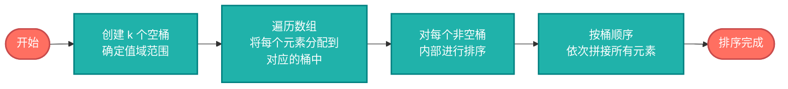

#### 伪代码

```js
function BucketSort(arr):
    n = length(arr)
    min_val = min(arr)
    max_val = max(arr)
    bucket_count = n                        // 桶数量通常取n
    bucket_size = (max_val - min_val + 1) / bucket_count

    buckets = array of bucket_count empty lists

    for x in arr:                           // 将元素分配到桶中
        idx = (x - min_val) / bucket_size
        buckets[idx].append(x)

    for each bucket in buckets:             // 桶内排序（通常用插入排序）
        InsertionSort(bucket)

    result = concatenate all buckets        // 按桶顺序拼接
    return result
```

#### 应用场景

- **均匀分布的浮点数排序**：如0-1之间的随机浮点数，分桶后几乎是线性时间
- **成绩分段统计**：按分数段分桶，天然的桶排序应用
- **颜色直方图**：图像处理中按像素值分桶统计
- **负载均衡**：将请求按特征值分桶分配到不同服务器

#### 复杂度

| 最好 | 平均 | 最坏 | 空间 | 稳定性 |
|------|------|------|------|--------|
| O(n + k) | O(n + k) | O(n²) | O(n + k) | 稳定 |

> 桶排序适合均匀分布的数据，高效且直观，就像按篮子整理水果一样，是实践中处理特定场景的稳定排序方法。

---

## 四、10大排序算法特点回顾


| 算法 | 平均时间复杂度 | 最坏时间复杂度 | 空间复杂度 | 稳定性 | 说明 |
|------|----------------|----------------|------------|--------|-----------|
| [冒泡排序](https://github.com/microwind/algorithms/tree/main/sorting/bubblesort) | O(n²) | O(n²) | O(1) | 稳定 | 相邻元素两两比较，最大或最小元素逐轮“冒”到最后 |
| [选择排序](https://github.com/microwind/algorithms/tree/main/sorting/selectionsort) | O(n²) | O(n²) | O(1) | 不稳定 | 每轮选择未排序里最小（或最大）元素放到已排序末尾 |
| [插入排序](https://github.com/microwind/algorithms/tree/main/sorting/insertsort) | O(n²) | O(n²) | O(1) | 稳定 | 类似打扑克，从未排序中取元素插入到已排序序列中 |
| [快速排序](https://github.com/microwind/algorithms/tree/main/sorting/quicksort) | O(n log n) | O(n²) | O(log n) | 不稳定 | 分治+分区，选基准元素将数组拆分，递归排序左右区间 |
| [归并排序](https://github.com/microwind/algorithms/tree/main/sorting/mergesort) | O(n log n) | O(n log n) | O(n) | 稳定 | 递归拆分数组到单个元素，再不断向上合并两个有序子数组 |
| [堆排序](https://github.com/microwind/algorithms/tree/main/sorting/heapsort) | O(n log n) | O(n log n) | O(1) | 不稳定 | 利用大顶堆选择最大元素放到末尾，原地排序 |
| [希尔排序](https://github.com/microwind/algorithms/tree/main/sorting/shellsort) | O(n^1.3) | O(n²) | O(1) | 不稳定 | 分组式插入排序，先大步长分组排序再逐步缩小步长 |
| [计数排序](https://github.com/microwind/algorithms/tree/main/sorting/countingsort) | O(n + k) | O(n + k) | O(n + k) | 稳定 | 不比较元素大小，统计每个值出现的次数并直接输出 |
| [基数排序](https://github.com/microwind/algorithms/tree/main/sorting/radixsort) | O(n × d) | O(n × d) | O(n + k) | 稳定 | 按位从低到高分别排序，最后从高到低合并数据 |
| [桶排序](https://github.com/microwind/algorithms/tree/main/sorting/bucketsort) | O(n + k) | O(n²) | O(n + k) | 稳定 | 将数据分成若干桶，桶内排序后再将全部桶合并 |

## 五、AI时代，如何指导AI选择排序算法？

### AI时代，工作方式发生了本质变化


> **过去：** 程序员写排序代码
> **现在：** 人工定义算法策略（需求拆解）和约束条件（性能 / 稳定性 / 成本）， 指导AI实现
> **未来：** 人只告诉AI需求目标，AI自主确定策略，自主执行合适方案


### 先分析需求和选择策略，再让AI实现代码

- **先看约束**：数据规模、是否需要稳定性、内存限制、键的范围与分布。
- **默认选择**：通用数组优先快速排序；链表或需要稳定性时选择归并排序。
- **小规模 / 近乎有序**：插入排序效果最好；也可用“无交换提前结束”的冒泡作为简单有序性检测。
- **整数且范围有限**：计数、基数或桶排序可将复杂度降到线性级别。
- **最坏情况防护**：快排应使用随机或三数取中选基准，小分区切换插入排序；大量重复元素时使用三路划分。

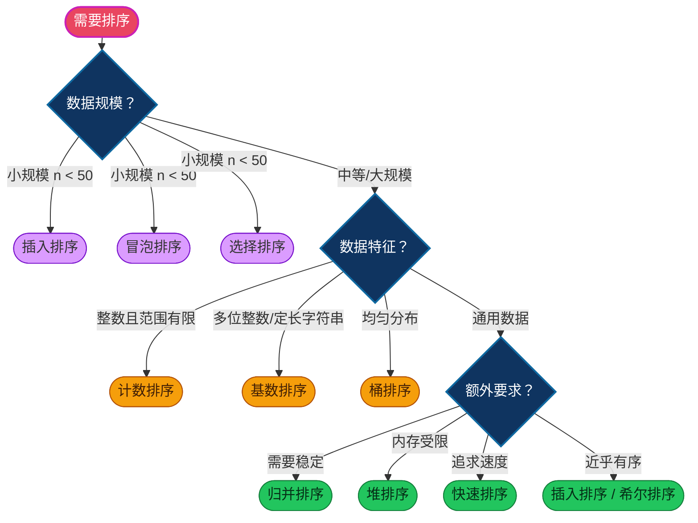

### 实际场景多采用混合策略

**编程语言中，会根据数据规模、分布特征和运行时情况，动态组合多种算法**

- **C 标准库（`qsort`）**：QuickSort 变种 + 插入排序优化

- **C++ STL（`std::sort`）**：Introsort（快速排序 + 堆排序 + 插入排序）

- **Java（`Arrays.sort`）**：Dual-Pivot QuickSort（双轴快排）、Timsort（归并 + 插入排序）

- **Python（`sorted` / `list.sort`）**：Timsort（归并 + 插入排序）

- **Go（`sort` 包）**：Introsort + 插入排序

- **JavaScript（`Array.prototype.sort`）**：插入排序、QuickSort / Timsort

- **Rust（`slice::sort` / `sort_unstable`）**：`sort` → Timsort 变体；`sort_unstable` → PDQSort（快排优化版）

**开源软件里也会根据数据结构的不同采用混合策略**

| 系统/场景 | 混合策略 |
|----------|---------|
| **MySQL** | 优先利用索引顺序；内存内 `ORDER BY` 使用快速排序，超出 `sort_buffer_size` 后切换为外部归并排序。 |
| **MongoDB** | 内存内使用快速排序或 Timsort，结果集超过 32 MB 时自动降级为外部归并排序（`allowDiskUse`）。 |
| **Elasticsearch (Lucene)** | 多段合并采用归并排序；对 `doc_values` 字段使用计数排序或快速排序变体。 |
| **推荐系统 Top-N** | 召回阶段用近似排序（ANN、桶排序、堆排序），精排阶段用快速排序或归并排序，整体用堆维护动态 Top-K。 |
| **Spark / Flink** | 分区内用 Timsort（Java 内置），跨分区全局排序采用采样+范围划分，流式场景用堆排序维护窗口 Top-N。 |
| **Redis** | `SORT` 命令小数据量用快速排序，大数据量用归并排序，支持外部临时文件。 |
| **PostgreSQL** | 优先走索引；内存排序使用快速排序，超过 `work_mem` 后切换为外部归并排序。 |
| **搜索引擎（如 Solr）** | 倒排索引合并时使用堆排序或归并排序；高亮片段排序使用自定义优先级队列。 |
| **实时计算（如 Flink SQL）** | 流式 Top-N 使用堆排序，批处理排序使用外部归并排序，结合内存和磁盘。 |

---

## 六、多语言实现源码

以下是十大排序算法在多种编程语言中的实现，你可以点击链接直接查看源码，对比不同语言的实现风格。

> 源码仓库：https://github.com/microwind/algorithms

| 排序算法 | C | Java | Go | Python | JavaScript | TypeScript | Rust |
|---------|---|------|----|--------|------------|------------|------|
| **冒泡排序** | [C](https://github.com/microwind/algorithms/tree/main/sorting/bubblesort/bubble_sort.c) | [Java](https://github.com/microwind/algorithms/tree/main/sorting/bubblesort/BubbleSort.java) | [Go](https://github.com/microwind/algorithms/tree/main/sorting/bubblesort/bubble_sort.go) | [Python](https://github.com/microwind/algorithms/tree/main/sorting/bubblesort/bubble_sort.py) | [JS](https://github.com/microwind/algorithms/tree/main/sorting/bubblesort/bubble_sort.js) | [TS](https://github.com/microwind/algorithms/tree/main/sorting/bubblesort/BubbleSort.ts) | [Rust](https://github.com/microwind/algorithms/tree/main/sorting/bubblesort/bubble_sort.rs) |
| **选择排序** | [C](https://github.com/microwind/algorithms/tree/main/sorting/selectionsort/selection_sort.c) | [Java](https://github.com/microwind/algorithms/tree/main/sorting/selectionsort/SelectionSort.java) | [Go](https://github.com/microwind/algorithms/tree/main/sorting/selectionsort/selection_sort.go) | [Python](https://github.com/microwind/algorithms/tree/main/sorting/selectionsort/selection_sort.py) | [JS](https://github.com/microwind/algorithms/tree/main/sorting/selectionsort/selection_sort.js) | [TS](https://github.com/microwind/algorithms/tree/main/sorting/selectionsort/SelectionSort.ts) | [Rust](https://github.com/microwind/algorithms/tree/main/sorting/selectionsort/selection_sort.rs) |
| **插入排序** | [C](https://github.com/microwind/algorithms/tree/main/sorting/insertsort/insert_sort.c) | [Java](https://github.com/microwind/algorithms/tree/main/sorting/insertsort/InsertSort.java) | [Go](https://github.com/microwind/algorithms/tree/main/sorting/insertsort/insert_sort.go) | [Python](https://github.com/microwind/algorithms/tree/main/sorting/insertsort/insert_sort.py) | [JS](https://github.com/microwind/algorithms/tree/main/sorting/insertsort/insert_sort.js) | [TS](https://github.com/microwind/algorithms/tree/main/sorting/insertsort/InsertSort.ts) | [Rust](https://github.com/microwind/algorithms/tree/main/sorting/insertsort/insert_sort.rs) |
| **希尔排序** | [C](https://github.com/microwind/algorithms/tree/main/sorting/shellsort/shell_sort.c) | [Java](https://github.com/microwind/algorithms/tree/main/sorting/shellsort/ShellSort.java) | [Go](https://github.com/microwind/algorithms/tree/main/sorting/shellsort/shell_sort.go) | [Python](https://github.com/microwind/algorithms/tree/main/sorting/shellsort/shell_sort.py) | [JS](https://github.com/microwind/algorithms/tree/main/sorting/shellsort/shell_sort.js) | [TS](https://github.com/microwind/algorithms/tree/main/sorting/shellsort/ShellSort.ts) | [Rust](https://github.com/microwind/algorithms/tree/main/sorting/shellsort/shell_sort.rs) |
| **快速排序** | [C](https://github.com/microwind/algorithms/tree/main/sorting/quicksort/quick_sort.c) | [Java](https://github.com/microwind/algorithms/tree/main/sorting/quicksort/QuickSort.java) | [Go](https://github.com/microwind/algorithms/tree/main/sorting/quicksort/quick_sort.go) | [Python](https://github.com/microwind/algorithms/tree/main/sorting/quicksort/quick_sort.py) | [JS](https://github.com/microwind/algorithms/tree/main/sorting/quicksort/quick_sort.js) | [TS](https://github.com/microwind/algorithms/tree/main/sorting/quicksort/QuickSort.ts) | [Rust](https://github.com/microwind/algorithms/tree/main/sorting/quicksort/quick_sort.rs) |
| **归并排序** | [C](https://github.com/microwind/algorithms/tree/main/sorting/mergesort/merge_sort.c) | [Java](https://github.com/microwind/algorithms/tree/main/sorting/mergesort/MergeSort.java) | [Go](https://github.com/microwind/algorithms/tree/main/sorting/mergesort/merge_sort.go) | [Python](https://github.com/microwind/algorithms/tree/main/sorting/mergesort/merge_sort.py) | [JS](https://github.com/microwind/algorithms/tree/main/sorting/mergesort/merge_sort.js) | [TS](https://github.com/microwind/algorithms/tree/main/sorting/mergesort/MergeSort.ts) | [Rust](https://github.com/microwind/algorithms/tree/main/sorting/mergesort/merge_sort.rs) |
| **堆排序** | [C](https://github.com/microwind/algorithms/tree/main/sorting/heapsort/heap_sort.c) | [Java](https://github.com/microwind/algorithms/tree/main/sorting/heapsort/HeapSort.java) | [Go](https://github.com/microwind/algorithms/tree/main/sorting/heapsort/heap_sort.go) | [Python](https://github.com/microwind/algorithms/tree/main/sorting/heapsort/heap_sort.py) | [JS](https://github.com/microwind/algorithms/tree/main/sorting/heapsort/heap_sort.js) | [TS](https://github.com/microwind/algorithms/tree/main/sorting/heapsort/HeapSort.ts) | [Rust](https://github.com/microwind/algorithms/tree/main/sorting/heapsort/heap_sort.rs) |
| **计数排序** | [C](https://github.com/microwind/algorithms/tree/main/sorting/countingsort/counting_sort.c) | [Java](https://github.com/microwind/algorithms/tree/main/sorting/countingsort/CountingSort.java) | [Go](https://github.com/microwind/algorithms/tree/main/sorting/countingsort/counting_sort.go) | [Python](https://github.com/microwind/algorithms/tree/main/sorting/countingsort/counting_sort.py) | [JS](https://github.com/microwind/algorithms/tree/main/sorting/countingsort/counting_sort.js) | [TS](https://github.com/microwind/algorithms/tree/main/sorting/countingsort/CountingSort.ts) | [Rust](https://github.com/microwind/algorithms/tree/main/sorting/countingsort/counting_sort.rs) |
| **基数排序** | [C](https://github.com/microwind/algorithms/tree/main/sorting/radixsort/radix_sort.c) | [Java](https://github.com/microwind/algorithms/tree/main/sorting/radixsort/RadixSort.java) | [Go](https://github.com/microwind/algorithms/tree/main/sorting/radixsort/radix_sort.go) | [Python](https://github.com/microwind/algorithms/tree/main/sorting/radixsort/radix_sort.py) | [JS](https://github.com/microwind/algorithms/tree/main/sorting/radixsort/radix_sort.js) | [TS](https://github.com/microwind/algorithms/tree/main/sorting/radixsort/RadixSort.ts) | [Rust](https://github.com/microwind/algorithms/tree/main/sorting/radixsort/radix_sort.rs) |
| **桶排序** | [C](https://github.com/microwind/algorithms/tree/main/sorting/bucketsort/bucket_sort.c) | [Java](https://github.com/microwind/algorithms/tree/main/sorting/bucketsort/BucketSort.java) | [Go](https://github.com/microwind/algorithms/tree/main/sorting/bucketsort/bucket_sort.go) | [Python](https://github.com/microwind/algorithms/tree/main/sorting/bucketsort/bucket_sort.py) | [JS](https://github.com/microwind/algorithms/tree/main/sorting/bucketsort/bucket_sort.js) | [TS](https://github.com/microwind/algorithms/tree/main/sorting/bucketsort/BucketSort.ts) | [Rust](https://github.com/microwind/algorithms/tree/main/sorting/bucketsort/bucket_sort.rs) |

## 总结

十大排序算法，从最朴素的冒泡、选择、插入，到分治思想的快速排序与归并排序，再到利用数据特性的计数、基数和桶排序，每一种都体现了前人解决问题的智慧——如何更快、更省、更稳地完成排序。

在实际应用中，判断力比记住代码实现更重要：何时优先选择快排，何时切换到线性时间的计数/基数/桶排序，何时为了稳定性选择归并，这些都取决于数据特征与约束条件。

当我们面对具体问题时，理解这些算法思想，就能够做出合理的判断，指导 AI 做出合适的方案。

---

### 相关链接
- [《程序员必备的算法思想指南》](https://github.com/microwind/algorithms/blob/main/start-here/AI-Era-Programmers-Need-Algorithmic-Thinking.md)
- [AI时代，人人都是算法思想工程师](https://github.com/microwind/algorithms/blob/main/start-here/AI-Era-Programmers-as-Algorithmic-Thinkers.md)
- [AI时代，人人都是Agent工程师](https://github.com/microwind/algorithms/blob/main/start-here/AI-Era-Programmers-as-Agent-Engineers.md)
- [算法与数据结构多种语言实现](https://github.com/microwind/algorithms)
