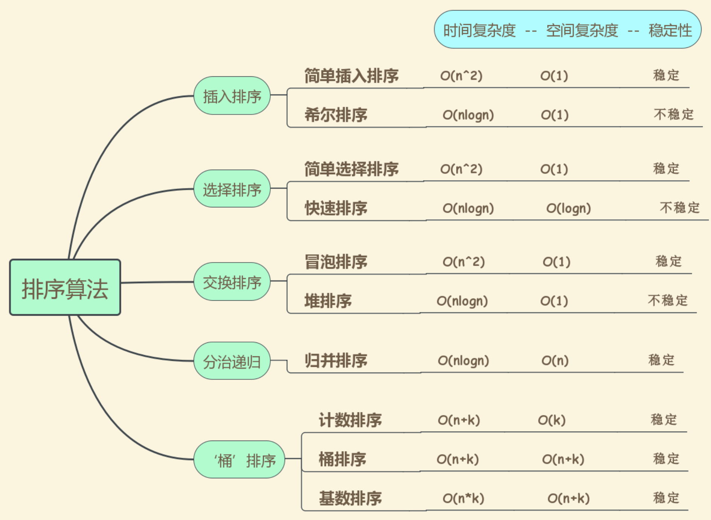

# 排序（Sorting）算法概述

## 1. 什么是排序算法？
排序算法是将一组数据按照特定顺序（升序或降序）重新排列的算法。排序是计算机科学中最基础、最重要的算法之一，也是许多复杂算法的基础操作。



**排序算法的分类示意**：
```
排序算法分类
├── 按比较方式
│   ├── 比较排序           → 基于元素比较
│   │   ├── 交换排序: 冒泡、快速
│   │   ├── 选择排序: 简单选择、堆
│   │   ├── 插入排序: 直接插入、希尔
│   │   └── 归并排序
│   │
│   └── 非比较排序         → 不基于比较
│       ├── 计数排序
│       ├── 基数排序
│       └── 桶排序
│
├── 按稳定性
│   ├── 稳定排序           → 相等元素相对位置不变
│   │   └── 插入、冒泡、归并、计数、基数
│   │
│   └── 不稳定排序         → 相等元素相对位置可能改变
│       └── 选择、快速、希尔、堆
│
├── 按空间复杂度
│   ├── 原地排序 O(1)      → 冒泡、选择、插入、快速、堆、希尔
│   └── 非原地排序         → 归并 O(n)、计数 O(k)、基数 O(n+k)
│
└── 按时间复杂度
    ├── O(n²)              → 冒泡、选择、插入
    ├── O(n log n)         → 快速、归并、堆
    └── O(n)               → 计数、基数、桶（特定条件）
```


## 2. 排序算法的基本特性

### 2.1 排序算法的评估维度
```
排序算法评估维度:

┌─────────────────────────────────────────────────────────┐
│ 1. 时间复杂度                                             │
│    • 最坏情况: 数据逆序或特定分布                           │
│    • 平均情况: 随机数据的期望性能                           │
│    • 最好情况: 数据已有序或接近有序                          │
├─────────────────────────────────────────────────────────┤
│ 2. 空间复杂度                                             │
│    • 原地排序: 只需要 O(1) 额外空间                         │
│    • 非原地排序: 需要额外数组或递归栈                        │
├─────────────────────────────────────────────────────────┤
│ 3. 稳定性                                                │
│    • 稳定: 相等元素保持原有相对顺序                          │
│    • 不稳定: 相等元素可能交换位置                            │
├─────────────────────────────────────────────────────────┤
│ 4. 内部/外部排序                                          │
│    • 内部: 数据全部在内存中进行                             │
│    • 外部: 数据太大，需要磁盘辅助                           │
└─────────────────────────────────────────────────────────┘
```

### 2.2 排序算法的稳定性示例
```
稳定性的重要性:

原始数据 (按姓名+分数):
┌─────────┬────────┐
│  姓名   │  分数   │
├─────────┼────────┤
│  Alice  │   85   │
│   Bob   │   90   │
│  Carol  │   85   │
└─────────┴────────┘

按分数升序稳定排序后:
┌─────────┬────────┐
│  Alice  │   85   │  ← 先于Carol，保持原顺序
│  Carol  │   85   │
│   Bob   │   90   │
└─────────┴────────┘

不稳定排序可能结果:
┌─────────┬────────┐
│  Carol  │   85   │  ← 相对顺序改变
│  Alice  │   85   │
│   Bob   │   90   │
└─────────┴────────┘

应用场景:
• 多关键字排序: 先按分数排序，再稳定按班级排序
• 保持原有顺序的场合
```

### 2.3 排序算法的优缺点
**优点**：
- **基础且重要**：几乎所有应用都需要排序
- **算法多样**：不同场景有最优算法选择
- **优化空间大**：可根据数据特性选择或定制

**缺点**：
- **时间成本**：大数据量排序耗时
- **空间成本**：某些算法需要额外空间
- **复杂性**：最优算法（如快速排序）实现较复杂

## 3. 常见的排序算法

### 3.1 冒泡排序（Bubble Sort）
**概述**：
- 最简单的排序算法之一
- 相邻元素两两比较，逆序则交换
- 每轮将最大元素"冒泡"到末尾

**算法过程示意**：
```
冒泡排序过程:

初始: [64, 34, 25, 12, 22, 11, 90]

第1轮:
  [64, 34, 25, 12, 22, 11, 90]
   ↑↑
   交换 → [34, 64, 25, 12, 22, 11, 90]
      ↑↑
      交换 → [34, 25, 64, 12, 22, 11, 90]
         ...
  结果: [34, 25, 12, 22, 11, 64, 90] (90已就位)

第2轮:
  [34, 25, 12, 22, 11, 64, 90]
   ↑↑
   交换 → [25, 34, 12, 22, 11, 64, 90]
      ↑↑
      交换 → [25, 12, 34, 22, 11, 64, 90]
         ...
  结果: [25, 12, 22, 11, 34, 64, 90] (64就位)

...继续直到全部有序

优化: 设置标志位，一轮无交换则提前结束

时间复杂度: 
  最好 O(n) - 已有序，只需一轮
  平均/最坏 O(n²)
空间复杂度: O(1)
稳定性: 稳定
```

**核心思想**：
- 相邻元素比较交换
- 每轮确定一个最大元素位置

**应用**：
- 教学演示（简单易懂）
- 小规模数据
- 接近有序的数据（优化版）

**实现目录**：`bubblesort/`

### 3.2 快速排序（Quick Sort）
**概述**：
- 分治思想的经典应用
- 选择一个基准(pivot)，将数据分为两部分
- 左边小于pivot，右边大于pivot
- 递归排序左右两部分

**算法过程示意**：
```
快速排序过程:

初始: [64, 34, 25, 12, 22, 11, 90]
选择pivot: 通常取最后一个元素或中间元素
这里选择 90 作为 pivot

分区过程:
  i=-1 (小于pivot的边界)
  
  j=0: 64 < 90? 是 → i=0, 交换arr[0]和arr[0]
  j=1: 34 < 90? 是 → i=1, 交换arr[1]和arr[1]
  j=2: 25 < 90? 是 → i=2, 交换arr[2]和arr[2]
  j=3: 12 < 90? 是 → i=3, 交换arr[3]和arr[3]
  j=4: 22 < 90? 是 → i=4, 交换arr[4]和arr[4]
  j=5: 11 < 90? 是 → i=5, 交换arr[5]和arr[5]
  j=6: 到达pivot

  将pivot放到正确位置: i+1=6
  结果: [64, 34, 25, 12, 22, 11, 90]
        ←────── 小于90 ──────→│←大于90(无)→

递归排序左半部分 [64, 34, 25, 12, 22, 11]

左半部分排序 (pivot=11):
  [11, 34, 25, 12, 22, 64]
   ← 小于11 →│←───大于11────→

继续递归...

最终结果: [11, 12, 22, 25, 34, 64, 90]

时间复杂度:
  最好 O(n log n) - pivot总是中位数
  平均 O(n log n)
  最坏 O(n²) - 数据已有序，pivot总是最小/最大
空间复杂度: O(log n) - 递归栈
稳定性: 不稳定
```

**核心思想**：
- 分治：分区 + 递归
- 分区：小于pivot在左，大于在右
- 关键：pivot选择和分区算法

**应用**：
- 通用排序（实际最常用）
- 大数据量排序
- C标准库qsort、Java Arrays.sort()

**实现目录**：`quicksort/`

### 3.3 归并排序（Merge Sort）
**概述**：
- 稳定的分治排序算法
- 将数组不断二分，直到单个元素
- 然后两两合并有序数组

**算法过程示意**：
```
归并排序过程:

初始: [64, 34, 25, 12, 22, 11, 90]

分解阶段 (递归二分):
                    [64,34,25,12,22,11,90]
                          /        \
              [64,34,25,12]      [22,11,90]
                 /     \            /     \
           [64,34]   [25,12]   [22,11]   [90]
            /   \     /   \     /   \
         [64] [34] [25] [12] [22] [11]

合并阶段 (两两合并):
         [64] [34] → 比较合并 → [34,64]
         [25] [12] → 比较合并 → [12,25]
         [22] [11] → 比较合并 → [11,22]
         [90]      → 单个元素

         [34,64] + [12,25] → [12,25,34,64]
         [11,22] + [90]    → [11,22,90]

         [12,25,34,64] + [11,22,90] → [11,12,22,25,34,64,90]

合并两个有序数组过程:
左: [12,25,34,64]  右: [11,22,90]
    ↑                   ↑
   L=0                 R=0

比较 12 和 11，取11 → 结果: [11]
比较 12 和 22，取12 → 结果: [11,12]
比较 25 和 22，取22 → 结果: [11,12,22]
比较 25 和 90，取25 → 结果: [11,12,22,25]
...
直到右数组取完，左数组剩余直接追加

时间复杂度: 稳定 O(n log n)
空间复杂度: O(n) - 需要额外数组
稳定性: 稳定
```

**核心思想**：
- 分：递归二分直到单个元素
- 治：合并两个有序数组

**应用**：
- 需要稳定排序的场景
- 链表排序（不需要额外空间）
- 外部排序（大数据无法一次装入内存）

**实现目录**：`mergesort/`

### 3.4 堆排序（Heap Sort）
**概述**：
- 利用堆数据结构的选择排序
- 构建大顶堆，每次取出最大元素放到末尾
- 重新调整堆，重复直到有序

**算法过程示意**：
```
堆排序过程:

初始: [64, 34, 25, 12, 22, 11, 90]

步骤1: 构建大顶堆 (Heapify)

          64
        /    \
      34      25
     /  \    /  \
   12   22  11   90

调整后:
          90
        /    \
      64      25
     /  \    /  \
   12   22  11   34

数组: [90, 64, 25, 12, 22, 11, 34]

步骤2: 排序过程

取堆顶90放到末尾，与最后一个元素34交换:
[34, 64, 25, 12, 22, 11, 90]
  ↑                        ↑
堆范围缩小，重新堆化

重新堆化后:
          64
        /    \
      34      25
     /  \    /  
   12   22  11   

数组: [64, 34, 25, 12, 22, 11, 90]

继续: 交换64和11，堆化...
[11, 34, 25, 12, 22, 64, 90]

继续直到全部有序:
[11, 12, 22, 25, 34, 64, 90]

时间复杂度: 稳定 O(n log n)
空间复杂度: O(1) - 原地排序
稳定性: 不稳定
```

**核心思想**：
- 堆是完全二叉树，父节点大于子节点
- 堆顶是最大元素
- 取出堆顶后重新调整堆

**应用**：
- 内存受限场景（原地排序）
- 优先队列实现
- 找Top K元素

**实现目录**：`heapsort/`

### 3.5 计数排序（Counting Sort）
**概述**：
- 非比较排序，适用于整数且范围不大的情况
- 统计每个元素出现的次数
- 根据计数直接确定元素位置

**算法过程示意**：
```
计数排序过程:

初始: [4, 2, 2, 8, 3, 3, 1]  (范围 1-8)

步骤1: 统计计数
┌────────┬────────┬────────┬────────┬────────┐
│ 数值    │   1    │   2    │   3    │   4    │
├────────┼────────┼────────┼────────┼────────┤
│ 计数    │   1    │   2    │   2    │   1    │
└────────┴────────┴────────┴────────┴────────┘

步骤2: 累加计数 (确定位置)
数值1: 位置0 (计数=1)
数值2: 位置1 (计数=1+2=3，范围[1,3))
数值3: 位置3 (计数=3+2=5，范围[3,5))
数值4: 位置5 (计数=5+1=6，范围[5,6))
...

步骤3: 放置元素
遍历原数组，根据累加计数确定每个元素的位置

结果: [1, 2, 2, 3, 3, 4, 8]

时间复杂度: O(n + k)  (k是数据范围)
空间复杂度: O(k)
稳定性: 稳定

适用场景:
• 数据范围不大 (k << n)
• 整数排序
• 需要稳定排序
```

**核心思想**：
- 统计计数代替比较
- 利用数据范围信息

**应用**：
- 年龄排序（范围0-150）
- 考试分数排序（范围0-100）
- 基数排序的子过程

**实现目录**：`countingsort/`

## 4. 典型应用场景

### 4.1 选择排序算法
```
┌─────────────────────────────────────────────────────────┐
│ 场景                            │ 推荐算法                │
├────────────────────────────────┼────────────────────────┤
│ 小规模数据 (n < 50)              │ 插入排序                │
│ 大规模随机数据                   │ 快速排序                │
│ 数据基本有序                     │ 插入排序                │
│ 需要稳定排序                     │ 归并排序                │
│ 内存受限                        │ 堆排序                  │
│ 数据范围小且整数                  │ 计数排序 O(n)           │
│ 数据分布均匀                     │ 桶排序                  │
│ 多位数整数                       │ 基数排序                │
└────────────────────────────────┴────────────────────────┘
```

### 4.2 系统级应用
- **数据库**：ORDER BY实现，索引排序
- **文件系统**：目录列表排序
- **编译器**：符号表排序，优化决策

### 4.3 算法基础
- **搜索算法**：二分搜索需要有序数据
- **贪心算法**：通常需要排序作为预处理
- **图算法**：Kruskal算法需要排序边

## 5. 算法技巧总结

### 5.1 混合排序策略
```
Timsort (Python/Java实际使用的排序):
• 小数组 (n < 32): 使用插入排序
• 大数组: 使用归并排序的变体
• 利用数据中已有的有序段(run)
• 最坏O(n log n)，最好O(n)

优化快速排序:
• 随机选择pivot避免最坏情况
• 三数取中: 选择头、中、尾的中位数
• 小数组切换到插入排序
• 三路划分: 处理大量重复元素
```

### 5.2 排序的变体应用
- **部分排序**：只找Top K，使用堆或快速选择
- **流数据排序**：使用插入或增量归并
- **多维度排序**：稳定排序配合多关键字

## 6. 性能特点

### 6.1 算法复杂度对比
| 算法 | 最好 | 平均 | 最坏 | 空间 | 稳定 |
|------|------|------|------|------|------|
| 冒泡 | O(n) | O(n²) | O(n²) | O(1) | 是 |
| 选择 | O(n²) | O(n²) | O(n²) | O(1) | 否 |
| 插入 | O(n) | O(n²) | O(n²) | O(1) | 是 |
| 希尔 | O(n log n) | O(n^1.3) | O(n²) | O(1) | 否 |
| 快速 | O(n log n) | O(n log n) | O(n²) | O(log n) | 否 |
| 归并 | O(n log n) | O(n log n) | O(n log n) | O(n) | 是 |
| 堆 | O(n log n) | O(n log n) | O(n log n) | O(1) | 否 |
| 计数 | O(n+k) | O(n+k) | O(n+k) | O(k) | 是 |
| 基数 | O(nk) | O(nk) | O(nk) | O(n+k) | 是 |

### 6.2 实际性能考虑
- **常数因子**：O(n log n)算法间实际速度差异大
- **缓存友好性**：快速排序缓存友好，堆排序不友好
- **数据移动代价**：链表适合归并，数组适合快排

## 7. 编程语言支持

- **C**：qsort()（通常实现为快速排序）
- **Java**：Arrays.sort()（Dual-Pivot QuickSort），Collections.sort()（Timsort）
- **Go**：sort.Sort()（快速排序）
- **JavaScript**：Array.prototype.sort()（各实现不同，通常快排或归并）
- **Python**：sorted() / list.sort()（Timsort）
- **Rust**：slice.sort()（自适应排序，通常是Timsort变体）

## 8. 学习建议

### 8.1 学习路径
1. **基础排序**：理解冒泡、选择、插入
2. **进阶排序**：掌握快速排序（重点）
3. **稳定排序**：学习归并排序
4. **原地排序**：学习堆排序
5. **特殊排序**：了解计数、基数、桶排序

### 8.2 实践要点
- 能手写快速排序（重点）
- 理解分治思想在排序中的应用
- 掌握稳定性概念和应用场景
- 学会根据场景选择合适的排序算法
- 了解实际库函数使用的排序算法

## 9. 10大经典排序算法实现

| 排序算法 | C | JavaScript | Python | Java | TypeScript | Go | Dart | Rust |
|---------|---|------------|--------|------|------------|----|----|----|
| **冒泡排序** | [bubble_sort.c](./bubblesort/bubble_sort.c) | [bubble_sort.js](./bubblesort/bubble_sort.js) | [bubble_sort.py](./bubblesort/bubble_sort.py) | [BubbleSort.java](./bubblesort/BubbleSort.java) | [BubbleSort.ts](./bubblesort/BubbleSort.ts) | [bubble_sort.go](./bubblesort/bubble_sort.go) | [bubble_sort.dart](./bubblesort/bubble_sort.dart) | [bubble_sort.rs](./bubblesort/bubble_sort.rs) |
| **插入排序** | [insert_sort.c](./insertsort/insert_sort.c) | [insert_sort.js](./insertsort/insert_sort.js) | [insert_sort.py](./insertsort/insert_sort.py) | [InsertSort.java](./insertsort/InsertSort.java) | [InsertSort.ts](./insertsort/InsertSort.ts) | [insert_sort.go](./insertsort/insert_sort.go) | - | - |
| **选择排序** | [selection_sort.c](./selectionsort/selection_sort.c) | [selection_sort.js](./selectionsort/selection_sort.js) | [selection_sort.py](./selectionsort/selection_sort.py) | [SelectionSort.java](./selectionsort/SelectionSort.java) | [SelectionSort.ts](./selectionsort/SelectionSort.ts) | [selection_sort.go](./selectionsort/selection_sort.go) | - | - |
| **堆排序** | [heap_sort.c](./heapsort/heap_sort.c) | [heap_sort.js](./heapsort/heap_sort.js) | [heap_sort.py](./heapsort/heap_sort.py) | [HeapSort.java](./heapsort/HeapSort.java) | [HeapSort.ts](./heapsort/HeapSort.ts) | [heap_sort.go](./heapsort/heap_sort.go) | - | - |
| **快速排序** | [quick_sort.c](./quicksort/quick_sort.c) | [quick_sort.js](./quicksort/quick_sort.js) | [quick_sort.py](./quicksort/quick_sort.py) | [QuickSort.java](./quicksort/QuickSort.java) | [QuickSort.ts](./quicksort/QuickSort.ts) | [quick_sort.go](./quicksort/quick_sort.go) | - | - |
| **归并排序** | [merge_sort.c](./mergesort/merge_sort.c) | [merge_sort.js](./mergesort/merge_sort.js) | [merge_sort.py](./mergesort/merge_sort.py) | [MergeSort.java](./mergesort/MergeSort.java) | [MergeSort.ts](./mergesort/MergeSort.ts) | [merge_sort.go](./mergesort/merge_sort.go) | - | - |
| **计数排序** | [counting_sort.c](./countingsort/counting_sort.c) | [counting_sort.js](./countingsort/counting_sort.js) | [counting_sort.py](./countingsort/counting_sort.py) | [CountingSort.java](./countingsort/CountingSort.java) | [CountingSort.ts](./countingsort/CountingSort.ts) | [counting_sort.go](./countingsort/counting_sort.go) | - | - |
| **基数排序** | [radix_sort.c](./radixsort/radix_sort.c) | [radix_sort.js](./radixsort/radix_sort.js) | [radix_sort.py](./radixsort/radix_sort.py) | [RadixSort.java](./radixsort/RadixSort.java) | [RadixSort.ts](./radixsort/RadixSort.ts) | [radix_sort.go](./radixsort/radix_sort.go) | - | - |
| **桶排序** | [bucket_sort.c](./bucketsort/bucket_sort.c) | [bucket_sort.js](./bucketsort/bucket_sort.js) | [bucket_sort.py](./bucketsort/bucket_sort.py) | [BuketSort.java](./bucketsort/BuketSort.java) | [BuketSort.ts](./bucketsort/BuketSort.ts) | [bucket_sort.go](./bucketsort/bucket_sort.go) | - | - |
| **希尔排序** | [shell_sort.c](./shellsort/shell_sort.c) | [shell_sort.js](./shellsort/shell_sort.js) | [shell_sort.py](./shellsort/shell_sort.py) | [ShellSort.java](./shellsort/ShellSort.java) | [ShellSort.ts](./shellsort/ShellSort.ts) | [shell_sort.go](./shellsort/shell_sort.go) | - | - |
