# 排序（Sorting）算法概述

> 排序算法是将一组数据按照特定顺序（升序或降序）重新排列的算法。排序是计算机科学中最基础、最重要的算法之一，也是许多复杂算法的基础操作。本目录涵盖经典十大排序算法的原理、流程与多语言实现。

## 导航总览

| 排序算法 | 类型 | 时间复杂度（平均） | 稳定性 | 目录 |
|---------|------|------------------|--------|------|
| [冒泡排序 Bubble Sort](#31-冒泡排序bubble-sort) | 比较 / 交换 | O(n²) | 稳定 | [`bubblesort/`](./bubblesort/) |
| [选择排序 Selection Sort](#32-选择排序selection-sort) | 比较 / 选择 | O(n²) | 不稳定 | [`selectionsort/`](./selectionsort/) |
| [插入排序 Insertion Sort](#33-插入排序insertion-sort) | 比较 / 插入 | O(n²) | 稳定 | [`insertsort/`](./insertsort/) |
| [希尔排序 Shell Sort](#34-希尔排序shell-sort) | 比较 / 插入 | O(n^1.3) | 不稳定 | [`shellsort/`](./shellsort/) |
| [快速排序 Quick Sort](#35-快速排序quick-sort) | 比较 / 交换 | O(n log n) | 不稳定 | [`quicksort/`](./quicksort/) |
| [归并排序 Merge Sort](#36-归并排序merge-sort) | 比较 / 归并 | O(n log n) | 稳定 | [`mergesort/`](./mergesort/) |
| [堆排序 Heap Sort](#37-堆排序heap-sort) | 比较 / 选择 | O(n log n) | 不稳定 | [`heapsort/`](./heapsort/) |
| [计数排序 Counting Sort](#38-计数排序counting-sort) | 非比较 | O(n + k) | 稳定 | [`countingsort/`](./countingsort/) |
| [基数排序 Radix Sort](#39-基数排序radix-sort) | 非比较 | O(n × d) | 稳定 | [`radixsort/`](./radixsort/) |
| [桶排序 Bucket Sort](#310-桶排序bucket-sort) | 非比较 | O(n + k) | 稳定 | [`bucketsort/`](./bucketsort/) |

---

## 1. 排序算法分类

### 1.1 常见排序算法分类
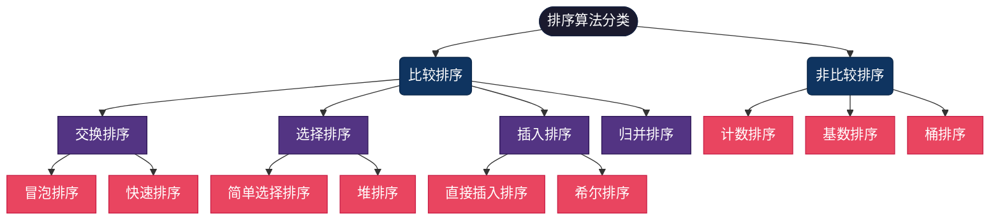

### 1.2 排序算法时间复杂度、空间复杂度以及稳定性
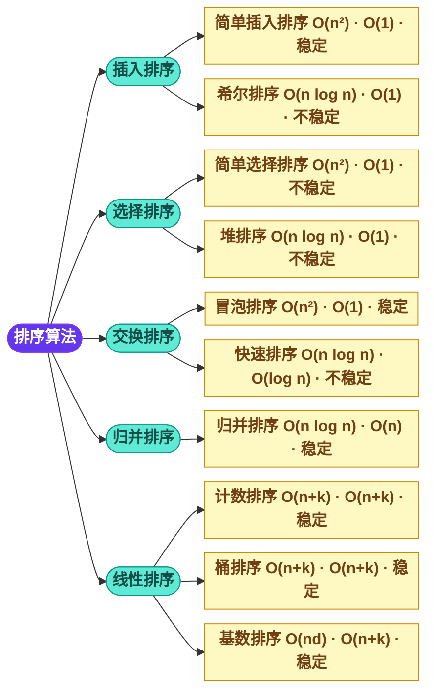

---

## 2. 排序算法的基本特性

### 2.1 排序算法的评估维度

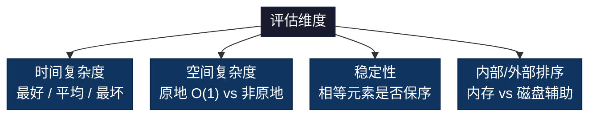

### 2.2 排序算法的稳定性示例

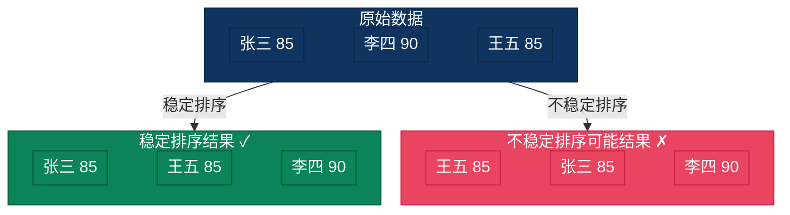

> **稳定性的意义**：多关键字排序时（如先按分数排序，再按班级稳定排序），稳定性保证已有的排序结果不被破坏。

### 2.3 排序算法的优缺点
**优点**：
- **基础且重要**：几乎所有应用都需要排序
- **算法多样**：不同场景有最优算法选择
- **优化空间大**：可根据数据特性选择或定制

**缺点**：
- **时间成本**：大数据量排序耗时
- **空间成本**：某些算法需要额外空间
- **复杂性**：最优算法（如快速排序）实现较复杂

---

## 3. 十大经典排序算法

### 3.1 冒泡排序（Bubble Sort）

**简介**：最简单的排序算法之一。重复遍历数组，相邻元素两两比较，逆序则交换，每轮将当前未排序部分的最大值"冒泡"到末尾。可设置标志位，若某轮无交换则提前终止。

| 最好 | 平均 | 最坏 | 空间 | 稳定性 |
|------|------|------|------|--------|
| O(n) | O(n²) | O(n²) | O(1) | 稳定 |

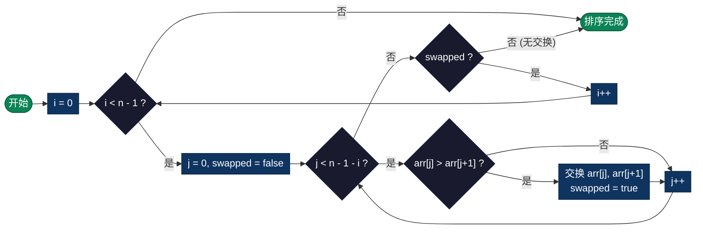

**适用场景**：教学演示、小规模数据、数据接近有序时。

**实现目录**：[`bubblesort/`](./bubblesort/)

---

### 3.2 选择排序（Selection Sort）

**简介**：每轮从未排序区间中选出最小（或最大）元素，将其放到已排序区间的末尾。无论数据是否有序，比较次数始终为 O(n²)，但交换次数最多 O(n)，因此在交换代价高的场景有一定优势。

| 最好 | 平均 | 最坏 | 空间 | 稳定性 |
|------|------|------|------|--------|
| O(n²) | O(n²) | O(n²) | O(1) | 不稳定 |

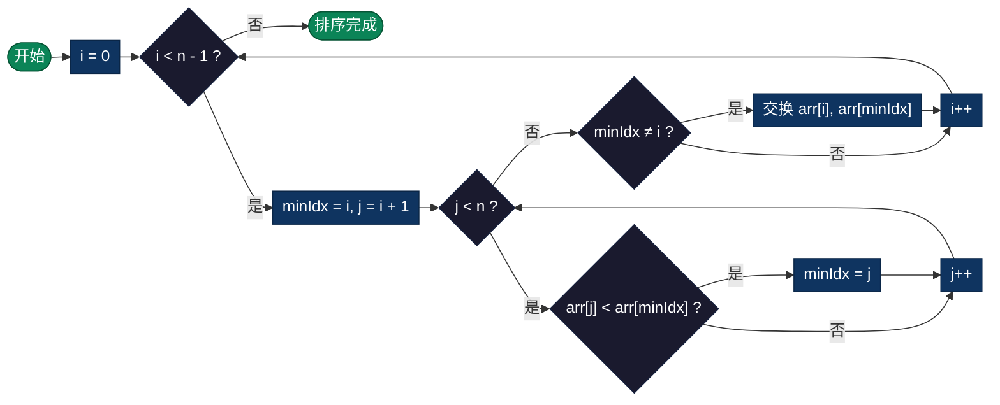

**适用场景**：数据量小且交换代价高的场景。

**实现目录**：[`selectionsort/`](./selectionsort/)

---

### 3.3 插入排序（Insertion Sort）

**简介**：类似整理扑克牌，将每个新元素插入到已排序部分的正确位置。对于基本有序的数据接近 O(n)，是小规模数据的最佳选择，也被用作快速排序和 Timsort 的子过程。

| 最好 | 平均 | 最坏 | 空间 | 稳定性 |
|------|------|------|------|--------|
| O(n) | O(n²) | O(n²) | O(1) | 稳定 |

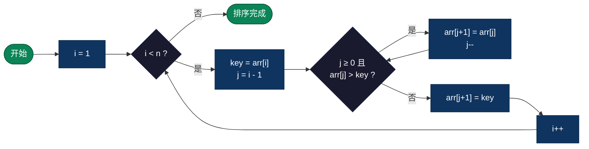

**适用场景**：小规模数据、数据基本有序、作为混合排序的子过程（如 Timsort）。

**实现目录**：[`insertsort/`](./insertsort/)

---

### 3.4 希尔排序（Shell Sort）

**简介**：插入排序的改进版，也称"缩小增量排序"。先按较大步长（gap）分组进行插入排序，逐步缩小 gap 直至 1，最终完成排序。通过大步长的预处理使数据趋于有序，大幅减少最终插入排序的移动次数。时间复杂度取决于 gap 序列的选取。

| 最好 | 平均 | 最坏 | 空间 | 稳定性 |
|------|------|------|------|--------|
| O(n log n) | O(n^1.3) | O(n²) | O(1) | 不稳定 |

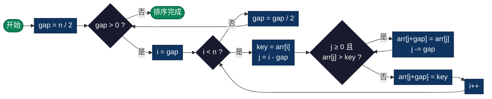

**适用场景**：中等规模数据、嵌入式系统等内存受限环境。

**实现目录**：[`shellsort/`](./shellsort/)

---

### 3.5 快速排序（Quick Sort）

**简介**：分治思想的经典应用。选取一个基准元素（pivot），通过分区操作将数组划分为"小于 pivot"和"大于 pivot"两部分，递归排序左右子数组。平均性能优异且缓存友好，是实际应用中最常用的通用排序算法。pivot 选择策略（三数取中、随机化）和小数组切换插入排序可有效避免最坏情况。

| 最好 | 平均 | 最坏 | 空间 | 稳定性 |
|------|------|------|------|--------|
| O(n log n) | O(n log n) | O(n²) | O(log n) | 不稳定 |

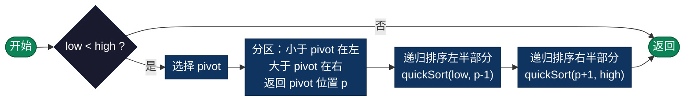

**适用场景**：通用大规模排序、C 标准库 `qsort()`、Java `Arrays.sort()`（基本类型）。

**实现目录**：[`quicksort/`](./quicksort/)

---

### 3.6 归并排序（Merge Sort）

**简介**：稳定的分治排序算法。将数组递归二分直到单个元素，然后自底向上两两合并有序子数组。时间复杂度始终为 O(n log n)，不受输入数据分布影响，但需要 O(n) 额外空间。链表排序时可做到 O(1) 额外空间，也是外部排序（海量数据无法一次装入内存）的基础算法。

| 最好 | 平均 | 最坏 | 空间 | 稳定性 |
|------|------|------|------|--------|
| O(n log n) | O(n log n) | O(n log n) | O(n) | 稳定 |

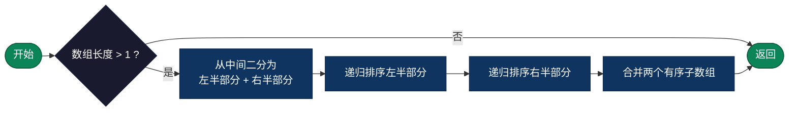

**适用场景**：需要稳定排序、链表排序、外部排序（大数据无法一次装入内存）。

**实现目录**：[`mergesort/`](./mergesort/)

---

### 3.7 堆排序（Heap Sort）

**简介**：利用堆（完全二叉树）数据结构的选择排序。先将数组构建为大顶堆（父节点 ≥ 子节点），然后反复取出堆顶最大元素放到数组末尾，再对剩余元素重新堆化。原地排序，空间复杂度 O(1)，时间复杂度稳定 O(n log n)，但缓存不友好导致实际性能通常逊于快速排序。

| 最好 | 平均 | 最坏 | 空间 | 稳定性 |
|------|------|------|------|--------|
| O(n log n) | O(n log n) | O(n log n) | O(1) | 不稳定 |

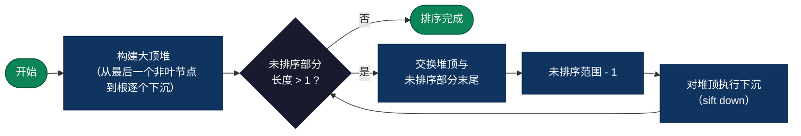

**适用场景**：内存受限的原地排序、优先队列实现、Top K 问题。

**实现目录**：[`heapsort/`](./heapsort/)

---

### 3.8 计数排序（Counting Sort）

**简介**：非比较排序算法。统计每个元素出现的次数，然后计算前缀和确定每个元素在输出数组中的位置，最后反向填充。要求数据为整数且取值范围 k 不能过大。时间复杂度 O(n + k)，当 k = O(n) 时为线性排序。也常作为基数排序的子过程。

| 最好 | 平均 | 最坏 | 空间 | 稳定性 |
|------|------|------|------|--------|
| O(n + k) | O(n + k) | O(n + k) | O(n + k) | 稳定 |

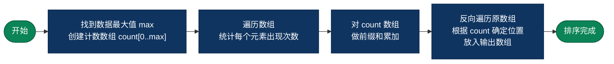

**适用场景**：整数排序且范围不大（如年龄 0-150、分数 0-100）、基数排序的子过程。

**实现目录**：[`countingsort/`](./countingsort/)

---

### 3.9 基数排序（Radix Sort）

**简介**：非比较排序算法，按"位"（个位、十位、百位……）从低位到高位（LSD）或从高位到低位（MSD）逐位进行稳定排序（通常用计数排序作为子过程）。不直接比较元素大小，而是利用整数的位信息。适用于整数或定长字符串排序，时间复杂度 O(n × d)，其中 d 为最大位数。

| 最好 | 平均 | 最坏 | 空间 | 稳定性 |
|------|------|------|------|--------|
| O(n × d) | O(n × d) | O(n × d) | O(n + k) | 稳定 |

> d = 最大位数，k = 基数（如十进制 k=10）

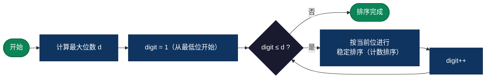

**适用场景**：多位数整数排序、手机号 / 身份证号等定长数字串排序。

**实现目录**：[`radixsort/`](./radixsort/)

---

### 3.10 桶排序（Bucket Sort）

**简介**：非比较排序算法，也称"箱排序"。将数据按值域均匀分配到有限数量的桶中，每个桶内部使用其他排序算法（通常插入排序）进行排序，最后按桶顺序依次拼接。当数据分布均匀时可达到 O(n) 线性时间复杂度；极端情况下（所有数据落入同一个桶）退化为桶内排序算法的复杂度。

| 最好 | 平均 | 最坏 | 空间 | 稳定性 |
|------|------|------|------|--------|
| O(n + k) | O(n + k) | O(n²) | O(n + k) | 稳定 |

> k = 桶的数量。最坏情况发生在所有元素落入同一个桶时。

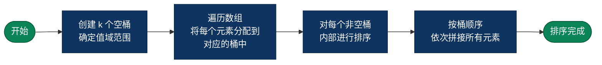

**适用场景**：数据分布均匀的浮点数排序、值域已知的大规模数据。

**实现目录**：[`bucketsort/`](./bucketsort/)

---

## 4. 算法复杂度对比

| 算法 | 最好 | 平均 | 最坏 | 空间 | 稳定 |
|------|------|------|------|------|------|
| 冒泡排序 | O(n) | O(n²) | O(n²) | O(1) | 稳定 |
| 选择排序 | O(n²) | O(n²) | O(n²) | O(1) | 不稳定 |
| 插入排序 | O(n) | O(n²) | O(n²) | O(1) | 稳定 |
| 希尔排序 | O(n log n) | O(n^1.3) | O(n²) | O(1) | 不稳定 |
| 快速排序 | O(n log n) | O(n log n) | O(n²) | O(log n) | 不稳定 |
| 归并排序 | O(n log n) | O(n log n) | O(n log n) | O(n) | 稳定 |
| 堆排序 | O(n log n) | O(n log n) | O(n log n) | O(1) | 不稳定 |
| 计数排序 | O(n + k) | O(n + k) | O(n + k) | O(n + k) | 稳定 |
| 基数排序 | O(n × d) | O(n × d) | O(n × d) | O(n + k) | 稳定 |
| 桶排序 | O(n + k) | O(n + k) | O(n²) | O(n + k) | 稳定 |

### 稳定性分类

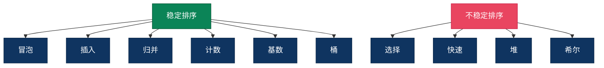

---

## 5. 典型应用场景

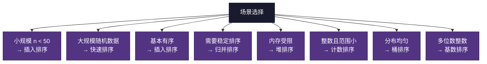

### 系统级应用
- **数据库**：ORDER BY 实现，索引排序
- **文件系统**：目录列表排序
- **编译器**：符号表排序，优化决策

### 算法基础
- **搜索算法**：二分搜索需要有序数据
- **贪心算法**：通常需要排序作为预处理
- **图算法**：Kruskal 算法需要排序边

---

## 6. 实际性能考虑

### 6.1 混合排序策略

> **Timsort**（Python `sorted()` / Java `Collections.sort()` 实际使用的算法）：小数组（n < 32）用插入排序，大数组用归并排序变体，并利用数据中已有的有序段（run），最坏 O(n log n)，最好 O(n)。

> **优化快速排序**：随机选择 pivot 或三数取中避免最坏情况；小数组切换插入排序；三路划分处理大量重复元素。

### 6.2 影响实际性能的因素
- **常数因子**：同为 O(n log n) 的算法间实际速度差异大
- **缓存友好性**：快速排序缓存友好，堆排序不友好
- **数据移动代价**：链表适合归并排序，数组适合快速排序

---

## 7. 编程语言标准库排序实现

| 语言 | 函数 | 算法 |
|------|------|------|
| C | `qsort()` | 通常为快速排序 |
| Java | `Arrays.sort()` | 基本类型 Dual-Pivot QuickSort；对象 Timsort |
| Python | `sorted()` / `list.sort()` | Timsort |
| Go | `sort.Sort()` | 模式自适应排序（pdqsort） |
| JavaScript | `Array.prototype.sort()` | 各引擎不同（V8 使用 Timsort） |
| Rust | `slice.sort()` | 自适应归并排序（Timsort 变体） |

---

## 8. 学习建议

### 学习路径

### 实践要点
- 能手写快速排序和归并排序（面试重点）
- 理解分治思想在排序中的应用
- 掌握稳定性概念和应用场景
- 学会根据场景选择合适的排序算法
- 了解实际库函数使用的排序算法

---

## 9. 十大排序算法多语言实现

| 排序算法 | C | Java | Go | Python | JavaScript | TypeScript | Rust | Dart |
|---------|---|------|----|--------|------------|------------|------|------|
| **冒泡排序** | [C](./bubblesort/bubble_sort.c) | [Java](./bubblesort/BubbleSort.java) | [Go](./bubblesort/bubble_sort.go) | [PY](./bubblesort/bubble_sort.py) | [JS](./bubblesort/bubble_sort.js) | [TS](./bubblesort/BubbleSort.ts) | [Rust](./bubblesort/bubble_sort.rs) | [Dart](./bubblesort/bubble_sort.dart) |
| **选择排序** | [C](./selectionsort/selection_sort.c) | [Java](./selectionsort/SelectionSort.java) | [Go](./selectionsort/selection_sort.go) | [PY](./selectionsort/selection_sort.py) | [JS](./selectionsort/selection_sort.js) | [TS](./selectionsort/SelectionSort.ts) | [Rust](./selectionsort/selection_sort.rs) | - |
| **插入排序** | [C](./insertsort/insert_sort.c) | [Java](./insertsort/InsertSort.java) | [Go](./insertsort/insert_sort.go) | [PY](./insertsort/insert_sort.py) | [JS](./insertsort/insert_sort.js) | [TS](./insertsort/InsertSort.ts) | [Rust](./insertsort/insert_sort.rs) | - |
| **希尔排序** | [C](./shellsort/shell_sort.c) | [Java](./shellsort/ShellSort.java) | [Go](./shellsort/shell_sort.go) | [PY](./shellsort/shell_sort.py) | [JS](./shellsort/shell_sort.js) | [TS](./shellsort/ShellSort.ts) | [Rust](./shellsort/shell_sort.rs) | - |
| **快速排序** | [C](./quicksort/quick_sort.c) | [Java](./quicksort/QuickSort.java) | [Go](./quicksort/quick_sort.go) | [PY](./quicksort/quick_sort.py) | [JS](./quicksort/quick_sort.js) | [TS](./quicksort/QuickSort.ts) | [Rust](./quicksort/quick_sort.rs) | - |
| **归并排序** | [C](./mergesort/merge_sort.c) | [Java](./mergesort/MergeSort.java) | [Go](./mergesort/merge_sort.go) | [PY](./mergesort/merge_sort.py) | [JS](./mergesort/merge_sort.js) | [TS](./mergesort/MergeSort.ts) | [Rust](./mergesort/merge_sort.rs) | - |
| **堆排序** | [C](./heapsort/heap_sort.c) | [Java](./heapsort/HeapSort.java) | [Go](./heapsort/heap_sort.go) | [PY](./heapsort/heap_sort.py) | [JS](./heapsort/heap_sort.js) | [TS](./heapsort/HeapSort.ts) | [Rust](./heapsort/heap_sort.rs) | - |
| **计数排序** | [C](./countingsort/counting_sort.c) | [Java](./countingsort/CountingSort.java) | [Go](./countingsort/counting_sort.go) | [PY](./countingsort/counting_sort.py) | [JS](./countingsort/counting_sort.js) | [TS](./countingsort/CountingSort.ts) | [Rust](./countingsort/counting_sort.rs) | - |
| **基数排序** | [C](./radixsort/radix_sort.c) | [Java](./radixsort/RadixSort.java) | [Go](./radixsort/radix_sort.go) | [PY](./radixsort/radix_sort.py) | [JS](./radixsort/radix_sort.js) | [TS](./radixsort/RadixSort.ts) | [Rust](./radixsort/radix_sort.rs) | - |
| **桶排序** | [C](./bucketsort/bucket_sort.c) | [Java](./bucketsort/BucketSort.java) | [Go](./bucketsort/bucket_sort.go) | [PY](./bucketsort/bucket_sort.py) | [JS](./bucketsort/bucket_sort.js) | [TS](./bucketsort/BucketSort.ts) | [Rust](./bucketsort/bucket_sort.rs) | - |
