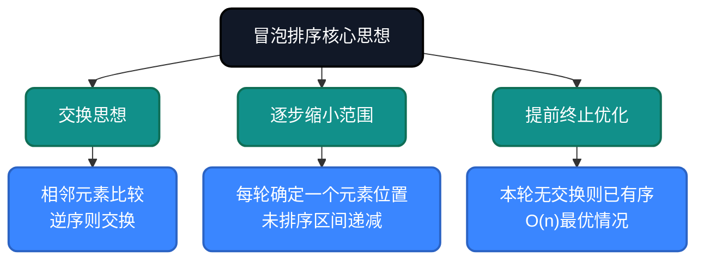
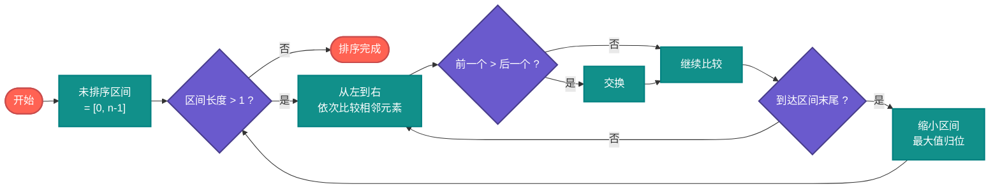
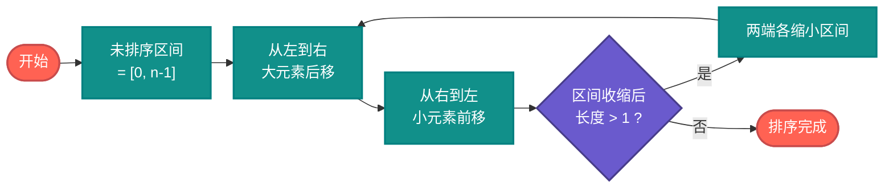
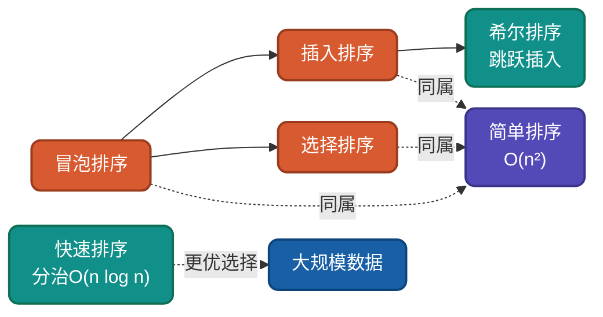

# AI时代，重温冒泡排序，不同实现思路详解

冒泡排序是最基础的排序算法，就像学编程的"Hello World"一样。虽然它效率不高，但蕴含着**交换思想**和**逐步逼近**的核心算法思维。理解冒泡排序的多种实现思路，从不同角度思考问题，有助于驱动AI干活。

## 为什么还要学冒泡排序？

AI可以生成冒泡排序代码，但无法理解**为什么这样设计**：
- 为什么要相邻元素两两比较？
- 为什么要从后往前缩小范围？
- 如何提前终止避免无效比较？

理解这些设计决策，才能更好地指导AI编写高效代码，从而解决现实中复杂的问题。

## 核心思想

冒泡排序基于**交换思想**：相邻元素两两比较，逆序则交换，每轮将最大元素"冒泡"到正确位置。



## 实现思路对比

| 实现方式 | 核心优化 | 时间复杂度 | 空间复杂度 | 稳定性 |
|---------|---------|-----------|-----------|--------|
| 基础冒泡 | 无优化 | O(n²) | O(1) | 稳定 |
| 提前终止 | 加入swapped标记 | O(n)~O(n²) | O(1) | 稳定 |
| 记录最后交换位置 | 缩小下一轮范围 | O(n)~O(n²) | O(1) | 稳定 |
| 双向冒泡 | 交替从两头排序 | O(n)~O(n²) | O(1) | 稳定 |

---

## 思路一：基础冒泡排序

**策略原理**：严格按照定义，相邻元素比较交换，每轮结束后未排序区间减一。

**适用场景**：教学演示、理解算法本质。

### 流程图



### 代码实现

**Go**
```go
func BubbleSortBasic(arr []int) []int {
    n := len(arr)
    // 外层：遍历全部数组，每轮确定一个最大值位置
    for i := 0; i < n-1; i++ {
        // 内层：在未排序区间进行相邻两两比较
        // n-1-i 表示已确定位置的元素无需再比较
        for j := 0; j < n-1-i; j++ {
            if arr[j] > arr[j+1] {
                // 相邻元素两两比较，把大的那个冒出来
                arr[j], arr[j+1] = arr[j+1], arr[j]
            }
        }
    }
    return arr
}
```

**Python**
```python
def bubble_sort_basic(arr):
    n = len(arr)
    # 外层：遍历全部数组，每轮确定一个最大值位置
    for i in range(n - 1):
        # 内层：在未排序区间进行相邻两两比较
        for j in range(n - 1 - i):
            if arr[j] > arr[j + 1]:
                # 相邻元素两两比较，把大的那个冒出来
                arr[j], arr[j + 1] = arr[j + 1], arr[j]
    return arr
```

**Java**
```java
public static void bubbleSortBasic(int[] arr) {
    int n = arr.length;
    // 外层：遍历全部数组，每轮确定一个最大值位置
    for (int i = 0; i < n - 1; i++) {
        // 内层：在未排序区间进行相邻两两比较
        for (int j = 0; j < n - 1 - i; j++) {
            if (arr[j] > arr[j + 1]) {
                // 相邻元素两两比较，把大的那个冒出来
                int temp = arr[j];
                arr[j] = arr[j + 1];
                arr[j + 1] = temp;
            }
        }
    }
}
```

---

## 思路二：提前终止优化

**策略原理**：如果某一轮没有发生任何交换，说明数组已经有序，可以提前结束排序。

**关键改进**：添加`swapped`标记位，检测是否发生交换。

**适用场景**：数据近乎有序的情况，可达到O(n)最优性能。

### 代码实现

**Go**
```go
func BubbleSortOptimized(arr []int) []int {
    n := len(arr)
    // 外层：遍历全部数组，每轮确定一个最大值位置
    for i := 0; i < n-1; i++ {
        swapped := false // 标记本轮是否发生交换

        // 内层：在未排序区间进行相邻两两比较
        for j := 0; j < n-1-i; j++ {
            if arr[j] > arr[j+1] {
                // 相邻元素两两比较，把大的那个冒出来
                arr[j], arr[j+1] = arr[j+1], arr[j]
                swapped = true
            }
        }

        // 本轮无交换，说明数组已有序，提前终止
        if !swapped {
            break
        }
    }
    return arr
}
```

**Python**
```python
def bubble_sort_optimized(arr):
    n = len(arr)
    # 外层：遍历全部数组，每轮确定一个最大值位置
    for i in range(n - 1):
        swapped = False  # 标记本轮是否发生交换
        # 内层：在未排序区间进行相邻两两比较
        for j in range(n - 1 - i):
            if arr[j] > arr[j + 1]:
                # 相邻元素两两比较，把大的那个冒出来
                arr[j], arr[j + 1] = arr[j + 1], arr[j]
                swapped = True
        # 本轮无交换，说明数组已有序，提前终止
        if not swapped:
            break
    return arr
```

---

## 思路三：记录最后交换位置

**策略原理**：记录每轮最后一次交换的位置，该位置之后的元素已有序，下一轮只需比较到这个位置即可。

**关键改进**：比提前终止更精细，避免比较已经有序的后缀部分。

**适用场景**：尾部已有序的大规模数据。

### 代码实现

**Go**
```go
func BubbleSortLastSwap(arr []int) []int {
    n := len(arr)
    lastSwap := n - 1 // 记录最后交换位置

    for lastSwap > 0 {
        newLastSwap := 0
        // 内层：在未排序区间进行相邻两两比较，只比较到上次交换位置
        for j := 0; j < lastSwap; j++ {
            if arr[j] > arr[j+1] {
                // 相邻元素两两比较，把大的那个冒出来
                arr[j], arr[j+1] = arr[j+1], arr[j]
                newLastSwap = j // 更新最后交换位置
            }
        }
        lastSwap = newLastSwap
    }
    return arr
}
```

**JavaScript**
```javascript
function bubbleSortLastSwap(arr) {
    let lastSwap = arr.length - 1;  // 记录最后交换位置

    while (lastSwap > 0) {
        let newLastSwap = 0;
        // 内层：在未排序区间进行相邻两两比较，只比较到上次交换位置
        for (let j = 0; j < lastSwap; j++) {
            if (arr[j] > arr[j + 1]) {
                // 相邻元素两两比较，把大的那个冒出来
                [arr[j], arr[j + 1]] = [arr[j + 1], arr[j]];
                newLastSwap = j;  // 更新最后交换位置
            }
        }
        lastSwap = newLastSwap;
    }
    return arr;
}
```

---

## 思路四：双向冒泡排序（鸡尾酒排序）

**策略原理**：交替从前往后和从后往前进行排序，每轮分别确定最大值和最小值的位置。

**关键改进**：快速将极值元素归位，适合极值在两端的数据。

**适用场景**：最小值在末尾或最大值在开头的情况。

### 流程图



### 代码实现

**Go**
```go
func CocktailSort(arr []int) []int {
    left, right := 0, len(arr)-1

    for left < right {
        // 从左到右：在未排序区间进行相邻两两比较，大元素后移
        for i := left; i < right; i++ {
            if arr[i] > arr[i+1] {
                // 相邻元素两两比较，把大的那个冒出来
                arr[i], arr[i+1] = arr[i+1], arr[i]
            }
        }
        right--

        // 从右到左：在未排序区间进行相邻两两比较，小元素前移
        for i := right; i > left; i-- {
            if arr[i-1] > arr[i] {
                // 相邻元素两两比较，把小的那个沉下去
                arr[i-1], arr[i] = arr[i], arr[i-1]
            }
        }
        left++
    }
    return arr
}
```

**Python**
```python
def cocktail_sort(arr):
    left, right = 0, len(arr) - 1

    while left < right:
        # 从左到右：在未排序区间进行相邻两两比较，大元素后移
        for i in range(left, right):
            if arr[i] > arr[i + 1]:
                # 相邻元素两两比较，把大的那个冒出来
                arr[i], arr[i + 1] = arr[i + 1], arr[i]
        right -= 1

        # 从右到左：在未排序区间进行相邻两两比较，小元素前移
        for i in range(right, left, -1):
            if arr[i - 1] > arr[i]:
                # 相邻元素两两比较，把小的那个沉下去
                arr[i - 1], arr[i] = arr[i], arr[i - 1]
        left += 1

    return arr
```

---

## 复杂度分析

| 实现方式 | 最好情况 | 平均情况 | 最坏情况 | 空间复杂度 | 稳定性 |
|---------|---------|---------|---------|-----------|--------|
| 基础冒泡 | O(n²) | O(n²) | O(n²) | O(1) | 稳定 |
| 提前终止 | O(n) | O(n²) | O(n²) | O(1) | 稳定 |
| 记录最后交换 | O(n) | O(n²) | O(n²) | O(1) | 稳定 |
| 双向冒泡 | O(n) | O(n²) | O(n²) | O(1) | 稳定 |

**稳定性说明**：冒泡排序是稳定的，因为相等的元素不会交换位置，保持原有相对次序。

---

## 应用场景

### 适用场景
1. **教学入门**：逻辑最简单直观，是算法教学的首选
2. **小规模数据**：n < 100时，性能差异不明显
3. **近乎有序数据**：提前终止优化后可达O(n)
4. **稳定性要求**：需要保持相等元素相对顺序时

### 不适用场景
1. **大规模数据排序**：O(n²)复杂度在大数据量下性能差
2. **高性能要求场景**：需要选择O(n log n)算法
3. **嵌入式实时系统**：有更快更省资源的替代方案

---

## 与其他算法对比



| 算法 | 平均复杂度 | 最好情况 | 最坏情况 | 稳定性 | 适用场景 |
|-----|-----------|---------|---------|--------|---------|
| 冒泡排序 | O(n²) | O(n) | O(n²) | 稳定 | 教学、近乎有序小数据 |
| 插入排序 | O(n²) | O(n) | O(n²) | 稳定 | 小数据、在线流式排序 |
| 选择排序 | O(n²) | O(n²) | O(n²) | 不稳定 | 交换敏感设备 |
| 希尔排序 | O(n^1.3) | O(n) | O(n²) | 不稳定 | 中等规模数据 |
| 快速排序 | O(n log n) | O(n log n) | O(n²) | 不稳定 | 大规模通用排序 |

---

## 总结

冒泡排序虽然效率不高，但它是理解**交换思想**的最佳入门算法。通过本文的多种实现思路，我们可以看到：

1. **基础冒泡**：理解算法本质
2. **提前终止**：学习优化思维
3. **记录交换位置**：掌握精细优化技巧
4. **双向冒泡**：拓展算法变体思路

AI时代，我们不需要手写冒泡排序，但需要理解这些优化思路，才能在与AI协作时做出正确的设计决策。

---

**相关链接**
- [冒泡排序多语言实现](https://github.com/microwind/algorithms/tree/main/sorting/bubblesort)
- [AI时代，重温10大经典排序算法](https://github.com/microwind/algorithms/blob/main/sorting/AI-Era-Top-10-Sorting-Algorithms.md)
- [选择排序详解](https://github.com/microwind/algorithms/tree/main/sorting/selectionsort)
- [插入排序详解](https://github.com/microwind/algorithms/tree/main/sorting/insertsort)

**AI编程核心库**
- [algorithms - 算法与数据结构](https://github.com/microwind/algorithms) - 本项目，包含各种数据结构与经典算法
- [ai-prompt - Prompt工程](https://github.com/microwind/ai-prompt) - 构建高质量的大型语言模型Prompt
- [ai-skills - AI编程技能](https://github.com/microwind/ai-skills) - 高质量的AI编程Skills库
- [design-patterns - 设计模式](https://github.com/microwind/design-patterns) - 设计模式、编程范式、架构设计
