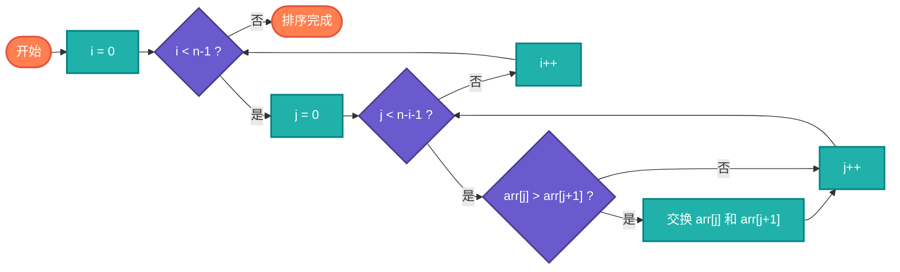
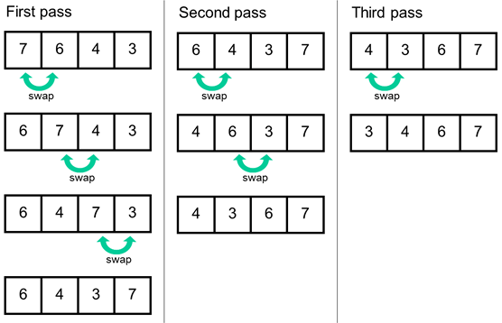
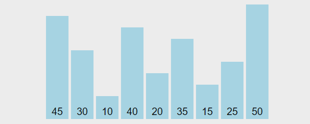

## 【冒泡排序算法详解】Java/Go/Python/JS/C不同语言实现

## 说明

冒泡排序（Bubble Sort）又称为泡式排序，是一种简单的排序算法。它重复地走访过要排序的数列，一次比较两个元素，如果它们的顺序错误就把它们交换过来。即通过遍历待排序的数列，一次比较两个元素，根据大小调换位置，直到把最大的或最小的冒出来。

> **生活类比**：体育课排队，让相邻两人比身高，矮的站前面，高的站后面。一轮下来，最高的人一定到了队尾。

## 实现过程

1. 先建立两个循环，外循环用于遍历整个数组，内循环遍历待排序的区间。
2. 内循环每次都从第一项开始，将该项与待排序的后项逐个进行大小比较，再两两交换，将大的数字冒出来。
3. 重复第二项，一直到数组遍历完。

## 算法流程



## 示意图




## 性能分析

    平均时间复杂度：O(N^2)
    最佳时间复杂度：O(N)
    最差时间复杂度：O(N^2)
    空间复杂度：O(1)
    排序方式：In-place
    稳定性：稳定

# 代码

## Java

```java
  // java冒泡排序标准版，更多版本请看源码文件
  void sort1(int arr[]) {
    int len = arr.length;
    for (int i = 0; i < len; i++) {
      for (int j = 0; j < len - i - 1; j++) {
        // 自左往右每两个进行比较，把大的交换到右侧
        // 逐轮冒出最大数，已经排好序的不要再比较
        if (arr[j] > arr[j + 1]) {
          int tmp = arr[j];
          arr[j] = arr[j + 1];
          arr[j + 1] = tmp;
        }
      }
    }
  }
```

## Python

```python
# python冒泡排序标准版，更多实现版本请查看源文件
def bubble_sort1(arr):
  print('bubble_sort1 from left to right:')
  length = len(arr)
  for i in range(length):
    for j in range(length - i - 1):
      # 自左往右每两个进行比较，把大的交换到右侧
      # 逐轮冒出最大数，已经排好序的不要再比较
      if (arr[j] > arr[j + 1]):
        [arr[j], arr[j + 1]] = [arr[j + 1], arr[j]]
```

## Go

```go
// go冒泡排序标准版，更多版本请查看源文件
func bubbleSort1(list []int) []int {
	var length = len(list)
	for i := 0; i < length; i++ {
		for j := 0; j < length-i-1; j++ {
			if list[j] > list[j+1] {
				var tmp = list[j+1]
				list[j+1] = list[j]
				list[j] = tmp
			}
		}
	}
	return list
}
```

## JS

```javascript
// js冒泡排序标准版，更多实现版本详见源码文件
function bubbleSort1(arr) {
  const len = arr.length
  for (var i = 0; i < len; i++) {
    for (var j = 0; j < len - i - 1; j++) {
      // 自左往右每两个进行比较，把大的交换到右侧
      // 逐轮冒出最大数，已经排好序的不要再比较
      if (arr[j] > arr[j + 1]) {
        [arr[j], arr[j + 1]] = [arr[j + 1], arr[j]]
      }
    }
  }
}
```

## TS

```typescript
  // ts冒泡排序标准版，其他版本请查看源码文件
  bubbleSort1(arr: Array<number>) {
    console.log('bubbleSort1 from left to right:')
    const len = arr.length
    for (let i = 0; i < len; i++) {
      for (let j = 0; j < len - i - 1; j++) {
        // 自左往右每两个进行比较，把大的交换到右侧
        // 逐轮冒出最大数，已经排好序的不要再比较
        if (arr[j] > arr[j + 1]) {
          [arr[j], arr[j + 1]] = [arr[j + 1], arr[j]]
        }
      }
    }
  }
```

## C

```c
// c语言冒泡排序标准版，更多实现请看源码
void bubbleSort1(int arr[], int len)
{

  for (int i = 0; i < len; i++)
  {
    for (int j = 0; j < len - i - 1; j++)
    {
      // 自左往右每两个进行比较，把大的交换到右侧
      // 逐轮冒出最大数，已经排好序的不要再比较
      if (arr[j] > arr[j + 1])
      {
        int tmp = arr[j];
        arr[j] = arr[j + 1];
        arr[j + 1] = tmp;
      }

    }
  }
}
```

## Rust

```rust
// rust冒泡排序标准版，更多实现请看源码
fn bubble_sort1<T: Ord>(arr: &mut [T]) -> &mut [T] {
  let len = arr.len();

  for i in 0..len {
    for j in 0..len - i - 1 {
      if arr[j] > arr[j + 1] {
        // 可以直接使用swap
        arr.swap(j, j + 1);
      }
    }
  }

  return arr;
}
```

## Dart

```dart
// dart冒泡排序标准版，更多实现请看源码
bubbleSort1(List list) {
  var len = list.length;
  for (var i = 0; i < len; i++) {
    for (var j = 0; j < len - i - 1; j++) {
      if (list[j] > list[j + 1]) {
        var tmp = list[j + 1];
        list[j + 1] = list[j];
        list[j] = tmp;
      }
    }
  }
  return list;
}
```

# 链接

冒泡排序算法源码：[https://github.com/microwind/algorithms/tree/main/sorting/bubblesort](https://github.com/microwind/algorithms/tree/main/sorting/bubblesort)

其他排序算法源码：[https://github.com/microwind/algorithms](https://github.com/microwind/algorithms)
