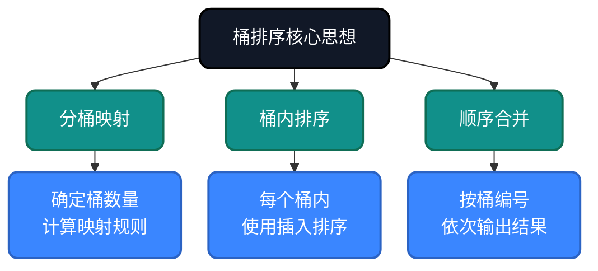
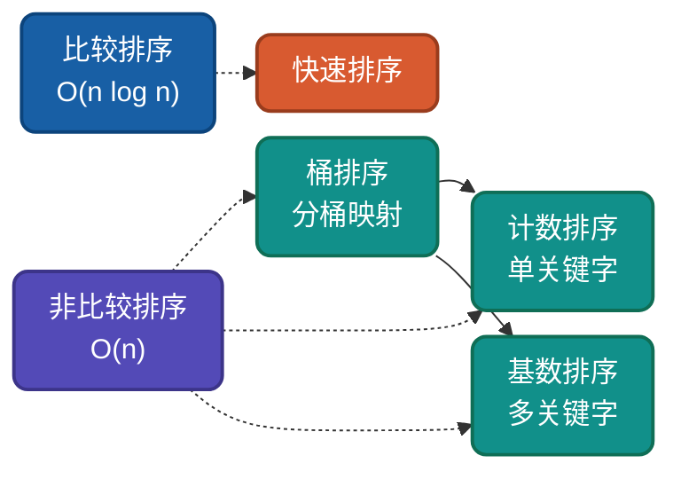

# AI时代，重温桶排序，不同实现思路详解

桶排序是**分桶映射思想**的代表，通过将数据分散到多个桶中再分别排序。理解桶排序的多种实现思路，有助于驱动AI干活。

## 为什么还要学桶排序？

AI可以生成桶排序代码，但无法理解**为什么这样设计**：
- 为什么数据均匀分布时能达到O(n)？
- 如何确定桶的数量？
- 桶内用什么排序算法最优？

理解这些设计决策，才能更好地指导AI编写高效代码，从而解决现实中复杂的问题。

## 核心思想

桶排序基于**分桶映射思想**：将数据范围划分为多个区间（桶），数据落入对应桶后分别排序，最后按桶顺序输出。



## 实现思路对比

| 实现方式 | 桶数量选择 | 桶内排序 | 适用场景 |
|---------|-----------|---------|---------|
| 基础桶排序 | n个桶 | 插入排序 | 均匀分布数据 |
| 优化桶排序 | 自适应 | 快速排序 | 非均匀分布 |

---

## 思路一：基础桶排序

**策略原理**：创建n个桶，将数据均匀映射到桶中，桶内使用插入排序，最后按顺序合并。

**关键改进**：当数据均匀分布时，每个桶只有常数个元素，桶内排序为O(1)，总体达到O(n)。

**适用场景**：数据均匀分布、浮点数排序、外部排序。

### 代码实现

**Go**
```go
func BucketSort(arr []float64) []float64 {
    n := len(arr)
    if n <= 1 {
        return arr
    }

    // 第一步：找到数据范围
    max, min := arr[0], arr[0]
    for _, v := range arr {
        if v > max {
            max = v
        }
        if v < min {
            min = v
        }
    }

    // 第二步：创建n个桶
    buckets := make([][]float64, n)

    // 第三步：将数据映射到对应桶
    for _, v := range arr {
        idx := int((v - min) / (max - min) * float64(n-1))
        buckets[idx] = append(buckets[idx], v)
    }

    // 第四步：桶内排序并合并
    result := make([]float64, 0, n)
    for _, bucket := range buckets {
        if len(bucket) > 0 {
            insertionSort(bucket)  // 桶内使用插入排序
            result = append(result, bucket...)
        }
    }
    return result
}

func insertionSort(arr []float64) {
    for i := 1; i < len(arr); i++ {
        key := arr[i]
        j := i - 1
        for j >= 0 && arr[j] > key {
            arr[j+1] = arr[j]
            j--
        }
        arr[j+1] = key
    }
}
```

**Python**
```python
def bucket_sort(arr):
    if not arr:
        return arr
    
    min_val, max_val = min(arr), max(arr)
    n = len(arr)
    
    # 创建桶
    buckets = [[] for _ in range(n)]
    
    # 分桶
    for v in arr:
        idx = int((v - min_val) / (max_val - min_val) * (n - 1))
        buckets[idx].append(v)
    
    # 桶内排序
    result = []
    for bucket in buckets:
        bucket.sort()
        result.extend(bucket)
    
    return result
```

## 整数桶排序

**Java**
```java
public static void bucketSort(int[] arr, int bucketSize) {
    if (arr.length == 0) return;
    
    int min = arr[0], max = arr[0];
    for (int v : arr) {
        if (v < min) min = v;
        if (v > max) max = v;
    }
    
    int bucketCount = (max - min) / bucketSize + 1;
    List<List<Integer>> buckets = new ArrayList<>();
    for (int i = 0; i < bucketCount; i++) {
        buckets.add(new ArrayList<>());
    }
    
    // 分桶
    for (int v : arr) {
        int idx = (v - min) / bucketSize;
        buckets.get(idx).add(v);
    }
    
    // 排序合并
    int index = 0;
    for (List<Integer> bucket : buckets) {
        Collections.sort(bucket);
        for (int v : bucket) {
            arr[index++] = v;
        }
    }
}
```

---

## 复杂度分析

| 实现方式 | 时间复杂度 | 空间复杂度 | 稳定性 | 说明 |
|---------|-----------|-----------|--------|------|
| 基础桶排序 | O(n)~O(n²) | O(n+k) | 稳定 | 桶内稳定排序 |
| 优化桶排序 | O(n)~O(n²) | O(n+k) | 稳定 | 自适应桶数量 |

**说明**：当数据均匀分布时，每个桶只有常数个元素，桶内排序O(1)，总体达到O(n)线性时间。

---

## 应用场景

### 适用场景
1. **均匀分布数据**：浮点数、随机数
2. **外部排序**：每个桶可单独处理
3. **并行排序**：桶之间独立可并行
4. **Top-K近似**：快速定位大致范围

### 不适用场景
- 数据需**均匀分布**才能发挥优势
- 需要知道**数据范围**
- 最坏情况退化为O(n²)

---

## 与其他算法对比



| 算法 | 平均复杂度 | 空间复杂度 | 稳定性 | 适用场景 |
|-----|-----------|-----------|--------|---------|
| 桶排序 | O(n)~O(n²) | O(n+k) | 稳定 | 均匀分布数据 |
| 计数排序 | O(n+k) | O(k) | 稳定 | 范围有限 |
| 基数排序 | O(d×(n+k)) | O(n+k) | 稳定 | 整数、字符串 |
| 快速排序 | O(n log n) | O(log n) | 不稳定 | 通用排序 |

---

## 总结

桶排序的核心价值在于**均匀分布时达到O(n)**。通过本文的多种实现思路：

1. **基础桶排序**：理解分桶映射思想
2. **整数桶排序**：自适应桶数量

AI时代，理解桶排序的**分桶映射思想**，能帮助我们在数据均匀分布场景做出正确选择。

---

**相关链接**
- [桶排序多语言实现](https://github.com/microwind/algorithms/tree/main/sorting/bucketsort)
- [AI时代，重温10大经典排序算法](https://github.com/microwind/algorithms/blob/main/sorting/AI-Era-Top-10-Sorting-Algorithms.md)
- [计数排序详解](https://github.com/microwind/algorithms/tree/main/sorting/countingsort)
- [基数排序详解](https://github.com/microwind/algorithms/tree/main/sorting/radixsort)

**AI编程核心库**
- [algorithms - 算法与数据结构](https://github.com/microwind/algorithms) - 本项目，包含各种数据结构与经典算法
- [ai-prompt - Prompt工程](https://github.com/microwind/ai-prompt) - 构建高质量的大型语言模型Prompt
- [ai-skills - AI编程技能](https://github.com/microwind/ai-skills) - 高质量的AI编程Skills库
- [design-patterns - 设计模式](https://github.com/microwind/design-patterns) - 设计模式、编程范式、架构设计
