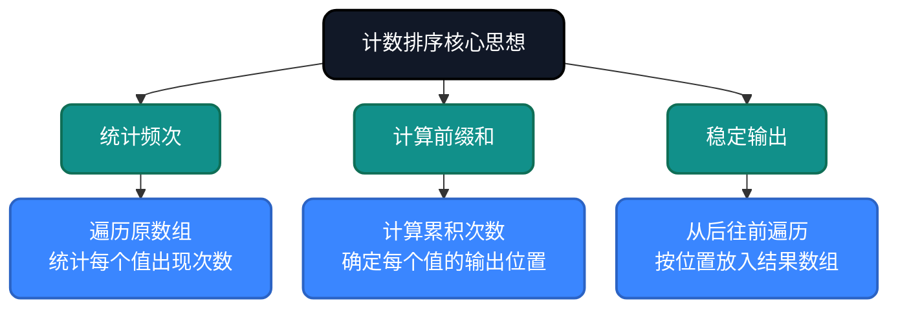
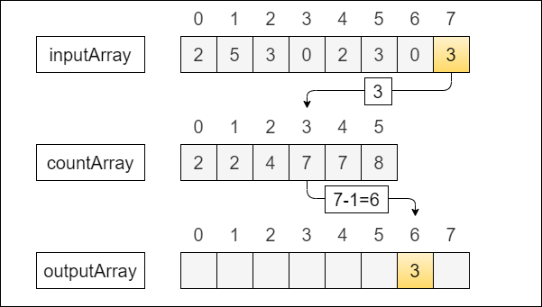
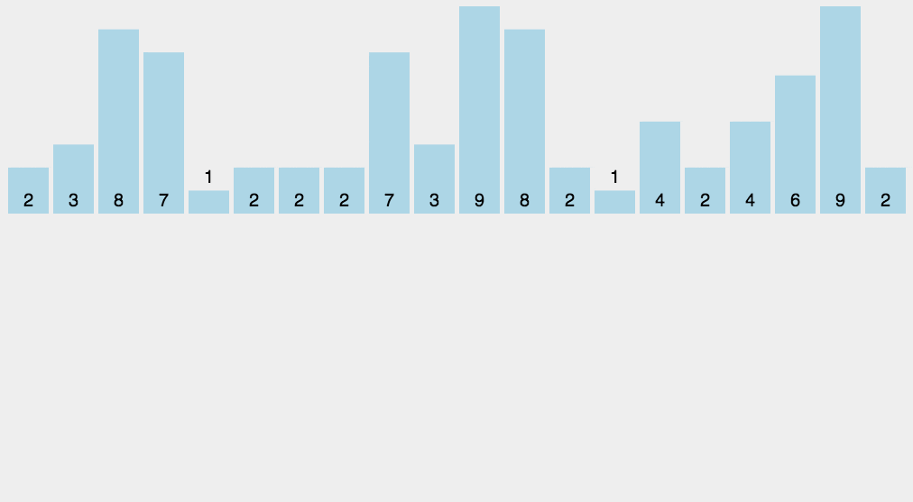
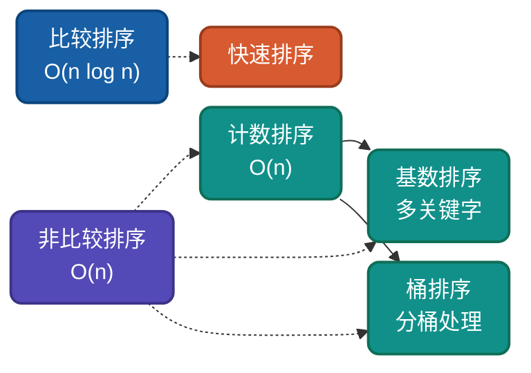

# AI时代，重温计数排序，不同实现思路详解

计数排序是**非比较排序**的代表，通过**空间换时间**实现线性复杂度。当数据范围有限时，它是最佳选择。理解计数排序的多种实现思路，有助于驱动AI干活。

## 为什么还要学计数排序？

AI可以生成计数排序代码，但无法理解**为什么这样设计**：
- 为什么不用比较就能排序？
- 为什么需要知道数据范围？
- 如何实现稳定版本？

理解这些设计决策，才能更好地指导AI编写高效代码，从而解决现实中复杂的问题。

## 核心思想

计数排序基于**映射思想**：利用数组下标天然有序的特性，统计每个值的出现次数，再通过前缀和计算位置，直接输出有序序列。



## 生活类比与示意图

> **生活类比**：就像统计考试分数：准备一个 0–100 的计数表，遍历所有试卷，把每个分数出现的次数加 1。最后从 0 分到 100 分依次输出，每个分数出现几次就写几次，这样就得到排序好的成绩单。




## 实现思路对比

| 实现方式 | 特点 | 空间复杂度 | 稳定性 |
|---------|-----|-----------|--------|
| 基础计数 | 统计频次输出 | O(k) | 不稳定 |
| 稳定计数 | 前缀和定位 | O(k) | 稳定 |
| 原地计数 | 输出到原数组 | O(k) | 稳定 |

## 稳定计数排序

**Go**
```go
func CountingSort(arr []int) []int {
    if len(arr) == 0 {
        return arr
    }

    // 第一步：找到数据范围
    max := arr[0]
    min := arr[0]
    for _, v := range arr {
        if v > max {
            max = v
        }
        if v < min {
            min = v
        }
    }

    // 第二步：统计频次
    count := make([]int, max-min+1)
    for _, v := range arr {
        count[v-min]++
    }

    // 第三步：计算前缀和，确定每个值的输出位置
    for i := 1; i < len(count); i++ {
        count[i] += count[i-1]
    }

    // 第四步：从后往前稳定输出到结果数组
    result := make([]int, len(arr))
    for i := len(arr) - 1; i >= 0; i-- {
        v := arr[i]
        result[count[v-min]-1] = v
        count[v-min]--
    }
    
    return result
}
```

**Python**
```python
def counting_sort(arr):
    if not arr:
        return arr
    
    min_val, max_val = min(arr), max(arr)
    count = [0] * (max_val - min_val + 1)
    
    # 计数
    for v in arr:
        count[v - min_val] += 1
    
    # 输出
    result = []
    for i, c in enumerate(count):
        result.extend([i + min_val] * c)
    
    return result

# 稳定版
def counting_sort_stable(arr):
    if not arr:
        return arr
    
    min_val, max_val = min(arr), max(arr)
    count = [0] * (max_val - min_val + 1)
    
    for v in arr:
        count[v - min_val] += 1
    
    # 前缀和
    for i in range(1, len(count)):
        count[i] += count[i - 1]
    
    result = [0] * len(arr)
    for i in range(len(arr) - 1, -1, -1):
        v = arr[i]
        result[count[v - min_val] - 1] = v
        count[v - min_val] -= 1
    
    return result
```

---

## 复杂度分析

| 实现方式 | 时间复杂度 | 空间复杂度 | 稳定性 | 说明 |
|---------|-----------|-----------|--------|------|
| 基础计数 | O(n+k) | O(k) | 不稳定 | 直接输出 |
| 稳定计数 | O(n+k) | O(k) | 稳定 | 前缀和定位 |

**适用条件**：k为数据范围，只有当k=O(n)时，才能达到O(n)线性时间复杂度。

---

## 应用场景

### 适用场景
1. **学生成绩排序**：0-100分范围
2. **年龄统计**：有限整数范围
3. **桶排序子过程**：基数排序的辅助
4. **数据压缩**：频次统计

### 不适用场景
- 数据必须是**整数**或**可映射到整数**
- 数据**范围不能太大**（k = O(n)）
- 无法比较**复杂对象**（需提取键值）

---

## 与其他算法对比



| 算法 | 平均复杂度 | 空间复杂度 | 稳定性 | 适用场景 |
|-----|-----------|-----------|--------|---------|
| 计数排序 | O(n+k) | O(k) | 稳定 | 整数、范围有限 |
| 基数排序 | O(n×k) | O(n+k) | 稳定 | 整数、字符串 |
| 桶排序 | O(n) | O(n+k) | 稳定 | 均匀分布数据 |
| 快速排序 | O(n log n) | O(log n) | 不稳定 | 通用排序 |

---

## 总结

计数排序的核心价值在于**线性时间**。通过本文的多种实现思路：

1. **基础计数排序**：理解映射思想本质
2. **稳定计数排序**：前缀和定位的正确应用

AI时代，理解计数排序的**空间换时间**思想，能帮助我们在数据范围有限时做出正确选择。

---

**相关链接**
- [计数排序多语言实现](https://github.com/microwind/algorithms/tree/main/sorting/countingsort)
- [AI时代，重温10大经典排序算法](https://github.com/microwind/algorithms/blob/main/sorting/AI-Era-Top-10-Sorting-Algorithms.md)
- [基数排序详解](https://github.com/microwind/algorithms/tree/main/sorting/radixsort)
- [桶排序详解](https://github.com/microwind/algorithms/tree/main/sorting/bucketsort)

**AI编程核心库**
- [algorithms - 算法与数据结构](https://github.com/microwind/algorithms) - 本项目，包含各种数据结构与经典算法
- [ai-prompt - Prompt工程](https://github.com/microwind/ai-prompt) - 构建高质量的大型语言模型Prompt
- [ai-skills - AI编程技能](https://github.com/microwind/ai-skills) - 高质量的AI编程Skills库
- [design-patterns - 设计模式](https://github.com/microwind/design-patterns) - 设计模式、编程范式、架构设计
