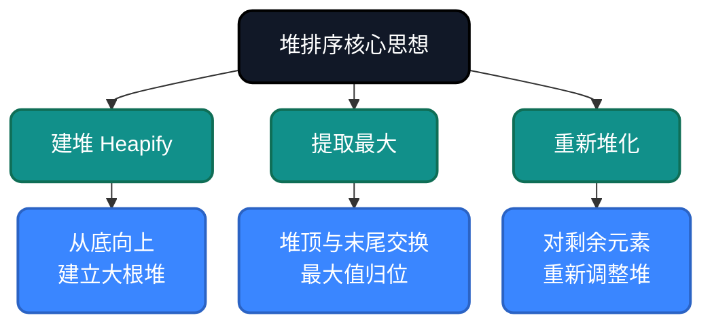
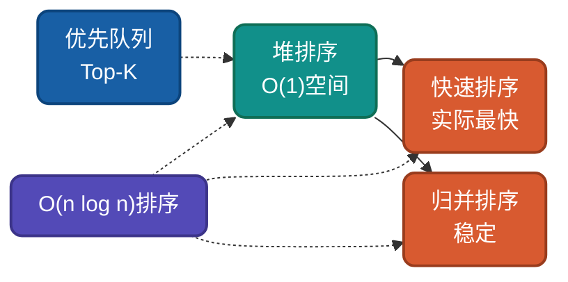

# AI时代，重温堆排序，不同实现思路详解

堆排序是基于**树形结构**的选择排序，利用堆的性质实现高效排序。它是**原地排序**且时间复杂度稳定在O(n log n)的算法。理解堆排序的多种实现思路，有助于驱动AI干活。

## 为什么还要学堆排序？

AI可以生成堆排序代码，但无法理解**为什么这样设计**：
- 为什么要用堆这种数据结构？
- 为什么建堆过程是O(n)而不是O(n log n)？
- 为什么是原地排序且稳定O(n log n)？

理解这些设计决策，才能更好地指导AI编写高效代码，从而解决现实中复杂的问题。

## 核心思想

堆排序基于**树形选择思想**：利用完全二叉树的堆性质（父节点大于子节点），通过建堆和逐次提取最大元素实现排序。



## 实现思路对比

| 实现方式 | 建堆方式 | 时间复杂度 | 空间复杂度 | 稳定性 |
|---------|---------|-----------|-----------|--------|
| 自顶向下 | 逐个插入 | O(n log n) | O(1) | 不稳定 |
| 自底向上 | Floyd建堆 | O(n log n) | O(1) | 不稳定 |
| 优先队列 | 使用堆结构 | O(n log n) | O(n) | 不稳定 |

---

## 思路一：自底向上建堆（Floyd建堆）

**策略原理**：从最后一个非叶子节点开始，自底向上对每个节点执行堆化操作。

**关键改进**：建堆时间复杂度为O(n)，比逐个插入的O(n log n)更优。

**适用场景**：理解堆排序本质、优先队列实现。

### 代码实现

**Go**
```go
func HeapSort(arr []int) {
    n := len(arr)

    // 建堆：从最后一个非叶子节点自底向上堆化
    for i := n/2 - 1; i >= 0; i-- {
        heapify(arr, n, i)
    }

    // 外层：逐个提取最大值到数组末尾
    for i := n - 1; i > 0; i-- {
        arr[0], arr[i] = arr[i], arr[0] // 堆顶(最大)与末尾交换
        heapify(arr, i, 0)              // 对剩余元素重新堆化
    }
}

func heapify(arr []int, n, i int) {
    largest := i        // 假设当前节点最大
    left := 2*i + 1     // 左子节点索引
    right := 2*i + 2    // 右子节点索引

    // 找出父节点和左右子节点中的最大值
    if left < n && arr[left] > arr[largest] {
        largest = left
    }
    if right < n && arr[right] > arr[largest] {
        largest = right
    }

    // 如果最大值不是当前节点，交换并递归堆化
    if largest != i {
        arr[i], arr[largest] = arr[largest], arr[i]
        heapify(arr, n, largest)  // 递归调整被交换的子树
    }
}
```

**Python**
```python
def heap_sort(arr):
    import heapq
    
    # 方法1：使用heapq
    def heap_sort_builtin(arr):
        heapq.heapify(arr)
        return [heapq.heappop(arr) for _ in range(len(arr))]
    
    # 方法2：手动实现
    def heapify(arr, n, i):
        largest = i
        left = 2 * i + 1
        right = 2 * i + 2
        
        if left < n and arr[left] > arr[largest]:
            largest = left
        if right < n and arr[right] > arr[largest]:
            largest = right
        
        if largest != i:
            arr[i], arr[largest] = arr[largest], arr[i]
            heapify(arr, n, largest)
    
    n = len(arr)
    for i in range(n // 2 - 1, -1, -1):
        heapify(arr, n, i)
    
    for i in range(n - 1, 0, -1):
        arr[0], arr[i] = arr[i], arr[0]
        heapify(arr, i, 0)
    
    return arr
```

---

## 复杂度分析

| 阶段 | 时间复杂度 | 空间复杂度 | 稳定性 | 说明 |
|-----|-----------|-----------|--------|------|
| 建堆 | O(n) | O(1) | 不稳定 | Floyd建堆 |
| 排序 | O(n log n) | O(1) | 不稳定 | n次extract-max |
| 总体 | O(n log n) | O(1) | 不稳定 | 原地排序 |

**不稳定性说明**：堆排序是不稳定的，因为堆化过程会改变相等元素的相对顺序。

---

## 应用场景

### 适用场景
1. **Top-K问题**：快速找到最大/小的K个元素
2. **优先队列**：任务调度、事件驱动
3. **流式数据**：动态维护有序集合
4. **内存受限**：O(1)额外空间

### 不适用场景
1. **稳定性要求**：需要保持相等元素顺序时
2. **小规模数据**：插入排序更快

---

## 与其他算法对比



| 算法 | 平均复杂度 | 最好情况 | 最坏情况 | 稳定性 | 适用场景 |
|-----|-----------|---------|---------|--------|---------|
| 堆排序 | O(n log n) | O(n log n) | O(n log n) | 不稳定 | 优先队列、Top-K |
| 快速排序 | O(n log n) | O(n log n) | O(n²) | 不稳定 | 大规模通用排序 |
| 归并排序 | O(n log n) | O(n log n) | O(n log n) | 稳定 | 稳定排序、链表 |

---

## 总结

堆排序的核心价值在于**原地O(n log n)**。通过本文的多种实现思路：

1. **自底向上建堆**：O(n)建堆优化
2. **优先队列实现**：理解堆的应用场景

AI时代，理解堆排序的**树形选择思想**，能帮助我们在优先队列、Top-K等场景做出正确选择。

---

**相关链接**
- [堆排序多语言实现](https://github.com/microwind/algorithms/tree/main/sorting/heapsort)
- [AI时代，重温10大经典排序算法](https://github.com/microwind/algorithms/blob/main/sorting/AI-Era-Top-10-Sorting-Algorithms.md)
- [快速排序详解](https://github.com/microwind/algorithms/tree/main/sorting/quicksort)
- [归并排序详解](https://github.com/microwind/algorithms/tree/main/sorting/mergesort)

**AI编程核心库**
- [algorithms - 算法与数据结构](https://github.com/microwind/algorithms) - 本项目，包含各种数据结构与经典算法
- [ai-prompt - Prompt工程](https://github.com/microwind/ai-prompt) - 构建高质量的大型语言模型Prompt
- [ai-skills - AI编程技能](https://github.com/microwind/ai-skills) - 高质量的AI编程Skills库
- [design-patterns - 设计模式](https://github.com/microwind/design-patterns) - 设计模式、编程范式、架构设计
