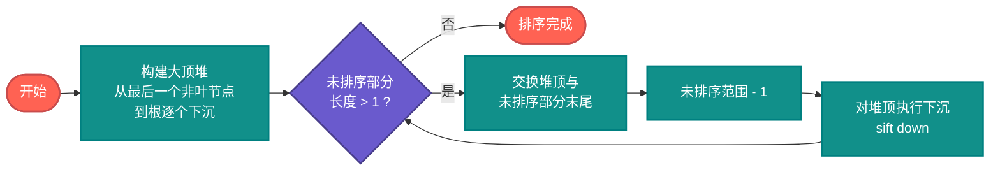
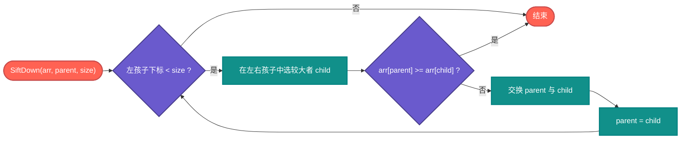

# Go 语言堆排序算法的几种实现分析

堆排序的本质很固定：**用数组表示完全二叉树**，先维护堆性质（大顶堆或小顶堆），再反复把「当前堆顶」移到未排序区间末尾，并对缩小的堆做一次「下沉」调整。复杂度上，比较排序里它属于 **时间 O(n log n)、额外空间 O(1)** 的一类；代价是 **不稳定**，且实际运行时常因访存模式不如快排友好。

仓库里的 `heap_sort.go` 把同一套数学结构，用 **五种不同写法** 铺开，这对读代码的人很有价值：**不是五种「新算法」**，而是五种「同一不变量下的实现策略」——适合教学、调试和性能对比。

行文与流程图、伪代码风格对齐仓库内文档 [`../AI-Era-Top-10-Sorting-Algorithms.md`](../AI-Era-Top-10-Sorting-Algorithms.md) 中「堆排序」一节。

---

## 算法原理

利用 **堆（完全二叉树）** 做排序：先把数组建成 **大顶堆**（父结点值 ≥ 子结点），再反复将堆顶（当前最大值）与未排序区间末尾交换，缩小堆规模并对新堆顶执行 **下沉（sift down）**，直到未排序区间长度为 1。

堆用数组存储时，下标 `i` 处结点：**左子** `2i+1`，**右子** `2i+2`，**父** `(i-1)/2`，无需指针。

1. **建堆**：从最后一个非叶结点 `n/2-1` 递减到 `0`，对每个结点做下沉，使整段满足大顶堆。
2. **排序**：`i` 从 `n-1` 到 `1`，交换 `arr[0]` 与 `arr[i]`，再对根在范围 `[0, i)` 内下沉。

> **类比**（与全景文档一致）：像每次从堆顶取走最大的一片，把堆尾换到顶上，再「摊平」剩余部分使仍满足堆形，重复直到有序。

---

### 流程图



### 下沉（SiftDown）子流程



---

### 伪代码

与全景文档中的「大顶堆 + 反复取顶」写法一致；`SiftDown` 用循环实现下沉（对应本仓库 **heapSort3 / heapSort5** 一类实现）。

```c
function HeapSort(arr):
    n = length(arr)
    // 建堆：从最后一个非叶节点开始，自底向上堆化
    for i = n/2 - 1 downto 0:
        SiftDown(arr, i, n)

    // 排序：反复把堆顶放到未排序区间末尾
    for i = n - 1 downto 1:
        swap(arr[0], arr[i])
        SiftDown(arr, 0, i)

function SiftDown(arr, parent, size):
    while 2 * parent + 1 < size:
        child = 2 * parent + 1
        if child + 1 < size and arr[child + 1] > arr[child]:
            child = child + 1
        if arr[parent] >= arr[child]:
            break
        swap(arr[parent], arr[child])
        parent = child
```

**小顶堆 + 反转**（对应 `heapSort2` 思路）：建 **最小堆**，同样每次把堆顶换到当前堆尾，最后将整个数组 **反转** 得到升序；多一次 O(n) 反转。

```c
function HeapSortMinThenReverse(arr):
    n = length(arr)
    for i = n/2 - 1 downto 0:
        SiftUpMin(arr, i, n)   // 或统一用 min-heapify
    for i = n - 1 downto 1:
        swap(arr[0], arr[i])
        SiftUpMin(arr, 0, i)
    reverse(arr)
```

---

### 复杂度

| 最好 | 平均 | 最坏 | 空间 | 稳定性 |
|------|------|------|------|--------|
| O(n log n) | O(n log n) | O(n log n) | O(1) | 不稳定 |

> 原地 O(1) 额外空间、最坏时间仍为 O(n log n)，是堆排序的理论优点；实际常因 **父子下标跳跃** 导致缓存不如快速排序友好，常数因子往往更大。详见全景文档该节说明。

---

### 应用场景

- **优先队列调度**：进程 / 网络包优先级
- **大规模 Top-K**：维护大小为 k 的堆，O(n log k)
- **内存紧张**：需要原地、最坏仍为 O(n log n) 的全排序时
- **定时器与调度**：Nginx、Go runtime、Redis 等以堆管理时间事件

---

## 1. 先统一记号：堆在数组里长什么样

对下标从 0 开始的切片 `arr[]`：

- 结点 `i` 的左孩子：`2*i+1`，右孩子：`2*i+2`
- 结点 `i` 的父结点：`(i-1)/2`（整数除法）

**大顶堆**：任意结点 `arr[i] >= arr[左]` 且 `>= arr[右]`（在堆范围内）。  
**小顶堆**：方向反过来。

堆排序的「排序阶段」无论用大顶堆还是小顶堆，都是在做同一件事：**把极值挪到正确区间边界**，然后对剩余部分继续维护堆性质。

---

## 2. `heap_sort.go` 里五种实现各自在干什么

下面按函数名对齐源码（`heapSort1`～`heapSort5` 及 `main` 中的对比说明）。

| 实现 | 核心策略 | 你在代码里会看到的主要差异 |
|------|-----------|---------------------------|
| **heapSort1** | **经典大顶堆** + 递归式 `heapify`（带步骤打印） | 建堆从 `n/2-1` 递减到根；排序阶段反复 `swap(0,i)` 后对根递归下沉。教学向、日志多。 |
| **heapSort2** | **小顶堆** + 最后再整体反转 | `heapifyMin` 建堆与调整，最后 `for i := 0; i < n/2; i++` 反转得升序。 |
| **heapSort3** | **大顶堆 + 全程迭代下沉** | 内层 `for { ... }` 沿路径交换下沉，无递归。 |
| **heapSort4** | **自底向上插入式建堆** + 另一套下沉 | 新元素从下标 1 起向上冒；排序阶段再按父/子下标下沉。 |
| **heapSort5** | **非递归 maxHeapify（缓存当前值下沉）** | `current := array[idx]`，子结点覆盖父位，最后回填；显式 `getParent` / `getLeft`。 |

五种实现的时间复杂度仍为 **O(n log n)**，辅助空间 **O(1)**（递归版另计 O(log n) 栈深）。

---

## 3. Go 源码节选（摘自 `heap_sort.go`）

以下与文件中的实现一致；为便于阅读，删去部分 `fmt` 调试输出说明，逻辑未改。

### 3.1 迭代大顶堆：`heapSort3`（建堆 + 排序双段迭代下沉）

```go
// heapSort3：大顶堆，下沉全程迭代，无递归。
func heapSort3(arr []int) {
	n := len(arr)

	// 建最大堆（迭代下沉）
	for i := n/2 - 1; i >= 0; i-- {
		current := i
		for {
			largest := current
			left := 2*current + 1
			right := 2*current + 2
			if left < n && arr[left] > arr[largest] {
				largest = left
			}
			if right < n && arr[right] > arr[largest] {
				largest = right
			}
			if largest == current {
				break
			}
			arr[current], arr[largest] = arr[largest], arr[current]
			current = largest
		}
	}

	// 依次将堆顶换到末尾，并在缩小后的堆上迭代下沉
	for i := n - 1; i > 0; i-- {
		arr[0], arr[i] = arr[i], arr[0]
		current := 0
		for {
			largest := current
			left := 2*current + 1
			right := 2*current + 2
			if left < i && arr[left] > arr[largest] {
				largest = left
			}
			if right < i && arr[right] > arr[largest] {
				largest = right
			}
			if largest == current {
				break
			}
			arr[current], arr[largest] = arr[largest], arr[current]
			current = largest
		}
	}
}
```

*注：`heap_sort.go` 中 `heapSort3` 在函数开始处有 `fmt.Println("heapSort3 iterative:")`，结尾处有 `printArray(arr, "排序后数组")`，上表为去掉调试输出后的核心逻辑。*

### 3.2 小顶堆 + 反转：`heapifyMin` 与 `heapSort2`

```go
func heapifyMin(arr []int, n, i int) {
	smallest := i
	left, right := 2*i+1, 2*i+2
	if left < n && arr[left] < arr[smallest] {
		smallest = left
	}
	if right < n && arr[right] < arr[smallest] {
		smallest = right
	}
	if smallest != i {
		arr[i], arr[smallest] = arr[smallest], arr[i]
		heapifyMin(arr, n, smallest)
	}
}

func heapSort2(arr []int) {
	n := len(arr)
	for i := n/2 - 1; i >= 0; i-- {
		heapifyMin(arr, n, i)
	}
	for i := n - 1; i > 0; i-- {
		arr[0], arr[i] = arr[i], arr[0]
		heapifyMin(arr, i, 0)
	}
	for i := 0; i < n/2; i++ {
		arr[i], arr[n-1-i] = arr[n-1-i], arr[i]
	}
}
```

*注：源码中 `heapSort2` 另有 `fmt.Println` 与 `printArray`，已省略。*

### 3.3 非递归单值下沉：`heapSort5` 内联 `maxHeapify`

```go
// 片段：heapSort5 中通过闭包实现的非递归大顶堆调整（sift down 单值版）
maxHeapify := func(array []int, idx, size int) {
	current := array[idx]
	child := 2*idx + 1
	for child < size {
		if child+1 < size && array[child] < array[child+1] {
			child++
		}
		if array[child] > current {
			array[idx] = array[child]
			idx = child
		} else {
			break
		}
		child = 2*idx + 1
	}
	array[idx] = current
}
```

完整五种版本、`heapifyWithSteps` 打印与 `main` 性能对比见源文件 **`heap_sort.go`** 全文。

---

## 4. 和「排序全景」里的堆排序条目怎么对齐

`README.md` 与 [`../AI-Era-Top-10-Sorting-Algorithms.md`](../AI-Era-Top-10-Sorting-Algorithms.md) 中堆排序一节可概括为：

1. **思想归类**：选择排序思路的升级版——用堆把「选极值」从线性扫描变为 **树高** 量级操作。
2. **工程现实**：理论时间与空间好，但 **访存跳跃** 常使实测不如快排；文档中已有说明。
3. **用处不只在排序**：Top-K、优先队列、定时器等同一套结构。

把 `heap_sort.go` 读成「**同一堆性质，五种维护与构建方式**」更贴切。

---

## 5. AI 时代为什么还要抠这几种实现

能生成 `heapSort` 不等于能处理：**不变量**（`size` 与下沉边界）、**差一错误**、**小顶+反转与大顶** 是否等价、**不稳定** 对相等键的影响，以及何时用 **堆** 而非 **快排**（Top-K vs 全量排序）。

多实现对照训练的是：**用同一不变量校验多种写法**，而不是多记五个函数名。

---

## 6. 小结

- 堆排序 = **数组下标 + 堆性质 + 反复取顶 + 下沉**。
- 本文流程图、伪代码、复杂度与 [`../AI-Era-Top-10-Sorting-Algorithms.md`](../AI-Era-Top-10-Sorting-Algorithms.md) 中堆排序章节一致；Go 代码以 `heap_sort.go` 为准。
- 工程上是否采用全数组堆排序，取决于是否要 **整段有序**；若只需 **前 K 个** 或 **动态极值**，优先队列 / 固定大小堆往往更合适。

---

## 参考

| 资源 | 说明 |
|------|------|
| `heap_sort.go` | 五种实现、`heapifyWithSteps`、`main` 测时 |
| `README.md` | 概念、mermaid 总流程、多语言片段索引 |
| [`../AI-Era-Top-10-Sorting-Algorithms.md`](../AI-Era-Top-10-Sorting-Algorithms.md) | 十大排序体系、堆排序流程图与伪代码、应用场景与复杂度表 |
