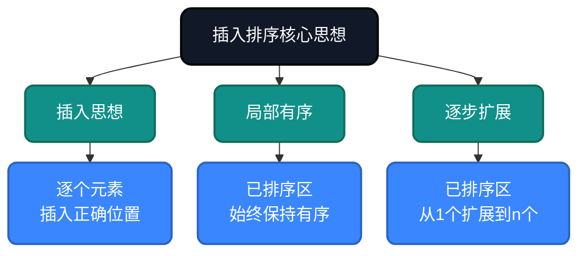
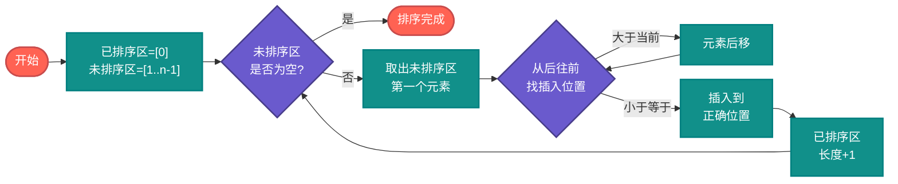
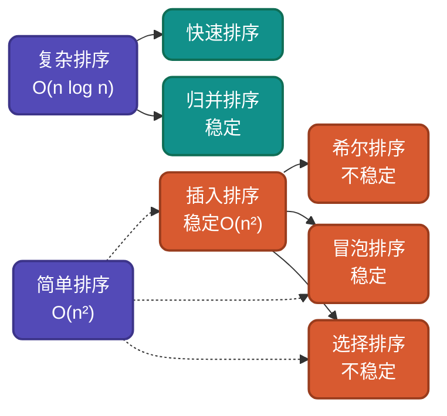

# AI时代，重温插入排序，不同实现思路详解

插入排序是最贴近生活的排序算法——就像整理扑克牌一样自然。虽然它看起来简单，但蕴含着**插入思想**和**局部有序**的核心算法思维。理解插入排序的多种实现思路，有助于驱动AI干活。

## 为什么还要学插入排序？

AI可以生成插入排序代码，但无法理解**为什么这样设计**：
- 为什么像整理扑克牌一样逐个插入？
- 为什么对已排序部分使用二分查找？
- 为什么近乎有序时能达到O(n)？

理解这些设计决策，才能更好地指导AI编写高效代码，从而解决现实中复杂的问题。

## 核心思想

插入排序基于**插入思想**：将数组分为已排序和未排序两部分，逐个取出元素插入到已排序区间的正确位置。



## 实现思路对比

| 实现方式 | 核心优化 | 时间复杂度 | 空间复杂度 | 稳定性 | 适用场景 |
|---------|---------|-----------|-----------|--------|---------|
| 基础插入 | 逐个插入 | O(n)~O(n²) | O(1) | 稳定 | 小数据、近乎有序 |
| 二分插入 | 二分查找位置 | O(n log n)~O(n²) | O(1) | 稳定 | 比较操作昂贵 |
| 希尔排序 | 跳跃式插入 | O(n)~O(n²) | O(1) | 不稳定 | 中等规模数据 |

---

## 思路一：基础插入排序

**策略原理**：将数组分为已排序和未排序两部分，逐个取出未排序元素，在已排序区间找到正确位置插入。

**适用场景**：理解算法本质、小规模数据排序。

### 流程图



### 代码实现

**Go**
```go
func InsertionSort(arr []int) []int {
    // 外层：遍历未排序区，逐个插入已排序区
    for i := 1; i < len(arr); i++ {
        key := arr[i] // 取出未排序区第一个元素
        j := i - 1

        // 内层：从后往前查找插入位置，同时后移元素
        for j >= 0 && arr[j] > key {
            arr[j+1] = arr[j] // 元素后移，腾出插入位置
            j--
        }
        arr[j+1] = key // 插入到正确位置
    }
    return arr
}
```

**Python**
```python
def insertion_sort(arr):
    # 外层：遍历未排序区，逐个插入已排序区
    for i in range(1, len(arr)):
        key = arr[i]  # 取出未排序区第一个元素
        j = i - 1

        # 内层：从后往前查找插入位置，同时后移元素
        while j >= 0 and arr[j] > key:
            arr[j + 1] = arr[j]  # 元素后移，腾出插入位置
            j -= 1
        arr[j + 1] = key  # 插入到正确位置
    return arr
```

---

## 思路二：二分插入排序

**策略原理**：使用二分查找在已排序区间确定插入位置，减少比较次数（但移动次数不变）。

**关键改进**：比较次数从O(n)降到O(log n)，适合比较操作昂贵的场景。

**适用场景**：比较操作耗时（如字符串比较）、大数据元素。

### 代码实现

**Go**
```go
func BinaryInsertionSort(arr []int) []int {
    // 外层：遍历未排序区，逐个插入已排序区
    for i := 1; i < len(arr); i++ {
        key := arr[i]  // 取出未排序区第一个元素
        left, right := 0, i

        // 内层：二分查找确定插入位置
        for left < right {
            mid := (left + right) / 2
            if arr[mid] > key {
                right = mid  // 插入点在左半区
            } else {
                left = mid + 1  // 插入点在右半区
            }
        }
        // 将元素后移，腾出插入位置
        copy(arr[left+1:i+1], arr[left:i])
        arr[left] = key  // 插入到正确位置
    }
    return arr
}
```

---

## 复杂度分析

| 实现方式 | 最好情况 | 平均情况 | 最坏情况 | 空间复杂度 | 稳定性 |
|---------|---------|---------|---------|-----------|--------|
| 基础插入 | O(n) | O(n²) | O(n²) | O(1) | 稳定 |
| 二分插入 | O(n log n) | O(n²) | O(n²) | O(1) | 稳定 |

**稳定性说明**：插入排序是稳定的，因为相等元素的相对顺序不会改变（只在严格大于时才后移）。

---

## 为什么是小数据之王？

- **缓存友好**：顺序访问，局部性好
- **常数因子小**：简单操作，无递归开销
- **适应性**：对近乎有序数据达O(n)
- **在线性**：数据流场景随时插入

## 应用场景

### 适用场景
1. **小规模数据**：n < 50时最快
2. **Timsort子过程**：Python/Java处理小分区
3. **流式数据**：在线插入无需重排
4. **近乎有序数据**：O(n)最优性能

### 不适用场景
1. **大规模随机数据**：O(n²)复杂度过高
2. **链表排序**：移动操作复杂，不如归并排序

---

## 与其他算法对比



| 算法 | 平均复杂度 | 最好情况 | 最坏情况 | 稳定性 | 适用场景 |
|-----|-----------|---------|---------|--------|---------|
| 插入排序 | O(n²) | O(n) | O(n²) | 稳定 | 小数据、在线排序 |
| 冒泡排序 | O(n²) | O(n) | O(n²) | 稳定 | 教学、近乎有序 |
| 选择排序 | O(n²) | O(n²) | O(n²) | 不稳定 | 交换敏感设备 |
| 希尔排序 | O(n^1.3) | O(n) | O(n²) | 不稳定 | 中等规模数据 |
| 快速排序 | O(n log n) | O(n log n) | O(n²) | 不稳定 | 大规模通用排序 |

---

## 总结

插入排序的核心价值在于**小数据最快**和**在线性**。通过本文的多种实现思路：

1. **基础插入排序**：理解插入思想本质
2. **二分插入排序**：学习优化查找过程

AI时代，理解插入排序的**小数据优势**和**在线性**，能帮助我们在小规模数据、流式数据等场景做出正确选择。

---

**相关链接**
- [插入排序多语言实现](https://github.com/microwind/algorithms/tree/main/sorting/insertsort)
- [AI时代，重温10大经典排序算法](https://github.com/microwind/algorithms/blob/main/sorting/AI-Era-Top-10-Sorting-Algorithms.md)
- [冒泡排序详解](https://github.com/microwind/algorithms/tree/main/sorting/bubblesort)
- [选择排序详解](https://github.com/microwind/algorithms/tree/main/sorting/selectionsort)

**AI编程核心库**
- [algorithms - 算法与数据结构](https://github.com/microwind/algorithms) - 本项目，包含各种数据结构与经典算法
- [ai-prompt - Prompt工程](https://github.com/microwind/ai-prompt) - 构建高质量的大型语言模型Prompt
- [ai-skills - AI编程技能](https://github.com/microwind/ai-skills) - 高质量的AI编程Skills库
- [design-patterns - 设计模式](https://github.com/microwind/design-patterns) - 设计模式、编程范式、架构设计
