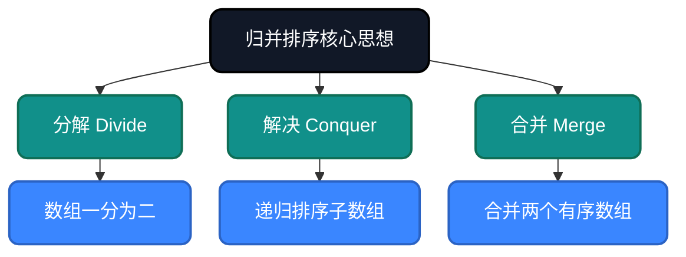
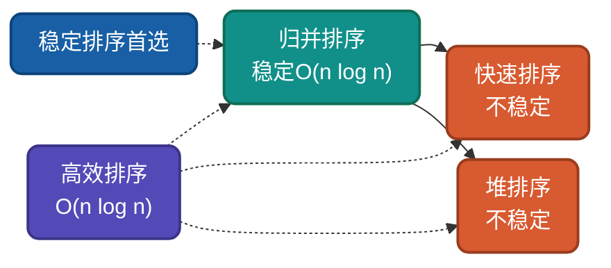

# AI时代，重温归并排序，不同实现思路详解

归并排序是基于**分治思想**的经典算法，将大问题分解为小问题求解后合并结果。它是**稳定排序**的首选，也是外部排序的基础。理解归并排序的多种实现思路，有助于驱动AI干活。

## 为什么还要学归并排序？

AI可以生成归并排序代码，但无法理解**为什么这样设计**：
- 为什么要分解成最小单位再合并？
- 为什么合并两个有序数组是O(n)？
- 为什么是稳定排序的首选？

理解这些设计决策，才能更好地指导AI编写高效代码，从而解决现实中复杂的问题。

## 核心思想

归并排序基于**分治思想**：分解 → 解决 → 合并。



## 实现思路对比

| 实现方式 | 核心特点 | 时间复杂度 | 空间复杂度 | 稳定性 |
|---------|---------|-----------|-----------|--------|
| 递归归并 | 经典实现 | O(n log n) | O(n) | 稳定 |
| 迭代归并 | 自底向上 | O(n log n) | O(n) | 稳定 |
| 原地归并 | 减少空间 | O(n log n) | O(1)~O(log n) | 稳定 |
| 多路归并 | k路合并 | O(n log_k n) | O(kn) | 稳定 |

---

## 思路一：递归归并排序

**策略原理**：经典分治实现，递归将数组分解为单元素，然后逐层合并有序数组。

**关键改进**：利用递归自然地处理分治过程，代码简洁直观。

**适用场景**：理解算法本质、链表排序（不需要额外空间）。

### 代码实现

**Go**
```go
func MergeSort(arr []int) []int {
    if len(arr) <= 1 {
        return arr
    }
    
    mid := len(arr) / 2
    left := MergeSort(arr[:mid])
    right := MergeSort(arr[mid:])
    
    return merge(left, right)
}

func merge(left, right []int) []int {
    result := make([]int, 0, len(left)+len(right))
    i, j := 0, 0
    
    for i < len(left) && j < len(right) {
        if left[i] <= right[j] {
            result = append(result, left[i])
            i++
        } else {
            result = append(result, right[j])
            j++
        }
    }
    
    result = append(result, left[i:]...)
    result = append(result, right[j:]...)
    return result
}
```

**Python**
```python
def merge_sort(arr):
    # 递归终止条件：单元素已有序
    if len(arr) <= 1:
        return arr

    # 分解：将数组一分为二
    mid = len(arr) // 2
    left = merge_sort(arr[:mid])   # 递归排序左半部
    right = merge_sort(arr[mid:])  # 递归排序右半部

    # 合并：将两个有序数组合并
    return merge(left, right)

def merge(left, right):
    result = []
    i = j = 0

    # 外层：依次从两个数组取出较小元素
    while i < len(left) and j < len(right):
        if left[i] <= right[j]:
            result.append(left[i])  # 取左数组元素
            i += 1
        else:
            result.append(right[j])  # 取右数组元素
            j += 1

    # 将剩余元素追加到结果
    result.extend(left[i:])
    result.extend(right[j:])
    return result
```

---

## 思路二：迭代归并排序

**策略**：自底向上，先合并相邻元素，再逐步扩大。

**Java**
```java
public static void mergeSortIterative(int[] arr) {
    int n = arr.length;
    int[] temp = new int[n];
    
    // 从大小为1开始，逐步倍增
    for (int size = 1; size < n; size *= 2) {
        for (int left = 0; left < n - size; left += 2 * size) {
            int mid = left + size - 1;
            int right = Math.min(left + 2 * size - 1, n - 1);
            merge(arr, temp, left, mid, right);
        }
    }
}

private static void merge(int[] arr, int[] temp, int left, int mid, int right) {
    System.arraycopy(arr, left, temp, left, right - left + 1);
    
    int i = left, j = mid + 1, k = left;
    
    while (i <= mid && j <= right) {
        if (temp[i] <= temp[j]) {
            arr[k++] = temp[i++];
        } else {
            arr[k++] = temp[j++];
        }
    }
    
    while (i <= mid) arr[k++] = temp[i++];
    while (j <= right) arr[k++] = temp[j++];
}
```

---

## 思路三：原地归并排序

**策略**：通过复杂交换减少额外空间使用。

**Python（简化版）**
```python
def merge_inplace(arr, start, mid, end):
    """原地合并两个有序子数组"""
    start2 = mid + 1
    
    # 如果已经有序，直接返回
    if arr[mid] <= arr[start2]:
        return
    
    while start <= mid and start2 <= end:
        if arr[start] <= arr[start2]:
            start += 1
        else:
            # 将arr[start2]插入到arr[start]位置
            value = arr[start2]
            index = start2
            
            # 后移元素
            while index != start:
                arr[index] = arr[index - 1]
                index -= 1
            
            arr[start] = value
            start += 1
            mid += 1
            start2 += 1
```

---

## 复杂度分析

| 实现方式 | 时间复杂度 | 空间复杂度 | 稳定性 | 备注 |
|---------|-----------|-----------|--------|------|
| 递归归并 | O(n log n) | O(n) | 稳定 | 经典实现 |
| 迭代归并 | O(n log n) | O(n) | 稳定 | 无递归栈 |
| 原地归并 | O(n log n) | O(1)~O(log n) | 稳定 | 实现复杂 |

**稳定性说明**：归并排序是稳定的，因为在合并时遇到相等元素，优先取左半部分的元素，保持了相对顺序。

---

## 应用场景

### 适用场景
1. **需要稳定排序**：相等元素顺序必须保持
2. **链表排序**：O(1)额外空间即可完成
3. **外部排序**：大数据无法装入内存时的首选
4. **并行计算**：分解过程天然并行

### 不适用场景
1. **内存受限**：需要O(n)额外空间
2. **小规模数据**：插入排序更快

---

## 与其他算法对比



| 算法 | 平均复杂度 | 最好情况 | 最坏情况 | 稳定性 | 适用场景 |
|-----|-----------|---------|---------|--------|---------|
| 归并排序 | O(n log n) | O(n log n) | O(n log n) | 稳定 | 稳定排序、链表、外部排序 |
| 快速排序 | O(n log n) | O(n log n) | O(n²) | 不稳定 | 大规模通用排序 |
| 堆排序 | O(n log n) | O(n log n) | O(n log n) | 不稳定 | 优先队列、Top-K |

---

## 总结

归并排序的核心价值在于**稳定高效**。通过本文的多种实现思路：

1. **递归归并**：理解分治思想本质
2. **迭代归并**：消除递归栈开销
3. **原地归并**：空间优化

AI时代，理解归并排序的**稳定性**和**分治思想**，能帮助我们在需要稳定排序、链表排序等场景做出正确选择。

---

**相关链接**
- [归并排序多语言实现](https://github.com/microwind/algorithms/tree/main/sorting/mergesort)
- [AI时代，重温10大经典排序算法](https://github.com/microwind/algorithms/blob/main/sorting/AI-Era-Top-10-Sorting-Algorithms.md)
- [快速排序详解](https://github.com/microwind/algorithms/tree/main/sorting/quicksort)
- [堆排序详解](https://github.com/microwind/algorithms/tree/main/sorting/heapsort)

**AI编程核心库**
- [algorithms - 算法与数据结构](https://github.com/microwind/algorithms) - 本项目，包含各种数据结构与经典算法
- [ai-prompt - Prompt工程](https://github.com/microwind/ai-prompt) - 构建高质量的大型语言模型Prompt
- [ai-skills - AI编程技能](https://github.com/microwind/ai-skills) - 高质量的AI编程Skills库
- [design-patterns - 设计模式](https://github.com/microwind/design-patterns) - 设计模式、编程范式、架构设计
