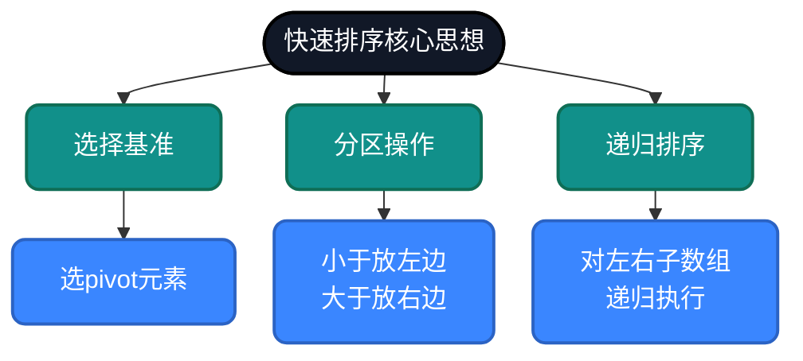
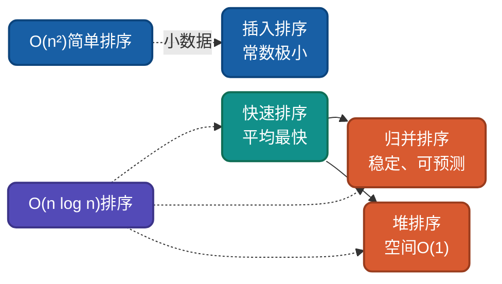

# AI时代，理解快速排序的不同思路

快速排序是实际应用中最快的通用排序算法，基于**分治思想**和**分区策略**。理解它的多种实现思路，不仅能帮你理解排序算法，更能让你在AI时代真正驾驭代码生成工具，写出有深度、有思考的程序。

## 为什么AI时代还要手写快排？

AI可以几秒生成一段快排代码，但它并没有告诉你下面的3个问题：

- **为什么要选这个元素当基准？** —— 选错了可能从O(n log n)退化到O(n²)
- **Lomuto和Hoare分区到底有什么区别？** —— 一个代码短，一个跑得快
- **数据有大量重复值时怎么办？** —— 普通快排会"失效"，三路快排却"胜出"

理解了算法思想原理，你才可以更好地驾驭AI：

- 在AI给出错误方案时**识别并纠正**
- 在特定场景下**选择合适的实现**
- 在优化时**有的放矢，直击要害**

> AI负责"代码实现"，你负责"决策与思考"。手写代码可以锤炼这种能力。

## 快排核心思想

快速排序基于**分治+分区思想**，核心是："先粗排，再细排"：

1. **选基准**：从数组中选一个元素作为基准（pivot）
2. **分区**：将数组重新排列，使所有小于基准的元素在左边，大于的在右边
3. **递归**：对左右两个子数组重复上述过程



## 快排为什么实际最快？

在O(n log n)的排序算法中，快排之所以"实际最快"：

- **缓存友好**：顺序访问数组，不像归并排序需频繁分配内存
- **原地排序**：额外空间仅O(log n)递归栈
- **常数因子小**：简单比较交换，没有复杂操作
- **可优化性强**：随机化、三路分区、插入排序混合等优化手段丰富

> 这些特性使得快排在绝大多数场景下，是排序的首选方案。

## 生活类比
就像给一群人排队，先选一个人当"基准"，比他矮的站左边，比他高的站右边，然后左右两边也重复这个过程。随着不断分组，每一小组都会越来越有序，直到每组只剩下一个人时，整个队伍就排好了。


---

## 思路一：标准递归版本（Lomuto分区）

**策略原理**：选择尾元素作为基准，单向扫描将小于等于基准的元素放到左边。

**关键改进**：代码简洁，但交换次数较多。

**适用场景**：理解快速排序本质、通用排序。

```python
def partition_lomuto(arr, low, high):
    """
    Lomuto分区方案：单向扫描，将小于pivot的交换到左侧。
    参数：
        arr: 待分区数组
        low: 左边界索引
        high: 右边界索引（pivot位置）
    返回：pivot最终所在的索引
    """
    # 1. 选择最后一个元素作为基准值
    pivot = arr[high]
    # 2. 初始化小于区域指针 i，指向小于区域的末尾
    i = low - 1

    # 3. 遍历除pivot外的所有元素
    for j in range(low, high):
        # 4. 若当前元素小于pivot，则将其交换到小于区域
        if arr[j] < pivot:
            i += 1                     # 小于区域扩大
            arr[i], arr[j] = arr[j], arr[i]  # 交换

    # 5. 将pivot放到正确位置（小于区域的右侧）
    arr[i + 1], arr[high] = arr[high], arr[i + 1]
    # 6. 返回pivot的最终索引
    return i + 1


def quick_sort_lomuto(arr, left=None, right=None):
    """
    Lomuto分区快速排序（递归实现）
    参数：
        arr: 待排序列表
        left: 左边界（首次调用自动设为0）
        right: 右边界（首次调用自动设为len(arr)-1）
    返回：排序后的列表（原地修改）
    """
    # 1. 初始化左右边界（处理首次调用）
    if left is None:
        left = 0
    if right is None:
        right = len(arr) - 1

    # 2. 递归终止条件：区间内元素少于2个
    if left >= right:
        return arr

    # 3. 获取分区后的基准索引
    pi = partition_lomuto(arr, left, right)

    # 4. 递归排序基准左侧子数组
    quick_sort_lomuto(arr, left, pi - 1)
    # 5. 递归排序基准右侧子数组
    quick_sort_lomuto(arr, pi + 1, right)

    return arr
```
### 分区过程示例

对数组 `[3, 8, 2, 5, 1, 4, 7, 6]`，选择末尾pivot=6：

```
初始: [3, 8, 2, 5, 1, 4, 7, 6]  pivot=6, i=-1
j=0: 3<6 → i=0, 交换arr[0]和arr[0] → [3, 8, 2, 5, 1, 4, 7, 6]
j=1: 8<6? 不交换
j=2: 2<6 → i=1, 交换arr[1]和arr[2] → [3, 2, 8, 5, 1, 4, 7, 6]
j=3: 5<6 → i=2, 交换arr[2]和arr[3] → [3, 2, 5, 8, 1, 4, 7, 6]
j=4: 1<6 → i=3, 交换arr[3]和arr[4] → [3, 2, 5, 1, 8, 4, 7, 6]
j=5: 4<6 → i=4, 交换arr[4]和arr[5] → [3, 2, 5, 1, 4, 8, 7, 6]
j=6: 7<6? 不交换
最后: i+1=5, 交换arr[5]和arr[6] → [3, 2, 5, 1, 4, 6, 7, 8]
返回索引5
```

---

## 思路二：Hoare分区

**策略原理**：选择首元素作为基准，双向扫描将小于基准的放左边，大于的放右边。

**关键改进**：交换次数少，效率略高于Lomuto。

**适用场景**：性能敏感场景。

```python
def quick_sort_hoare(arr, left=None, right=None):
    """
    Hoare分区快速排序（递归实现）
    使用首元素作为基准，双指针相向扫描，交换逆序对。
    参数：
        arr: 待排序列表
        left: 左边界
        right: 右边界
    返回：排序后的列表（原地修改）
    """
    # 1. 初始化边界（首次调用）
    if left is None:
        left = 0
    if right is None:
        right = len(arr) - 1

    # 2. 递归终止
    if left >= right:
        return arr

    # 3. 选择基准（首元素）
    pivot = arr[left]
    # 4. 初始化左右指针
    i = left
    j = right

    # 5. 双向扫描分区
    while i <= j:
        # 5a. 左指针右移，直到找到不小于pivot的元素
        while arr[i] < pivot:
            i += 1
        # 5b. 右指针左移，直到找到不大于pivot的元素
        while arr[j] > pivot:
            j -= 1
        # 5c. 若指针未交错，交换并移动指针
        if i <= j:
            arr[i], arr[j] = arr[j], arr[i]
            i += 1
            j -= 1

    # 6. 递归排序左右两部分
    # 注意：此时左半部分为 [left .. j]，右半部分为 [i .. right]
    quick_sort_hoare(arr, left, j)
    quick_sort_hoare(arr, i, right)

    return arr
```

### 双指针交换的精妙之处

传统思维：逐个把小元素"冒"到前面 → 需要n次交换

Hoare思维：**一次交换同时处理"一对"逆序元素** → 只需n/2次交换

这个"配对"思想是Hoare分区的核心智慧。

---

## 思路三：递归新建数组（最易理解的版本）

**策略原理**：每次递归创建新数组，将小于基准的放左列表，大于等于的放右列表，然后合并。

**关键改进**：无需交换，逻辑清晰，但占用额外内存。

**适用场景**：教学演示、函数式编程风格。

```python
def quick_sort_new_array(arr):
    """
    快速排序 - 递归新建数组版本，这个最好理解，但效率略低
    
    ## 算法特点
    - 无需交换，每个分区都是新数组
    - 使用中间元素作为基准，避免最坏情况
    - 不修改原数组：返回新数组，适合需要保留原始数据的场景
    - 稳定排序：保持相等元素的相对位置
    """
    # 第一步：递归终止条件
    # 关键点：数组长度<=1时已经有序，直接返回
    arr_len = len(arr)
    if arr_len <= 1:
        return arr
    
    # 第二步：选择基准并分区
    left = []
    right = []
    # 关键点：设置中间数作为基准，避免最坏情况
    mid_index = arr_len // 2
    pivot = arr[mid_index]
    
    # 第三步：遍历数组，按基准值分区
    for i in range(arr_len):
        # 关键点：跳过基准元素本身，避免重复处理
        if mid_index == i:
            continue
        # 关键点：小于基准的放左边，大于等于的放右边
        if arr[i] < pivot:
            left.append(arr[i])
        else:
            right.append(arr[i])
    
    # 第四步：递归排序并合并
    # 关键点：先递归左数组，再添加基准，最后递归右数组
    result = quick_sort_new_array(left) + [pivot] + quick_sort_new_array(right)
    return result

"""
quick_sort_new_array 递归步骤示例:
      f([7, 11, 9, 10, 12, 13, 8])
            /       10          \
      f([7, 9, 8])           f([11, 12, 13])
        /   9    \             /    12     \
   f([7, 8])    f([])       f([11])       f[13]
   /   8  \
f([7]) f([])
  [7]
"""
```

## 思路四：标准原地分区版本（中间基准，平衡之选）

```python
def quick_sort_mid_pivot(arr, left=None, right=None):
    """
    快速排序 - 标准原地分区版本
    
    ## 算法特点
    - 需要左右不断交换，无需新建数组
    - 使用中间元素作为基准
    - 双向扫描：左右指针相向移动
    - 效率较高：减少不必要的交换
    """
    # 第一步：初始化边界
    # 关键点：设置默认值，确保函数可以单独调用
    i = left if left is not None else 0
    j = right if right is not None else len(arr) - 1
    # 关键点：确定中间位置，基于中间位置不停左右交换
    mid_index = (i + j) // 2
    pivot = arr[mid_index]
    
    # 第二步：分区过程
    # 关键点：当左侧小于等于右侧则表示还有值没有对比，需要继续
    while i <= j:
        # 步骤2.1：从左向右找大于基准的元素
        while arr[i] < pivot:
            i += 1
        # 步骤2.2：从右向左找小于基准的元素
        while arr[j] > pivot:
            j -= 1
        
        # 步骤2.3：交换元素，确保左边小于基准，右边大于基准
        if i <= j:
            arr[i], arr[j] = arr[j], arr[i]
            # 关键点：缩小搜查范围，直到左侧都小于基数，右侧都大于基数
            i += 1
            j -= 1
    
    # 第三步：递归排序左右子数组
    # 步骤3.1：递归处理左子数组
    if left < j:
        quick_sort_mid_pivot(arr, left, j)
    # 步骤3.2：递归处理右子数组
    if i < right:
        quick_sort_mid_pivot(arr, i, right)
    
    return arr
```

### 关键细节

- **`while arr[i] < pivot`** 而不是 `<=`：避免指针卡在等值元素上
- **`if i <= j` 后 i++, j--**：防止死循环
- **递归边界 `left, j` 和 `i, right`**：正确处理分区后的边界

**这个版本适合绝大多数日常场景，可作为默认选择。**

---
## 思路五：三路分区递归版本（处理重复元素）

**策略原理**：将数组分为三部分：小于基准、等于基准、大于基准。等于基准的部分不参与递归，大幅提升含大量重复元素的效率。

**关键改进**：有效处理重复键值，避免退化。

**适用场景**：大量重复元素的数据集（如年龄、成绩等）。

```python
def quick_sort_three_way(arr, left=None, right=None):
    """
    快速排序 - 三路分区递归版本
    数据分为三个区：[ < pivot ] [ == pivot ] [ > pivot ]
    
    ## 算法特点
    - 使用第一个元素作为基准
    - 三路分区：处理重复元素，提高效率
    - 递归优化：减少递归调用次数
    - 原地排序：不需要额外空间
    
    ## 复杂度分析
    - 时间复杂度：平均O(n log n)
    - 空间复杂度：O(log n) - 递归调用栈
    - 稳定性：不稳定 - 分区过程可能改变相等元素的相对位置
    """
    # 第一步：递归终止条件检查
    left = left if left is not None else 0
    right = right if right is not None else len(arr) - 1
    if left >= right:
        return arr

    # 第二步：初始化基准和三路指针
    pivot = arr[left]  # 第一个元素作为基准
    lt = left          # 小于基准的右边界
    i = left + 1       # 当前遍历指针
    gt = right         # 大于基准的左边界

    # 第三步：三路分区
    while i <= gt:
        if arr[i] < pivot:
            # 步骤3.1：小于基准，交换到左边
            arr[lt], arr[i] = arr[i], arr[lt]
            lt += 1
            i += 1
        elif arr[i] > pivot:
            # 步骤3.2：大于基准，交换到右边
            arr[i], arr[gt] = arr[gt], arr[i]
            gt -= 1
        else:
            # 步骤3.3：等于基准，直接跳过
            i += 1

    # 第四步：递归处理左右子数组
    quick_sort_three_way(arr, left, lt - 1)
    quick_sort_three_way(arr, gt + 1, right)
    # 等于基准的部分已经就位，无需处理

    return arr
```

三路快排是实际应用中的**王者**：

- **Java的`Arrays.sort()`**：对对象排序时使用优化版三路快排（Dual-Pivot QuickSort）
- **Python的`list.sort()`**：Timsort虽为主力，但底层也融合了快排思想
- **数据库排序**：对含大量重复值的字段（如性别、状态）比较有效

---

## 复杂度分析

| 实现方式 | 最好情况 | 平均情况 | 最坏情况 | 空间复杂度 | 稳定性 |
|---------|---------|---------|---------|-----------|--------|
| Lomuto | O(n log n) | O(n log n) | O(n²) | O(log n) | 不稳定 |
| Hoare | O(n log n) | O(n log n) | O(n²) | O(log n) | 不稳定 |
| 新建数组 | O(n log n) | O(n log n) | O(n²) | O(n) | 稳定 |
| 原地中间基准 | O(n log n) | O(n log n) | O(n²) | O(log n) | 不稳定 |
| 三路分区 | O(n) | O(n log n) | O(n²) | O(log n) | 不稳定 |
> 三路分区的 O(n) 仅在所有元素相等时成立；常规随机数据下仍为 O(n log n)。

---

## 应用场景

### 适用场景

1. **大规模通用排序**：实际最快，尤其数据随机分布时。
2. **数组排序**：利用随机访问优势。
3. **内存排序**：原地排序，额外空间小。

### 不适用场景

1. **稳定性要求**：需要保持相等元素顺序时（可改用归并排序）。
2. **链表排序**：需随机访问，不适合链表。
3. **已近乎有序**：可能退化为O(n²)（除非使用随机或三路分区）。

---

## 与其他算法对比



| 算法 | 平均复杂度 | 最好情况 | 最坏情况 | 稳定性 | 适用场景 |
|-----|-----------|---------|---------|--------|---------|
| 快速排序 | O(n log n) | O(n log n) | O(n²) | 不稳定 | 大规模通用排序 |
| 归并排序 | O(n log n) | O(n log n) | O(n log n) | 稳定 | 稳定排序、链表 |
| 堆排序 | O(n log n) | O(n log n) | O(n log n) | 不稳定 | 优先队列、Top-K |
| 插入排序 | O(n²) | O(n) | O(n²) | 稳定 | 小数据、在线排序 |

---

## 总结

快速排序的核心价值在于**实际最快**。本文主要内容回顾：

1. **Lomuto分区**（`quick_sort_lomuto`）：理解分区思想本质，代码简洁。
2. **Hoare分区**（`quick_sort_hoare`）：更高效的实现，交换次数少。
3. **新建数组**（`quick_sort_new_array`）：逻辑清晰，适合教学。
4. **中间基准原地**（`quick_sort_mid_pivot`）：平衡性能与代码可读性。
5. **三路分区**（`quick_sort_three_way`）：高效处理重复元素。

### 回到开篇AI不会告诉你的三个问题：

**问题1：为什么要选这个元素当基准？**
- 选尾元素（Lomuto）：代码最简单，适合入门
- 选首元素（Hoare）：配合双向扫描，效率最高
- 选中间元素：平衡分割，避免已有序数组退化
- 选随机元素：消除最坏情况，工程应用首选

**问题2：Lomuto和Hoare分区到底有什么区别？**

- Lomuto是"先找到小的，再放到前面"——慢在单向扫描
- Hoare是"前后各找一个问题元素，一次交换解决两个"——快在配对交换

**问题3：数据有大量重复值时怎么办？**

- 普通快排会把等值元素不断交换，效率暴跌
- 三路分区把等值元素单独隔离，不参与递归——这才是"对症下药"


> 这三个设计决策的区别，AI可以告诉你"是什么"，但只有你理解了"为什么"，才能在具体场景中做出正确的决策来。

AI时代，理解快速排序的**分区思想**和**基准选择**，能让我们有效指导AI写出适合业务场景的代码来。

---

## 相关链接

- [快速排序多语言实现](https://github.com/microwind/algorithms/tree/main/sorting/quicksort) - 从不同编程语言角度理解快速排序
- [design-patterns - 设计模式](https://github.com/microwind/design-patterns) - 设计模式、编程范式、架构设计
- [algorithms - 算法与数据结构](https://github.com/microwind/algorithms) - 包含各种数据结构与经典算法
- [ai-prompt - Prompt工程](https://github.com/microwind/ai-prompt) - 构建高质量的大型语言模型Prompt
- [ai-skills - AI编程技能](https://github.com/microwind/ai-skills) - 高质量的AI编程Skills库
