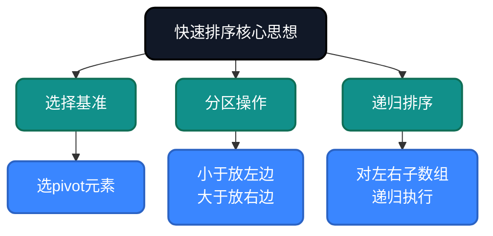
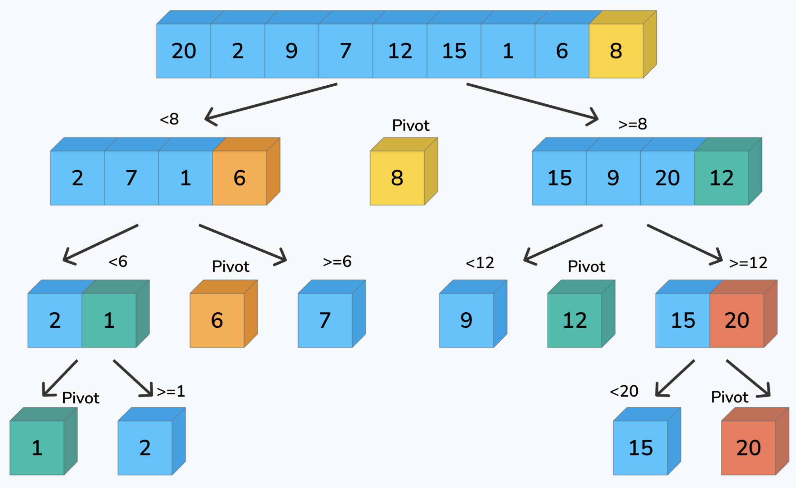
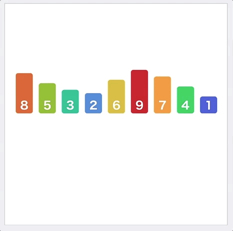
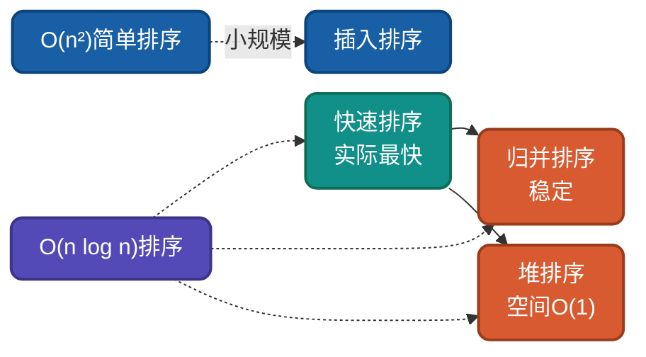

# AI时代，重温快速排序，不同实现思路详解

快速排序是实际应用中最快的通用排序算法，基于**分治思想**和**分区策略**。理解快速排序的多种实现思路，有助于驱动AI干活。

## 为什么还要学快速排序？

AI可以生成快速排序代码，但无法理解**为什么这样设计**：
- 为什么要选基准元素进行分区？
- 为什么Lomuto和Hoare分区有不同的适用场景？
- 如何避免最坏情况下的O(n²)？

理解这些设计决策，才能更好地指导AI编写高效代码，从而解决现实中复杂的问题。

## 核心思想

快速排序基于**分治+分区思想**：选择基准元素 → 将数组分为小于/大于基准的两部分 → 递归排序子数组。



## 生活类比与示意图

> **生活类比**：就像给一群人排队，先选一个人当"基准"，比他矮的站左边，比他高的站右边，然后左右两边也重复这个过程。随着不断分组，每一小组都会越来越有序，直到每组只剩下一个人时，整个队伍就排好了。




## 实现思路对比

| 实现方式 | Pivot选择 | 分区策略 | 时间复杂度 | 空间复杂度 | 稳定性 |
|---------|----------|---------|-----------|-----------|--------|
| Lomuto | 尾元素 | 单向扫描 | O(n log n)~O(n²) | O(log n) | 不稳定 |
| Hoare | 首元素 | 双向扫描 | O(n log n)~O(n²) | O(log n) | 不稳定 |
| 随机快排 | 随机 | 任意 | O(n log n)期望 | O(log n) | 不稳定 |
| 三路快排 | 任意 | 分三区 | O(n log n)~O(n) | O(log n) | 不稳定 |

---

## 思路一：Lomuto分区

**策略原理**：选择末尾元素作为基准，单向扫描将小于等于基准的元素放到左边。

**关键改进**：代码简洁，但交换次数较多。

**适用场景**：理解快速排序本质、通用排序。

### 代码实现

**Go**
```go
func QuickSort(arr []int, low, high int) {
    // 递归终止条件
    if low < high {
        // 分区：将数组分为两部分，返回基准位置
        pivot := partition(arr, low, high)

        // 递归：对左子数组排序
        QuickSort(arr, low, pivot-1)
        // 递归：对右子数组排序
        QuickSort(arr, pivot+1, high)
    }
}

func partition(arr []int, low, high int) int {
    pivot := arr[high]  // 选择末尾元素作为基准
    i := low - 1        // i指向小于等于区的末尾

    // 外层：遍历数组，将小于等于基准的元素放到左边
    for j := low; j < high; j++ {
        if arr[j] <= pivot {
            i++
            arr[i], arr[j] = arr[j], arr[i]  // 交换到小于等于区
        }
    }
    arr[i+1], arr[high] = arr[high], arr[i+1]  // 将基准放到正确位置
    return i + 1
}
```

---

## 思路二：Hoare分区

**策略原理**：选择首元素作为基准，双向扫描将小于基准的放左边，大于的放右边。

**关键改进**：交换次数少，效率略高于Lomuto。

**适用场景**：性能敏感场景。

### 代码实现

**Python**
```python
def quick_sort(arr, low=0, high=None):
    if high is None:
        high = len(arr) - 1
    if low < high:
        pivot = partition(arr, low, high)
        quick_sort(arr, low, pivot)
        quick_sort(arr, pivot + 1, high)
    return arr

def partition(arr, low, high):
    pivot = arr[(low + high) // 2]
    i, j = low - 1, high + 1
    while True:
        i += 1
        while arr[i] < pivot:
            i += 1
        j -= 1
        while arr[j] > pivot:
            j -= 1
        if i >= j:
            return j
        arr[i], arr[j] = arr[j], arr[i]
```

## 随机快排

```go
import "math/rand"

func RandomQuickSort(arr []int, low, high int) {
    if low < high {
        pivot := randomPartition(arr, low, high)
        RandomQuickSort(arr, low, pivot-1)
        RandomQuickSort(arr, pivot+1, high)
    }
}

func randomPartition(arr []int, low, high int) int {
    randomIndex := low + rand.Intn(high-low+1)
    arr[randomIndex], arr[high] = arr[high], arr[randomIndex]
    return partition(arr, low, high)
}
```

---

## 复杂度分析

| 实现方式 | 最好情况 | 平均情况 | 最坏情况 | 空间复杂度 | 稳定性 |
|---------|---------|---------|---------|-----------|--------|
| Lomuto | O(n log n) | O(n log n) | O(n²) | O(log n) | 不稳定 |
| Hoare | O(n log n) | O(n log n) | O(n²) | O(log n) | 不稳定 |
| 随机快排 | O(n log n) | O(n log n)期望 | O(n²) | O(log n) | 不稳定 |

**不稳定性说明**：快速排序是不稳定的，因为分区过程会改变相等元素的相对顺序。

---

## 应用场景

### 适用场景
1. **大规模通用排序**：实际最快
2. **数组排序**：随机访问优势
3. **内存排序**：不需要额外空间

### 不适用场景
1. **稳定性要求**：需要保持相等元素顺序时
2. **链表排序**：需要随机访问，不适合链表
3. **已近乎有序**：可能退化为O(n²)

---

## 与其他算法对比



| 算法 | 平均复杂度 | 最好情况 | 最坏情况 | 稳定性 | 适用场景 |
|-----|-----------|---------|---------|--------|---------|
| 快速排序 | O(n log n) | O(n log n) | O(n²) | 不稳定 | 大规模通用排序 |
| 归并排序 | O(n log n) | O(n log n) | O(n log n) | 稳定 | 稳定排序、链表 |
| 堆排序 | O(n log n) | O(n log n) | O(n log n) | 不稳定 | 优先队列、Top-K |
| 插入排序 | O(n²) | O(n) | O(n²) | 稳定 | 小数据、在线排序 |

---

## 总结

快速排序的核心价值在于**实际最快**。通过本文的多种实现思路：

1. **Lomuto分区**：理解分区思想本质
2. **Hoare分区**：更高效的实现
3. **随机快排**：避免最坏情况

AI时代，理解快速排序的**分区思想**和**基准选择**，能帮助我们在大规模数据排序场景做出正确选择。

---

**相关链接**
- [快速排序多语言实现](https://github.com/microwind/algorithms/tree/main/sorting/quicksort)
- [AI时代，重温10大经典排序算法](https://github.com/microwind/algorithms/blob/main/sorting/AI-Era-Top-10-Sorting-Algorithms.md)
- [归并排序详解](https://github.com/microwind/algorithms/tree/main/sorting/mergesort)
- [堆排序详解](https://github.com/microwind/algorithms/tree/main/sorting/heapsort)

**AI编程核心库**
- [algorithms - 算法与数据结构](https://github.com/microwind/algorithms) - 本项目，包含各种数据结构与经典算法
- [ai-prompt - Prompt工程](https://github.com/microwind/ai-prompt) - 构建高质量的大型语言模型Prompt
- [ai-skills - AI编程技能](https://github.com/microwind/ai-skills) - 高质量的AI编程Skills库
- [design-patterns - 设计模式](https://github.com/microwind/design-patterns) - 设计模式、编程范式、架构设计
