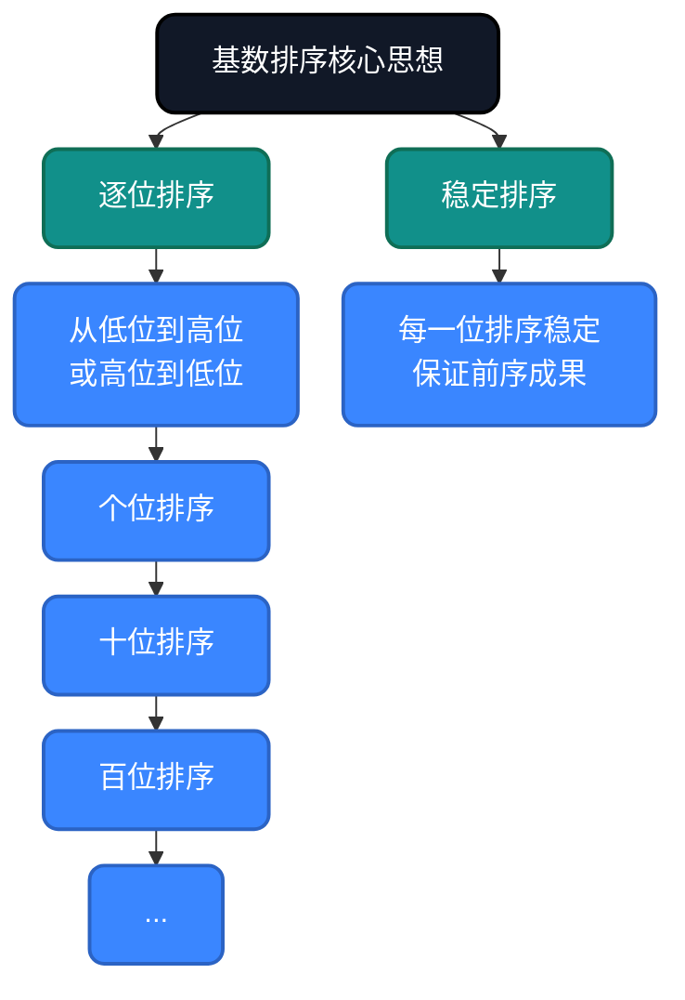
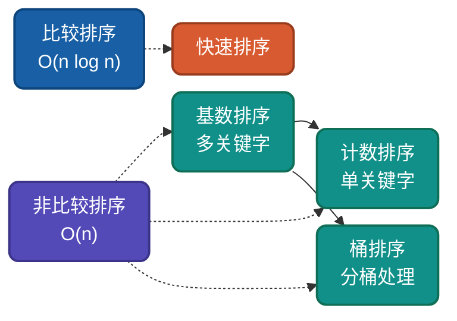

# AI时代，重温基数排序，不同实现思路详解

基数排序是**非比较排序**的经典算法，通过**逐位排序**实现线性复杂度。它是处理大规模整数排序的利器。理解基数排序的多种实现思路，有助于驱动AI干活。

## 为什么还要学基数排序？

AI可以生成基数排序代码，但无法理解**为什么这样设计**：
- 为什么按位排序能保证最终有序？
- 为什么必须从低位到高位（LSD）或高位到低位（MSD）？
- 为什么每一位的排序必须是稳定的？

理解这些设计决策，才能更好地指导AI编写高效代码，从而解决现实中复杂的问题。

## 核心思想

基数排序基于**逐位排序思想**：从最低位（LSD）或最高位（MSD）开始，按位进行稳定排序（通常用计数排序作为子过程）。



## 实现思路对比

| 方式 | 排序方向 | 位数处理 | 适用场景 |
|-----|---------|---------|---------|
| LSD | 低位到高位 | 全部位数 | 固定位数整数 |
| MSD | 高位到低位 | 可提前终止 | 变长字符串 |

---

## 思路一：LSD基数排序（最低位优先）

**策略原理**：从最低位（个位）开始，逐位向高位进行稳定排序。

**关键改进**：适合固定位数的整数排序，实现简单，可以利用计数排序作为子过程。

**适用场景**：固定位数整数、大规模数据排序。

### 代码实现

**Go**
```go
func RadixSort(arr []int) {
    if len(arr) == 0 {
        return
    }
    
    // 找最大值确定位数
    max := arr[0]
    for _, v := range arr {
        if v > max {
            max = v
        }
    }
    
    // 对每一位进行计数排序
    for exp := 1; max/exp > 0; exp *= 10 {
        countingSortByDigit(arr, exp)
    }
}

func countingSortByDigit(arr []int, exp int) {
    n := len(arr)
    output := make([]int, n)
    count := make([]int, 10)
    
    // 第一步：统计当前位的出现次数
    for i := 0; i < n; i++ {
        digit := (arr[i] / exp) % 10
        count[digit]++
    }
    
    // 第二步：计算前缀和，确定位置
    for i := 1; i < 10; i++ {
        count[i] += count[i-1]
    }
    
    // 第三步：从后往前稳定输出
    for i := n - 1; i >= 0; i-- {
        digit := (arr[i] / exp) % 10
        output[count[digit]-1] = arr[i]
        count[digit]--
    }
    
    copy(arr, output)
}
```

**Python**
```python
def radix_sort(arr):
    if not arr:
        return arr
    
    max_val = max(arr)
    exp = 1
    
    while max_val // exp > 0:
        counting_sort_by_digit(arr, exp)
        exp *= 10
    
    return arr

def counting_sort_by_digit(arr, exp):
    n = len(arr)
    output = [0] * n
    count = [0] * 10
    
    for i in range(n):
        digit = (arr[i] // exp) % 10
        count[digit] += 1
    
    for i in range(1, 10):
        count[i] += count[i - 1]
    
    i = n - 1
    while i >= 0:
        digit = (arr[i] // exp) % 10
        output[count[digit] - 1] = arr[i]
        count[digit] -= 1
        i -= 1
    
    for i in range(n):
        arr[i] = output[i]
```

## 二进制基数排序

```go
func RadixSortBinary(arr []int) {
    const bits = 32 // 假设32位整数
    const radix = 256 // 8位一组
    
    for shift := 0; shift < bits; shift += 8 {
        countingSortByBits(arr, shift, radix)
    }
}

func countingSortByBits(arr []int, shift, radix int) {
    n := len(arr)
    output := make([]int, n)
    count := make([]int, radix)
    
    for _, v := range arr {
        bucket := (v >> shift) & (radix - 1)
        count[bucket]++
    }
    
    for i := 1; i < radix; i++ {
        count[i] += count[i-1]
    }
    
    for i := n - 1; i >= 0; i-- {
        bucket := (arr[i] >> shift) & (radix - 1)
        output[count[bucket]-1] = arr[i]
        count[bucket]--
    }
    
    copy(arr, output)
}
```

---

## 复杂度分析

| 实现方式 | 时间复杂度 | 空间复杂度 | 稳定性 | 说明 |
|---------|-----------|-----------|--------|------|
| LSD | O(d×(n+k)) | O(n+k) | 稳定 | d是位数，k是基数 |
| MSD | O(d×(n+k)) | O(n+k) | 稳定 | 可提前终止 |
| 二进制 | O(32/8 × (n+256)) | O(n+256) | 稳定 | 位运算实现 |

**说明**：当d为常数时（如32位整数），时间复杂度为O(n)，达到线性！

---

## 应用场景

### 适用场景
1. **大规模整数排序**：手机号、身份证号
2. **字符串排序**：固定长度字符串
3. **数据库索引**：多关键字排序
4. **并行排序**：各位独立可并行

### 不适用场景
- **浮点数排序**：需要特殊处理
- **变长数据**：MSD实现复杂
- **位数过多**：d过大时效率下降

---

## 与其他算法对比



| 算法 | 平均复杂度 | 空间复杂度 | 稳定性 | 适用场景 |
|-----|-----------|-----------|--------|---------|
| 基数排序 | O(d×(n+k)) | O(n+k) | 稳定 | 整数、字符串 |
| 计数排序 | O(n+k) | O(k) | 稳定 | 范围有限 |
| 桶排序 | O(n) | O(n+k) | 稳定 | 均匀分布 |
| 快速排序 | O(n log n) | O(log n) | 不稳定 | 通用排序 |

---

## 总结

基数排序的核心价值在于**线性时间处理多关键字**。通过本文的多种实现思路：

1. **LSD基数排序**：固定位数整数排序
2. **MSD基数排序**：变长字符串排序
3. **二进制基数排序**：位运算优化

AI时代，理解基数排序的**逐位稳定排序**思想，能帮助我们在大规模整数/字符串排序场景做出正确选择。

---

**相关链接**
- [基数排序多语言实现](https://github.com/microwind/algorithms/tree/main/sorting/radixsort)
- [AI时代，重温10大经典排序算法](https://github.com/microwind/algorithms/blob/main/sorting/AI-Era-Top-10-Sorting-Algorithms.md)
- [计数排序详解](https://github.com/microwind/algorithms/tree/main/sorting/countingsort)
- [桶排序详解](https://github.com/microwind/algorithms/tree/main/sorting/bucketsort)

**AI编程核心库**
- [algorithms - 算法与数据结构](https://github.com/microwind/algorithms) - 本项目，包含各种数据结构与经典算法
- [ai-prompt - Prompt工程](https://github.com/microwind/ai-prompt) - 构建高质量的大型语言模型Prompt
- [ai-skills - AI编程技能](https://github.com/microwind/ai-skills) - 高质量的AI编程Skills库
- [design-patterns - 设计模式](https://github.com/microwind/design-patterns) - 设计模式、编程范式、架构设计
