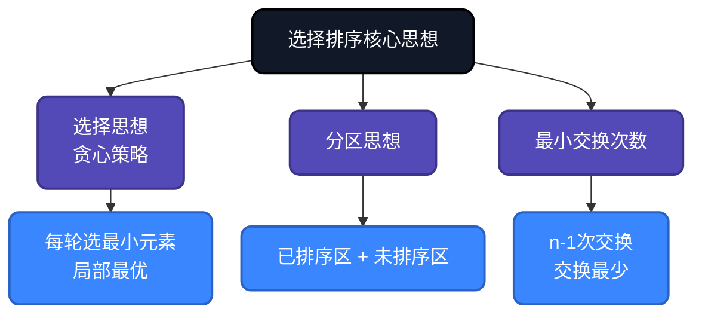
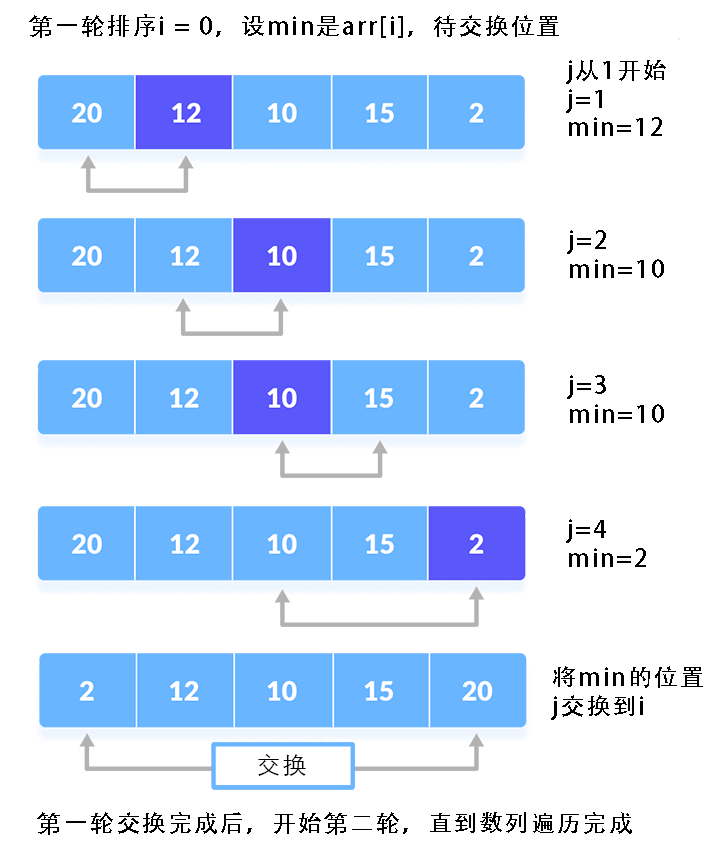
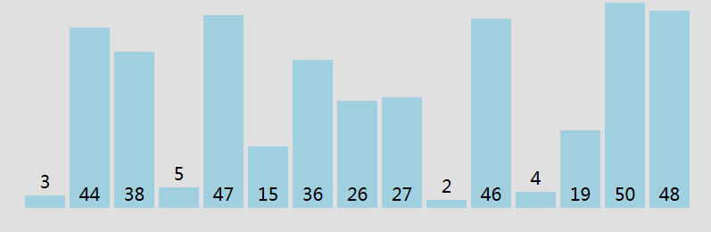
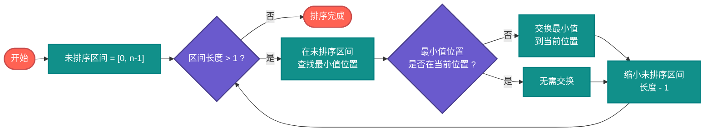
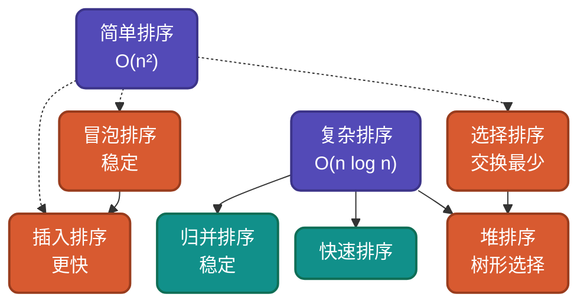

# AI时代，重温选择排序，不同实现思路详解

选择排序是最朴素的选择思想实现。它通过**每轮选择最小（大）元素**来完成排序，交换次数极少但比较次数固定。本文整理选择排序的多种实现思路和优化技巧，帮助你理解**选择思想**在算法设计中的应用。

## 为什么还要学选择排序？

AI可以生成选择排序代码，但无法理解**为什么这样设计**：
- 为什么选择最小元素而不是相邻交换？
- 为什么交换次数最少只有n-1次？
- 如何理解它的不稳定性？

理解选择排序，是理解**贪心思想**（每轮选局部最优）的最佳切入点。

## 核心思想

选择排序基于**选择思想**：每轮在未排序区间中选择最小（或最大）元素，放到已排序区间的末尾。



## 生活类比与示意图

> **生活类比**：就像从一堆没有次序的苹果里，每次都挑出最小（或最大）的一个，放到一边按大小排好。每次只挑一个，慢慢就把所有苹果按顺序排好了。




## 实现思路对比

| 实现方式 | 核心特点 | 时间复杂度 | 空间复杂度 | 稳定性 | 交换次数 |
|---------|---------|-----------|-----------|--------|---------|
| 基础选择排序 | 每轮选最小值 | O(n²) | O(1) | 不稳定 | n-1 |
| 同时找最大最小 | 每轮确定两个位置 | O(n²) | O(1) | 不稳定 | ~n/2 |
| 双向选择排序 | 交替找最大最小 | O(n²) | O(1) | 不稳定 | ~n/2 |
| 稳定版选择排序 | 插入而非交换 | O(n²) | O(n) | 稳定 | 0 |

---

## 思路一：基础选择排序

**策略原理**：遍历数组，每轮在未排序区间中找到最小元素，与当前位置交换。

**适用场景**：理解算法本质、交换敏感设备。

### 流程图



### 代码实现

**Go**
```go
func SelectionSort(arr []int) []int {
    n := len(arr)
    // 外层：遍历全部数组，每轮确定一个最小值位置
    for i := 0; i < n-1; i++ {
        minIdx := i // 假设当前位置最小

        // 内层：在未排序区间查找最小值
        for j := i + 1; j < n; j++ {
            if arr[j] < arr[minIdx] {
                minIdx = j // 更新最小值位置
            }
        }

        // 将最小值交换到当前位置
        if minIdx != i {
            arr[i], arr[minIdx] = arr[minIdx], arr[i]
        }
    }
    return arr
}
```

**Python**
```python
def selection_sort(arr):
    n = len(arr)
    # 外层：遍历全部数组，每轮确定一个最小值位置
    for i in range(n - 1):
        min_idx = i

        # 内层：在未排序区间查找最小值
        for j in range(i + 1, n):
            if arr[j] < arr[min_idx]:
                min_idx = j  # 更新最小值位置

        # 将最小值交换到当前位置
        if min_idx != i:
            arr[i], arr[min_idx] = arr[min_idx], arr[i]
    return arr
```

**Java**
```java
public static void selectionSort(int[] arr) {
    int n = arr.length;
    // 外层：遍历全部数组，每轮确定一个最小值位置
    for (int i = 0; i < n - 1; i++) {
        int minIdx = i;

        // 内层：在未排序区间查找最小值
        for (int j = i + 1; j < n; j++) {
            if (arr[j] < arr[minIdx]) {
                minIdx = j;  // 更新最小值位置
            }
        }

        // 将最小值交换到当前位置
        if (minIdx != i) {
            int temp = arr[i];
            arr[i] = arr[minIdx];
            arr[minIdx] = temp;
        }
    }
}
```

---

## 思路二：同时查找最大最小值

**策略原理**：每轮同时找到最大值和最小值，分别放到两端，减少排序轮数。

**关键改进**：从O(n²)降到~O(n²/2)比较次数，交换次数也减半。

**适用场景**：数据规模较大但仍使用选择排序的场景。

### 代码实现

**Go**
```go
func SelectionSortMinMax(arr []int) []int {
    n := len(arr)
    left, right := 0, n-1

    for left < right {
        minIdx, maxIdx := left, left

        // 内层：在未排序区间同时查找最小和最大值位置
        for i := left; i <= right; i++ {
            if arr[i] < arr[minIdx] {
                minIdx = i // 更新最小值位置
            }
            if arr[i] > arr[maxIdx] {
                maxIdx = i // 更新最大值位置
            }
        }

        // 将最小值交换到左边
        arr[left], arr[minIdx] = arr[minIdx], arr[left]

        // 注意：如果最大值刚好在left位置，已被换走需修正
        if maxIdx == left {
            maxIdx = minIdx
        }

        // 将最大值交换到右边
        arr[right], arr[maxIdx] = arr[maxIdx], arr[right]

        left++
        right--
    }
    return arr
}
```

**Python**
```python
def selection_sort_min_max(arr):
    left, right = 0, len(arr) - 1

    while left < right:
        min_idx = max_idx = left

        # 内层：在未排序区间同时查找最小和最大值位置
        for i in range(left, right + 1):
            if arr[i] < arr[min_idx]:
                min_idx = i  # 更新最小值位置
            if arr[i] > arr[max_idx]:
                max_idx = i  # 更新最大值位置

        # 将最小值交换到左边
        arr[left], arr[min_idx] = arr[min_idx], arr[left]

        # 处理最大值位置被换走的情况
        if max_idx == left:
            max_idx = min_idx

        # 将最大值交换到右边
        arr[right], arr[max_idx] = arr[max_idx], arr[right]

        left += 1
        right -= 1
    return arr
```

---

## 思路三：双向选择排序

**策略原理**：交替从前往后找最小值、从后往前找最大值，每轮确定两个元素位置。

**关键改进**：与思路二类似，但交替进行更直观。

### 代码实现

**JavaScript**
```javascript
function bidirectionalSelectionSort(arr) {
    let left = 0, right = arr.length - 1;

    while (left < right) {
        // 从左往右：在未排序区间查找最小值
        let minIdx = left;
        for (let i = left + 1; i <= right; i++) {
            if (arr[i] < arr[minIdx]) {
                minIdx = i; // 更新最小值位置
            }
        }
        // 将最小值交换到左边
        if (minIdx !== left) {
            [arr[left], arr[minIdx]] = [arr[minIdx], arr[left]];
        }
        left++;

        if (left >= right) break;

        // 从右往左：在未排序区间查找最大值
        let maxIdx = right;
        for (let i = right - 1; i >= left; i--) {
            if (arr[i] > arr[maxIdx]) {
                maxIdx = i; // 更新最大值位置
            }
        }
        // 将最大值交换到右边
        if (maxIdx !== right) {
            [arr[right], arr[maxIdx]] = [arr[maxIdx], arr[right]];
        }
        right--;
    }
    return arr;
}
```

---

## 思路四：稳定版选择排序

**策略原理**：不交换元素，而是将最小元素插入到正确位置，移动其他元素。

**关键改进**：通过O(n)空间或O(n²)时间换取稳定性。

**适用场景**：需要稳定性但只能使用选择排序思想的场景。

### 代码实现

**Go（使用额外空间）**
```go
func StableSelectionSort(arr []int) []int {
    n := len(arr)
    result := make([]int, 0, n)
    used := make([]bool, n)

    // 外层：遍历全部数组，每轮确定一个最小值
    for len(result) < n {
        minIdx := -1

        // 内层：在未使用元素中查找最小值
        for i := 0; i < n; i++ {
            if !used[i] {
                if minIdx == -1 || arr[i] < arr[minIdx] {
                    minIdx = i // 更新最小值位置
                }
            }
        }

        result = append(result, arr[minIdx])
        used[minIdx] = true
    }
    copy(arr, result)
    return arr
}
```

**Python（原地稳定版）**
```python
def stable_selection_sort(arr):
    n = len(arr)
    # 外层：遍历全部数组，每轮确定一个最小值位置
    for i in range(n - 1):
        min_idx = i

        # 内层：在未排序区间查找最小值
        for j in range(i + 1, n):
            if arr[j] < arr[min_idx]:
                min_idx = j  # 更新最小值位置

        # 稳定移动：将最小值插入到位置i，其他元素后移
        key = arr[min_idx]
        # 将i到min_idx-1的元素后移
        for j in range(min_idx, i, -1):
            arr[j] = arr[j - 1]
        arr[i] = key
    return arr
```

---

## 复杂度分析

| 实现方式 | 最好情况 | 平均情况 | 最坏情况 | 空间复杂度 | 稳定性 |
|---------|---------|---------|---------|-----------|--------|
| 基础选择排序 | O(n²) | O(n²) | O(n²) | O(1) | 不稳定 |
| 同时找最大最小 | O(n²) | O(n²) | O(n²) | O(1) | 不稳定 |
| 双向选择排序 | O(n²) | O(n²) | O(n²) | O(1) | 不稳定 |
| 稳定版（原地） | O(n²) | O(n²) | O(n²) | O(1) | 稳定 |
| 稳定版（额外空间） | O(n²) | O(n²) | O(n²) | O(n) | 稳定 |

**比较次数**：
- 基础版：(n-1) + (n-2) + ... + 1 = n(n-1)/2 = O(n²)
- 优化版：约减半但仍为O(n²)

**交换次数**：
- 基础版：最多n-1次
- 优化版：约n/2次

---

## 为什么不稳定？

选择排序的不稳定性来自于**远距离交换**：

```
原始序列：[5a, 5b, 3]
         ↑        ↑
         交换这两个位置

结果：[3, 5b, 5a]  ← 5a和5b的相对顺序改变了！
```

当最小元素在相等元素之后时，交换会破坏相等元素的原有顺序。

---

## 应用场景

### 适用场景
1. **交换敏感设备**：Flash、ROM等存储设备，写入次数有限
2. **小规模数据**：n < 50时，性能差异不明显
3. **Top-K问题**：只需执行K轮即可选出前K小/大元素
4. **内存受限环境**：O(1)空间复杂度优势明显

### 不适用场景
1. **需要稳定性的场景**：相等元素顺序必须保持
2. **大规模数据排序**：O(n²)复杂度性能差
3. **对比较操作昂贵的数据**：如复杂对象比较

---

## 与其他算法对比



| 算法 | 交换次数 | 稳定性 | 适用场景 |
|-----|---------|--------|---------|
| 选择排序 | n-1 | 不稳定 | 交换敏感设备 |
| 冒泡排序 | O(n²) | 稳定 | 教学、近乎有序 |
| 插入排序 | O(n²) | 稳定 | 小数据、流式排序 |
| 堆排序 | O(n log n) | 不稳定 | 优先队列、Top-K |

---

## 总结

选择排序的核心价值在于**交换次数最少**，这是其他排序算法无法比拟的优势。通过本文的多种实现思路：

1. **基础选择排序**：理解选择思想本质
2. **同时找最大最小**：学习优化思维
3. **双向选择排序**：拓展变体思路
4. **稳定版选择排序**：理解稳定性与性能的权衡

AI时代，理解选择排序的**最小交换特性**，能帮助我们在Flash存储、嵌入式系统等特殊场景做出正确选择。

---

**相关链接**
- [选择排序多语言实现](https://github.com/microwind/algorithms/tree/main/sorting/selectionsort)
- [AI时代，重温10大经典排序算法](https://github.com/microwind/algorithms/blob/main/sorting/AI-Era-Top-10-Sorting-Algorithms.md)
- [冒泡排序详解](https://github.com/microwind/algorithms/tree/main/sorting/bubblesort)
- [插入排序详解](https://github.com/microwind/algorithms/tree/main/sorting/insertsort)

**AI编程核心库**
- [algorithms - 算法与数据结构](https://github.com/microwind/algorithms) - 本项目，包含各种数据结构与经典算法
- [ai-prompt - Prompt工程](https://github.com/microwind/ai-prompt) - 构建高质量的大型语言模型Prompt
- [ai-skills - AI编程技能](https://github.com/microwind/ai-skills) - 高质量的AI编程Skills库
- [design-patterns - 设计模式](https://github.com/microwind/design-patterns) - 设计模式、编程范式、架构设计
