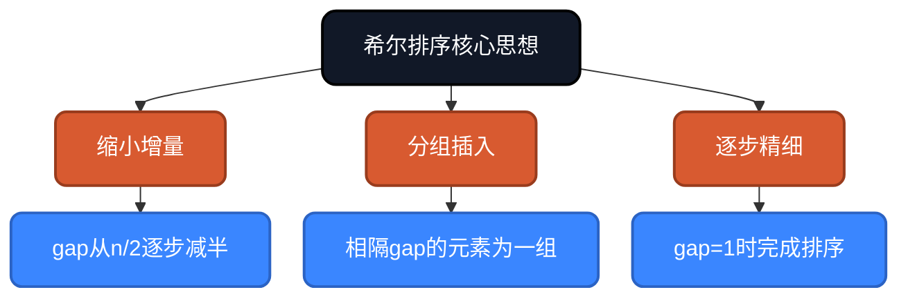
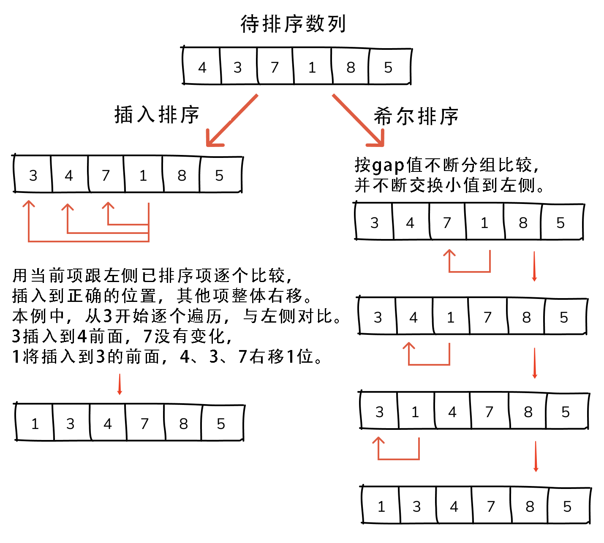
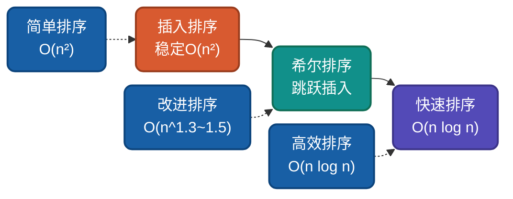

# AI时代，重温希尔排序，不同实现思路详解

希尔排序是插入排序的升级版，通过**跳跃式插入**大幅提升效率。它是第一批突破O(n²)时间复杂度的排序算法之一。理解希尔排序的多种实现思路，有助于驱动AI干活。

## 为什么还要学希尔排序？

AI可以生成希尔排序代码，但无法理解**为什么这样设计**：
- 为什么要跳跃式插入而不是逐个插入？
- 为什么不同的gap序列会影响性能？
- 为什么最后一定要用gap=1完成排序？

理解这些设计决策，才能更好地指导AI编写高效代码，从而解决现实中复杂的问题。

## 核心思想

希尔排序基于**缩小增量排序**：先以较大步长(gap)分组进行插入排序，逐步缩小步长至1，最终完成全排序。



## 生活类比与示意图

> **生活类比**：就像整理扑克牌，如果手里有很多牌，一次只按相隔一定间距（比如每隔10张牌）把牌插入到已排好的位置，先把大块牌大致排好序，再缩小间距，一次次精细调整，最后整个牌堆就排好了。相比插入排序"每次拿一张牌插入"，希尔排序就像先粗略排，再精细排，效率更高。




## 实现思路对比

| 实现方式 | Gap序列 | 时间复杂度 | 空间复杂度 | 稳定性 |
|---------|--------|-----------|-----------|--------|
| Shell原始 | n/2, n/4, ... , 1 | O(n²) | O(1) | 不稳定 |
| Hibbard | 2^k-1 | O(n^1.5) | O(1) | 不稳定 |
| Sedgewick | 4^k+3·2^(k-1)+1 | O(n^1.3) | O(1) | 不稳定 |
| Knuth | (3^k-1)/2 | O(n^1.5) | O(1) | 不稳定 |

---

## 思路一：Shell原始序列

**策略原理**：gap从n/2开始，每次减半直至1，对每个gap分组进行插入排序。

**关键改进**：通过跳跃式插入，让远距离元素快速归位，逐步精细调整。

**适用场景**：理解算法本质、中等规模数据。

### 代码实现

**Go**
```go
func ShellSortShell(arr []int) []int {
    n := len(arr)

    // 外层：gap从n/2逐步减半直至1
    for gap := n / 2; gap > 0; gap /= 2 {
        // 中层：对相隔gap的每个分组进行插入排序
        for i := gap; i < n; i++ {
            temp := arr[i]  // 取出当前元素
            j := i

            // 内层：在分组内查找插入位置，同时后移元素
            for j >= gap && arr[j-gap] > temp {
                arr[j] = arr[j-gap]  // 元素后移gap位
                j -= gap
            }
            arr[j] = temp  // 插入到正确位置
        }
    }
    return arr
}
```

---

## 思路二：Knuth序列

**策略原理**：gap取1, 4, 13, 40, 121,...即(3^k-1)/2，从小于n的最大值开始逐步缩小。

**关键改进**：相比Shell原始序列，Knuth序列能让元素更均匀地分布，减少最后gap=1时的工作量。

**适用场景**：实际应用中最常用的gap序列，性能平衡。

### 代码实现

**Python**
```python
def shell_sort_knuth(arr):
    n = len(arr)

    # 外层：计算初始gap，使用Knuth序列
    gap = 1
    while gap < n // 3:
        gap = gap * 3 + 1

    while gap >= 1:
        # 中层：对相隔gap的每个分组进行插入排序
        for i in range(gap, n):
            temp = arr[i]  # 取出当前元素
            j = i

            # 内层：在分组内查找插入位置，同时后移元素
            while j >= gap and arr[j - gap] > temp:
                arr[j] = arr[j - gap]  # 元素后移gap位
                j -= gap
            arr[j] = temp  # 插入到正确位置
        gap //= 3
    return arr
```

---

## 思路三：Sedgewick序列

**策略原理**：使用更复杂的数学序列，让元素在不同gap下都能良好分布，达到理论最优时间复杂度。

**关键改进**：时间复杂度可达O(n^1.3)，是目前理论最优的gap序列之一。

**适用场景**：对性能要求极高的场景。

### 代码实现

**JavaScript**
```javascript
function shellSortSedgewick(arr) {
    const n = arr.length;

    // 外层：预计算Sedgewick序列
    const gaps = [];
    let k = 0;
    while (true) {
        let gap;
        if (k % 2 === 0) {
            gap = 9 * (1 << k) - 9 * (1 << (k / 2)) + 1;
        } else {
            gap = 8 * (1 << k) - 6 * (1 << ((k + 1) / 2)) + 1;
        }
        if (gap >= n) break;
        gaps.unshift(gap);
        k++;
    }
    gaps.push(1);
    
    for (const gap of gaps) {
        for (let i = gap; i < n; i++) {
            const temp = arr[i];
            let j = i;
            while (j >= gap && arr[j - gap] > temp) {
                arr[j] = arr[j - gap];
                j -= gap;
            }
            arr[j] = temp;
        }
    }
    
    return arr;
}
```

---

## 复杂度分析

| Gap序列 | 时间复杂度 | 最坏情况 | 空间复杂度 | 稳定性 | 备注 |
|--------|-----------|---------|-----------|--------|------|
| Shell (n/2^k) | O(n²) | O(n²) | O(1) | 不稳定 | 最坏退化为插入排序 |
| Hibbard (2^k-1) | O(n^1.5) | O(n^1.5) | O(1) | 不稳定 | 较好的平衡 |
| Knuth ((3^k-1)/2) | O(n^1.5) | O(n^1.5) | O(1) | 不稳定 | 推荐实践 |
| Sedgewick | O(n^1.3) | O(n log²n) | O(1) | 不稳定 | 理论最优 |

**不稳定性说明**：希尔排序是不稳定的，因为跳跃式插入会改变相等元素的相对顺序。

---

## 应用场景

### 适用场景
1. **中等规模数据**：几千到几万的数据量
2. **嵌入式系统**：代码简单，无需递归栈
3. **性能要求适中**：比快排慢但比冒泡快很多
4. **原地排序需求**：O(1)空间复杂度

### 不适用场景
1. **大规模数据**：需要O(n log n)算法
2. **稳定性要求**：需要保持相等元素顺序时

---

## 与其他算法对比



| 算法 | 平均复杂度 | 最好情况 | 最坏情况 | 稳定性 | 适用场景 |
|-----|-----------|---------|---------|--------|---------|
| 插入排序 | O(n²) | O(n) | O(n²) | 稳定 | 小数据、在线排序 |
| 希尔排序 | O(n^1.3~1.5) | O(n) | O(n²) | 不稳定 | 中等规模数据 |
| 快速排序 | O(n log n) | O(n log n) | O(n²) | 不稳定 | 大规模通用排序 |
| 归并排序 | O(n log n) | O(n log n) | O(n log n) | 稳定 | 需要稳定的大排序 |

---

## 总结

希尔排序的核心价值在于**突破O(n²)瓶颈**。通过本文的多种实现思路：

1. **Shell原始序列**：理解缩小增量思想
2. **Knuth序列**：实践中最常用的平衡选择
3. **Sedgewick序列**：理论最优的性能追求

AI时代，理解希尔排序的**gap序列选择**，能帮助我们在中等规模数据场景做出正确选择。

---

**相关链接**
- [希尔排序多语言实现](https://github.com/microwind/algorithms/tree/main/sorting/shellsort)
- [AI时代，重温10大经典排序算法](https://github.com/microwind/algorithms/blob/main/sorting/AI-Era-Top-10-Sorting-Algorithms.md)
- [插入排序详解](https://github.com/microwind/algorithms/tree/main/sorting/insertsort)
- [快速排序详解](https://github.com/microwind/algorithms/tree/main/sorting/quicksort)

**AI编程核心库**
- [algorithms - 算法与数据结构](https://github.com/microwind/algorithms) - 本项目，包含各种数据结构与经典算法
- [ai-prompt - Prompt工程](https://github.com/microwind/ai-prompt) - 构建高质量的大型语言模型Prompt
- [ai-skills - AI编程技能](https://github.com/microwind/ai-skills) - 高质量的AI编程Skills库
- [design-patterns - 设计模式](https://github.com/microwind/design-patterns) - 设计模式、编程范式、架构设计
