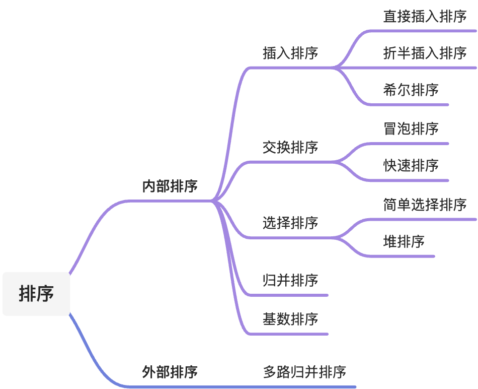
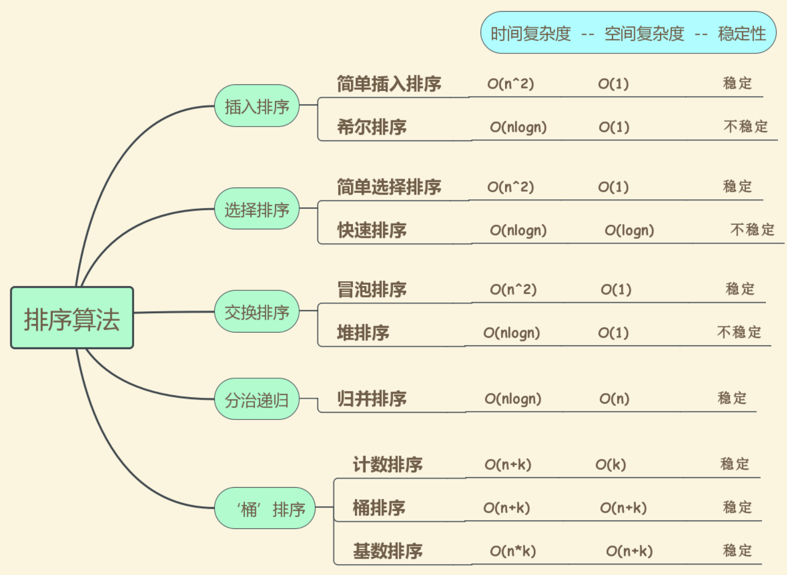

## 概览

## 比较

## 10大经典排序算法
- ### [冒泡排序 bubble sort](./bubblesort/)
[C语言版](./bubblesort/bubble_sort.c ) | [JavaScript版](./bubblesort/bubble_sort.js ) | [Python版](./bubblesort/bubble_sort.py ) | [Java版](./bubblesort/BubbleSort.java ) | [TypeScript版](./bubblesort/BubbleSort.ts ) | [Go版](./bubblesort/bubble_sort.go ) | [Dart版](./bubblesort/bubble_sort.dart ) | [Rust版](./bubblesort/bubble_sort.rs )
- ### [插入排序 insert sort](./insertsort/)
[C语言版](./insertsort/insert_sort.c ) | [JavaScript版](./insertsort/insert_sort.js ) | [Python版](./insertsort/insert_sort.py ) | [Java版](./insertsort/InsertSort.java ) | [TypeScript版](./insertsort/InsertSort.ts ) | [Go版](./insertsort/insert_sort.go ) 
- ### [选择排序 selection sort](./selectionsort/)
[C语言版](./selectionsort/selection_sort.c ) | [JavaScript版](./selectionsort/selection_sort.js ) | [Python版](./selectionsort/selection_sort.py ) | [Java版](./selectionsort/SelectionSort.java ) | [TypeScript版](./selectionsort/SelectionSort.ts )
- ### [堆排序 heap sort](./heapsort/)
[C语言版](./heapsort/heap_sort.c ) | [JavaScript版](./heapsort/heap_sort.js ) | [Python版](./heapsort/heap_sort.py ) | [Java版](./heapsort/HeapSort.java ) | [TypeScript版](./heapsort/HeapSort.ts )
- ### [快速排序 quick sort](./quicksort/)
[C语言版](./quicksort/quick_sort.c ) | [JavaScript版](./quicksort/quick_sort.js ) | [Python版](./quicksort/quick_sort.py ) | [Java版](./quicksort/QuickSort.java ) | [TypeScript版](./quicksort/QuickSort.ts )
- ### [归并排序 merge sort](./mergesort/)
[C语言版](./mergesort/merge_sort.c ) | [JavaScript版](./mergesort/merge_sort.js ) | [Python版](./mergesort/merge_sort.py ) | [Java版](./mergesort/MergeSort.java ) | [TypeScript版](./mergesort/MergeSort.ts )
- ### [计数排序 counting sort](./countingsort/)
[C语言版](./countingsort/counting_sort.c ) | [JavaScript版](./countingsort/counting_sort.js ) | [Python版](./countingsort/counting_sort.py ) | [Java版](./countingsort/CountingSort.java ) | [TypeScript版](./countingsort/CountingSort.ts ) | [Go版](./countingsort/counting_sort.go ) 
- ### [基数排序 radix sort](./radixsort/)
[C语言版](./radixsort/radix_sort.c ) | [JavaScript版](./radixsort/radix_sort.js ) | [Python版](./radixsort/radix_sort.py ) | [Java版](./radixsort/RadixSort.java ) | [TypeScript版](./radixsort/RadixSort.ts )
- ### [桶排序 bucket sort](./bucketsort/)
[C语言版](./bucketsort/bucket_sort.c ) | [JavaScript版](./bucketsort/bucket_sort.js ) | [Python版](./bucketsort/bucket_sort.py ) | [Java版](./bucketsort/BuketSort.java ) | [TypeScript版](./bucketsort/BuketSort.ts )
- ### [希尔排序 shell sort](./shellsort/)
[C语言版](./shellsort/shell_sort.c ) | [JavaScript版](./shellsort/shell_sort.js ) | [Python版](./shellsort/shell_sort.py ) | [Java版](./shellsort/ShellSort.java ) | [TypeScript版](./shellsort/ShellSort.ts )

## 链接
https://github.com/microwind