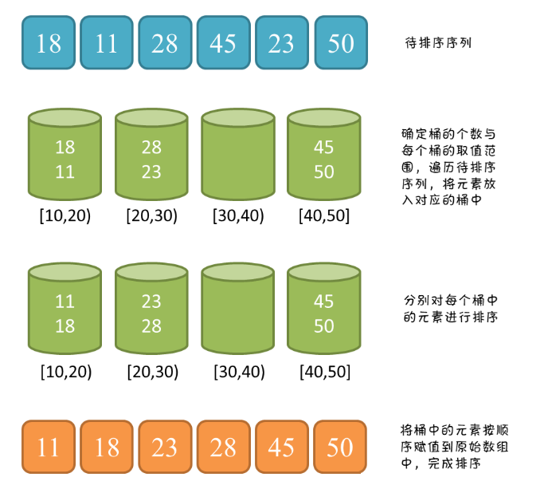
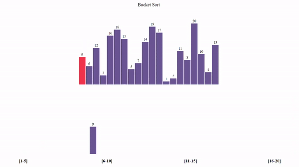

## Java/Go/Python/JS/C 语言实现桶排序算法

## 说明

桶排序（Bucket sort）也称箱排序，是一个排序算法，工作原理是将数组分到几个桶里，桶的数量可由排序数组最大值与最小值关系决定，可以固定几个桶。每个桶内再通过插入、冒泡或或是以桶递归方式进行排序。

## 实现过程

1.	得到桶的数量，比如用数组中最大项减去最小项再除以最小项，桶也可以是任意值，几个桶都可以；
3.	新建一个桶列表，然后遍历数组，再将数组项除以桶的个数得到要存放的桶的下标，将数组项存入到对应桶中；
4.	将新元素存入桶中时，按顺序插入，保持顺序；
5.	数据全部放入桶之后，再遍历桶列表，将二维数组按顺序展开取出即可。

## 示意图




## 性能分析

    平均时间复杂度：O(n + k)
    最佳时间复杂度：O(n + k)
    最差时间复杂度：O(n ^ 2)
    空间复杂度：O(n * k)
    稳定性：稳定

# 代码

## Java

```java
  // java  桶排序标准版，更多版本请看源码文件
  void sort1(int arr[]) {
    int len = arr.length;
    for (int i = 0; i < len; i++) {
      for (int j = 0; j < len - i - 1; j++) {
        // 自左往右每两个进行比较，把大的交换到右侧
        // 逐轮冒出最大数，已经排好序的不要再比较
        if (arr[j] > arr[j + 1]) {
          int tmp = arr[j];
          arr[j] = arr[j + 1];
          arr[j + 1] = tmp;
        }
      }
    }
  }
```

## Python

```py
# python  桶排序标准版，更多实现版本请查看源文件
def bubble_sort1(arr):
  print('bubble_sort1 from left to right:')
  length = len(arr)
  for i in range(length):
    for j in range(length - i - 1):
      # 自左往右每两个进行比较，把大的交换到右侧
      # 逐轮冒出最大数，已经排好序的不要再比较
      if (arr[j] > arr[j + 1]):
        [arr[j], arr[j + 1]] = [arr[j + 1], arr[j]]
```

## Go

```go
// go  桶排序标准版，更多版本请查看源文件
func bubbleSort1(list []int) []int {
	var length = len(list)
	for i := 0; i < length; i++ {
		for j := 0; j < length-i-1; j++ {
			if list[j] > list[j+1] {
				var tmp = list[j+1]
				list[j+1] = list[j]
				list[j] = tmp
			}
		}
	}
	return list
}
```

## JS

```js
// js  桶排序徐标准版，更多实现版本详见源码文件
function bubbleSort1(arr) {
  const len = arr.length
  for (var i = 0; i < len; i++) {
    for (var j = 0; j < len - i - 1; j++) {
      // 自左往右每两个进行比较，把大的交换到右侧
      // 逐轮冒出最大数，已经排好序的不要再比较
      if (arr[j] > arr[j + 1]) {
        ;[arr[j], arr[j + 1]] = [arr[j + 1], arr[j]]
      }
    }
  }
}
```

## TS

```ts
  // TS标准版，其他版本请查看源码文件
  bubbleSort1(arr: Array<number>) {
    console.log('bubbleSort1 from left to right:')
    const len = arr.length
    for (let i = 0; i < len; i++) {
      for (let j = 0; j < len - i - 1; j++) {
        // 自左往右每两个进行比较，把大的交换到右侧
        // 逐轮冒出最大数，已经排好序的不要再比较
        if (arr[j] > arr[j + 1]) {
          [arr[j], arr[j + 1]] = [arr[j + 1], arr[j]]
        }
      }
    }
  }
```

## C

```c
//   桶排序标准版，更多实现请看源码
void bubbleSort1(int arr[], int len)
{

  for (int i = 0; i < len; i++)
  {
    for (int j = 0; j < len - i - 1; j++)
    {
      // 自左往右每两个进行比较，把大的交换到右侧
      // 逐轮冒出最大数，已经排好序的不要再比较
      if (arr[j] > arr[j + 1])
      {
        int tmp = arr[j];
        arr[j] = arr[j + 1];
        arr[j + 1] = tmp;
      }

    }
  }
}
```

## rust

```rust
fn bubble_sort1<T: Ord>(arr: &mut [T]) -> &mut [T] {
  let len = arr.len();

  for i in 0..len {
    for j in 0..len - i - 1 {
      if arr[j] > arr[j + 1] {
        // 可以直接使用swap
        arr.swap(j, j + 1);
      }
    }
  }

  return arr;
}
```

## dart

```dart
bubbleSort1(List list) {
  var len = list.length;
  for (var i = 0; i < len; i++) {
    for (var j = 0; j < len - i - 1; j++) {
      if (list[j] > list[j + 1]) {
        var tmp = list[j + 1];
        list[j + 1] = list[j];
        list[j] = tmp;
      }
    }
  }
  return list;
}
```

# 链接

  桶排序算法源码：[https://github.com/microwind/algorithms/tree/master/sorts/bubblesort](https://github.com/microwind/algorithms/tree/master/sorts/bubblesort)

其他排序算法源码：[https://github.com/microwind/algorithms](https://github.com/microwind/algorithms)
