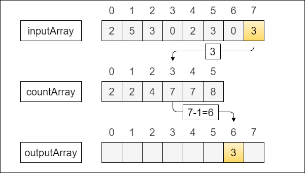
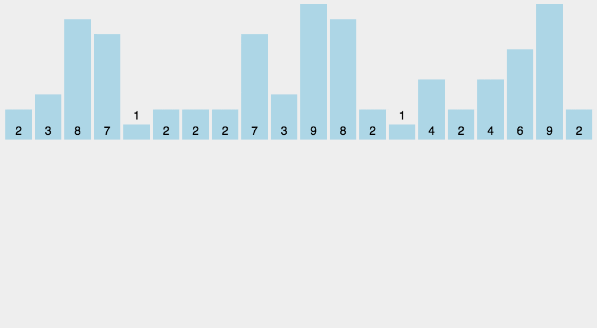

## 【堆排序算法详解】Java/Go/Python/JS/C不同语言实现

## 说明

堆排序（Counting sort）是一种稳定的线性时间排序算法。该算法于1954年由 Harold H. Seward 提出。堆排序使用一个额外的数组，数组的下标对应待排序的数字。然后根据新数组的下标来获得正确的顺序。就像给每个位置按数字顺序做好标记，然后把对应数组放入其中，最后把下标打印出来即可。堆排序适合数量较少的整数排序，对于浮点不太适合。

## 实现过程

1. 找到待排序中最大和最小的元素；
2. 新建一个计数数组，长度为最大与最小值的差值+1；
3. 遍历待排序数组，将数字与计数数组下标对应，按出现次数做标记；做对应时为了减少数组长度，可以用下标减去最小值；
4. 反向取出数据，按出现的次数逐个追加到输出数组中。


## 示意图




## 性能分析

平均时间复杂度：O(n + k)
最佳时间复杂度：O(n + k)
最差时间复杂度：O(n + k)
空间复杂度：O(n + k)

# 代码

## Java

```java
  public int[] countingSort1(int[] arr) {
    int minValue = arr[0];
    int maxValue = arr[0];
    for (int item : arr) {
      if (item > maxValue) {
        maxValue = item;
      }
      if (item < minValue) {
        minValue = item;
      }
    }

    int realLen = maxValue - minValue + 1;
    // 计数数组的长度在最大和最小差值+1
    int[] counter = new int[realLen];
    for (int item : arr) {
      int idx = item - minValue;
      // 下标增加1
      counter[idx] += 1;
    }

    // 后一项记录前一项的值，这样得到排序位置
    for (int i = 1; i < realLen; i++) {
      counter[i] += counter[i - 1];
    }

    // 根据位置将计数数组内容添加到返回数组中
    int[] output = new int[realLen];
    for (int i = 0; i < arr.length; i++) {
      int item = arr[i] - minValue;
      // 根据当前项从计数数组得到新数组下标
      int idx = counter[item] - 1;
      // 给返回的下标赋值为当前项
      output[idx] = item + minValue;
      // 取出一项，计数数组则减少一项
      counter[item] -= 1;
    }
    return output;
  }
```

## Python

```py
# 堆排序1
def counting_sort1(arr):
    # 计算最大值与最小值
    min_value = min(arr)
    max_value = max(arr)
    buckets = []
    real_len = int(max_value - min_value + 1)
    for i in range(real_len):
        buckets.append(0)
    # 计数数组的长度在最大和最小差值+1
    l = len(arr)
    for i in range(l):
        # 把下标减去min值，以便减少计数数组的长度，同时可以支持负数，最小坐标为0
        idx = int(arr[i] - min_value)
        # 根据待排序项给对应下标的位置增加1个标记
        buckets[idx] += 1
        # print('idx, arr[i], buckets[idx]', idx, arr[i], buckets[idx])
    output = []
    # 遍历计数数组
    for i in range(real_len):
        val = buckets[i]
        # 如果相同则取多次
        for j in range(val):
            output.append(i + min_value)
    return output
```

## Go

```go
// 堆排序2
func countingSort2(arr []int) []int {
  var max = arr[0]
  var min = arr[0]
  arrLen := len(arr)
  for i := 1; i < arrLen; i++ {
    if arr[i] > max {
      max = arr[i]
    }
    if arr[i] < min {
      min = arr[i]
    }
  }
  var output = make([]int, arrLen)
  var countList = make([]int, max-min+1)

  // 按每个数组项出现次数计数，从最小项的下标为0
  for _, item := range arr {
    // 当前前减去最小项得到下标，最后取出数据要还原
    var idx = item - min
    countList[idx]++
  }

  // 把上一项的值个数存入到当前项，相当于排序
  for i := 1; i < len(countList); i++ {
    countList[i] += countList[i-1]
  }

  // 按位置还原数据，下一个索引记录了上一个的坐标值
  for i := 0; i < arrLen; i++ {
    // 当前项来自原始数组减去-min
    item := arr[i] - min
    // 根据当前项从计数数组里找到目标位置
    idx := countList[item] - 1
    // 输出数据加上min进行还原
    output[idx] = item + min
    // 取出一项计数则减少一个
    countList[item] -= 1
  }

  return output
}
```

## JS

```js
// 堆排序标准版
function countingSort1(arr) {
  // 计算最大值与最小值
  const arrLen = arr.length
  const min = Math.min.apply(null, arr)
  const max = Math.max.apply(null, arr)
  // 计数数组的长度在最大和最小差值+1
  const countListLen = max - min + 1
  const countList = Array(countListLen).fill(0)
  for (let i = 0, l = arrLen; i < l; i++) {
    // 把下标减去min值，可以支持负数
    // 最小的数的坐标为0，以此累加
    const idx = arr[i] - min
    // 根据待排序项给对应下标的位置增加1个标记
    countList[idx] += 1
  }

  // 将上一项的值添加到下一项中
  for (let i = 1; i < countListLen; i++) {
    countList[i] += countList[i - 1]
  }

  // 按位置还原数据，下一个索引记录了上一个的坐标值
  const output = []
  for (let i = 0; i < arrLen; i++) {
    // 当前项来自原始数组减去-min
    const item = arr[i] - min
    // 根据当前项从计数数组里找到目标位置
    const idx = countList[item] - 1
    // 输出数据加上min进行还原
    output[idx] = item + min
    // 取出一项计数则减少一个
    countList[item] -= 1
  }

  return output
}
```

## TS

```ts
 // 堆排序
  countingSort1(arr: Array<number>) {
    const countList: number[] = []
    // 计算最大值与最小值
    const min = Math.min.apply(null, arr)
    const max = Math.max.apply(null, arr)
    // 计数数组的长度在最大和最小差值+1
    countList.length = max - min + 1
    for (var i = 0, l = arr.length; i < l; i++) {
      // 把下标减去min值，以便减少计数数组的长度，同时可以支持负数，最小坐标为0
      const idx = arr[i] - min
      // 根据待排序项给对应下标的位置增加1个标记
      if (!countList[idx]) {
        countList[idx] = 1
      } else {
        // 多个相同的数字则需要多个标记
        countList[idx] += 1
      }
    }

    const output: number[] = []
    // 遍历计数数组
    countList.forEach((val, i) => {
      // 下标若大于0，则取出来，如果相同则取多次
      for (var j = 0; j < val; j++) {
        if (val && val > 0) {
          // 取出的值要+min还原
          output.push(i + min)
        }
      }
    })
    return output
  }
```

## C

```c
// 堆排序标准版，注意与桶排序区别
int *countingSort2(int arr[], int len)
{
  int max = arr[0];
  int min = arr[0];
  for (int i = 1; i < len; i++)
  {
    if (arr[i] > max)
      max = arr[i];
    if (arr[i] < min)
      min = arr[i];
  }

  int real_len = max - min + 1;
  int count_list[real_len];
  for (int i = 0; i < real_len; i++)
    count_list[i] = 0;

  for (int i = 0; i < len; i++)
    count_list[arr[i] - min]++;

  // 输出方式2. 把上一项的值个数存入到当前项，还原位置取出
  for (int i = 1; i < real_len; i++)
  {
    count_list[i] += count_list[i - 1];
  }
  int *output = malloc(len * sizeof(int));
  // 按位置还原数据，下一个索引记录了上一个的坐标值
  for (int i = 0; i < len; i++)
  {
    // 当前项来自原始数组减去-min
    int item = arr[i] - min;
    // 根据当前项从计数数组里找到目标位置
    int idx = count_list[item] - 1;
    // 输出数据加上min进行还原
    output[idx] = item + min;
    // 取出一项计数则减少一个
    count_list[item] -= 1;
  }

  return output;
}
```
# 链接

堆排序算法源码：[https://github.com/microwind/algorithms/tree/master/sorts/bubblesort](https://github.com/microwind/algorithms/tree/master/sorts/bubblesort)

其他排序算法源码：[https://github.com/microwind/algorithms](https://github.com/microwind/algorithms)
