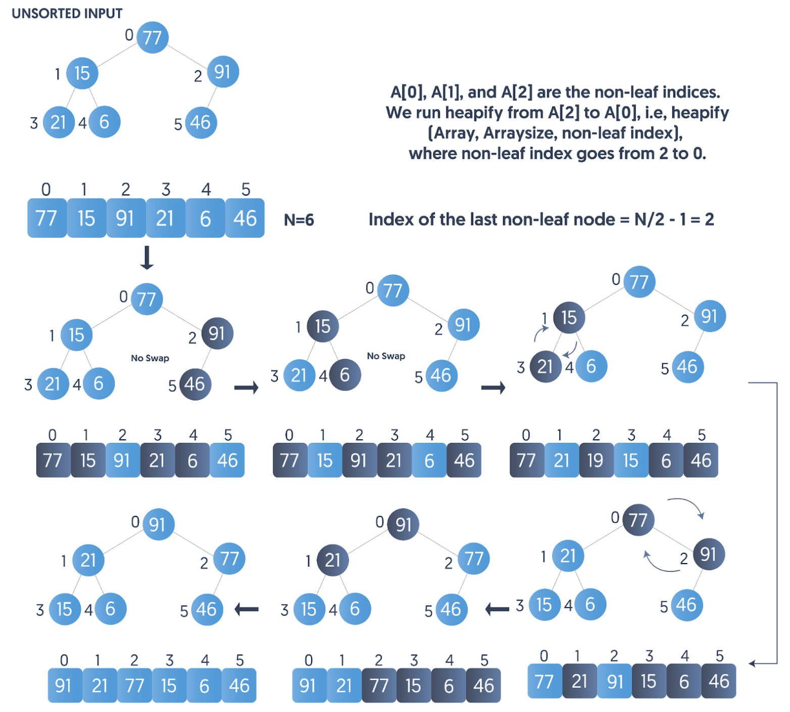

## 【堆排序算法详解】Java/Go/Python/JS/C不同语言实现

## 说明

堆排序（Heap Sort）算法，是将数据看成近似完全二叉树结构，并根据完全二叉树的特性来进行排序的一种算法。完全二叉树要求每个节点的值都大于等于其左右子节点的值，称为大顶堆；或者每个节点的值都小于或等于其左右子节点的值，称为小顶堆。先将父节点的最大数取出，并构建最大堆，再将堆继续调整为最大堆，再次将堆顶的最大数取出，这个过程持续到剩余数只有一个时结束。

堆排序本质也是一种选择排序，利用树形结构选择排序。只不过在直接选择排序中，为了从A[1…n]中选择最大记录，需比较n-1次，然后从A[1…n-2]中选择最大记录需比较n-2次。事实上这n-2次比较中有很多已经在前面的n-1次比较中已经做过，而树形选择排序恰好利用树形的特点保存了部分的比较结果，因此能减少比较次数。对于n个关键字序列，最坏情况下每个节点需比较log2(n)次，因此其最坏情况下时间复杂度为nlogn。堆排序为不稳定排序，不适合记录较少的排序。

## 实现过程

1. 首先数据按照二叉数来看待，将其下标与二叉树节点对应起来；
2. 构建最大堆（Build-Max-Heap），将堆所有数据重新排序，使其成为最大堆，并且冒出最大数；
3. 堆排序(Heap-Sort)，从最后一个子节点开始遍历，并将根节点与其交换，也就是移除第一个数据的根节点，并做最大堆调整的递归调用，直到排序完成。

## 示意图

<!-- s -->



## 性能分析

平均时间复杂度：O(nlogn)
最佳时间复杂度：O(nlogn)
最差时间复杂度：O(nlogn)
稳定性：不稳定

# 代码

## Java

```java
public class HeapSort {
  
  private static int getLeft(int i) {
    return i * 2 + 1;
  }

  private static int getRight(int i) {
    return i * 2 + 2;
  }

  static void swap(int arr[], int from, int to) {
    int temp = arr[from];
    arr[from] = arr[to];
    arr[to] = temp;
  }

  private static void maxHeapify(int arr[], int idx, int size) {
    int max = idx;
    int left = getLeft(idx);
    int right = getRight(idx);
    if (left < size && arr[left] > arr[max]) {
      max = left;
    }
    if (right < size && arr[right] > arr[max]) {
      max = right;
    }
    System.out.println("idx=" + idx + " left=" + left + " right=" + right + " max=" + max + " size=" + size);
    if (max != idx) {
      swap(arr, idx, max);
      maxHeapify(arr, max, size);
    }
  }

  static void heapSort(int arr[]) {
    int len = arr.length;
    int parent = (len - 1) / 2 - 1;
    int child = len - 1;

    while (parent >= 0) {
      maxHeapify(arr, parent, len);
      System.out.println("parent sort:" + parent + " " + len + " ");
      parent--;
    }

    System.out.println("child start: parent=" + parent + " child=" + child);

    while (child > 0) {
      swap(arr, 0, child);
      maxHeapify(arr, 0, child);
      System.out.println("child sort:" + 0 + " " + child + " ");
      child--;
    }
  }
}
```

## Python

```py
class HeapSort:

  def __init__(self, arr):
    self.arr = arr

  def get_parent(self, i):
    return int((i - 1) / 2)

  def get_left(self, i):
    return 2 * i + 1

  def get_right(self, i):
    return 2 * i + 2

  # 始终保持大顶堆特性
  def max_heapify(self, idx, size):
    arr = self.arr
    max = idx
    left = self.get_left(idx)
    right = self.get_right(idx)
    if (left < size and arr[left] > arr[max]):
      max = left
    
    if (right < size and arr[right] > arr[max]):
      max = right
    
    print('idx=', idx, 'left=', left, 'right=', right, 'max=', max, 'size=', size)

    if (max != idx):
      [arr[idx], arr[max]] = [arr[max], arr[idx]]
      self.max_heapify(max, size)
  
  def build_max_heap(self):
    arr = self.arr
    length = len(arr)
    last_parent = self.get_parent(length) - 1
    for parent in range(last_parent, -1, -1):
      self.max_heapify(parent, length)
      print('parent sort:', parent, arr)

  def sort_tree(self):
    arr = self.arr
    length = len(arr)
    child = length - 1
    while (child > 0):
      [arr[0], arr[child]] = [arr[child], arr[0]]
      self.max_heapify(0, child)
      print('child sort:', child, arr)
      child -= 1

  def start(self):
    self.build_max_heap()
    print('child start:')
    self.sort_tree()
    return arr
```

## Go

```go
/* 根据完全二叉树结构性质，父子节点与数组下标的关系，通过数组下标i得到节点位置 */

// Tree 定义堆排序过程中使用的堆结构
type Tree struct {
  arr  []int // 用来存储堆的数据
  size int   // 用来标识堆的大小
}

// 保持最大顶堆特性非递归版
func maxHeapify(tree *Tree, idx int) {
  arr := tree.arr
  var current = arr[idx]
  var child = 2*idx + 1
  // 从当前位置的左节点开始遍历
  for child < tree.size {
    fmt.Println("current=", current, " idx=", idx, " child=", child, " size=", tree.size)
    // 如果左节点小于右节点且小于总长度，则指向右节点
    if child+1 < tree.size && arr[child] < arr[child+1] {
      child++
    }
    if arr[child] > current {
      // 如果子节点大于父节点，将子节点的值赋给父节点
      arr[idx] = arr[child]
      // 当前节点指向该子节点，继续循环
      idx = child
    } else {
      // 子节点小于父节点则跳出循环
      break
    }
    // 遍历子树父节点
    child = 2*idx + 1
  }
  // 当前节点赋值为父节点的值
  arr[idx] = current
}

// 利用堆结构对数组进行排序
func heapSort(arr []int) []int {
  tree := &Tree{}
  tree.arr = arr
  tree.size = len(arr)

  // 构建大顶堆，把最大节点冒出到堆顶，从任意1个父节点开始均可
  var current = (tree.size - 1) / 2
  for ; current >= 0; current-- {
    maxHeapify(tree, current)
  }

  // 从最底层子节点开始排序，置换顶根节点与子节点，并继续构建大顶堆
  for tree.size > 0 {
    // 将最大的数值调整到堆的末尾
    tree.arr[0], tree.arr[tree.size-1] = tree.arr[tree.size-1], tree.arr[0]
    // 减少堆的长度
    tree.size--
    // 由于堆顶元素改变了，而且堆的大小改变了，需要重新调整堆，维持堆的性质
    maxHeapify(tree, 0)
  }
  return tree.arr
}
```

## JS

```js
  // 根据完全二叉树结构性质，父子节点与数组下标的关系，通过数组下标i得到节点位置
  const getParent = (i) => Math.floor((i - 1) / 2)
  const getLeft = (i) => 2 * i + 1
  const getRight = (i) => 2 * i + 2

  /**
   * @param {Array<number>} arr
   * @param {number} idx - the index of element
   * @param {number} size - the array's length
   * 始终保持大顶堆特性, 构建大顶堆的递归写法
   */
  function maxHeapify(arr, idx, size) {
    let max = idx
    const left = getLeft(idx)
    const right = getRight(idx)
    if (left < size && arr[left] > arr[max]) {
      max = left
    }
    if (right < size && arr[right] > arr[max]) {
      max = right
    }
    console.log('idx=', idx, 'left=', left, 'right=', right, 'max=', max, 'size=', size)
    if (max !== idx) {
      // 保持最大堆，如果当前父节点小于子节点，则进行交换
      ;
      [arr[idx], arr[max]] = [arr[max], arr[idx]]
      // 继续递归执行，直到符合最大堆特性
      maxHeapify(arr, max, size)
    }
  }

  // 构建最大堆的非递归写法，此处可以覆盖上面递归maxHeapify函数
  function maxHeapify(arr, idx, size) {
    const current = arr[idx]
    let child = getLeft(idx)
    // 从当前位置的左节点开始遍历
    for (; child < size;) {
      console.log('current=', current, ' idx=', idx, ' child=', child, ' size=', size)
      // 如果左节点小于右节点且小于总长度，则指向右节点
      if (child + 1 < size && arr[child] < arr[child + 1]) {
        child++
      }
      if (arr[child] > current) {
        // 如果子节点大于父节点，将子节点的值赋给父节点
        arr[idx] = arr[child]
        // 当前节点指向该子节点，继续循环
        idx = child
      } else {
        // 子节点小于父节点则跳出循环
        break
      }
      // 遍历子树父节点
      child = getLeft(idx)
    }
    // 赋值为父节点的值
    arr[idx] = current
  }

  function heapSort(arr) {
    const len = arr.length
    // 最底层的父节点
    let parent = getParent(len) - 1
    // 最底层的子节点
    let child = len - 1
    // 从最后的父节点开始遍历，构建大顶堆，并把最大数冒出到堆顶
    while (parent >= 0) {
      maxHeapify(arr, parent, len)
      console.warn('parent sort:', parent, arr)
      parent--
    }
    console.warn('child start:', 'parent=' + parent, ' child=' + child)
    // 自下向上逐个将子节点数与最顶端的数进行交换，并保持最大堆特性
    while (child > 0) {
      // 将顶端的父节点与当前子节点互换
      ;
      [arr[0], arr[child]] = [arr[child], arr[0]]
      // 自最底层往上遍历构建大顶堆，已经排好序的不再交换
      maxHeapify(arr, 0, child)
      console.warn('child sort:', child, arr)
      child--
    }

    return arr
  }
```

## TS

```ts
class HeapSort {
  arr: number[]
  constructor(arr: Array<number>) {
    this.arr = arr
    this.heapSort()
  }
  getParent(i: number) {
    return Math.floor((i - 1) / 2)
  }
    
  getLeft(i: number) {
    return 2 * i + 1
  }

  getRight(i: number) {
    return 2 * i + 2
  }
  maxHeapify(idx: number, size: number) {
    let max = idx
    const arr = this.arr
    const left = this.getLeft(idx)
    const right = this.getRight(idx)
    if (left < size && arr[left] > arr[max]) {
      max = left
    }
    if (right < size &&  arr[right] > arr[max]) {
      max = right
    }
    console.log('idx=', idx, 'left=', left, 'right=', right, 'max=', max, 'size:', size)
    if (max !== idx) {
      [arr[idx], arr[max]] = [arr[max], arr[idx]]
      this.maxHeapify(max, size)
    }
  }

  heapSort() {
    const arr = this.arr
    const len = arr.length
    // 最底层的父节点
    let parent = this.getParent(len) - 1
    // 最底层的子节点
    let child = len - 1
    // 从最后的父节点开始遍历，把最大的那个父节点冒出到堆顶
    while (parent >= 0) {
      this.maxHeapify(parent, len)
      console.warn('parent sort:', parent, arr)
      parent--
    }
    console.warn('child start:', 'parent=' + parent, ' child=' + child)
    // 从子节点往上开始交换和保持大顶堆
    while (child > 0) {
      // 将顶端的父节点与当前子节点互换
      [arr[0], arr[child]] = [arr[child], arr[0]]
      // 自最底层往上遍历排序
      this.maxHeapify(0, child)
      console.warn('child sort:', child, arr);
      child--
    }
    return arr
  }

}
```

## C

```c
int get_left(int i)
{
  return i * 2 + 1;
}

int get_right(int i)
{
  return i * 2 + 2;
}

void swap(int arr[], int from, int to)
{
  int temp = arr[from];
  arr[from] = arr[to];
  arr[to] = temp;
}
/**
 * 始终保持大顶堆特性
 */
void max_heapify(int arr[], int idx, int size)
{
  int max = idx;
  int left = get_left(max);
  int right = get_right(max);
  if (left < size && arr[left] > arr[max])
  {
    max = left;
  }
  if (right < size && arr[right] > arr[max])
  {
    max = right;
  }

  printf("\r\nidx=%d, left=%d, right=%d, max=%d, size=%d", idx, left, right, max, size);

  if (max != idx)
  {
    // swap the current width max value
    swap(arr, idx, max);
    // make max tree recursive
    max_heapify(arr, max, size);
  }
}

void heap_sort(int arr[], int len)
{
  int parent = (len - 1) / 2 - 1;
  int child = len - 1;
  while (parent >= 0)
  {
    max_heapify(arr, parent, len);
    printf("\r\nparent=%d, len=%d", parent, len);
    parent--;
  }

  printf("child start: parent=%d child=%d", parent, child);

  while (child > 0)
  {
    swap(arr, 0, child);
    max_heapify(arr, 0, child);
    printf("\r\nchild=%d, parent=%d", 0, child);
    child--;
  }
}
```
# 链接

堆排序算法源码：[https://github.com/microwind/algorithms/tree/master/sorts/heapsort](https://github.com/microwind/algorithms/tree/master/sorts/heapsort)

其他排序算法源码：[https://github.com/microwind/algorithms](https://github.com/microwind/algorithms)
