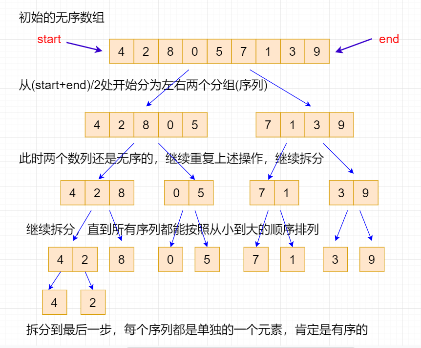
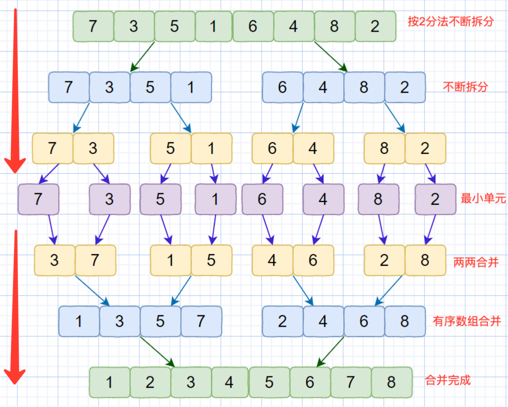

## 【归并排序算法详解】Java/Go/Python/JS/C不同语言实现

## 说明

归并排序（Merge Sort）算法，也叫合并排序，是创建在归并操作上的一种有效的排序算法。算法是采用分治法（Divide and Conquer）的一个非常典型的应用，且各层分治递归可以同时进行。归并排序思路简单，速度仅次于快速排序，为稳定排序算法，一般用于对总体无序，但是各子项相对有序的数列。

归并排序和选择排序一样，归并排序的性能不受输入数据的影响，但表现比选择排序好的多，因为始终都是O(n log n）的时间复杂度。代价是需要额外的内存空间。

归并排序是用分治思想，分治模式在每一层递归上有三个步骤：

分解（Divide）：将n个元素分成个含n/2个元素的子序列。
解决（Conquer）：用合并排序法对两个子序列递归的排序。
合并（Combine）：合并两个已排序的子序列已得到排序结果。

## 实现过程

1. 将所有数组项无限细分，得到1个个独立的单元，也就是不断分解。
2. 将相近的两两进行比较，按照已排序数组合并，形成（n/2）个序列，每个序列包含2个数字。
2. 将上述两个序列递归合并，按照已排序数组合并，形成（n/4）个序列，每个序列包含4个数字。
3. 重复步骤2，直到所有元素合并排序完毕。

## 示意图





## 性能分析

平均时间复杂度：O(nlogn)
最佳时间复杂度：O(n)
最差时间复杂度：O(nlogn)
空间复杂度：O(n)
排序方式：In-place
稳定性：稳定

# 代码

## Java

```java
class MergeSort {

  static void merge(int arr[], int left, int mid, int right) {
    // 先建立一个长度等于原数组的临时数组
    int[] temp = new int[right - left + 1];
    // 左侧指针
    int i = left;
    // 右侧指针
    int j = mid + 1;
    // 临时数组指针
    int k = 0;
    // 当左指针小于中间，且右指针不大于最右侧时
    while (i <= mid && j <= right) {
      // 如果左侧小于右侧，将数移到临时数组中左侧
      if (arr[i] <= arr[j]) {
        temp[k++] = arr[i++];
      // 否则移动到临时数组右侧
      } else {
        temp[k++] = arr[j++];
      }
    }

    // 如果左边数组还有数据，就把左侧剩余都放入到新数组后面
    while (i <= mid) {
      temp[k++] = arr[i++];
    }
    // 如果右侧数组还有数据，把剩下的数据放入到新数组后面
    while (j <= right) {
      temp[k++] = arr[j++];
    }

    // 将排序后的元素全部移动到原数组中
    int x = 0;
    while (left <= right) {
      arr[left++] = temp[x++];
    }
    System.out.println("arr:" + Arrays.toString(arr));
  }

  static int[] mergeSort(int[] arr, int left, int right) {
    // 得到中间值
    int mid = (left + right) / 2;
    // 如果左侧小于右侧则执行合并排序
    System.out.println("mergeSort left=" + left + " right=" + right);
    if (left < right) {
      System.out.println("mergeSort left<right left=" + left + " right=" + right);
      // 递归合并左侧
      mergeSort(arr, left, mid);
      // 递归合并右侧
      mergeSort(arr, mid + 1, right);
      // 合并排序
      merge(arr, left, mid, right);
    }
    return arr;
  }
```

## Python

```py
def merge_sort1(values):
    result = values
    if len(values) > 1:
        mid = len(values) // 2
        left = values[:mid]
        right = values[mid:]
        left = merge_sort1(left)
        right = merge_sort1(right)

        result = []
        while len(left) > 0 and len(right) > 0:
            # print('values:', result)
            if left[0] < right[0]:
                result.append(left[0])
                left.pop(0)
            else:
                result.append(right[0])
                right.pop(0)

        for i in left:
            result.append(i)
        for i in right:
            result.append(i)

    return result
```

## Go

```go
/**
 * @desc 新建数组，两两比较移动指针实现已排序数组合并
 */
func merge(one []int, two []int) []int {
	var oneLen = len(one)
	var twoLen = len(two)
	// 新建一个空数组，用来保存排序后的结果
	var result = make([]int, oneLen+twoLen)
	// i是第一个数组下标
	i := 0
	// j是第二个数组下标
	j := 0
	// k是新数组下标
	k := 0
	// 遍历两个数组，直到其中一个被遍历完成为止
	for i < oneLen && j < twoLen {
		// 比较两个数组的最小项，将小的项添加到空数组中
		// 小项指针后移一位，继续比较最小项，直到一个数组完成
		if one[i] < two[j] {
			result[k] = one[i]
			k++
			i++
		} else {
			result[k] = two[j]
			k++
			j++
		}
	}

	// 复制剩余的第2个数组项
	for i < oneLen {
		result[k] = one[i]
		k++
		i++
	}

	// 复制剩余的第2个数组项
	for j < twoLen {
		result[k] = two[j]
		k++
		j++
	}
	return result
}

func merge_sort(arr []int) []int {
	// 如果数组长度只有1位则终止递归
	if len(arr) <= 1 {
		return arr
	}
	// 得到数组中间值，一分为二
	mid := (len(arr)) / 2
	// 递归合并左侧部分
	left := merge_sort(arr[:mid])
	// 递归合并右侧部分
	right := merge_sort(arr[mid:])
	// 两两合并已排序数组
	return merge(left, right)
}
```

## JS

```js
// JS第二种写法，利用JS语言特点实现，更多版本 请查看源码
(function () {
  function mergeSort (arr) {
    const len = arr.length
    if (len < 2) {
      return arr
    }
    // 取得当前数组的中间位置
    const mid = Math.floor(len / 2)
    const left = arr.slice(0, mid)
    const right = arr.slice(mid)
    console.log('mergeSort arr:', arr, left, right)
    // 递归调用，不断重复直到当前数组拆分剩1项
    return merge(mergeSort(left), mergeSort(right))
  }

  // 将两个有序数组进行合并为一个新的有序数组
  function merge (left, right) {
    // 建立一个空数组，用来存放排序结果
    const result = []
    // 左右数组的长度都不为空时，则将两个数组的第一个进行比较
    // 如左侧小于右，则移除左侧的内容到结果数据，反之移动右侧成员
    while (left.length && right.length) {
      if (left[0] <= right[0]) {
        result.push(left.shift())
      } else {
        result.push(right.shift())
      }
    }
    // 最后把剩余的左或者右侧成员全部添加到结果数组
    while (left.length) {
      result.push(left.shift())
    }

    while (right.length) {
      result.push(right.shift())
    }
    // 这样一趟下来后，两个数组就合并为一个新的排序数组
    return result
  }
})()
```

## TS

```ts
class MergeSort {
  merge(arr: Array<number>, left: number, mid: number, right: number) {
    // 先建立一个长度等于原数组的临时数组
    const temp = Array<number>()
    // 左侧指针
    let i = left
    // 右侧指针
    let j = mid + 1
    // 临时数组指针
    let k = 0
    // 当左指针小于中间，且右指针不大于最右侧时
    while (i <= mid && j <= right) {
      // 如果左侧小于右侧，将数移到临时数组中左侧
      if (arr[i] <= arr[j]) {
        temp[k++] = arr[i++]
        // 否则移动到临时数组右侧
      } else {
        temp[k++] = arr[j++]
      }
    }

    // 如果左边数组还有数据，就把左侧剩余都放入到原数组后面
    while (i <= mid) {
      temp[k++] = arr[i++]
    }
    // 如果右侧数组还有数据，把剩下的数据放入到原数组后面
    while (j <= right) {
      temp[k++] = arr[j++]
    }

    // 将排序后的元素全部移动到原数组中
    let x = 0
    while (left <= right) {
      arr[left++] = temp[x++]
    }
    console.log('arr:', arr)
  }

  mergeSort(arr: Array<number>, left: number, right: number) {
    // 得到中间值
    const mid = Math.floor((left + right) / 2)
    // 如果左侧小于右侧则执行合并排序
    if (left < right) {
      // 递归合并左侧
      this.mergeSort(arr, left, mid)
      // 递归合并右侧
      this.mergeSort(arr, mid + 1, right)
      // 合并排序
      this.merge(arr, left, mid, right)
    }
    return arr
  }
}
```

## C

```c

void merge(int arr[], int left, int mid, int right);
void merge_sort(int arr[], int left, int right);

// 合并两个子数组，根据中间值分为2个数组
void merge(int arr[], int left, int mid, int right)
{
    // 初始化左右子数组长度
    int left_len = mid - left + 1;
    int right_len = right - mid;

    // 初始化两个子数组
    int left_arr[left_len], right_arr[right_len];

    /* 复制数据到子数组，根据中间数来复制 */
    for (int i = 0; i < left_len; i++)
    {
        left_arr[i] = arr[left + i];
    }
    for (int j = 0; j < right_len; j++)
    {
        right_arr[j] = arr[mid + 1 + j];
    }

    int i = 0;
    int j = 0;
    // 合并到数组，从左侧位置开始合并
    int idx = left;
    while (i < left_len && j < right_len)
    {
        if (left_arr[i] <= right_arr[j])
        {
            // 左侧小于右侧，则复制左侧成员
            arr[idx] = left_arr[i];
            i++;
        }
        else
        {
            // 否则复制右侧成员到原数组
            arr[idx] = right_arr[j];
            j++;
        }
        idx++;
    }

    /* 复制左侧剩余成员 */
    while (i < left_len)
    {
        arr[idx] = left_arr[i];
        i++;
        idx++;
    }

    /* 复制右侧剩余成员 */
    while (j < right_len)
    {
        arr[idx] = right_arr[j];
        j++;
        idx++;
    }
}

// 递归调用左右侧进行数组合并
void merge_sort(int arr[], int left, int right)
{
    if (left < right)
    {
        // 中间值为左+右/2取整
        int mid = left + (right - left) / 2;

        // 递归合并左侧
        merge_sort(arr, left, mid);
        // 递归合并右侧
        merge_sort(arr, mid + 1, right);
        // 合并排序
        merge(arr, left, mid, right);
    }
}
```
# 链接

归并排序算法源码：[https://github.com/microwind/algorithms/tree/master/sorts/mergesort](https://github.com/microwind/algorithms/tree/master/sorts/mergesort)

其他排序算法源码：[https://github.com/microwind/algorithms](https://github.com/microwind/algorithms)
