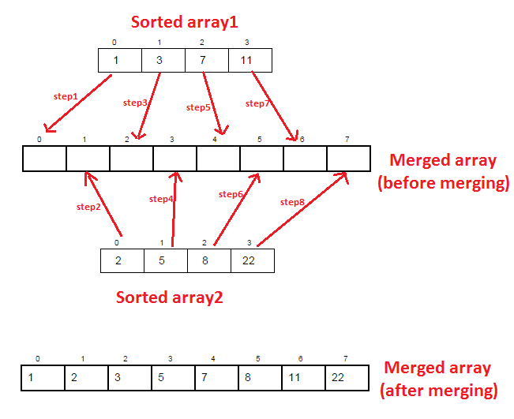
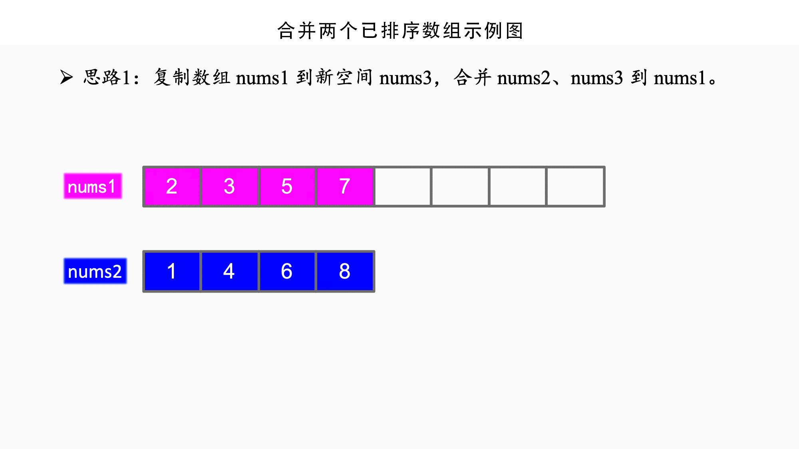

## 【合并两个已排序数组算法详解】Java/Go/Python/JS不同语言实现

## 说明

合并两个已排序的数组，这再算法中经常遇到。

策略：
策略一：双指针法，建立1个新数组，长度为两个数组的长度之和。从两个数组的第1项开始比较，将数值小的一项添加到新数组中，并将数值小的指针右移1位，继续两两比较，哪个小就添加到新数组中，并且右移小项的指针，直到遍历完其中一个数组，也就是把1个数组项全部添加到新数组时终止。最后再将剩余那个数组项追击到新数组即可。
策略二：将数组1和数组2先合在一起，然后当成一个新数组排序，这样的排序采用普通排序算法即可。因为两个都是已排序了的数组，在遍历时，可以从后面的数组开始，前面已排序数组无需再排。
策略三：将一个数组的长度扩展成两个数组之和，按照任意一种排序，将这个数组当成是已排序部分，遍历另外1个数组，将另外1个数组项逐个插入到这个数组中的位置中去。

## 实现过程

1. 新建1个空数组，长度为两个数组之和
2. 同时遍历数组1和数组2，比较数组1和数组2里的第一项，哪个小就追加到新数组中，小项的指针后移1位
3. 继续遍历，直到数组1或数组2完成遍历
4. 将另外1个数组剩余的内容追加到新数组

## 示意图




## 性能分析

平均时间复杂度：O(nlogn)
最佳时间复杂度：O(n)
最差时间复杂度：O(nlogn)
空间复杂度：O(n)
排序方式：In-place
稳定性：稳定

# 代码

## Java

```java
public class MergeSortedArray {

  /**
   * @desc 移动指针，两两比较移动指针实现已排序数组合并
   */
  static int[] mergeSorted1(int[] one, int[] two) {
    // 新数组长度是两个数组长度之和
    int[] result = new int[one.length + two.length];
    // 数组1下标
    int i = 0;
    // 数组2下标
    int j = 0;
    // 新数组下标
    int k = 0;
    // 两个数组同时遍历，直到一个遍历完成
    while (i < one.length && j < two.length) {
      // 两两比较，把小的项追加到新数组中，同时移动小的那个数组指针
      if (one[i] < two[j]) {
        result[k++] = one[i++];
      } else {
        result[k++] = two[j++];
      }
    }

    // 复制数组1剩余的项目
    while (i < one.length) {
      result[k++] = one[i++];
    }
    // 复制数组2剩余的项目
    while (j < two.length) {
      result[k++] = two[j++];
    }
    return result;
  }

  /**
   * @desc 逐个取出1项插入到另外1个已排序数组中去，相当于选择最小项插入到已排序数组中
   *       从第1个数组里依次取出项插入到第2个数组合适位置中，这里采用List以便动态调整
   */
  static List<Integer> mergeSorted2(List<Integer> one, List<Integer> two) {
    int twoLen = two.size();
    for (int i = 0; i < one.size(); i++) {
      int j = 0;
      // 从第1个列表依次取出比较项，与第2个列表项自前往后逐个比较
      while (j < twoLen) {
        // 如果比较项小于第2个数组的某项，则插入到该项前面
        if (one.get(i) < two.get(j)) {
          // 第2个数组扩容1位，将最后1位复制添加到最后，并增加第2个数组长度
          two.add(two.get(twoLen - 1));
          twoLen++;
          int itemIndex = twoLen - 1 - 1;

          // 并将第2个数组自j位整体后移1位
          while (itemIndex > j) {
            two.set(itemIndex, two.get(itemIndex - 1));
            itemIndex--;
          }

          // 将比较项插入到第2个列表的j位置中
          two.set(j, one.get(i));
          break;
        } else {
          // 如果全部比较完成，数组2里面没有比它还大的，则添加到最后
          // 也可以一次性添加数组1里面全部剩余项，终止外部的循环
          if (j == twoLen - 1) {
            two.add(one.get(i));
            twoLen++;
            break;
          }
        }
        j++;
      }
    }
    // 第2个列表是合并了第1个数组的结果
    return two;
  }

  /**
   * @desc 先将两个数组合并，然后采用普通排序方式排序
   */
  static int[] mergeSorted3(int[] one, int[] two) {
    int oneLen = one.length;
    int twoLen = two.length;
    int[] output = new int[oneLen + twoLen];
    // 合并数组
    for (int i = 0; i < output.length; i++) {
      if (i < oneLen) {
        output[i] = one[i];
      } else {
        output[i] = two[i - oneLen];
      }
    }
    // 采用任意一种排序算法，这里采用插入算法
    // 前面已排序的无需再排，i从第2个数组开始
    for (int i = oneLen; i < output.length; i++) {
      int j = i;
      int current = output[j];
      // 用未排序的项逐个与左侧已排序项进行对比
      while (j-- > 0 && current < output[j]) {
        // 如果比较项小于已排序的项，需要将已排序项整体右移
        output[j + 1] = output[j];
      }
      // 将比较项插入到空出的位置
      output[j + 1] = current;
    }

    return output;
  }
```

## Python

```py
"""
   * 双指针合并两个已排序数组。
   * 新建数组复制法，比较数组1和数组2的当前项，将小的添加到新数组中
   * @param:list one
   * @param:list two
"""


def merge_sorted1(one, two):
    # 数组1下标
    i = 0
    # 数组2下标
    j = 0
    # 结果数组下标
    k = 0

    one_len = len(one)
    two_len = len(two)
    result = [None] * (one_len + two_len)

    # 循环遍历两个数组，直到有1个数组里面的全部被比较过
    while i < one_len and j < two_len:
        # 逐个比较数组1和数组2的项，将小的项添加到新数组中，右移小项的指针再继续比较
        if one[i] < two[j]:
            result[k] = one[i]
            i += 1
        else:
            result[k] = two[j]
            j += 1
        k += 1

    # 如果数组1还有剩余的没有添加完，就全部追加到新数组最后
    while i < one_len:
        result[k] = one[i]
        k += 1
        i += 1

    # 如果数组2还有剩余的没有添加完，就全部追加到新数组最后
    while (j < two_len):
        result[k] = two[j]
        k += 1
        j += 1

    return result


"""
  * 合并两个已排序数组。
  * 插入法，从第一个数组里取出一项，自前往后逐个与第二个数组项进行比较，插入到第二个数组中
  * @param:list one
  * @param:lisit two
"""


def merge_sorted2(one, two):
    one_len = len(one)
    two_len = len(two)
    j = 0
    for i in range(one_len):
        for j in range(two_len):
            # 从数组1里拿出一项来与数组2逐个(自前往后)进行比较
            # 当遇到比它大的项时，则把它插入到数组2里该项的前面
            # 同时数组2下标与长度增加一位，跳出当前循环，进入下一轮比较
            if (one[i] < two[j]):
                two.insert(j, one[i])
                two_len += 1
                break
            else:
                # 如果全部比较完成，且数组2里面没有比它还大的，则添加到最后
                # 也可以一次性添加数组1里面全部剩余项，后面的就无需再比较了
                if j == two_len - 1:
                    two.append(one[i])
                    two_len += 1
                    break

    return two


"""
  * 合并两个已排序数组。
  * 合并数组再采取普通排序法
  * @param:list one
  * @param:list two
"""


def merge_sorted3(one, two):
    one_len = len(one)
    two_len = len(two)

    result = one + two
    # 从第2个数组开始遍历，采用插入排序
    for i in range(one_len, one_len + two_len):
        j = i - 1
        current = result[i]
        # 如果当前项小于已排序的项，则逐个右移1位
        while (j >= 0 and current < result[j]):
            result[j + 1] = result[j]
            j -= 1

        # 空出位置插入比较项
        result[j + 1] = current

    return result
```

## Go

```go
/**
 * @desc 双指针法，新建数组，两两比较移动指针实现已排序数组合并
 */
func mergeSorted1(one []int, two []int) []int {
	var oneLen = len(one)
	var twoLen = len(two)
	var result = make([]int, oneLen+twoLen)
	i := 0
	j := 0
	k := 0
	// 循环遍历两个数组，直到有1个数组项全部被比较过为止
	for i < oneLen && j < twoLen {
		// 从两个数组里逐个取出最小项来进行比较
		// 哪个更小就取出哪个添加到结果数组中去
		// 被取出最小项的数组下标右移1位，结果数组下标也同样移动1位
		// 继续进行两个数组的最小项比较，直到其中一个数组遍历完成
		if one[i] < two[j] {
			result[k] = one[i]
			k++
			i++
		} else {
			result[k] = two[j]
			k++
			j++
		}
	}

	// 如果第1个数组项有剩余，则依次复制剩余的第1个数组项
	for i < oneLen {
		result[k] = one[i]
		k++
		i++
	}

	// 如果第2个数组项有剩余，则依次复制剩余的第2个数组项
	for j < twoLen {
		result[k] = two[j]
		k++
		j++
	}

	return result
}

/**
 * @desc 逐个取出1项插入到另外1个已排序数组中去，相当于选择最小项插入到已排序数组中
 */
func mergeSorted2(one []int, two []int) []int {
	var oneLen = len(one)
	var twoLen = len(two)
	for i := 0; i < oneLen; i++ {
		for k, v := range two {
			// 如果比较项小于数组2的成员项，则插入到数组2中
			if one[i] < v {
				// 追加最后一位到数组2
				two = append(two, two[twoLen-1])
				twoLen++
				// 将数组2中k的位置整体右移1位
				copy(two[k+1:twoLen-1], two[k:twoLen-2])
				// 将比较项插入到空出的位置
				two[k] = one[i]
				break
			} else {
				// 如果全部比较完成，且数组2里面没有比它还大的，则添加到最后
				if k == twoLen-1 {
					two = append(two, one[i])
					twoLen++
					break
				}
			}
		}
	}
	return two
}

/**
 * @desc 先将两个数组合并，然后采用普通排序方式排序
 */
func mergeSorted3(one []int, two []int) []int {
	var oneLen = len(one)
	var twoLen = len(two)
	var result = make([]int, oneLen+twoLen)
	// 合并数组
	for i := range result {
		if i < oneLen {
			result[i] = one[i]
		} else {
			result[i] = two[i-oneLen]
		}
	}

	// 自第二个数组开始按照普通排序算法排序，这里采用冒泡排序
	// 前面数组已排序，从第二数组的第1项开始
	for i := oneLen; i < len(result); i++ {
		// 自后往前把当前项与前一项进行比较
		for j := i; j > 0; j-- {
			// 如果小于前面项则交换位置
			if result[j] < result[j-1] {
				result[j], result[j-1] = result[j-1], result[j]
			}
		}
	}

	return result
}
```

## JS

```js
  /**
   * 双指针合并两个已排序数组。
   * 新建数组复制法，比较数组1和数组2的当前项，将小的添加到新数组中
   * @param {Arary} one
   * @param {Array} two
   */
  function mergeSorted1(one, two) {
    const result = []
    // 数组1下标
    let i = 0
    // 数组2下标
    let j = 0
    // 结果数组下标
    let k = 0

    const oneLen = one.length
    const twoLen = two.length
    // 循环遍历两个数组，直到有1个数组里面的全部被比较过
    while (i < oneLen && j < twoLen) {
      // 逐个比较数组1和数组2的项，将小的项添加到新数组中，移动指针再继续下个比较
      if (one[i] < two[j]) {
        result[k++] = one[i++]
      } else {
        result[k++] = two[j++]
      }
      // console.log(`while one[i] < two[j] ${i} < ${j}`, result)
    }

    console.log(one, i, oneLen)
    // 如果数组1还有剩余的没有添加完，就全部追加到新数组最后
    while (i < oneLen) {
      result[k++] = one[i++]
    }

    // 如果数组2还有剩余的没有添加完，就全部追加到新数组最后
    while (j < twoLen) {
      result[k++] = two[j++]
    }

    return result
  }

  /**
   * 合并两个已排序数组。
   * 插入法，从第一个数组里取出一项，自前往后逐个与第二个数组项进行比较，插入到第二个数组中
   * @param {Arary} one
   * @param {Array} two
   */
  function mergeSorted2(one, two) {
    const oneLen = one.length
    let twoLen = two.length
    let j = 0
    for (let i = 0; i < oneLen; i++) {
      for (; j < twoLen; j++) {
        // 从数组1里拿出一项来与数组2逐个(自前往后)进行比较
        // 当遇到比它大的项时，则把它插入到数组2里该项的前面
        // 同时数组2下标与长度增加一位，跳出当前循环，进入下一轮比较
        if (one[i] < two[j]) {
          console.log(`insert ${one[i]} into two at ${j}`)
          two.splice(j, 0, one[i])
          twoLen++
          break
        } else {
          // 如果全部比较完成，且数组2里面没有比它还大的，则添加到最后
          // 也可以一次性添加数组1里面全部剩余项，后面的就无需再比较了
          if (j === twoLen - 1) {
            two[j + 1] = one[i]
            twoLen++
            break
          }
        }
        // console.log(`for one[i] < two[j] ${i} vs ${j}`, one[i], two[j], one, two)
      }
    }
    return two
  }

  /**
   * 合并两个已排序数组。
   * 插入法，从第一个数组里取出一项，自后往前逐个与第二个数组项进行比较，插入到第二个数组中
   * @param {Arary} one
   * @param {Array} two
   */
  function mergeSorted3(one, two) {
    const oneLen = one.length
    let twoLen = two.length
    for (let i = 0; i < oneLen; i++) {
      let j = twoLen - 1
      // 拿数组1的一项作为比较项，逐个跟数组2里的项进行比较
      // 自后往前查找，直到找到比它小的位置，插入到该位置后面
      // 如果没有比它还小的，那么j无变化，就会插入到最后
      while (one[i] < two[j]) {
        j--
      }
      // 优化点: 如果j的位置无变化，说明比较项是数组2里最大的，则可以一次性复制数组1后面全部的项
      if (j === twoLen - 1) {
        const remained = one.slice(i, oneLen)
        console.log('concat remained:', remained)
        two = two.concat(remained)
        break
      }

      // 把比较项插入到第二个数组里比它小的位置后面
      console.log(`insert ${one[i]} into two at ${j + 1}`)
      two.splice(j + 1, 0, one[i])
      twoLen++

    }
    return two
  }

  /**
   * 合并两个已排序数组。
   * 新建数组push法，比较数组1和数组2的当前项，将小的添加到新数组中
   * @param {Arary} one
   * @param {Array} two
   */
  function mergeSorted4(one, two) {
    const result = []
    // 数组1下标
    let i = 0
    // 数组2下标
    let j = 0

    const oneLen = one.length
    const twoLen = two.length
    // 循环遍历两个数组，直到有1个数组里面的全部被比较过
    while (i < oneLen && j < twoLen) {
      // 逐个比较数组1和数组2的项，将小的项添加到新数组中，再继续下个比较
      if (one[i] < two[j]) {
        result.push(one[i])
        i++
      } else {
        result.push(two[j])
        j++
      }
      // console.log(`while one[i] < two[j] ${i} < ${j}`, result)
    }

    // 如果数组1还有剩余的没有添加完，就全部追加到新数组最后
    while (i < oneLen) {
      result.push(one[i])
      i++
    }

    // 如果数组2还有剩余的没有添加完，就全部追加到新数组最后
    while (j < twoLen) {
      result.push(two[j])
      j++
    }

    return result
  }

  /**
   * 合并两个已排序数组。
   * 合并数组再采取普通排序法
   * @param {Arary} one
   * @param {Array} two
   */
  function mergeSorted5(one, two) {
    const oneLen = one.length
    const twoLen = two.length

    const result = one.concat(two)
    // 从第2个数组开始遍历，采用插入排序
    for (let i = oneLen; i < oneLen + twoLen; i++) {
      let j = i
      const current = result[i]
      // 如果当前项小于已排序的项，则逐个右移1位
      while (j-- > 0 && current < result[j]) {
        result[j + 1] = result[j]
      }
      // 空出位置插入比较项
      result[j + 1] = current
    }

    return result
  }
```

# 链接

归并排序算法源码：[https://github.com/microwind/algorithms/tree/master/sorts/mergesort](https://github.com/microwind/algorithms/tree/master/sorts/mergesort)

其他排序算法源码：[https://github.com/microwind/algorithms](https://github.com/microwind/algorithms)
