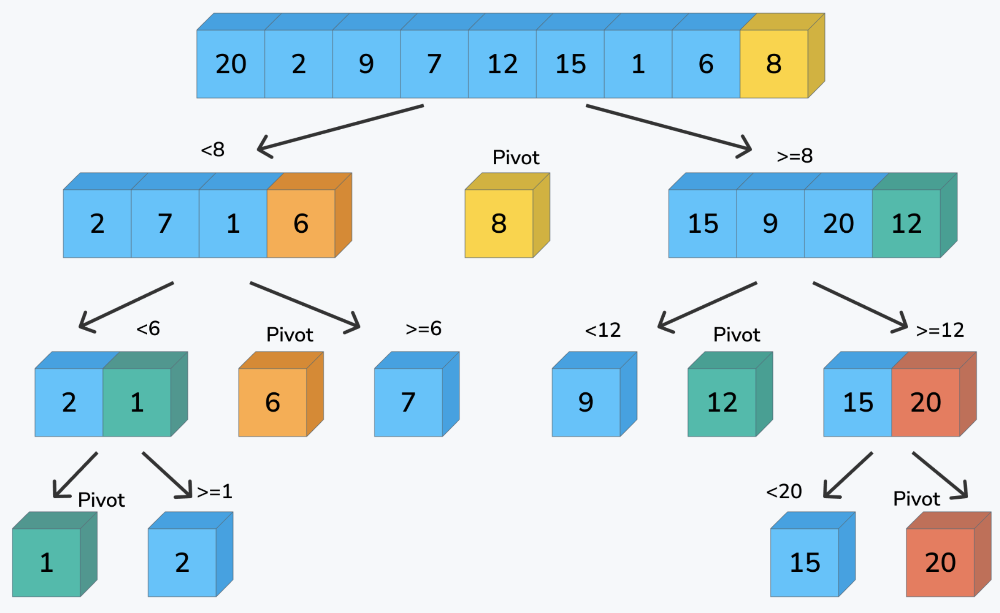

## 【JavaScript快速排序算法】不同版本原理分析

## 说明

快速排序（QuickSort），又称分区交换排序（partition-exchange sort），简称快排。快排是一种通过基准划分区块，再不断交换左右项的排序方式，其采用了分治法，减少了交换的次数。它的基本思想是：通过一趟排序将要排序的数据分割成独立的两部分，其中一部分的所有数据都比另外一部分的所有数据都要小，然后再按此方法对这两部分数据分别进行快速排序，整个排序过程可以递归或迭代进行，以此让整个数列变成有序序列。

## 实现过程

1. 在待排序区间找到一个基准点(pivot)，便于理解一般是位于数组中间的那一项。
2. 逐个循环数组将小于基准的项放左侧，将大于基准的项放在右侧。一般通过交换的方式来实现。
3. 将基准点左侧全部项和基点右侧全部项分别通过递归(或迭代)方式重复第1项，直到所有数组都交换完成。

## 示意图



解释：以某个数字为基点，这里取最右侧的数字8，以基点划分为两个区间，将小于8的数字放在左侧区间，将大于8的数字放在右侧区间。再将左侧区间和右侧区间分别放到递归，按照最右侧为基点，继续分解。直到分解完毕，排序完成。这是其中一种常见的分区递归法，除了这种方式外，还有其他实现方式。

## 性能分析
平均时间复杂度：O(NlogN)
最佳时间复杂度：O(NlogN)
最差时间复杂度：O(N^2)
空间复杂度：根据实现方式的不同而不同，可以查看不同版本的源码

# 代码

## 快排方式1, 新建数组递归版本。无需交换，每个分区都是新数组，数量庞大。

这个版本利用了JS数组可变且随意拼接的特性，让每个分区都是一个新数组，从而无需交换数组项。
这个方式非常简单易懂，但理论上来讲不是完全意义上的快排，效率较差。

```javascript
function quickSort1(arr) {
  // 数组长度为1就不再分解
  console.log('origin array:', arr)
  if (arr.length <= 1) {
    return arr
  }

  var pivot
  const left = []
  const right = []
  // 设置中间数，取最中间的项
  var midIndex = Math.floor(arr.length / 2)
  pivot = arr[midIndex]

  for (var i = 0, l = arr.length; i < l; i++) {
    console.log('i=' + i + ' midIndex=' + midIndex + ' pivot=' + pivot + ' arr[]=' + arr)
    // 当中间基数等于i时跳过。基数数待递归完成时合并到到新数组。
    if (midIndex === i) {
      continue
    }
    // 当前数组里面的项小于基数则添加到左侧
    if (arr[i] < pivot) {
      left.push(arr[i])
      // 大于等于则添加到右侧
    } else {
      right.push(arr[i])
    }
  }

  // 递归调用遍历左侧和右侧，再将中间值连接起来
  arr = quickSort1(left).concat(pivot, quickSort1(right))
  console.log('sorted array:', arr)
  return arr
}
```

### 递归的过程
```javascript
// 基于中间位置进行递归分解：
      f([7, 11, 9, 10, 12, 13, 8])
            /       10          \
      f([7, 9, 8])           f([11, 12, 13])
        /   9    \             /    12     \
   f([7, 8])    f([])       f([11])       f[13]
   /   8  \
f([7]) f([])
  [7]
// 将递归后的最小单元和基数连接起来
// 得到：[7, 8, 9, 10, 11, 12, 13]
```

## 快排方式2, 标准分区递归版本。左右分区递归交换排序，无需新建数组。
这个版本是最常见的标准分区版本，简单好懂。先写一个分区函数，依据基准值把成员项分为左右两部分。基准值可以是数列中的任意一项，为了交换方便，基准值一般最左或最右侧项。把小于基准值的放在左侧，大于基准值的放在右侧，最后返回分区索引。这样就得到一个基于基准值的左右两个部分。再将左右两个部分，分别进行分区逻辑的递归调用，当左右值相等，也就是最小分区只有1项时终止。

```javascript
// 分区函数，负责把数组分按照基准值分为左右两部分
// 小于基准的在左侧，大于基准的在右侧最后返回基准值的新下标
function partition(arr, left, right) {
  // 基准值可以是left与right之间的任意值，再将基准值移动至最左或最右即可。
  // 直接基于中间位置排序，则需要基于中间位置左右交换，参加基于中间位置交换的版本。
  // var tmpIndex = Math.floor((right - left) / 2)
  // ;[arr[left + tmpIndex], arr[right]] = [arr[right], arr[left + tmpIndex]]

  var pivotIndex = right
  var pivot = arr[pivotIndex]
  var partitionIndex = left - 1
  for (var i = left; i < right; i++) {
    // 如果比较项小于基准值则进行交换，并且分区索引增加1位
    // 也就是将大于基准值的全部往右侧放，以分区索引为分割线
    if (arr[i] < pivot) {
      partitionIndex++
      if (partitionIndex !== i) {
        [arr[partitionIndex], arr[i]] = [arr[i], arr[partitionIndex]]
      }
    }
  }
  partitionIndex++;
  [arr[partitionIndex], arr[pivotIndex]] = [arr[pivotIndex], arr[partitionIndex]]
  return partitionIndex
}

// 分区递归版本，分区递归调用。
function quickSort2(arr, left, right) {
  left = left !== undefined ? left : 0
  right = right !== undefined ? right : arr.length - 1
  if (left < right) {
    var pivot = partition(arr, left, right)
    quickSort2(arr, left, pivot - 1)
    quickSort2(arr, pivot + 1, right)
  }
  return arr
}
```

## 快排方式3, 标准左右交换递归版本。基于中间位置不断左右交换，无需新建数组。
此版本基于中间位置，建立双指针，同时从前往后和从后往前遍历，从左侧找到大于基准值的项，从右侧找到小于基准值的项。
再将大于基准值的挪到右侧，将小于基准值的项挪到左侧，直到左侧位置大于右侧时终止。左侧位置小于基准位置则递归调用左侧区间，右侧大于基准位置则递归调用右侧区间，直到所有项排列完成。

```js
function quickSort3(arr, left, right) {
  var i = left = left !== undefined ? left : 0
  var j = right = right !== undefined ? right : arr.length - 1
  // 确定中间位置，基于中间位置不停左右交换
  var midIndex = Math.floor((i + j) / 2)
  var pivot = arr[midIndex]

  // 当左侧小于等于右侧则表示还有项没有对比，需要继续
  while (i <= j) {
    // 当左侧小于基准时查找位置右移，直到找出比基准值大的位置来
    while (arr[i] < pivot) {
      console.log('arr[i] < pivot:', ' i=' + i + ' j=' + j + ' pivot=' + pivot)
      i++
    }
    // 当前右侧大于基准时左移，直到找出比基准值小的位置来
    while (arr[j] > pivot) {
      console.log('arr[j] > pivot:', ' i=' + i + ' j=' + j + ' pivot=' + pivot)
      j--
    }

    console.log('  left=' + left + ' right=' + right + ' i=' + i + ' j=' + j + ' midIndex=' + midIndex + ' pivot=' + pivot + ' arr[]=' + arr)

    // 当左侧位置小于等于右侧时，将数据交换，小的交换到基准左侧，大的交换到右侧
    if (i <= j) {
      [arr[i], arr[j]] = [arr[j], arr[i]]
      // 缩小搜查范围，直到左侧都小于基数，右侧都大于基数
      i++
      j--
    }
  }

  // 左侧小于基数位置，不断递归左边部分
  if (left < j) {
    console.log('left < j:recursion:  left=' + left + ' right=' + right + ' i=' + i + ' j=' + j + 'arr[]' + arr)
    quickSort3(arr, left, j)
  }
  // 基数位置小于右侧，不断递归右侧部分
  if (i < right) {
    console.log('i < right:recursion:  left=' + left + ' right=' + right + ' i=' + i + ' j=' + j + 'arr[]' + arr)
    quickSort3(arr, i, right)
  }

  return arr
}
```

## 快排方式4, 非递归左右交换版本。基于中间位置不断左右交换，利用stack或queue遍历。
这种方式标准左右交换递归版本的非递归版本，其原理一样，只是不再递归调用，而是通过stack来模拟递归效果。这种方式性能最好。

```js
function quickSort4(arr, left, right) {
  left = left !== undefined ? left : 0
  right = right !== undefined ? right : arr.length - 1

  var stack = []
  var i, j, midIndex, pivot, tmp
  // 与标准递归版相同，只是将递归改为遍历栈的方式
  // 先将左右各取一个入栈
  stack.push(left)
  stack.push(right)

  while (stack.length) {
    // 如果栈内还有数据，则一并马上取出，其他逻辑与标准递归版同
    j = right = stack.pop()
    i = left = stack.pop()
    midIndex = Math.floor((i + j) / 2)
    pivot = arr[midIndex]
    while (i <= j) {
      while (arr[i] < pivot) {
        console.log('arr[i] < pivot:', ' i=' + i + ' j=' + j + ' pivot=' + pivot + 'arr[]=' + arr)
        i++
      }
      while (arr[j] > pivot) {
        console.log('arr[j] > pivot:', ' i=' + i + ' j=' + j + ' pivot=' + pivot + 'arr[]=' + arr)
        j--
      }

      if (i <= j) {
        tmp = arr[j]
        arr[j] = arr[i]
        arr[i] = tmp
        i++
        j--
      }
    }
    if (left < j) {
      // 与递归版不同，这里当左侧小于基数位置时添加到栈中，以便继续循环
      console.log('left < j:recursion:  left=' + left + ' right=' + right + ' i=' + i + ' j=' + j + 'arr[]=' + arr)
      stack.push(left)
      stack.push(j)
    }
    if (i < right) {
      // 当右侧大于等于基数位置时添加到栈中，以便继续循环
      console.log('i < right:recursion:  left=' + left + ' right=' + right + ' i=' + i + ' j=' + j + 'arr[]=' + arr)
      stack.push(i)
      stack.push(right)
    }
  }
  return arr
}
```

## 测试
```js
(function () {
  const arr = [7, 11, 9, 10, 12, 13, 8]
  // 构建数列，可以任意构建，支持负数，也不限浮点
  // const arr = [17, 31, 12334, 9.545, -10, -12, 1113, 38]

  console.time('sort1')
  const arr1 = arr.slice(0)
  console.log('sort1 origin:', arr1)
  console.log('\r\nquickSort1 sorted:', quickSort1(arr1))
  console.timeEnd('sort1')

  console.time('sort2')
  const arr2 = arr.slice(0)
  console.log('sort2 origin:', arr2)
  console.log('\r\nquickSort2 sorted:', quickSort2(arr2))
  console.timeEnd('sort2')

  console.time('sort3')
  const arr3 = arr.slice(0)
  console.log('sort3 origin:', arr3)
  console.log('\r\nquickSort3 sorted:', quickSort3(arr3))
  console.timeEnd('sort3')

  console.time('sort4')
  const arr4 = arr.slice(0)
  console.log('sort4 origin:', arr4)
  console.log('\r\nquickSort4 sorted:', quickSort4(arr4))
  console.timeEnd('sort4')
})()

/**
// 测试结果
jarry@jarrys-MacBook-Pro quicksort % node quick_sort.js
sort1 origin: [
   7, 11, 9, 10,
  12, 13, 8
]
origin array: [
   7, 11, 9, 10,
  12, 13, 8
]
i=0 midIndex=3 pivot=10 arr[]=7,11,9,10,12,13,8
i=1 midIndex=3 pivot=10 arr[]=7,11,9,10,12,13,8
i=2 midIndex=3 pivot=10 arr[]=7,11,9,10,12,13,8
i=3 midIndex=3 pivot=10 arr[]=7,11,9,10,12,13,8
i=4 midIndex=3 pivot=10 arr[]=7,11,9,10,12,13,8
i=5 midIndex=3 pivot=10 arr[]=7,11,9,10,12,13,8
i=6 midIndex=3 pivot=10 arr[]=7,11,9,10,12,13,8
origin array: [ 7, 9, 8 ]
i=0 midIndex=1 pivot=9 arr[]=7,9,8
i=1 midIndex=1 pivot=9 arr[]=7,9,8
i=2 midIndex=1 pivot=9 arr[]=7,9,8
origin array: [ 7, 8 ]
i=0 midIndex=1 pivot=8 arr[]=7,8
i=1 midIndex=1 pivot=8 arr[]=7,8
origin array: [ 7 ]
origin array: []
sorted array: [ 7, 8 ]
origin array: []
sorted array: [ 7, 8, 9 ]
origin array: [ 11, 12, 13 ]
i=0 midIndex=1 pivot=12 arr[]=11,12,13
i=1 midIndex=1 pivot=12 arr[]=11,12,13
i=2 midIndex=1 pivot=12 arr[]=11,12,13
origin array: [ 11 ]
origin array: [ 13 ]
sorted array: [ 11, 12, 13 ]
sorted array: [
   7,  8,  9, 10,
  11, 12, 13
]

quickSort1 sorted: [
   7,  8,  9, 10,
  11, 12, 13
]
sort1: 9.824ms
sort2 origin: [
   7, 11, 9, 10,
  12, 13, 8
]
partitioned arr= [
   7,  8,  9, 10,
  12, 13, 11
] partitionIndex: 1 left= [ 7 ] arr[partitionIndex]= 8 right= [ 8, 9, 10, 12, 13, 11 ] [
   7,  8,  9, 10,
  12, 13, 11
]
partitioned arr= [
   7,  8,  9, 10,
  11, 13, 12
] partitionIndex: 4 left= [ 9, 10 ] arr[partitionIndex]= 11 right= [ 11, 13, 12 ] [
   7,  8,  9, 10,
  11, 13, 12
]
partitioned arr= [
   7,  8,  9, 10,
  11, 13, 12
] partitionIndex: 3 left= [ 9 ] arr[partitionIndex]= 10 right= [ 10 ] [
   7,  8,  9, 10,
  11, 13, 12
]
partitioned arr= [
   7,  8,  9, 10,
  11, 12, 13
] partitionIndex: 5 left= [] arr[partitionIndex]= 12 right= [ 12, 13 ] [
   7,  8,  9, 10,
  11, 12, 13
]

quickSort2 sorted: [
   7,  8,  9, 10,
  11, 12, 13
]
sort2: 1.15ms
sort3 origin: [
   7, 11, 9, 10,
  12, 13, 8
]
arr[i] < pivot:  i=0 j=6 pivot=10
  left=0 right=6 i=1 j=6 midIndex=3 pivot=10 arr[]=7,11,9,10,12,13,8
arr[i] < pivot:  i=2 j=5 pivot=10
arr[j] > pivot:  i=3 j=5 pivot=10
arr[j] > pivot:  i=3 j=4 pivot=10
  left=0 right=6 i=3 j=3 midIndex=3 pivot=10 arr[]=7,8,9,10,12,13,11
left < j:recursion:  left=0 right=6 i=4 j=2arr[]7,8,9,10,12,13,11
arr[i] < pivot:  i=0 j=2 pivot=8
arr[j] > pivot:  i=1 j=2 pivot=8
  left=0 right=2 i=1 j=1 midIndex=1 pivot=8 arr[]=7,8,9,10,12,13,11
i < right:recursion:  left=0 right=6 i=4 j=2arr[]7,8,9,10,12,13,11
arr[i] < pivot:  i=4 j=6 pivot=13
  left=4 right=6 i=5 j=6 midIndex=5 pivot=13 arr[]=7,8,9,10,12,13,11
left < j:recursion:  left=4 right=6 i=6 j=5arr[]7,8,9,10,12,11,13
  left=4 right=5 i=4 j=5 midIndex=4 pivot=12 arr[]=7,8,9,10,12,11,13

quickSort3 sorted: [
   7,  8,  9, 10,
  11, 12, 13
]
sort3: 0.595ms
sort4 origin: [
   7, 11, 9, 10,
  12, 13, 8
]
arr[i] < pivot:  i=0 j=6 pivot=10arr[]=7,11,9,10,12,13,8
arr[i] < pivot:  i=2 j=5 pivot=10arr[]=7,8,9,10,12,13,11
arr[j] > pivot:  i=3 j=5 pivot=10arr[]=7,8,9,10,12,13,11
arr[j] > pivot:  i=3 j=4 pivot=10arr[]=7,8,9,10,12,13,11
left < j:recursion:  left=0 right=6 i=4 j=2arr[]=7,8,9,10,12,13,11
i < right:recursion:  left=0 right=6 i=4 j=2arr[]=7,8,9,10,12,13,11
arr[i] < pivot:  i=4 j=6 pivot=13arr[]=7,8,9,10,12,13,11
left < j:recursion:  left=4 right=6 i=6 j=5arr[]=7,8,9,10,12,11,13
arr[i] < pivot:  i=0 j=2 pivot=8arr[]=7,8,9,10,11,12,13
arr[j] > pivot:  i=1 j=2 pivot=8arr[]=7,8,9,10,11,12,13

quickSort4 sorted: [
   7,  8,  9, 10,
  11, 12, 13
]
sort4: 0.377ms
 */
```

# 链接

多种语言实现快速排序算法源码：[https://github.com/microwind/algorithms/tree/master/sorts/quicksort](https://github.com/microwind/algorithms/tree/master/sorts/quicksort)

其他排序算法源码：[https://github.com/microwind/algorithms](https://github.com/microwind/algorithms)
