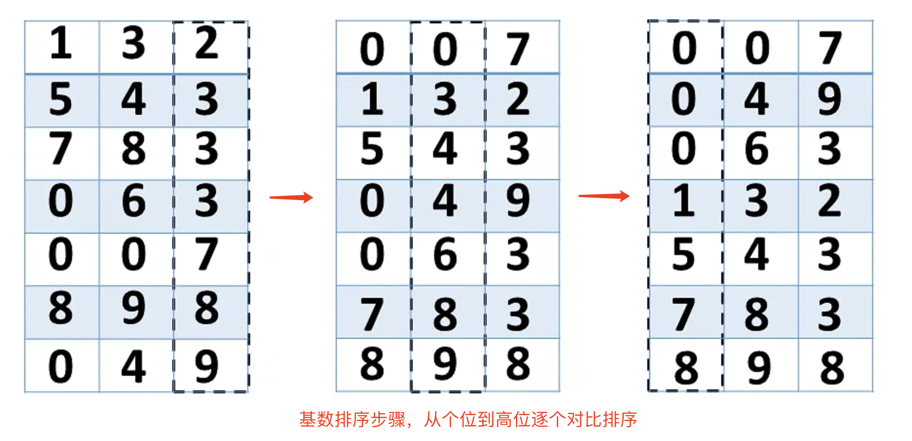

## 【基数排序算法详解】Java/Go/Python/JS/C不同语言实现

## 说明

基数排序（RadixSort）是一种非比较型整数排序算法，其原理是将整数按位数切割成不同的数字，然后按每个位数分别比较。由于整数也可以表达字符串（比如名字或日期）和特定格式的浮点数，所以基数排序也不是只能使用于整数。基数排序的发明可以追溯到1887年赫尔曼·何乐礼在列表机（Tabulation Machine）上的贡献。
s
基数排序的方式可以采用LSD（Least significant digital）或MSD（Most significant digital），LSD的排序方式由键值的最右边开始，而MSD则相反，由键值的最左边开始。
    MSD：先从高位开始进行排序，在每个关键字上，可采用计数排序
    LSD：先从低位开始进行排序，在每个关键字上，可采用桶排序

## 实现过程

1. 将待排序数列（正整数）统一为同样的数位长度，数位较短的补零。
2. 从最低位开始，依次进行排序。先按照个位数进行排序，再按照十位数排序，再按照百位数进行排序，以此类推。
3. 每个数位都按照计数排序将数列重排，然后再进行下一位的比较。
4. 这样从最低位排序一直到最高位排序完成以后，数列就变成一个有序序列。

## 示意图




## 性能分析
时间复杂度：O(k*N)
空间复杂度：O(k + N)
稳定性：稳定

# 代码

## Java

```java
  /* 方式1,标准递归版本。需要左右不断交换，无需新建数组。 */
  static int[] radixSort1(int arr[], int low, int high) {
    int i = low > 0 ? low : 0;
    int j = high;
    int midIndex = (i + j) / 2;
    int pivot = arr[midIndex];

    System.out.println(
        " i=" + i + ", j=" + j + ", midIndex=" + midIndex + ", pivot=" + pivot + "  arr[]=" + Arrays.toString(arr));

    // 当左侧小于等于右侧则表示还有值没有对比，需要继续
    while (i <= j) {
      // 当左侧小于基准时查找位置右移，直到找出比基准值大的位置来
      while (arr[i] < pivot) {
        System.out.println("arr[i] < pivot: i=" + i + ", j=" + j + ", pivot=" + pivot);
        i++;
      }
      // 当前右侧大于基准时左移，直到找出比基准值小的位置来
      while (arr[j] > pivot) {
        System.out.println("arr[i] > pivot: i=" + i + ", j=" + j + ", pivot=" + pivot);
        j--;
      }

      System.out.println("low=" + low + ", high=" + high + ", i=" + i + ", j=" + j + ", pivot=" + pivot);

      // 当左侧位置小于右侧时，将数据交换，小的交换到基准左侧，大的交换到右侧
      if (i <= j) {
        int tmp = arr[j];
        arr[j] = arr[i];
        arr[i] = tmp;
        // 缩小搜查范围，直到左侧都小于基数，右侧都大于基数
        i++;
        j--;
      }
    }
    // 左侧小于基数位置，不断递归左边部分
    if (low < j) {
      System.out.println("  low < j:recursion: low=" + low + ", high=" + high + ", i=" + i + ", j=" + j + ", midIndex="
          + midIndex + ", pivot=" + pivot);
      radixSort1(arr, low, j);
    }
    // 基数位置小于右侧，不断递归右侧部分
    if (i < high) {
      System.out.println("  i < high:recursion: low=" + low + ", high=" + high + ", i=" + i + ", j=" + j + ", midIndex="
          + midIndex + ", pivot=" + pivot);
      radixSort1(arr, i, high);
    }

    return arr;
  }
```

## Python

```py
# 标准递归版本。需要左右不断交换，无需新建数组。
def radix_sort2(arr, left=None, right=None):

    i = left = left if left is not None else 0
    j = right = right if right is not None else len(arr) - 1
    mid_index = (i + j) / 2
    pivot = arr[mid_index]

    # 当左侧小于等于右侧则表示还有值没有对比，需要继续
    while (i <= j):
        # 当左侧小于基准时查找位置右移，直到找出比基准值大的位置来
        while (arr[i] < pivot):
            print('arr[i] < pivot:',
                  ' i=' + str(i) + ' j=' + str(j) + ' pivot=' + str(pivot))
            i = i + 1

        # 当前右侧大于基准时左移，直到找出比基准值小的位置来
        while (arr[j] > pivot):
            print('arr[j] > pivot:',
                  ' i=' + str(i) + ' j=' + str(j) + ' pivot=' + str(pivot))
            j -= 1

        print(
            '  left=' + str(left) + ' right=' + str(right) + ' i=' + str(i) +
            ' j=' + str(j) + ' mid_index=' + str(mid_index) + ' pivot=' +
            str(pivot) + ' arr[]=', arr)

        # 当左侧位置小于右侧时，将数据交换，小的交换到基准左侧，大的交换到右侧
        if (i <= j):
            [arr[i], arr[j]] = [arr[j], arr[i]]
            # 缩小搜查范围，直到左侧都小于基数，右侧都大于基数
            i += 1
            j -= 1

    # 左侧小于基数位置，不断递归左边部分
    if (left < j):
        print(
            'left < j:recursion:  left=' + str(left) + ' right=' + str(right) +
            ' i=' + str(i) + ' j=' + str(j) + 'arr[]', arr)
        radix_sort2(arr, left, j)

    # 基数位置小于右侧，不断递归右侧部分
    if (i < right):
        print(
            'i < right:recursion:  left=' + str(left) + ' right=' +
            str(right) + ' i=' + str(i) + ' j=' + str(j) + 'arr[]', arr)
        radix_sort2(arr, i, right)

    return arr
```

## Go

```go
// 把数组分按照基准值分为左右两部分，再返回新的中间位置作为排序的pivot
func partition(arr []int, left int, right int) int {
  // pivot基准可以任意挑选，这里取右侧
  var pivotIndex = right
  var pivot = arr[pivotIndex]
  var swapIndex = left - 1
  for i := left; i < right; i++ {
    // 如果小于基准则进行交换
    if arr[i] < pivot {
      swapIndex++
      arr[swapIndex], arr[i] = arr[i], arr[swapIndex]
    }
  }
  swapIndex++
  arr[swapIndex], arr[pivotIndex] = arr[pivotIndex], arr[swapIndex]
  fmt.Println("partition:", arr, swapIndex, arr[swapIndex], arr[left:swapIndex], arr[swapIndex:right])
  return swapIndex
}

// 方式2, 标准递归版本。左右不断分区交换，无需新建数组。
func radixSort2(arr []int, left int, right int) []int {
  if left < right {
    var pivot = partition(arr, left, right)
    radixSort2(arr, left, pivot-1)
    radixSort2(arr, pivot+1, right)
  }
  return arr
}
```

## JS

```js
// 方式4, 非递归版本。需要交换，无需新建数组，利用stack或queue遍历。
function radixSort4(arr, left, right) {
  left = left !== undefined ? left : 0
  right = right !== undefined ? right : arr.length - 1

  var stack = []
  var i, j, midIndex, pivot, tmp
  // 与标准递归版相同，只是将递归改为遍历栈的方式
  // 先将左右各取一个入栈
  stack.push(left)
  stack.push(right)

  while (stack.length) {
    // 如果栈内还有数据，则一并马上取出，其他逻辑与标准递归版同
    j = right = stack.pop()
    i = left = stack.pop()
    midIndex = Math.floor((i + j) / 2)
    pivot = arr[midIndex]
    while (i <= j) {
      while (arr[i] < pivot) {
        console.log('arr[i] < pivot:', ' i=' + i + ' j=' + j + ' pivot=' + pivot + 'arr[]=' + arr)
        i++
      }
      while (arr[j] > pivot) {
        console.log('arr[j] > pivot:', ' i=' + i + ' j=' + j + ' pivot=' + pivot + 'arr[]=' + arr)
        j--
      }

      if (i <= j) {
        tmp = arr[j]
        arr[j] = arr[i]
        arr[i] = tmp
        i++
        j--
      }
    }
    if (left < j) {
      // 与递归版不同，这里添加到栈中，以便继续循环
      console.log('left < j:recursion:  left=' + left + ' right=' + right + ' i=' + i + ' j=' + j + 'arr[]=' + arr)
      stack.push(left)
      stack.push(j)
    }
    if (i < right) {
      console.log('i < right:recursion:  left=' + left + ' right=' + right + ' i=' + i + ' j=' + j + 'arr[]=' + arr)
      stack.push(i)
      stack.push(right)
    }
  }
  return arr
}
```

## TS

```ts
  // 1. 方式1, 递归新建数组版本。无需交换，每个分区都是新数组，数量庞大
  radixSort1(arr: Array<number>) {
    // 数组长度为1就不再分级
    if (arr.length <= 1) {
      return arr
    }
    console.log('split array:', arr)

    var pivot: number
    const left = Array<number>()
    const right = Array<number>()
    // 设置中间数
    var midIndex = Math.floor(arr.length / 2)
    pivot = arr[midIndex]

    for (var i = 0, l = arr.length; i < l; i++) {
      console.log(
        'i=' + i + ' midIndex=' + midIndex + ' pivot=' + pivot + ' arr[]=' + arr
      )
      // 当中间基数等于i时，跳过当前。中间数递归完成时合并
      if (midIndex === i) {
        continue
      }
      // 当前数组端里面的项小于基数则添加到左侧
      if (arr[i] < pivot) {
        left.push(arr[i])
        // 大于等于则添加到右侧
      } else {
        right.push(arr[i])
      }
    }

    arr = this.radixSort1(left).concat(pivot, this.radixSort1(right))
    // 递归调用遍历左侧和右侧，再将中间值连接起来
    return arr
  }
```

## C

```c
/** 方式1,标准递归版本。需要左右不断交换，无需新建数组。*/
void *radixSort1(int arr[], int low, int high)
{
  int i = low > 0 ? low : 0;
  int j = high;
  int midIndex = (i + j) / 2;
  int pivot = arr[midIndex];

  // 当左侧小于等于右侧则表示还有值没有对比，需要继续
  while (i <= j)
  {
    // 当左侧小于基准时查找位置右移，直到找出比基准值大的位置来
    while (arr[i] < pivot)
    {
      printf("\r\narr[i] < pivot: i=%d, j=%d, pivot=%d", i, j, pivot);
      i++;
    }
    // 当前右侧大于基准时左移，直到找出比基准值小的位置来
    while (arr[j] > pivot)
    {
      printf("\r\narr[i] > pivot: i=%d, j=%d, pivot=%d", i, j, pivot);
      j--;
    }

    printf("\r\n  low=%d, high=%d, i=%d, j=%d, midIndex=%d, pivot=%d", low, high, i, j, midIndex, pivot);

    // 当左侧位置小于右侧时，将数据交换，小的交换到基准左侧，大的交换到右侧
    if (i <= j)
    {
      swap(&arr[i], &arr[j]);
      // 缩小搜查范围，直到左侧都小于基数，右侧都大于基数
      i++;
      j--;
    }
  }
  // 左侧小于基数位置，不断递归左边部分
  if (low < j)
  {
    printf("\r\n  low < j:recursion:  low=%d, high=%d, i=%d, j=%d, midIndex=%d, pivot=%d", low, high, i, j, midIndex, pivot);
    radixSort1(arr, low, j);
  }
  // 基数位置小于右侧，不断递归右侧部分
  if (i < high)
  {
    printf("\r\n  i < high:recursion:  low=%d, high=%d, i=%d, j=%d, midIndex=%d, pivot=%d", low, high, i, j, midIndex, pivot);
    radixSort1(arr, i, high);
  }

  return arr;
}
```

# C++
```c++
void swap(int *a, int *b)
{
  int temp = *a;
  *a = *b;
  *b = temp;
}
void printArray(int *arr, int size)
{
  for (int i = 0; i < size; i++)
  {
    std::cout << arr[i] << " ";
  }
  std::cout << std::right;
}

// 把数组分按照基准值分为左右两部分，再返回新的中间位置作为排序的pivot
int partition(int *arr, int left, int right)
{
  // 这里的pivot以右侧为准
  int pivotIndex = right;
  int pivot = arr[pivotIndex];
  // 记录交换的位置
  int swapIndex = left - 1;
  for (int i = left; i < right; i++)
  {
    // 如果小于基准则进行交换
    // 把小于基数的逐个往左侧放，大于基数的往右侧放
    if (arr[i] < pivot)
    {
      swapIndex++;
      swap(&arr[swapIndex], &arr[i]);
    }
  }
  swapIndex++;
  // 最后把原基数调换到分区线的位置，并返回分区线位置
  swap(&arr[swapIndex], &arr[pivotIndex]);
  return swapIndex;
}

void radixSort(int *arr, int left, int right)
{
  if (left < right)
  {
    int pivot = partition(arr, left, right);
    radixSort(arr, left, pivot - 1);
    radixSort(arr, pivot + 1, right);
  }
}
```
# 链接

# 基数排序与计数排序、桶排序区别
    基数排序与计数排序、桶排序都使用桶的概念来排序，其差异如下：
    基数排序：根据数据的位数来分配桶，每一位对应一个桶，先将全部数据的位数按最大位数对齐，再根据位数上的值大小排列；
    计数排序：根据最大最小差值设定若干桶，每个桶对应一个数值，将数据放入桶里并把值存入下一个桶，最后按索引顺序取出对应桶里的值；
    桶排序：根据情况分为若干个桶，每个桶存储一定范围的数值，每个桶单独排序，最后按桶顺序取出数据；

基数排序算法源码：[https://github.com/microwind/algorithms/tree/master/sorts/radixsort](https://github.com/microwind/algorithms/tree/master/sorts/radixsort)

其他排序算法源码：[https://github.com/microwind/algorithms](https://github.com/microwind/algorithms)
