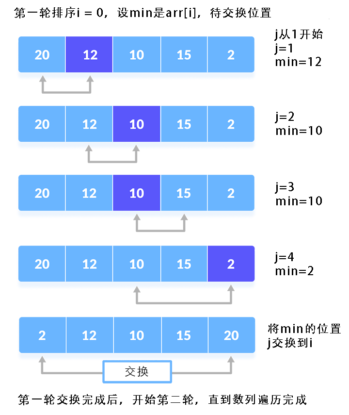

## 【选择排序算法详解】Java/Go/Python/JS/C 不同语言实现

## 说明

选择排序（Selection Sort）是一种简单直观的排序算法。跟冒泡、插入排序一样，它将数列分为已排序和待排序两个区间。首先在待排序序列中找到最小（或最大）的元素，追加到已排序序列中，然后继续从待排序序列中寻找最小（或最大）的元素，追加到已排序序列的尾部。以此类推，直到所有元素均排序完毕。可以通过同时找出最小和最大项来优化性能，详见源码。

## 实现过程

1. 先建立两个循环，外循环用于逐个交换数据，内循环用来遍历找到最小(或最大)值。
2. 设第 1 项为最小值，在内循环中将其逐个与后项进行比较，如果遇到更小的值，则更新最小值，并记录下最小值的下标。
3. 在外循环中将第 1 项与最小值进行交换，然后以第 2 项作为最小值，再重复执行步骤 2，直到遍历完全部待排序区间。

## 示意图




## 性能分析

    平均时间复杂度：O(N^2)
    最佳时间复杂度：O(N^2)
    最差时间复杂度：O(N^2)
    空间复杂度：O(1)
    排序方式：In-place
    稳定性：不稳定

    选择排序的交换操作介于和(n-1)次之间。选择排序的比较操作为n(n-1)/2次之间。选择排序的赋值操作介于0和3(n-1)次之间。
    比较次数O(n^2)，比较次数与关键字的初始状态无关，总的比较次数N = (n-1) + (n-2) +…+ 1 = n x (n-1)/2。交换次数O(n)，最好情况是，已经有序，交换0次；最坏情况是，逆序，交换n-1次。

# 代码

## Java

```java
  // java选择排序标准版，更多版本请看源码文件
  static int[] selectionSort1(final int[] arr) {
    int min;
    int minIdx;
    int tmp;
    int l = arr.length;
    for (int i = 0; i < l - 1; i++) {
      min = arr[i];
      minIdx = i;
      int j = i + 1;
      for (; j < l; j++) {
        // 从待排序列表找到最小值和位置
        if (arr[j] < min) {
          min = arr[j];
          minIdx = j;
        }
      }
      System.out.println("i=" + i + " j=" + j + " min=" + min + "minIdx=" + minIdx + " arr[]" + Arrays.toString(arr));
      // 将待排序里最小值交换到已排序最后面
      if (minIdx != i) {
        tmp = arr[i];
        arr[i] = min;
        arr[minIdx] = tmp;
      }
    }
    return arr;
  }
```

```java
// 选择排序优化版，同时找出最小和最大值进行交换，可减少1半遍历
// 把数列分为前中后三个区间，分别代表最小已排序、中间待排序以及最大已排序区间
// 遍历中间待排序同时找最大和最小值，分别交换到最小值区间和最大值区间
class SelectionSort {

  static int[] sort(final int[] arr) {
    int minValue, maxValue, minIdx, maxIdx;
    int minListIdx, maxListIdx;
    int arrLen = arr.length;
    for (int i = 0; i < arrLen - 1; i++) {
      // 待排序里面初始最小值和下标
      minIdx = i;
      minValue = arr[minIdx];
      // 待排序里面初始最大值和下标
      maxIdx = i;
      maxValue = arr[maxIdx];
      // 最小和最大序列里最新待交换的下标
      // 最小序列的下标从0开始，自前往后递加
      minListIdx = minIdx;
      // 最大序列的下标从数组最后1位开始，自后往前递减
      maxListIdx = arrLen - 1 - i;
      // 如果最小和最大下标相同，说明只剩下1个数字，则终止循环
      if (minListIdx == maxListIdx) {
        break;
      }

      // 逐一遍历待排序区间，找出最小和最大值
      // 待排序区间在最小值序列和和最大值序列之间
      // 待比较区间的下标j从i+1开始，到最大已排序前结束
      for (int j = i + 1; j < arrLen - i; j++) {
        // 从待排序列表中分别找到最小值和最大值
        if (arr[j] < minValue) {
          minIdx = j;
          minValue = arr[minIdx];
        } else if (arr[j] > maxValue) {
          maxIdx = j;
          maxValue = arr[maxIdx];
        }
      }

      // 如果最小值等于最小序列待交换的值，且最大值等于最大序列里待交换的值，则跳过
      if (arr[minIdx] == arr[minListIdx] && arr[maxIdx] == arr[maxListIdx]) {
        continue;
      }

      // 先交换小值，再交换大值
      arr[minIdx] = arr[minListIdx];
      arr[minListIdx] = minValue;
      // 如果最大值被交换了，则需要更新最大值的下标
      if (arr[minIdx] == maxValue) {
        maxIdx = minIdx;
      }
      arr[maxIdx] = arr[maxListIdx];
      arr[maxListIdx] = maxValue;
    }
    return arr;
  }
}
```

## Python

```py
# python选择排序标准版本，更多实现版本请查看源文件
# 新建数组版，无需交换
def selection_sort2(arr):
    new_list = []
    i = 0
    l = len(arr)
    while (i < l):
        min = arr[i]
        min_idx = i
        j = i + 1
        while (j < l):
            # 找到并记录下最小值和位置
            if (arr[j] < min):
                min = arr[j]
                min_idx = j
            
            j += 1

        # 将待排序里最小值添加到新数组中去
        new_list.append(min)
        # 原数组中删除对应的项
        arr.remove(min)
        l -= 1

    return new_list

```

```py
"""
# 选择排序优化版，同时找出最小和最大值进行交换，可减少1半遍历
# 把数列分为前中后三个区间，分别代表最小已排序、中间待排序以及最大已排序区间
# 遍历中间待排序同时找最大和最小值，分别交换到最小值区间和最大值区间
"""
def selection_sort(arr):
    arr_len = len(arr)
    for i in range(arr_len - 1):
        # 初始最小值和下标
        min_idx = i
        min_value = arr[min_idx]
        # 初始最大值和下标
        max_idx = i
        max_value = arr[max_idx]

        # 最小和最大序列里最新待交换的下标
        # 最小序列的下标从0开始，自前往后递加
        min_list_idx = min_idx
        # 最大序列的下标从数组最后1位开始，自后往前递减
        max_list_idx = arr_len - 1 - i
        # 如果最小和最大下标相同，说明只剩下1个数字，则终止循环
        if min_list_idx == max_list_idx:
            break

        # 逐一遍历待排序区间，找出最小和最大值
        # 待排序区间在最小值序列和和最大值序列之间
        # 待比较区间的下标j从i+1开始，到最大已排序前结束
        j = i + 1
        while j < arr_len - i:
            # 从待排序列表找到最小值和最大值及位置
            if arr[j] < min_value:
                min_idx = j
                min_value = arr[min_idx]
            elif arr[j] > max_value:
                max_idx = j
                max_value = arr[max_idx]
            j += 1

        # 如果最小值等于最小序列待交换的值，且最大值等于最大序列里待交换的值，则跳过
        if arr[min_idx] == arr[min_list_idx] and arr[max_idx] == arr[
                max_list_idx]:
            continue

        print('min_value=', min_value, 'max_value=', max_value, 'min_idx=',
              min_idx, 'max_idx=', max_idx, 'min_list_idx=', min_list_idx,
              'max_list_idx=', max_list_idx)

        # 先交换小值，再交换大值
        arr[min_list_idx], arr[min_idx] = arr[min_idx], arr[min_list_idx]
        # 如果最大值被交换了，则需要更新最大值的下标
        if arr[min_idx] == max_value:
            max_idx = min_idx
        arr[max_list_idx], arr[max_idx] = arr[max_idx], arr[max_list_idx]

    return arr
```

## Go

```go
// go选择排序标准版，其他版本请查看源文件
func selectionSort1(arr []int) []int {
  var min = arr[0]
  var minIdx = 0
  var tmp = -1
  var arrLen = len(arr)
  for i := 0; i < arrLen-1; i++ {
    min = arr[i]
    minIdx = i
    var j = i + 1
    for ; j < arrLen; j++ {
      // 从待排序列表中找到最小值和位置，用作交换
      if arr[j] < min {
        min = arr[j]
        minIdx = j
      }
    }
    fmt.Println("i=", i, " j=", j, "min=", min, "minIdx=", minIdx, "arr[]=", arr)
    // 将待排序里最小值交换到已排序最后面
    if minIdx != i {
      tmp = arr[i]
      arr[i] = min
      arr[minIdx] = tmp
    }
  }

  return arr
}
```

```go
// 选择排序优化版，同时找出最小和最大值进行交换，可减少1半遍历
// 把数列分为前中后三个区间，分别代表最小已排序、中间待排序以及最大已排序区间
// 遍历中间待排序同时找最大和最小值，分别交换到最小值区间和最大值区间
func selectionSort(arr []int) []int {

  var minValue int
  var maxValue int
  var minIdx int
  var maxIdx int
  var minListIdx int
  var maxListIdx int

  var arrLen = len(arr)
  for i := 0; i < arrLen-1; i++ {
    // 待排序里面初始最小值和下标
    minIdx = i
    minValue = arr[minIdx]
    // 待排序里面初始最大值和下标
    maxIdx = i
    maxValue = arr[maxIdx]
    // 最小和最大序列里最新待交换的下标
    // 最小序列的下标从0开始，自前往后递加
    minListIdx = minIdx
    // 最大序列的下标从数组最后1位开始，自后往前递减
    maxListIdx = arrLen - 1 - i
    // 如果最小和最大下标相同，说明只剩下1个数字，则终止循环
    if minListIdx == maxListIdx {
      break
    }

    // 逐一遍历待排序区间，找出最小和最大值
    // 待排序区间在最小值序列和和最大值序列之间
    // 待比较区间的下标j从i+1开始，到最大已排序前结束
    for j := i + 1; j < arrLen-i; j++ {
      // 从待排序列表中分别找到最小值和最大值
      if arr[j] < minValue {
        minIdx = j
        minValue = arr[minIdx]
      } else if arr[j] > maxValue {
        maxIdx = j
        maxValue = arr[maxIdx]
      }
    }

    // 如果最小值等于最小序列待交换的值，且最大值等于最大序列里待交换的值，则跳过
    if arr[minIdx] == arr[minListIdx] && arr[maxIdx] == arr[maxListIdx] {
      continue
    }
    fmt.Println("minValue=", minValue, " maxValue=", maxValue, " minIdx=", minIdx, " maxIdx=", maxIdx, " minListIdx=", minListIdx, " maxListIdx=", maxListIdx)
    // 先交换小值，再交换大值
    arr[minListIdx], arr[minIdx] = arr[minIdx], arr[minListIdx]
    // 如果最大值被交换了，则需要更新最大值的下标
    if arr[minIdx] == maxValue {
      maxIdx = minIdx
    }
    arr[maxListIdx], arr[maxIdx] = arr[maxIdx], arr[maxListIdx]
  }

  return arr
}
```

## JS

```js
// js选择排序徐标准版，更多实现版本详见源码文件
// 新建数组版，无需交换
function selectionSort2(arr) {
  var min, minIdx
  var newArr = []
  var arrLen = arr.length
  for (var i = 0; i < arrLen; i++) {
    min = arr[i]
    minIdx = i
    let j = i + 1
    for (; j < arrLen; j++) {
      // 找到并记录下最小值和位置
      if (arr[j] < min) {
        min = arr[j]
        minIdx = j
      }
    }
    console.log('i=' + i, ' j=' + j, 'min=' + min, 'minIdx=' + minIdx, 'arr[]=', arr)
    // 将待排序里最小值添加到新数组中去
    newArr.push(min)
    // 原数组中删除对应的项
    arr.splice(minIdx, 1)
    arrLen--
    i--
  }
  return newArr
}
```

```js
// 选择排序优化版，同时找出最小和最大值进行交换，可减少1半遍历
// 把数列分为前中后三个区间，分别代表最小已排序、中间待排序以及最大已排序区间
// 遍历中间待排序同时找最大和最小值，分别交换到最小值区间和最大值区间
function selectionSort(arr) {
  let minValue, maxValue, minIdx, maxIdx
  let minListIdx, maxListIdx
  const arrLen = arr.length
  // 外循环，从第1项开始与后面待排序项逐个对比，最后1位无需再比较
  for (let i = 0; i < arrLen - 1; i++) {
    // 待排序里面初始最小值和下标
    minIdx = i
    minValue = arr[minIdx]
    // 待排序里面初始最大值和下标
    maxIdx = i
    maxValue = arr[maxIdx]
    // 最小和最大序列里最新待交换的下标
    // 最小序列的下标从0开始，自前往后递加
    minListIdx = minIdx
    // 最大序列的下标从数组最后1位开始，自后往前递减
    maxListIdx = arrLen - 1 - i
    // 如果最小和最大下标相同，说明只剩下1个数字，则终止循环
    if (minListIdx === maxListIdx) {
      break
    }

    // 逐一遍历待排序区间，找出最小和最大值
    // 待排序区间在最小值序列和和最大值序列之间
    // 待比较区间的下标j从i+1开始，到最大已排序前结束
    for (let j = i + 1; j < arrLen - i; j++) {
      // 从待排序列表中分别找到最小值和最大值
      if (arr[j] < minValue) {
        minIdx = j
        minValue = arr[minIdx]
      } else if (arr[j] > maxValue) {
        maxIdx = j
        maxValue = arr[maxIdx]
      }
    }

    // 如果最小值等于最小序列待交换的值，且最大值等于最大序列里待交换的值，则跳过
    if (arr[minIdx] === arr[minListIdx] && arr[maxIdx] === arr[maxListIdx]) {
      continue
    }
    console.log('minValue=', minValue, 'maxValue=', maxValue, 'minIdx=', minIdx, 'maxIdx=', maxIdx, 'minListIdx=', minListIdx, 'maxListIdx=', maxListIdx)
    // 先交换小值，再交换大值
    ;[arr[minListIdx], arr[minIdx]] = [arr[minIdx], arr[minListIdx]]
    // 如果最大值被交换了，则需要更新最大值的下标
    if (arr[minIdx] === maxValue) {
      maxIdx = minIdx
    }
    ;[arr[maxListIdx], arr[maxIdx]] = [arr[maxIdx], arr[maxListIdx]]
  }

  return arr
}
```

## TS

```ts
// TS标准版，其他版本请查看源码文件
class SelectionSort {
  constructor() {}
  // 标准版
  selectionSort1(arr: Array<number>) {
    let min: number, minIdx: number, tmp: number
    let l = arr.length
    for (let i = 0; i < l - 1; i++) {
      min = arr[i]
      minIdx = i
      let j = i + 1
      for (; j < l; j++) {
        // 从待排序列表找到最小值和位置
        if (arr[j] < min) {
          min = arr[j]
          minIdx = j
        }
      }

      // 将待排序里最小值交换到已排序最后面
      if (minIdx !== i) {
        tmp = arr[i]
        arr[i] = min
        arr[minIdx] = tmp
      }
    }

    return arr
  }
}
```

```ts
class SelectionSort {
  // 选择排序优化版，同时找出最小和最大值进行交换，可减少1半遍历
  // 把数列分为前中后三个区间，分别代表最小已排序、中间待排序以及最大已排序区间
  // 遍历中间待排序同时找最大和最小值，分别交换到最小值区间和最大值区间
  sort(arr: Array<number>) {
    let minValue: number, maxValue: number, minIdx: number, maxIdx: number
    let minListIdx: number, maxListIdx: number
    const arrLen = arr.length
    // 外循环，从第1项开始与后面待排序项逐个对比，最后1位无需再比较
    for (let i = 0; i < arrLen - 1; i++) {
      // 待排序里面初始最小值和下标
      minIdx = i
      minValue = arr[minIdx]
      // 待排序里面初始最大值和下标
      maxIdx = i
      maxValue = arr[maxIdx]
      // 最小和最大序列里最新待交换的下标
      // 最小序列的下标从0开始，自前往后递加
      minListIdx = minIdx
      // 最大序列的下标从数组最后1位开始，自后往前递减
      maxListIdx = arrLen - 1 - i
      // 如果最小和最大下标相同，说明只剩下1个数字，则终止循环
      if (minListIdx === maxListIdx) {
        break
      }

      // 逐一遍历待排序区间，找出最小和最大值
      // 待排序区间在最小值序列和和最大值序列之间
      // 待比较区间的下标j从i+1开始，到最大已排序前结束
      for (let j = i + 1; j < arrLen - i; j++) {
        // 从待排序列表中分别找到最小值和最大值
        if (arr[j] < minValue) {
          minIdx = j
          minValue = arr[minIdx]
        } else if (arr[j] > maxValue) {
          maxIdx = j
          maxValue = arr[maxIdx]
        }
      }

      // 如果最小值等于最小序列待交换的值，且最大值等于最大序列里待交换的值，则跳过
      if (arr[minIdx] === arr[minListIdx] && arr[maxIdx] === arr[maxListIdx]) {
        continue
      }

      // 先交换小值，再交换大值
      arr[minIdx] = arr[minListIdx];
      arr[minListIdx] = minValue;
      // 如果最大值被交换了，则需要更新最大值的下标
      if (arr[minIdx] == maxValue) {
        maxIdx = minIdx;
      }
      arr[maxIdx] = arr[maxListIdx];
      arr[maxListIdx] = maxValue;
    }

    return arr
  }
}
```

## C

```c
// c语言选择排序标准版，其他版本请查看源码文件
void *selection_sort1(int arr[], int len)
{
  int min_value, min_idx, tmp;
  for (int i = 0; i < len - 1; i++)
  {
    min_value = arr[i];
    min_idx = i;
    int j = i + 1;
    for (; j < len; j++)
    {
      // 从待排序列表找到最小值和位置
      if (arr[j] < min_value)
      {
        min_value = arr[j];
        min_idx = j;
      }
    }

    // 将待排序里最小值交换到已排序最后面
    if (min_idx != i)
    {
      tmp = arr[i];
      arr[i] = min_value;
      arr[min_idx] = tmp;
    }
  }
  return arr;
}
```

```c
// 选择排序优化版，同时找出最小和最大值进行交换，可减少1半遍历
// 把数列分为前中后三个区间，分别代表最小已排序、中间待排序以及最大已排序区间
// 遍历中间待排序同时找最大和最小值，分别交换到最小值区间和最大值区间
void *selection_sort(int arr[], int len)
{
  int min_value, max_value, min_idx, max_idx;
  int min_list_idx, max_list_idx;
  for (int i = 0; i < len - 1; i++)
  {
    // 待排序里面初始最小值和下标
    min_idx = i;
    min_value = arr[min_idx];
    // 待排序里面初始最大值和下标
    max_idx = i;
    max_value = arr[max_idx];
    // 最小和最大序列里最新待交换的下标
    // 最小序列的下标从0开始，自前往后递加
    min_list_idx = min_idx;
    // 最大序列的下标从数组最后1位开始，自后往前递减
    max_list_idx = len - 1 - i;
    // 如果最小和最大下标相同，说明只剩下1个数字，则终止循环
    if (min_list_idx == max_list_idx)
    {
      break;
    }

    // 逐一遍历待排序区间，找出最小和最大值
    // 待排序区间在最小值序列和和最大值序列之间
    // 待比较区间的下标j从i+1开始，到最大已排序前结束
    for (int j = i + 1; j < len - i; j++)
    {
      // 从待排序列表中分别找到最小值和最大值
      if (arr[j] < min_value)
      {
        min_idx = j;
        min_value = arr[min_idx];
      }
      else if (arr[j] > max_value)
      {
        max_idx = j;
        max_value = arr[max_idx];
      }
    }

    // 如果最小值等于最小序列待交换的值，且最大值等于最大序列里待交换的值，则跳过
    if (arr[min_idx] == arr[min_list_idx] && arr[max_idx] == arr[max_list_idx])
    {
      continue;
    }

    // 先交换小值，再交换大值
    arr[min_idx] = arr[min_list_idx];
    arr[min_list_idx] = min_value;
    // 如果最大值被交换了，则需要更新最大值的下标
    if (arr[min_idx] == max_value)
    {
      max_idx = min_idx;
    }
    arr[max_idx] = arr[max_list_idx];
    arr[max_list_idx] = max_value;
  }
  return arr;
}
```

# 链接

选择排序算法源码：[https://github.com/microwind/algorithms/tree/master/sorts/selectionsort](https://github.com/microwind/algorithms/tree/master/sorts/selectionsort)

其他排序算法源码：[https://github.com/microwind/algorithms](https://github.com/microwind/algorithms)
