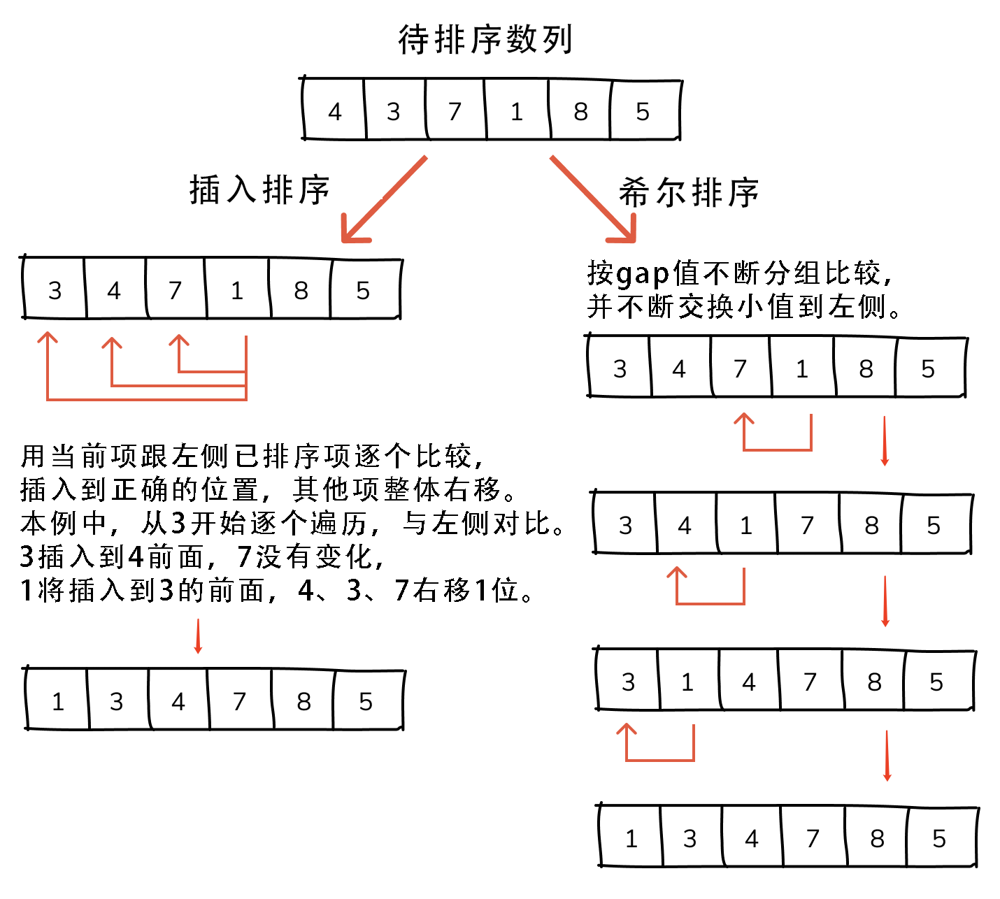
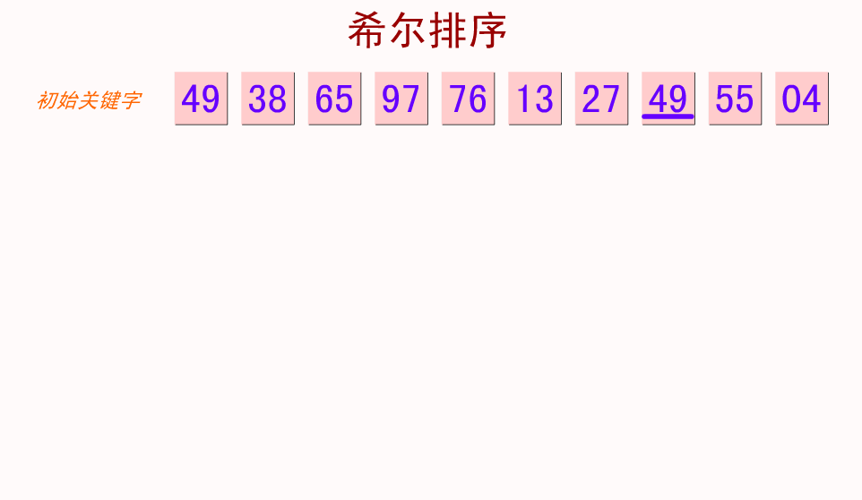

## 【希尔排序算法详解】Java/Go/Python/JS/C不同语言实现

## 说明
希尔排序（Shell Sort）是插入排序的一种改进版，也称递减增量排序算法（Diminishing Increment Sort），其实质是将数列分组，然后再按插入算法分别排序，因DL．Shell于1959年提出而得名。

希尔排序是基于插入排序的以下两点性质而提出改进方法的：
- 插入排序在对几乎已经排好序的数据操作时效率较高，可以达到线性排序的效率。
- 但插入排序对于一般不规则数列来说是低效的，因为插入排序每次只能挪动一位数据。

## 实现过程
1. 定义一个分组间隔（步长），分组规则可以是1/2数组长度或其他。
2. 按步长间隔取出数字组成子序列，针对子序列按照插入算法进行排序。
3. 步长按照分组规则缩量递减，继续新一轮子序列的插入排序。
3. 待步长为1时，再对全体元素进行一次插入排序，排序完成。

步长间隔怎么取呢？在希尔的原稿中建议的初始步长是N/2，就是将每一次排序分成两半，这样取步长在大多数情况下会比插入排序好，但也不是最好。

## 示意图



## 性能分析

    平均时间复杂度：O(Nlog^2N)
    最差时间复杂度：O(N^2)
    空间复杂度：O(1)
    稳定性：不稳定
    复杂性：较复杂

# 代码

## Java
```java
// java希尔排序算法
class ShellSort {

  /* 1. 希尔排序标准版，基于插入排序进行分组排序，步长按1/2缩减。 */
  static int[] shellSort1(int arr[]) {
    int len = arr.length;
    // 设置分组增量值（步长）为1/2的数组长度
    int gap = len / 2;

    // 根据步长得到子序列如果间隔大于0，则表示还可以继续分组
    while (gap > 0) {
      for (int i = gap; i < len; i++) {
        int current = arr[i];
        int j = i;
        // 根据步长得到子序列，对子序列按照插入排序
        while (j >= gap && current < arr[j - gap]) {
          System.out.println("gap=" + gap + " i=" + i + " j=" + j + " arr:" + Arrays.toString(arr));
          arr[j] = arr[j - gap];
          j -= gap;
        }
        // 交换当前项
        arr[j] = current;
      }
      // 缩短一半步长
      gap = gap / 2;
    }
    return arr;
  }

  /* 2. 希尔排序，基于插入排序进行分组排序，步长按3倍递减。 */
  public static int[] shellSort2(int[] arr) {

    int len = arr.length;
    int gap = 1;
    // 初始步长按3倍递增，小于1/3数组长度
    while (gap < len / 3) {
      gap = gap * 3 + 1;
    }

    // 如果间隔大于0，则表示还可以继续分组
    while (gap > 0) {
      for (int i = gap; i < len; i++) {
        int current = arr[i];
        int j = i - gap;
        // 根据步长得到子序列，对子序列按照插入排序
        for (; j >= 0 && arr[j] > current; j -= gap) {
          System.out.println("gap=" + gap + " i=" + i + " j=" + j + " arr:" + Arrays.toString(arr));
          arr[j + gap] = arr[j];
        }
        arr[j + gap] = current;
      }
      // 步长按3倍缩减
      gap /= 3;
    }

    return arr;
  }
```

## Python
```py
# python希尔排序算法
# 1. 希尔排序标准版，基于插入排序进行分组排序，步长按1/2缩减。
def shell_sort1(arr):
    size = len(arr)
    # 设置分组增量值（步长）为1/2的数组长度
    gap = size // 2

    # 根据步长得到子序列，如果间隔大于0，则表示还可以继续分组
    while gap > 0:
        for i in range(gap, size):
            current = arr[i]
            j = i
            # 对子序列按照插入排序
            while j >= gap and current < arr[j - gap]:
                print('gap=' + str(gap) + ' i=' + str(i) + ' j-gap=' +
                      str(j - gap) + ' j=' + str(j))
                arr[j] = arr[j - gap]
                j -= gap
            # 交换当前项
            arr[j] = current
        # 调整步长为1/2
        gap = gap // 2
    return arr


# 2. 希尔排序，基于插入排序进行分组排序，步长按3倍递减。
def shell_sort2(arr):
    size = len(arr)
    gap = 1
    # 初始步长按3倍递增，小于1/3数组长度
    while gap < (size // 3):
        gap = gap * 3 + 1

    # 根据步长得到子序列，如果间隔大于0，则表示还可以继续分组
    while (gap > 0):
        for i in range(gap, size):
            current = arr[i]
            j = i - gap
            # 对子序列按照插入排序s
            while j >= 0 and arr[j] > current:
                print('gap=' + str(gap) + ' i=' + str(i) + ' j=' + str(j) + ' j+gap=' + str(j + gap))
                arr[j + gap] = arr[j]
                j -= gap

            # 还原当前位置
            arr[j + gap] = current

        # 步长按3倍缩减
        gap = gap // 3

    return arr
```

## Go
```go
// go语言希尔排序算法
// 1. 希尔排序标准版，基于插入排序进行分组排序，步长按1/2缩减。
func shellSort1(arr []int) []int {
  var arrLen int = len(arr)
  //  设置分组间隔
  var gap int = (arrLen / 2)
  // 如果间隔大于0，则表示还可以继续分
  for gap > 0 {
    for i := 0; i < arrLen; i++ {
      var current = arr[i]
      var j = i
      // 分组按照插入排序
      for j >= gap && current < arr[j-gap] {
        fmt.Println("gap=", gap, "i=", i, " j-gap=", j-gap, " j=", j)
        arr[j] = arr[j-gap]
        j -= gap
      }
      // 交换当前项
      arr[j] = current
      // 调整步长为1/2
    }
    gap = (gap / 2)
  }
  return arr
}

// 2. 希尔排序，基于插入排序进行分组排序，步长按3倍递减。
func shellSort2(arr []int) []int {
  var arrLen int = len(arr)
  //  设置分组间隔
  var gap int = 1
  // 初始步长按3倍递增，小于1/3数组长度
  for gap < (arrLen / 3) {
    gap = gap*3 + 1
  }
  // 如果间隔大于0，则表示还可以继续分
  for gap > 0 {
    for i := gap; i < arrLen; i++ {
      var current = arr[i]
      var j = i - gap
      // 对子序列按照插入排序
      for ; j >= 0 && arr[j] > current; j -= gap {
        fmt.Println("gap=", gap, "i=", i, " j=", j, " j+gap=", (j + gap))
        arr[j+gap] = arr[j]
      }
      arr[j+gap] = current
    }
    // 步长按3倍缩减
    gap = (gap / 3)
  }
  return arr
}
```

## JS
```js
// js希尔排序算法
/* 1. 希尔排序标准版，基于插入排序进行分组排序，步长按1/2缩减。 */
function shellSort1(arr) {
  const len = arr.length
  // 设置分组增量值（步长）为1/2的数组长度
  let gap = Math.floor(len / 2)
  // 根据步长得到子序列，如果间隔大于0，则表示还可以继续分组
  while (gap > 0) {
    for (let i = 0; i < len; i++) {
      const current = arr[i]
      let j = i
      // 对子序列按照插入排序
      while (j >= gap && current < arr[j - gap]) {
        console.log('gap=' + gap + ' i=' + i + ' j=' + j + ' (j - gap)=' + (j - gap), 'arr:', arr)
        arr[j] = arr[j - gap]
        j -= gap
      }
      // 交换当前项
      arr[j] = current
    }
    // 调整步长为1/2
    gap = Math.floor(gap / 2)
  }
  return arr
}

/* 2. 希尔排序，基于插入排序进行分组排序，步长按3倍递减。 */
function shellSort2(arr) {
  const len = arr.length
  let gap = 1
  // 初始步长按3倍递增，小于1/3数组长度
  while (gap < Math.floor(len / 3)) {
    gap = gap * 3 + 1
  }
  // 根据步长得到子序列，如果间隔大于0，则表示还可以继续分组
  while (gap > 0) {
    for (let i = gap; i < len; i++) {
      const current = arr[i]
      let j = i - gap
      // 对子序列按照插入排序
      for (; j >= 0 && arr[j] > current; j -= gap) {
        console.log('gap=' + gap + ' i=' + i + ' j=' + j + ' (j + gap)=' + (j + gap), 'arr:', arr)
        arr[j + gap] = arr[j]
      }
      arr[j + gap] = current
    }
    // 步长按3倍缩减
    gap = Math.floor(gap / 3)
  }
  return arr
}
```

## TS
```ts
// TS希尔排序算法
// 1. 希尔排序，基于插入排序进行了分组排序
class ShellSort {
  shellSort1(arr: number[]): number[] {
    const len = arr.length
    // 设置分组增量值（步长）为1/2的数组长度
    let gap = Math.floor(len / 2)
    // 根据步长得到子序列，如果间隔大于0，则表示还可以继续分组
    while (gap > 0) {
      for (let i = 0; i < len; i++) {
        const current = arr[i]
        let j = i
        // 对子序列按照插入排序
        while (j >= gap && current < arr[j - gap]) {
          console.log(
            'gap=' + gap + ' i=' + i + ' j=' + j + ' (j - gap)=' + (j - gap),
            'arr:',
            arr
          )
          arr[j] = arr[j - gap]
          j -= gap
        }
        // 交换当前项
        arr[j] = current
      }
      // 调整步长为1/2
      gap = Math.floor(gap / 2)
    }
    return arr
  }

  /* 2. 希尔排序，基于插入排序进行分组排序，步长按3倍递减。 */
  shellSort2(arr: number[]): number[] {
    const len = arr.length
    let gap = 1
    // 初始步长按3倍递增，小于1/3数组长度
    while (gap < Math.floor(len / 3)) {
      gap = gap * 3 + 1
    }
    // 根据步长得到子序列，如果间隔大于0，则表示还可以继续分组
    while (gap > 0) {
      for (let i = gap; i < len; i++) {
        const current = arr[i]
        let j = i - gap
        // 对子序列按照插入排序
        for (; j >= 0 && arr[j] > current; j -= gap) {
          console.log(
            'gap=' + gap + ' i=' + i + ' j=' + j + ' (j + gap)=' + (j + gap),
            'arr:',
            arr
          )
          arr[j + gap] = arr[j]
        }
        arr[j + gap] = current
      }
      // 步长按3倍缩减
      gap = Math.floor(gap / 3)
    }
    return arr
  }
}
```

## C
```c
// C语言希尔排序算法
/* 1. 希尔排序标准版，基于插入排序进行分组排序，步长按1/2缩减。 */
float *shell_sort1(float arr[], int len)
{
  // 设置分组增量值（步长）为1/2的数组长度
  int gap = len / 2;
  // 根据步长得到子序列，如果间隔大于0，则表示还可以继续分组
  while (gap > 0)
  {
    for (int i = 0; i < len; i++)
    {
      float current = arr[i];
      int j = i;
      // 对子序列按照插入排序
      while (j >= gap && current < arr[j - gap])
      {
        arr[j] = arr[j - gap];
        j -= gap;
      }
      // 交换当前项
      arr[j] = current;
    }
    // 调整步长为1/2
    gap = gap / 2;
  }
  return arr;
}

/* 2. 希尔排序标准版，基于插入排序进行分组排序，步长按1/2缩减。 */
int *shell_sort2(int arr[], int len)
{
  // 设置分组增量值（步长）为1/2的数组长度
  int gap = 1;
  // 初始步长按3倍递增，小于1/3数组长度
  while (gap < len / 3)
  {
    gap = gap * 3 + 1;
  }
  // 根据步长得到子序列，如果间隔大于0，则表示还可以继续分组
  while (gap > 0)
  {
    for (int i = 0; i < len; i++)
    {
      int current = arr[i];
      int j = i - gap;
      // 对子序列按照插入排序
      for (; j >= 0 && arr[j] > current; j -= gap)
      {
        arr[j + gap] = arr[j];
      }
      arr[j + gap] = current;
    }
    // 步长按3倍缩减
    gap = (gap / 3);
  }
  return arr;
}
```

# 链接
希尔排序算法源码：[https://github.com/microwind/algorithms/tree/master/sorts/shellsort](https://github.com/microwind/algorithms/tree/master/sorts/shellsort)

其他排序算法源码：[https://github.com/microwind/algorithms](https://github.com/microwind/algorithms)