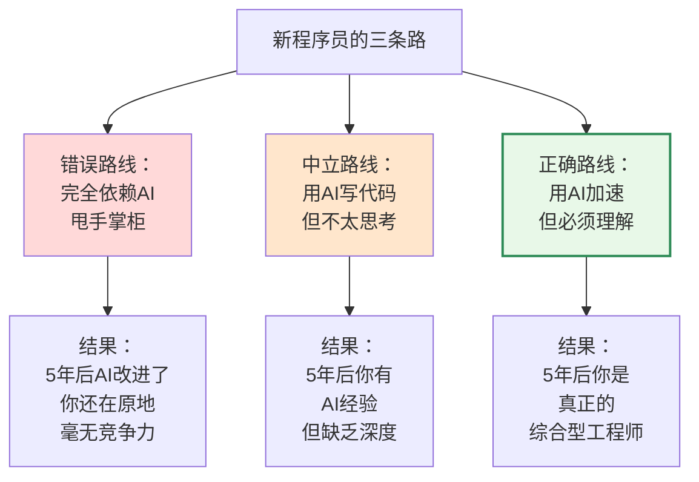
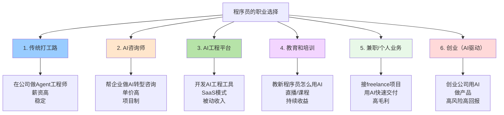

# AI时代，新人程序员的发展机遇

## 新程序员如何赶上这个时代的机遇

如果你是35岁以下的程序员，你面临的情况完全不同。

坦白说，你的劣势很明显：**经验不足。**

但你的优势也明显：**时间充足，还有30年职业生涯。**

关键是不要走错路。

### 你现在最容易犯的错误

最常见的错误：年轻人用Cursor写代码，AI写了就用，从不审查，从不思考。

这种人到第5年的时候，会发现自己卡住了。因为他们完全依赖AI，AI稍微出点问题就不知所措。

这样的人，会被真正懂的人吊打。

### Step 1：打牢编程基础（第1-2年很关键）

这一步老程序员不需要，但你必须做。

**不要急着用AI，先学会手写代码。**

我知道这听起来很"传统"，但我是认真的。

原因很简单：
看AI写代码和自己写代码，是完全不同的两种学习方式。

你需要经历：
1. 思考 → 2. 尝试 → 3. 失败 → 4. 调试 → 5. 理解

这个完整的过程，才能真正学会。

如果你的第一个项目就用AI写，你可能永远都不会知道为什么某个边界情况会出bug。

所以：
- 前3个月：坚持手写代码，不用AI
- 3-6个月：AI开始当参考，但你要理解它的输出
- 6个月+：AI当加速工具，但你能验证它

### Step 2：系统学习数据结构和算法（第2-3年）

这不是选项，是必修课。

不是说要你刷LeetCode 500题（虽然刷是没错）。而是要你：

**理解每种数据结构的本质**
  （为什么Hash表查询是O(1)，二叉树是O(log n)）

**掌握核心算法思想**
  （贪心、分治、DP、搜索）

**知道什么问题该用什么思想**
  （看到搜索问题会想到BFS/DFS）

**能分析复杂度**
  （看一个算法就能说出时空复杂度）

这个学习不是为了面试，而是为了5年后能指导AI。

一个30岁的程序员如果不懂算法思想，指导不了AI。但一个30岁的程序员如果懂，就能做出真正好的系统。

### Step 3：参与足够多的系统设计评审（第3-5年）

这个很多公司都不重视，但对年轻人特别重要。

你要：
- 参加架构评审，听老工程师怎么分析问题
- 参加需求评审，看资深产品怎么理解业务
- 参加技术选型，学习如何在方案间权衡

不是旁听，是要真的提问、讨论、思考。

这些经验，是AI教不了的。**只有在真实的复杂系统面前，你才能学到。**

### Step 4：主动建立自己的知识库

到了第3年左右，开始记录：

- 遇到过的问题和解决方案
- 不同的系统设计方案对比
- 用过的算法和它们的适用场景
- 项目中的失败案例和教训

这个知识库，5年后就成了你最大的财富。

### Step 5：不要在一个地方呆太久

这对年轻人特别重要。

前5年，最好换2-3个公司或者2-3个项目，这样能接触不同的：
- 业务场景（推荐、广告、支付、交易……）
- 技术栈（不同语言、不同框架）
- 团队风格（学会看不同的工程师怎么工作）

这种广度的积累，到第5年的时候，就成了你的竞争力。

### 给新程序员的忠告

你现在最大的优势不是"学新技术快"，而是"还有30年职业生涯"。

不要因为有AI就放弃深度学习。反而要更认真地学，因为你的竞争者也在学。

5年后，同样用AI的两个人：

- 一个人什么都懂，能指导AI做复杂系统
- 一个人只会用AI写CRUD，面对复杂问题卡壳

前者月薪50k+，后者月薪15k。

差别不在于AI能力，在于你本身的深度。

以前的情况：程序员的职业路线很单一。

进公司 → 做开发 → 升级做架构 → 升级做管理 → 升级做总监/VP

基本就这一条路。要么继续打工，要么创业。

现在不一样了。

### 新的职业模式正在形成

### 案例1：AI咨询师

某个40岁的工程师，在大厂呆了15年。现在他辞职了，和两个朋友做AI转型咨询。

模式很简单：
帮企业评估 → 做转型方案 → 执行和验证 → 持续优化

每个项目：
- 小企业：20-30万
- 中等企业：50-100万
- 大企业：200万+

他一年做3-5个项目，收入反而比在大厂高。而且更自由。

关键是：他的"能力"没变，只是**把能力换了个卖法**。

### 案例2：AI工程工具

某个35岁的工程师，开发了一个"AI辅助的系统设计工具"。

用户是中小企业的技术负责人。他们不懂怎么用AI做系统设计，这个工具帮他们实现BEAT/SCALE框架，然后指导AI。

现在这个工具有几千个付费用户，月收入20-30万。

他的工作？维护工具、更新AI提示词、收集用户反馈。一周工作15小时。

这就是**被动收入模式**。

### 案例3：教育

还有人开始教年轻程序员"怎么用AI时代的思维做开发"。

他开了个在线课程，目前有2000+学员，月收入10万+。

这种"经验商品化"的模式，以前存在，但没这么赚钱。现在因为AI的出现，需求暴增了。

### 案例4：Freelance项目交付

某个33岁的程序员，现在接freelance项目。

以前接一个项目需要2个月，现在用AI加速，1个月就能完成。

结果就是：**同样的时间，能做更多项目，收入翻倍。**

以前：一年接6个项目 = 年收60万
现在：一年接12个项目 = 年收120万
（单价不变，但效率翻倍）

### 新的选择框架

你要选择哪条路？取决于你想要什么：

稳定 + 高薪 → 在大厂做Agent工程师
              （薪资50k+，但要上班）

自由 + 高收入 → Freelance或咨询
              （收入不稳定，但更自由）

被动收入 → 做SaaS产品或教育
          （需要投入初期，然后持续收益）

创业梦想 → 用AI创业
         （高风险，但如果成功回报巨大）

关键是：**选择权回到了你手里。**

不再是"打工or失业"的二元选择，而是有多条路可以走。
