# AI时代，人人都是Agent工程师

> 随着AI编程的普及，每程序员都有个疑问："我写了多年的代码，经验丰富，但AI写得比我快还好，那我还有价值吗？"

AI时代，不是所有人都需要写代码，但所有人都需要会**驱动AI干活**。当Claude Code、CodeX、OpenClaw等大模型和Agent出现后，传统职能边界变得模糊——产品经理可以指导AI设计UI，测试可以用AI生成测试用例，程序员可以用提示词指导AI写代码。但这一切的前提是：**你要会指导AI干什么，怎么干，以及如何验证干得对不对**。

换句话说，每个人都需要成为"**会驱动AI干活的工程师**"——这就是**Agent工程师**。

> AI时代的竞争力不是你能干什么，而是你能指导AI干什么、怎么干、干得有多好。

**本文相关资源请见** [https://github.com/microwind/algorithms](https://github.com/microwind/algorithms)

## 目录

1. [背景：AI Agent工具的冲击](#一背景ai-agent工具的冲击)
2. [什么是Agent工程师](#二什么是agent工程师)
3. [为什么人人都是Agent工程师](#三为什么人人都是agent工程师)
4. [成为Agent工程师的三层能力](#四成为agent工程师的三层能力)
5. [Agent工程师的工作流程与实战场景](#五agent工程师的工作流程与实战场景)
6. [什么样的人更容易成为Agent工程师](#六什么样的人更容易成为agent工程师)

---

## 一、背景：AI Agent工具的冲击

### 最近三年的变化

从2023年ChatGPT爆红到现在，AI工具已经深刻改变了软件开发的各个环节：

| 时间 | 代表工具 | 影响 | 程序员角色变化 |
|-----|-----------|------|---------------|
| 2023 | ChatGPT生成式大模型 | 大模型能力得到验证 | 通过提示词辅助编写和调试代码 |
| 2024 | Cursor、Windsurf等 AI 编辑器 | AI 深度集成到 IDE | IDE 从代码编辑器逐渐演变为 AI神器 |
| 2025 | Claude Code、CodeX等编程模型 | Vibe Coding 开始流行 | 通过需求对话生成代码 |
| 2026 | OpenClaw / Agent框架 | AI 具备一定自主执行能力 | 从“**写代码**”转向“**驱动 AI 干活**” |

关键的转折点是：**从"AI是工具"到"AI是员工"**。

- ✗ 旧时代：程序员写代码，代码执行
- ✓ 新时代：程序员指导AI，AI写代码，代码执行

### 传统职能边界正在消融

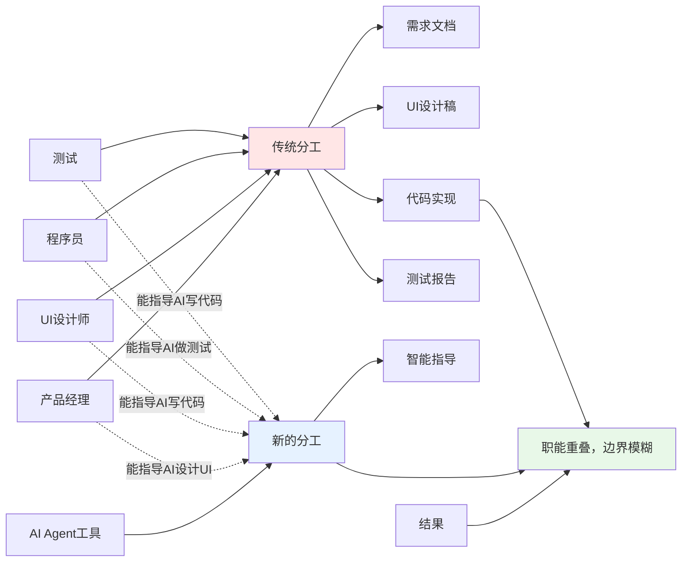

**现实中的例子**：

- Figma 推出 AI 设计功能后，一个产品经理可以快速生成 UI 原型，不再完全依赖设计师。
- Claude Code 等 编程模型出现后，需求方自己可以通过自然语言指导AI生成可上线的软件。
- 当 OpenClaw 等 Agent 框架能够处理多步骤复杂任务后，业务分析师可以直接指导 AI 完成完整工作流。

> **这不是未来趋势，这就是现在正在发生的事实。**

### 新的职能结构正在形成

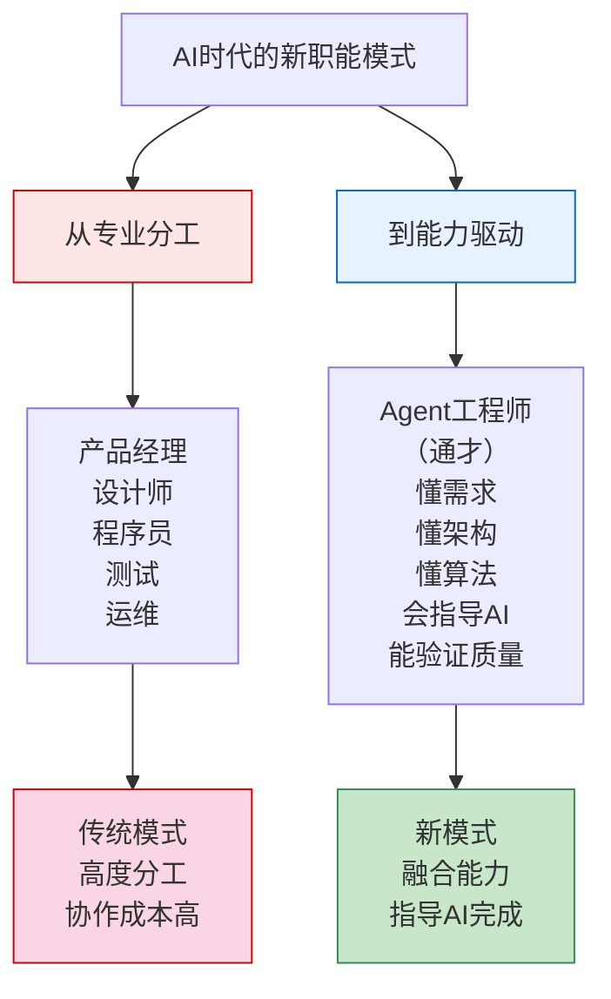

---

## 二、什么是Agent工程师

### 定义

**Agent工程师**是指能够有效地指导和驱动AI Agent完成复杂任务的工程师。核心职责不是"**做什么**"，而是"**指导AI干什么，怎么干，以及验证做得对不对**"。

### 核心特征

一个优秀的Agent工程师应该具备：

**1. 深度理解能力**
```
- 能清晰地理解和描述业务问题
- 从表面需求挖掘真实需求
- 转化为AI能理解的指令
```

**2. 系统设计能力**
```
- 能定义问题的边界和约束
- 进行容量规划和性能权衡
- 设计系统的整体架构
```

**3. 算法思想能力**
```
- 能用算法思想指导AI选择方案
- 理解复杂度和性能权衡
- 验证AI生成的代码质量
```

**4. 指导协调能力**
```
- 能用清晰的语言指导AI
- 能根据结果快速调整策略
- 能多轮迭代优化结果
```

**5. 质量验证能力**

```
- 能评估AI的工作质量
- 能识别AI的弱点和局限
- 能提出改进方向
```

### Agent工程师 vs 传统程序员

| 维度 | 传统程序员 | Agent工程师 |
|------|-----------|-----------|
| **核心职责** | 写代码 | 指导AI |
| **输入** | 需求文档 | 业务问题 |
| **输出** | 代码和系统 | 指令和验证 |
| **核心能力** | 编码和调试 | 理解和指导 |
| **与AI的关系** | 有时使用 | 日常依赖 |
| **关键素质** | 技术深度 | 综合素质 |

> **核心变化：从"我会干"变成"我会让AI干得更对更好"。**

### Agent工程师的实际工作场景

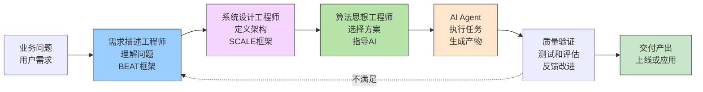

---

## 三、为什么人人都是Agent工程师

### 原因1：职能边界正在消融

#### 真实案例：互联网大厂的组织变化

```
✓ 2024年之前的某SNS推荐系统团队：
  - 1个产品经理（定需求）
  - 3个后端工程师（架构和实现）
  - 1个算法工程师（优化算法）
  - 2个前端工程师（接口和展示）
  - 1个测试工程师（测试）
  - 1个运维工程师（上线和维护）
  总计：9人

✓ 2025年后的推荐系统团队：
  - 1个产品+技术融合岗（需求+架构）
  - 2个全栈工程师（指导AI完成）
  - 1个算法思想顾问（兼职）
  总计：3-4人
  
 ✓ 2026年后会更少，AI Agent成本会逐渐下降

变化的核心：一个懂需求、懂架构、能指导AI的工程师替代了之前的5-6个分工明确的专家。
```

#### 为什么会这样？

**AI的能力范围在扩大**：

- 写代码：AI已经可以
- 设计系统：AI可以参考最佳实践
- 测试用例：AI可以自动生成
- 代码审查：AI可以找出缺陷
- 优化建议：AI可以提出方向

**传统分工的成本在上升**：
- 协作成本：5个人需要经常沟通协调
- 效率损失：需求传递三四次才能理解准确
- 人力成本：每个人都需要招聘培养

**一个优秀的Agent工程师可以**：

- 直接指导AI完成整个工作流
- 避免多轮协作的低效
- 减少专业分工的成本

### 原因2：大厂组织优化的实践

最近两年，很多大厂都在做这样的探索：

```
某短视频公司：
✓ 取消部分"产品设计-研发-测试"的线性流程
✓ 改成"全栈工程师+AI助手"的模式
✓ 同一个人可以在2周内完成：需求评审→系统设计→代码开发→功能测试→上线发布

某电商公司：
✓ 推出"AI编程开发平台"后，招聘标准从"专家型程序员"改为"全能型工程师"
✓ 不再强调"Java专家"或"前端专家"，而是"能理解需求的全栈工程师"

某SNS公司：
✓ 某些项目团队从12人缩减到4人
✓ 核心变化：不是人少了，而是职能融合了
✓ 关键岗位从"编码能力强"改为"指导AI能力强"
```

> **数据不会说谎：效率提升300%，人力成本下降50%。**

### 原因3：职责已经融合了

#### 一个典型的场景

**2023年前的流程**（传统方式）：
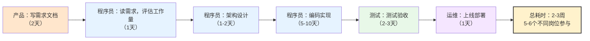

**2025年后的流程**（AI方式）：

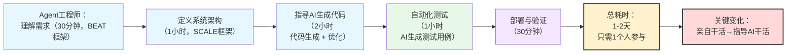

#### 为什么职责会融合？

| 职能 | 传统方式 | AI时代方式 |
|------|---------|-----------|
| **需求理解** | 产品经理负责 | 所有人都需要理解 |
| **架构设计** | 资深工程师负责 | 懂需求的人设计 |
| **代码实现** | 程序员负责 | AI负责，人指导 |
| **质量验证** | 测试负责 | AI+人双重验证 |
| **上线部署** | 运维负责 | 自动化，人监督 |

**结论**：当AI可以干具体的活儿之后，原来的"专业分工"就变成了"能力融合"。

> 职责合并是大势所趋，好消息是**经验从来没有像今天这样值钱。**

---

## 四、成为Agent工程师的三层能力

Agent工程师需要具备"需求描述"、"系统设计"和"算法思想"三层能力。这三层能力正是前面三篇文章重点讨论的内容。

### 第一层：需求描述能力（What）

**核心问题**：能否清晰地理解和描述业务问题？

#### 能力要求

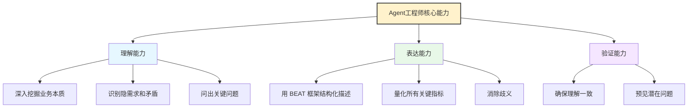

#### 指导AI的场景
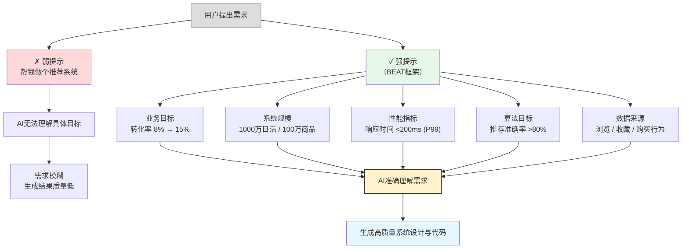


### 第二层：系统设计能力（Scope）

**核心问题**：能否合理地定义系统边界和约束？

#### 能力要求
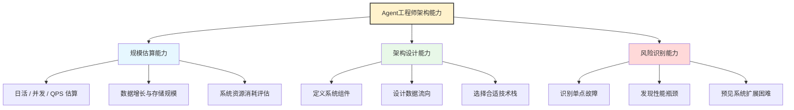

#### 指导AI的场景
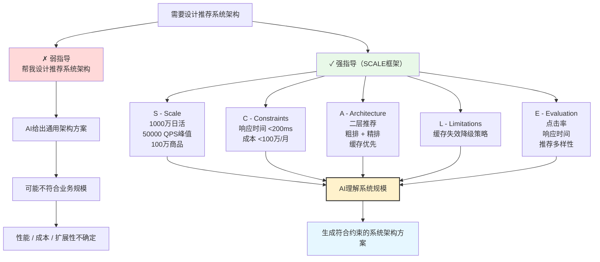

### 第三层：算法思想能力（How）

**核心问题**：能否用算法思想指导AI选择最优方案？

#### 能力要求
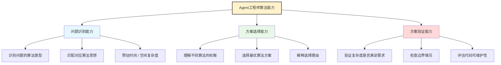

#### 指导AI的场景

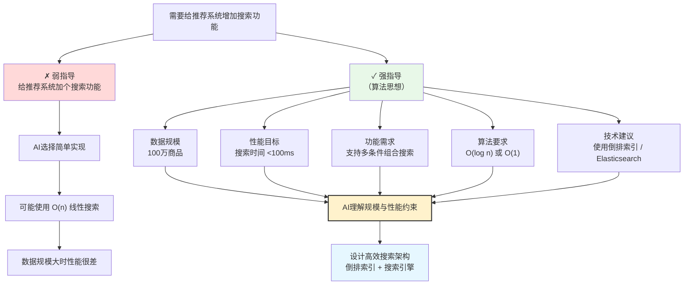

### 三层能力的关系

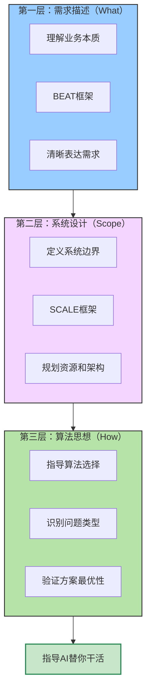

### 实践建议

如果你想成为Agent工程师，应该这样提升：

```
初期（1-3个月）：
✓ 深入学习BEAT框架，理解需求的本质
✓ 学习SCALE框架，掌握系统设计的方法
✓ 了解常见的算法思想，知道什么时候用什么

中期（3-6个月）：
✓ 参与2-3个真实项目的完整设计
✓ 用三层能力框架来指导AI
✓ 积累不同问题类型的设计经验

深化（6-12个月）：
✓ 能独立指导AI完成复杂系统开发
✓ 能指导团队成员提升三层能力
✓ 建立自己的最佳实践库
```

---

## 五、Agent工程师的工作流程与实战场景

Agent工程师的工作流程可以归纳为：**理解需求 → 定义边界 → 指导AI → 验证质量 → 迭代优化**。

下面通过5个真实的行业场景来展示这个流程。

### 场景1：信息流分发系统开发

#### 业务背景

某短视频平台需要优化信息流分发算法，提升用户粘性和日活。

#### Agent工程师的工作流程

**第一步：需求描述（What）**

用BEAT框架理解需求：

```
B - Background：
当前分发系统推荐准确率低（点击率5%），用户停留时间短（平均2分钟）。
需要通过优化推荐算法来提升用户体验。

E - Expectation：
- 点击率从5%提升到12%
- 用户停留时间从2分钟提升到5分钟
- 推荐多样性指数提升到0.8

A - Action：
- 收集用户行为数据（浏览、点赞、分享、完成度）
- 基于用户画像和视频特征计算相似度
- 混合不同推荐策略（协同过滤、内容相似度、热度排序）
- 支持个性化和社交推荐

T - Test：
- 日活用户5000万
- QPS 100000+
- 响应时间<200ms（P99）
- 模型更新频率1小时
```

**第二步：系统设计（Scope）**

用SCALE框架定义架构：

```
S - Scale：
- DAU 5000万
- 峰值并发 50万用户
- QPS 100000
- 视频库 500万内容
- 日数据增长 50GB

C - Constraints：
- 响应时间<200ms（P99）
- 推荐准确率>12%
- 成本<500万/月
- 支持灰度发布

A - Architecture：
三层推荐架构：
[粗排] -> [精排] -> [过滤和混排] -> [结果]

粗排：热度排序+基础协同过滤，1000 QPS，<50ms
精排：向量相似度，100 QPS，<100ms
过滤：规则过滤，<20ms
缓存：Redis热数据缓存，80%命中率

L - Limitations：
降级1（粗排超时）：返回热度内容
降级2（精排宕机）：返回粗排结果
降级3（整体故障）：返回热门内容

E - Evaluation：
- 点击率、停留时间、分享率
- P99延迟、QPS、可用性
- A/B测试效果评估
```

**第三步：指导AI（How）**

用算法思想指导AI实现：

```
Agent工程师的指令：

推荐系统分为三层处理：

1. 粗排层（贪心算法）：
   - 从500万视频中快速选出Top 1000
   - 用贪心策略：评分最高优先
   - 时间复杂度：O(n log n)排序 + O(1000)遍历
   - 实现：Elasticsearch + 快速排序

2. 精排层（动态规划思想）：
   - 从1000个候选中选出20个最优推荐
   - 平衡相似度和多样性
   - 用MMR算法（最大边际相关性）
   - 时间复杂度：O(k²)，k=1000

3. 过滤和混排层（贪心+规则）：
   - 应用业务规则（不推已看、不推禁内容）
   - 插入广告和热点（贪心插入）
   - 时间复杂度：O(n)
```

**第四步：验证质量**

AI生成代码后，Agent工程师验证：

```
✓ 复杂度检查：
  粗排：O(n log n)，符合<50ms要求
  精排：O(k²)，k=1000，约100ms，符合
  总计：约150ms，满足<200ms要求

✓ 边界情况：
  新用户推荐？（用热度排序降级）
  新视频推荐？（用内容相似度）
  推荐列表不足10个？（用热度补充）

✓ 性能验证：
  单台16核机器支持多少QPS？
  需要多少台服务器？
  缓存命中率能达到80%吗？

✓ 改进方向：
  向量相似度计算可以用FAISS加速
  可以增加实时热点检测
  可以支持更复杂的混合策略
```

**第五步：迭代优化**

根据线上数据反馈持续改进：

```
第一周上线：点击率10%，用户停留2.5分钟
✓ 效果不错，继续优化

遇到的问题：
✗ 推荐结果过于同质化（都是头部视频）
✗ 新用户推荐效果不好

改进方向：
✓ 加强多样性约束（品类分散）
✓ 冷启动问题：用热度排序 + 用户地理位置推荐

一个月后：点击率12%，用户停留4分钟
→ 达到目标，可以全量上线
```

### 场景2：广告投放系统开发

#### 业务背景

电商平台的广告系统需要优化，提高广告收入和用户体验的平衡。

#### Agent工程师的工作流程

**第一步：需求描述**

```
B - Background：
当前广告系统投放效率低（CTR 2%），用户体验差（厌烦度高）。
需要通过智能竞价和优化投放来提升收入和用户体验。

E - Expectation：
- 广告收入提升50%（从1000万/天到1500万/天）
- 用户厌烦度下降30%
- 广告CTR从2%提升到3.5%

A - Action：
- 收集广告展示和点击数据
- 计算用户广告偏好模型
- 实时竞价优化
- 支持多维度的广告限频

T - Test：
- 日均广告展示 50亿次
- QPS 150000
- 竞价计算时间<100ms
- 支持1万+广告主同时竞价
```

**第二步：系统设计**

```
S - Scale：
- 日展示量 50亿
- QPS 150000
- 广告库 100万创意
- 日数据增长 100GB

C - Constraints：
- 竞价响应<100ms
- 成本<300万/月
- 支持分钟级算法更新

A - Architecture：
[请求进来] -> [广告检索] -> [粗排竞价] -> [精排优化] -> [投放]

广告检索：快速找到候选广告，<20ms
粗排竞价：选Top 100广告，基于出价排序，<30ms
精排优化：考虑CTR和用户体验权衡，<40ms
投放判断：频率控制和冲突检测，<10ms

L - Limitations：
降级1：检索超时 -> 返回默认广告
降级2：竞价超时 -> 用缓存出价结果
降级3：广告库故障 -> 返回默认内容

E - Evaluation：
- 广告收入、CTR、转化率
- 用户厌烦度指标
- 投放成本和效率
```

**第三步：指导AI**

```
广告竞价问题属于【多目标优化问题】

指导方向：
1. 广告检索层（分治思想）：
   - 按广告类别分片存储（Z轴分解）
   - 并行检索各类别top结果
   - 合并排序返回top 100

2. 粗排竞价层（贪心算法）：
   - 基于实时出价和历史CTR计算综合分
   - 贪心选择分最高的广告
   - O(n log n)排序

3. 精排优化层（动态规划思想）：
   - 状态：(已选广告集合，剩余展示位)
   - 目标：最大化(收入 × 用户体验指数)
   - 用DP记忆化避免重复计算

4. 验证和降级：
   - 支持投放冲突检测（同一广告主不超过K个）
   - 用户频率控制（同用户同类广告展示频率限制）
   - 时间约束：必须在100ms内完成全部处理
```

### 场景3：数据报表系统开发

#### 业务背景

BI团队需要快速搭建自助分析平台，让业务方能自己生成报表。

#### Agent工程师的工作流程

**第一步：需求描述**

```
B - Background：
当前报表系统由BI手工编写，每个报表需要2-3天。
业务方期望能自助生成报表，加速决策效率。

E - Expectation：
- 支持100种常见报表模板
- 业务方能在5分钟内生成自定义报表
- 报表查询延迟<5秒

A - Action：
- 建立报表模板库
- 支持拖拽式报表设计
- 实时数据聚合和展示

T - Test：
- 用户量：1000+
- 日报表生成：10000+
- 并发查询：100+
- 数据延迟：<1分钟
```

**第二步：系统设计**

```
S - Scale：
- 1000+用户
- 日生成10000份报表
- 数据量：TB级

C - Constraints：
- 查询响应<5秒
- 支持自定义维度和指标
- 权限控制

A - Architecture：
[模板库] -> [查询构建] -> [数据聚合] -> [可视化]

模板库：预设100个常用模板
查询构建：拖拽生成SQL
数据聚合：从数据仓库查询
可视化：支持表、图表、数据看板

L - Limitations：
降级1：查询超时(>5s) -> 返回采样数据
降级2：聚合失败 -> 返回缓存结果

E - Evaluation：
- 用户满意度
- 报表准确率
- 查询响应时间
```

**第三步：指导AI**

```
这是一个【快速功能实现】问题

指导方向：
1. 模板生成（用回溯算法）：
   - 从维度和指标的组合空间中枚举
   - 过滤掉不合理的组合
   - 返回Top N最有用的模板

2. 查询优化（分治 + 动态规划）：
   - 分治：按维度分片查询
   - DP：优化join顺序（同数据库查询优化）
   - 缓存中间结果加速重复查询

3. 权限检查（贪心算法）：
   - 逐个检查维度和指标权限
   - 快速回退不允许的组合

4. 性能保证：
   - 预计算常用维度组合结果
   - 使用列式存储加速聚合
   - 支持增量更新缓存
```

### 场景4：视频播放系统开发

#### 业务背景

视频平台需要优化播放体验，降低卡顿率和启动时间。

#### Agent工程师的工作流程

**第一步：需求描述**

```
B - Background：
当前视频平台卡顿率5%，启动时间3秒，用户投诉多。
需要提升播放体验，特别是弱网环境。

E - Expectation：
- 卡顿率从5%降到<1%
- 启动时间从3秒降到<1秒
- 用户完成率提升20%

A - Action：
- 智能码率自适应
- 预加载和缓冲优化
- CDN边缘计算加速
- 弱网检测和降级

T - Test：
- 日活：5000万
- 并发：50万
- 视频库：1000万
- 带宽成本：关键优化目标
```

**第二步：系统设计**

```
S - Scale：
- DAU 5000万
- 并发50万
- 视频库1000万
- 日传输流量 EB级

C - Constraints：
- 启动时间<1秒
- 卡顿率<1%
- 带宽成本最低化
- 支持4K/8K

A - Architecture：
[用户请求] -> [网络检测] -> [码率选择] -> [CDN调度] -> [播放]

网络检测：检测带宽和延迟
码率选择：根据网络动态调整
CDN调度：选择最近节点
缓冲优化：智能预加载

L - Limitations：
降级1：带宽不足 -> 自动降低码率
降级2：CDN故障 -> 切换节点

E - Evaluation：
- 启动时间、卡顿率
- 带宽消耗、成本
- 用户完成率
```

**第三步：指导AI**

```
这是一个【实时优化 + 分布式调度】问题

指导方向：
1. 网络检测（贪心算法）：
   - 快速测试带宽：发送小包测量延迟
   - 动态更新：根据播放过程中的丢包调整

2. 码率选择（动态规划）：
   - 状态：(当前码率, 缓冲量, 网络带宽)
   - 目标：最大化(画质分 - 卡顿分 - 切换分)
   - 用DP确定最优码率序列

3. CDN调度（分治 + 启发式搜索）：
   - 分治：将用户按地域分组
   - 启发式：根据延迟选择最近CDN节点
   - 考虑节点负载均衡

4. 缓冲优化（贪心算法）：
   - 预判用户观看时长
   - 贪心选择预加载视频片段
   - 在带宽和存储间平衡
```

### 场景5：点餐小程序开发

#### 业务背景

某连锁餐饮企业需要快速上线点餐小程序，支持堂食、外卖、预订三种模式。

#### Agent工程师的工作流程

**第一步：需求描述**

```
B - Background：
传统点单方式效率低，用户体验差。需要上线小程序加速业务。

E - Expectation：
- 支持日订单5000+
- 用户下单从5分钟降到1分钟
- 出错率<0.5%

A - Action：
- 菜单展示和搜索
- 购物车管理
- 订单支付和追踪
- 评价和会员积分

T - Test：
- 用户量：10万+
- 日活：1万
- QPS：100
- 并发订单：50
```

**第二步：系统设计**

```
S - Scale：
- 日订单5000
- QPS 100（峰值）
- 菜品库1000+
- 门店100+

C - Constraints：
- 响应时间<500ms
- 成本<50万/年
- 支持快速迭代

A - Architecture：
[客户端] -> [API网关] -> [订单服务] -> [支付/库存] -> [后厨系统]

客户端：小程序+H5
API网关：限流和鉴权
订单服务：订单CRUD
支付：第三方支付
库存：菜品库存管理
后厨：打单和配送

L - Limitations：
降级1：支付超时 -> 提示重试
降级2：库存查询超时 -> 默认可售
降级3：后厨系统故障 -> 通知商户

E - Evaluation：
- 订单完成率
- 用户满意度
- 系统可用性
```

**第三步：指导AI**

```
这是一个【快速MVP开发】问题

指导方向：
1. 菜单搜索（二分查找 + 倒排索引）：
   - 用ElasticSearch快速搜索
   - 支持关键词、分类、价格范围等多维度

2. 购物车（贪心 + 动态规划）：
   - 自动应用优惠券：贪心选择最大优惠
   - 计算总价：DP计算满减组合优化

3. 订单流程（状态机 + 事务）：
   - 订单状态：已下单 -> 已支付 -> 已确认 -> 已完成
   - 确保库存检查和支付的原子性

4. 库存管理（贪心 + 并发控制）：
   - 快速库存检查
   - 库存扣减：用数据库事务保证一致性
   - 库存恢复：支付失败时回滚

5. 后厨对接（消息队列）：
   - 异步推送订单到后厨
   - 订单状态变化通知前端
   - 重试机制保证可靠
```

### Agent工程师工作的共同特点

通过这5个场景，我们可以看到Agent工程师工作的共同特点：

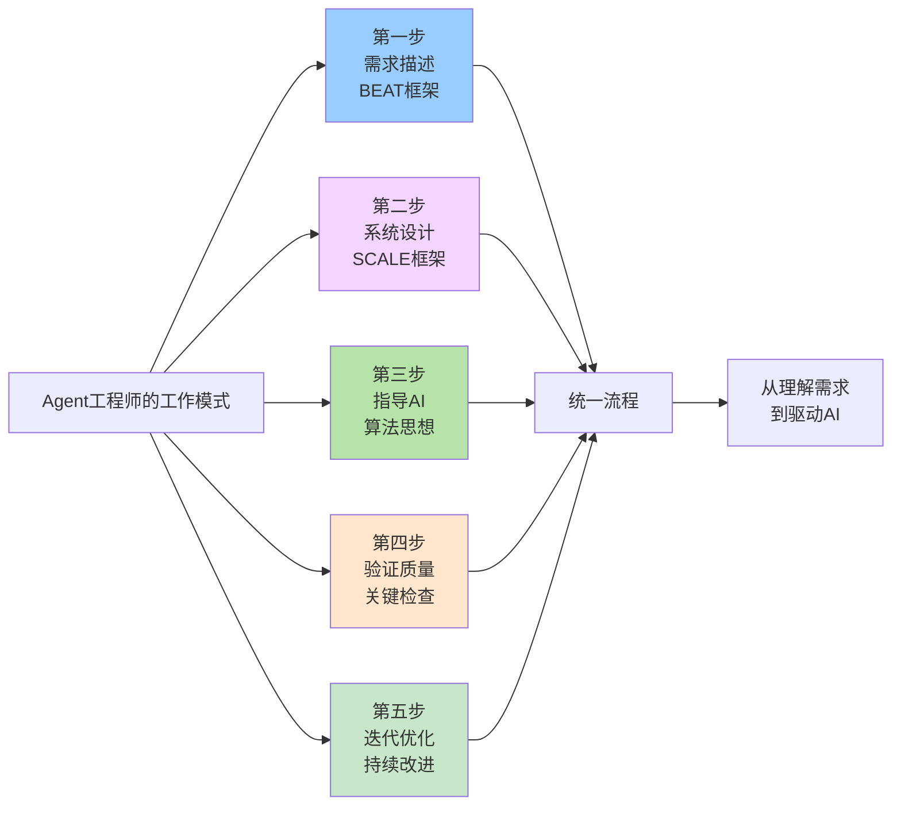

---

## 六、什么样的人更容易成为Agent工程师

不是所有人都能成为优秀的Agent工程师。经验丰富的程序员、懂业务的产品经理、有全局视野的架构师——这些人更容易转变成Agent工程师。

### 关键因素分析

#### 1. 经验深度很重要

```
✗ 缺乏经验的新手：
  - 不懂系统设计的权衡
  - 不了解常见的坑
  - 指导AI时容易出错

✓ 有5年以上经验的工程师：
  - 看过多种系统架构
  - 经历过性能优化的全过程
  - 能快速识别问题本质
  - 能指导AI做出更优的选择
```

#### 2. 业务理解很关键

```
✗ 只懂技术不懂业务的人：
  - 设计的系统偏离业务需求
  - 优化方向不对
  - 浪费AI的能力

✓ 既懂技术又懂业务的人：
  - 能准确理解需求
  - 知道哪些优化最重要
  - 能指导AI做出业务最优解
```

#### 3. 全局视野很必要

```
✗ 只聚焦在某个领域的人：
  - 不知道如何权衡
  - 容易过度优化
  - 难以整体协调

✓ 有全局视野的人：
  - 能看到系统的全图
  - 知道在哪些地方妥协
  - 能协调多个模块的优化
```

### 为什么老程序员更容易转变成Agent工程师？

#### 经验是最大的优势

一个有10年+经验的老程序员为什么比新手更容易成为Agent工程师？

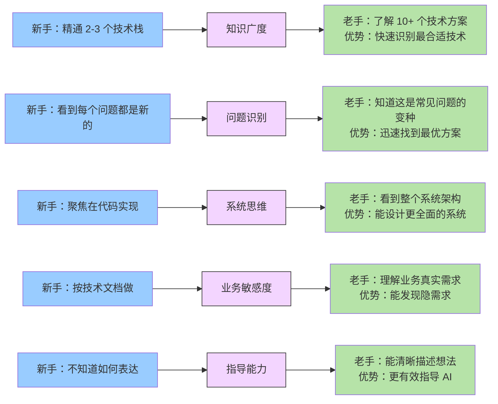

### 成为Agent工程师的建议

#### 给有经验程序员的建议

```
你的优势：
✓ 有足够的技术深度
✓ 有足够的业务理解
✓ 有足够的系统思维

需要改进的地方：
✗ 学会用BEAT框架清晰表达需求
✗ 学会用SCALE框架设计系统
✗ 学会用算法思想指导AI
✗ 学会验证和迭代

建议：
1. 花1-2个月深入学习三个框架
2. 用3-5个项目实践框架
3. 建立自己的检查清单
4. 积累指导AI的经验和技巧

你已经在3/4的路上了，只需要学会"表达和指导"就行。
```

#### 给新手的建议

```
你的劣势：
✗ 经验不足，容易被坑
✗ 对系统的了解还不深入
✗ 业务知识不够

建议：
1. 不要急着成为Agent工程师
2. 先花3-5年积累业务和技术经验
3. 参与足够多的系统设计评审
4. 主动学习系统设计和架构知识
5. 建立自己的知识库

（如果你现在就想做Agent工程师的工作，需要搭配有经验的人组队）
```

### 下篇预告

**经验的价值为什么越来越凸显？**

在AI时代，一个有10-20年经验的程序员和一个有2-3年经验的程序员，使用同样的AI工具，效率差距可能是10倍以上。这是为什么呢？

下篇文章《AI时代，为什么35岁以上的老程序员更吃香？》将从以下角度深入探讨：

```
1. 经验的乘数效应
   - AI放大了经验的价值
   - 为什么AI时代"老"反而变成优势？

2. 能力模型的差异
   - 新手vs老手的核心差别
   - 为什么经验很难用AI替代？

3. 职业发展的新机遇
   - 35岁不再是职业的终点
   - 而是成为Agent工程师的起点

4. 如何延长职业生命周期
   - 与其抗衡年龄，不如升级能力
   - 成为不可替代的Agent工程师
```

---

## 总结

### 关键认知

1. **职能在融合**：不再是"专业分工"，而是"能力融合"
2. **角色在转变**：从"编码者"变成"指导者"  
3. **价值在改变**：从"写多少代码"变成"能指导AI干什么"

> **从码农到AI指挥官，这是程序员唯一的出路。**

### Agent工程师的三层能力

```
第一层：需求描述（What）
  → 用BEAT框架理解和表达需求

第二层：系统设计（Scope）
  → 用SCALE框架定义系统边界

第三层：算法思想（How）
  → 用算法思想指导AI选择方案
```

### 核心建议

```
对有经验的程序员：
✓ 你已经有了大部分的能力，只需要学会如何指导AI

对产品和设计同学：
✓ 不要只依赖程序员，学会这三层能力可以更有效地合作

对想要转为Agent工程师的人：
✓ 优先积累经验和业务理解
✓ 然后系统地学习这三个框架
✓ 最后用大量的实践来强化能力
```

---

## 相关链接

- [AI时代，人人都是需求描述工程师](https://github.com/microwind/algorithms/blob/main/start-here/AI-Era-Programmers-as-Requirements-Engineers.md)
- [AI时代，人人都是系统设计工程师](https://github.com/microwind/algorithms/blob/main/start-here/AI-Era-Programmers-as-System-Design-Engineers.md)
- [AI时代，人人都是算法思想工程师](https://github.com/microwind/algorithms/blob/main/start-here/AI-Era-Programmers-as-Algorithmic-Thinkers.md)
- [算法与数据结构代码分析](https://github.com/microwind/algorithms)
- [设计模式与编程范式详解](https://github.com/microwind/design-patterns)
- [AI编程提示词模板库](https://github.com/microwind/ai-prompt)
- [AI编程Skill仓库](https://github.com/microwind/ai-skills)
