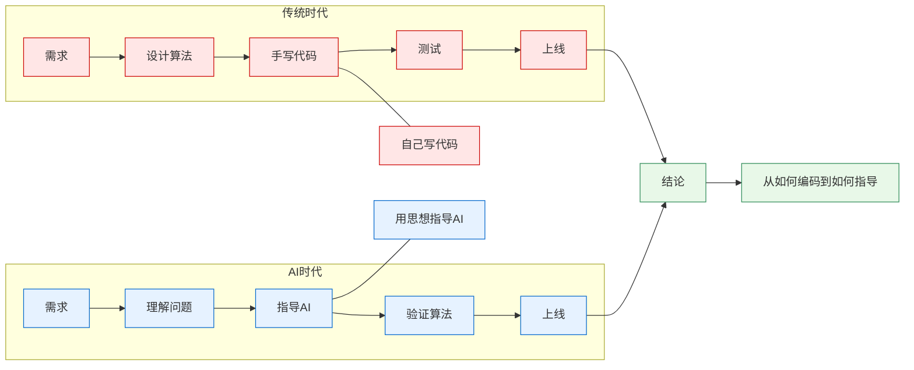
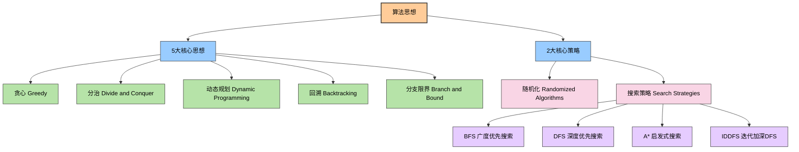

# AI时代下，程序员需要转为算法思想工程师

> AI 编程时代，AI写的代码又快又好。但面对具体业务场景，如果不能清晰地描述需求和定义边界，并从算法角度理解和建模问题，那么AI也无所适从。因此，在 AI 时代，程序员既需要深入理解业务和确定技术架构，更需要熟练掌握核心算法思想，并用算法思想来指导AI生成代码。
>
> 只有这样，才能真正利用 AI 工具进行创新，并解决实际问题。因此，在 AI 时代，程序员的价值并不会消失，而是逐渐从“编写代码”转向“理解问题、设计方案和指导 AI”。只有具备扎实的数据结构基础和算法思想，才能更有效地利用 AI 进行算法设计与问题求解，从而解决真实世界中的复杂问题。

---

## 目录

1. [算法与算法思想概述](#一算法与算法思想概述)
2. [算法要解决什么问题](#二算法要解决什么问题)
3. [算法思想有什么作用](#三算法思想有什么作用)
4. [算法思想大全](#四算法思想的大全)
5. [算法思想指导AI编程示例](#五算法思想指导AI编程示例)
6. [程序员如何学习算法思想？](#六程序员如何学习算法思想？)
7. [算法思想指导AI编程项目实践](#七算法思想指导AI编程项目实践)

---

## 一、算法与算法思想概述

### 什么是算法？

**算法**是计算机解决问题的一步步的方法和步骤。它是一个确定的、有限的、有效的计算过程，包括：

- **输入**：问题的数据
- **输出**：问题的解
- **清晰的指令**：一系列确定的步骤

**工程师视角**：计算机程序=算法+数据结构，算法是代码的灵魂。同样的功能，不同算法的性能差异可能是数个数量级。

### 什么是算法思想？

**算法思想**是指解决问题的通用的、系统的方法和理念。它是：

- 对多个具体算法的**抽象和总结**
- 一种**思考问题、分析问题、设计算法的思维方式**
- 不依赖于特定编程语言的**通用方法论**

**关键区别**：

- **算法思想** ← 抽象、通用、可复用 ← **黑盒思维**
- **具体算法** ← 实现、特定、一次性 ← **白盒实现**

### 为什么程序员必须学算法思想？

#### 传统时代 vs AI时代

| 维度 | 传统编程时代 | AI编程时代 |
|------|-----------|---------|
| **代码来源** | 手写 | AI生成 |
| **算法实现** | 自己写 | AI写 |
| **核心能力** | 编码能力 | 设计能力 |
| **关键价值** | 实现算法 | 指导AI设计 |
| **学习重点** | 掌握语法和算法 | 理解思想和原理 |

#### AI时代程序员的职责转变

<!--

```
传统时代：需求 → 设计算法 → 手写代码 → 测试 → 上线
                    ↑自己写

AI时代：  需求 → 理解问题 → 指导AI → 验证算法 → 上线
                    ↑用思想指导AI

结论：从"如何编码"到"如何设计"的升级
```
-->



### AI时代为什么还要学算法思想？

**核心理由：**

1. **指导AI生成正确算法** - AI需要清晰的设计指导，而不是模糊的需求
2. **验证AI生成代码** - 知道算法思想才能判断AI代码的正确性和最优性
3. **性能优化决策** - 在多个方案中选择最优方案，需要理解复杂度和权衡
4. **解决创新问题** - 没有现成案例的新问题，需要用基础思想创意组合
5. **理解系统底层** - 数据库索引、缓存策略、分布式算法都基于基础思想
6. **面试和职业发展** - 算法思想是工程师能力的核心指标，拥有良好的算法思想是职业需要

---

## 二、算法要解决什么问题？

### 问题分类

#### 1. **计算问题** - 求值问题
```
特点：给定输入，计算输出值
例子：
- 数学计算：阶乘、斐波那契数列、最大公约数
- 统计计算：平均值、标准差、相关系数
- 工程应用：利息计算、贷款摊销、财务预测
```

#### 2. **搜索问题** - 查找问题
```
特点：在数据集中找到符合条件的元素或位置
例子：
- 线性搜索：顺序查找
- 二分搜索：排序数组中的查找
- 工程应用：数据库查询、日志检索、倒排索引
```

#### 3. **排序问题** - 整序问题
```
特点：将数据按特定顺序排列
例子：
- 冒泡排序：适合小数据集
- 快速排序：通用高效排序
- 归并排序：稳定排序、外存排序
- 工程应用：数据库索引、缓存淘汰、队列优先级
```

#### 4. **优化问题** - 最优化问题
```
特点：在众多可能的解中找到最优解
例子：
- 背包问题：有限资源下的最大收益
- 旅行商问题：最短路径
- 资源分配：成本最小化
- 工程应用：任务调度、负载均衡、缓存策略
```

#### 5. **组合问题** - 枚举问题
```
特点：生成或枚举所有可能的组合或排列
例子：
- 全排列：所有可能的顺序
- 组合生成：从n个元素中选择k个
- 子集生成：所有的子集
- 工程应用：权限组合、配置生成、测试用例生成
```

#### 6. **图论问题** - 关系问题
```
特点：处理元素之间的关系和网络结构
例子：
- 最短路径：Dijkstra、Bellman-Ford
- 最小生成树：Prim、Kruskal
- 拓扑排序：DAG排序
- 工程应用：路由协议、社交网络、推荐系统、知识图谱
```

---

## 三、算法思想有什么作用？

#### 1. **快速问题识别与方案选择**
```
场景：接到一个新需求，如何快速设计方案？

算法思想的作用：
✓ 识别问题属于哪一类（搜索/优化/排序）
✓ 快速关联到对应的思想（贪心/DP/分治）
✓ 预估解决方案的复杂度
✓ 选择最优的设计方案

实例：
需求：设计一个LRU缓存
识别：这是一个优化问题（在有限空间内最大化命中率）
思想：贪心算法（每次淘汰最久未使用的）
实现：HashMap + DoublyLinkedList
```

#### 2. **代码性能优化**
```
案例：用户反馈系统慢

算法思想帮助：
❌ 原始方案：O(n²) 的嵌套查询
→ 分析：这是搜索问题，应该用二分查找
→ 优化：O(n log n) 的排序 + 二分查询

性能提升：1000万条数据，从几分钟到几秒
```

#### 3. **系统架构理解**
```
为什么理解算法思想很重要？

数据库索引 ← 二分查找的应用
缓存淘汰 ← 贪心算法
分布式共识 ← 图论和贪心
操作系统调度 ← 动态规划和贪心
编译器优化 ← 动态规划
网络协议 ← 图论和贪心

了解思想 = 理解系统内核
```

#### 4. **AI编程时代的核心竞争力**
```
AI生成代码的问题：
❌ 可能生成的不是最优算法
❌ 可能有逻辑漏洞
❌ 可能不适合你的具体场景

解决方案：
✓ 用算法思想指导AI："使用分治思想设计这个搜索功能"
✓ 用算法思想验证AI："这个方案的复杂度是多少？"
✓ 用算法思想优化AI："试试用动态规划优化这部分"

结论：AI时代，算法思想是程序员的"操纵杆"
```

#### 5. **职业发展的区分器**
```
初级工程师：能实现给定算法
中级工程师：能根据需求选择算法
高级工程师：能根据问题设计创新算法

所有阶段都需要算法思想，但层次不同。
```

#### 6. **面试和技术评估**
```
面试官关注的顺序：
1. 能否识别问题类型？（算法思想）
2. 选择的方案是否最优？（复杂度分析）
3. 实现代码是否正确？（编码能力）

结论：算法思想决定了60%的评分
```

#### 7. **建立通用的解题框架**
```
有了算法思想：
✓ 面对新问题有章可循
✓ 知道什么时候用什么方法
✓ 能够组合多个思想解决复杂问题
✓ 持续积累可复用的模式

这是从"学生思维"到"工程师思维"的升级
```

---

## 四、算法思想大全

### 列举5大思想与2大策略



---

## 1 贪心算法 (Greedy)

### 核心思想
每一步都选择当前状态下的最优选择，期望得到全局最优解。

### 算法特征
- **贪心选择性**：全局最优解可以通过一系列局部最优的贪心选择得到
- **最优子结构**：某个问题的最优解包含其子问题的最优解
- **无后效性**：前面的选择不影响后面的决策

### 伪代码模板
```py
# 贪心算法模板：每步选择当前最优解
function greedy_algorithm(items):
    result = empty_set
    # 按贪心标准排序 - 这是贪心算法的核心
    sort items by greedy_criteria
    
    for item in items:
        # 略，详见完整版
```

## 2 分治算法 (Divide and Conquer)

### 核心思想
分解问题 → 递归求解子问题 → 合并子问题的结果

### 三个阶段
1. **Divide**：把问题分解成若干个规模较小的相同问题
2. **Conquer**：递归求解这些子问题
3. **Combine**：合并子问题的解成原问题的解

### 伪代码模板
```py
# 分治算法模板：分解-解决-合并
function divide_and_conquer(problem):
    # 基础情况 - 递归终止条件
    if problem is small enough:
        return solve_directly(problem)
    # 略，详见完整版
```

## 3 动态规划 (Dynamic Programming)

### 核心思想
以空间换时间，用记忆化消除重复计算

### 必要条件
- **最优子结构**：大问题的最优解 = 子问题最优解的组合
- **重叠子问题**：不同的子问题有重复计算

### 两种实现方式
1. **自顶向下**（记忆化递归）
2. **自底向上**（递推表格）

### 伪代码模板
```py
# 动态规划模板：通过表格存储避免重复计算
# 1. 自底向上实现
function dynamic_programming(problem):
    # 初始化DP表 - 存储子问题解
    dp_table = initialize_dp_table(problem)
    
    # 递推计算 - 按依赖关系填充表格
    for subproblem in all_subproblems:
        # 略，详见完整版
```

## 4 回溯算法 (Backtracking)

### 核心思想
尝试 → 探索 → 回退，系统地尝试所有可能性直到找到解

### 本质
带约束的深度优先搜索（DFS）

### 关键步骤
1. 做出选择
2. 在这个选择上进行递归
3. 撤销选择（回退）
4. 尝试其他选择

### 伪代码模板
```py
# 回溯算法模板：深度优先搜索 + 状态回退
function backtrack(current_state, path):
    # 找到解 - 记录当前路径
    if is_solution(current_state):
        add path to solutions
        return
    
    # 遍历所有可能的选择
    for choice in available_choices(current_state):
        # 略，详见完整版
```

## 5 分支限界算法 (Branch and Bound)

### 核心思想
通过剪枝来减少搜索空间，在回溯的基础上加入界限函数

### 算法特点
- **分支**：将问题分解为子问题
- **限界**：计算子问题的界限，剪枝不可能产生最优解的分支
- **剪枝**：提前终止不可能产生最优解的搜索路径

### 伪代码模板
```py
# 分支限界算法模板：剪枝优化的搜索
function branch_and_bound(problem):
    best_solution = None
    best_value = -infinity
    
    # 优先队列 - 按界值排序
    priority_queue = PriorityQueue()
    initial_state = create_initial_state(problem)
    
    # 略，详见完整版
```

## 6 随机化算法 (Randomized Algorithms)

### 核心思想
利用随机性来简化算法设计、提高性能或解决确定性算法难以处理的问题

### 算法类型
1. **拉斯维加斯算法**：总是给出正确答案，但运行时间随机
2. **蒙特卡洛算法**：运行时间确定，但可能给出错误答案

### 伪代码模板
```python
# 随机化算法模板：利用随机性简化问题
function randomized_algorithm(input):
    while not solution_found():
        # 略，详见完整版
```

## 7 搜索策略 (Search Strategies)

### 核心思想
系统性地在解空间中搜索目标，不同的策略适用于不同类型的问题

### 搜索策略分类
1. **BFS**：广度优先搜索，逐层扩展
2. **DFS**：深度优先搜索，一路到底
3. **A***：启发式搜索，有指导的搜索
4. **IDDFS**：迭代加深DFS，结合BFS和DFS优点

### 伪代码模板

#### BFS模板
```py
# BFS模板：广度优先搜索 - 逐层扩展
function bfs(start, goal):
    # 队列数据结构 - 保证FIFO顺序
    queue = Queue()
    queue.enqueue(start)
    
   # 略，详见完整版
```

#### DFS模板
```py
# DFS模板：深度优先搜索 - 一路到底
function dfs(current, goal, visited):
    # 目标检查 - 找到目标
    if current == goal:
        return [current]
    
    # 略，详见完整版
```

#### A*模板
```py
# A*模板：启发式搜索 - 有指导的搜索
function a_star(start, goal):
    # 优先队列 - 按f值排序
    open_set = PriorityQueue()
    
    # 启发式函数 - 估计到目标的距离
    h_start = heuristic(start, goal)
    open_set.put(start, h_start)
    
    # 略，详见完整版
```

## 五、算法思想指导AI编程示例

### 项目实践1：电商秒杀系统

#### 1 描述需求（What）
给用户提供高并发的商品抢购服务，确保公平性和系统稳定性。

#### 2 定义边界（Scope）
- **并发用户**：10万用户同时抢购
- **商品库存**：1000件商品
- **响应时间**：100ms内返回结果
- **公平性**：先到先得，每人限购1件

#### 3 算法建模（How）
**贪心算法建模**：

- 问题抽象：资源分配 + 顺序决策
- 算法模型：队列 + 贪心选择
- 核心思想：每个请求立即做最优分配

**指导AI编程**：

```
AI，请实现一个贪心算法的秒杀系统：
1. 用户请求进入队列
2. 按队列顺序处理（贪心选择）
3. 检查库存和用户限制
4. 立即分配或拒绝
```

#### 算法流程
```
用户请求 → 排队 → 库存检查 → 贪心分配 → 返回结果
```

#### 适用场景
- ✅ 电商推荐系统
- ✅ 秒杀抢购系统
- ✅ 库存管理
- ✅ 用户行为分析

---

### 项目实践2：视频平台内容分发

#### 1 描述需求（What）
为全球用户提供低延迟的视频播放服务，确保观看体验。

#### 2 定义边界（Scope）
- **用户规模**：1000万用户同时在线
- **视频文件**：单个视频1-10GB
- **CDN节点**：全球50个节点
- **延迟要求**：200ms内开始播放
- **带宽成本**：需要优化传输成本

#### 3 算法建模（How）
**分治算法建模**：

- 问题抽象：大规模数据分发 + 地理位置优化
- 算法模型：区域分解 + 并行处理
- 核心思想：Divide（地理分组）→ Conquer（并行分发）→ Combine（结果合并）

**指导AI编程**：
```
AI，请实现分治算法的视频分发：
1. Divide：按地理位置将用户分组
2. Conquer：并行处理各组的视频分发
3. Combine：合并分发状态和结果
4. 优化：选择最近的CDN节点
```

#### 算法流程
```
用户请求 → 地理分组 → CDN选择 → 并行分发 → 状态合并
```

#### 适用场景
- ✅ 视频平台内容分发
- ✅ CDN节点优化
- ✅ 大规模数据处理
- ✅ 地理位置服务

---

### 项目实践3：订餐系统路径优化

#### 1 描述需求（What）
为外卖平台规划最优配送路线，提高配送效率和用户体验。

#### 2 定义边界（Scope）
- **订单数量**：高峰期每小时1万订单
- **配送员**：500名配送员同时工作
- **时间限制**：30分钟内送达
- **优化目标**：最小化总配送时间 + 最大化配送订单数
- **约束条件**：配送员负载均衡 + 订单截止时间

#### 3 算法建模（How）
**动态规划建模**：
- 问题抽象：多阶段决策优化 + 资源约束
- 算法模型：状态转移方程 + 记忆化搜索
- 核心思想：当前最优 = 之前最优 + 当前决策

**指导AI编程**：
```
AI，请实现动态规划的配送优化：
1. 状态定义：(当前订单集合, 当前时间, 当前位置)
2. 状态转移：尝试每个订单作为下一个配送目标
3. 记忆化：缓存已计算的状态结果
4. 回溯：基于DP结果重构最优路径
```

#### 算法流程
```
订单集合 → 状态定义 → 递归求解 → 记忆化缓存 → 路径重构
```

#### 适用场景
- ✅ 外卖配送路径优化
- ✅ 订餐系统调度
- ✅ 物流配送规划
- ✅ 资源分配优化

---

### 项目实践4：抽奖组合生成器

#### 1 描述需求（What）
为彩票系统生成所有可能的号码组合，帮助用户优化投注策略。

#### 2 定义边界（Scope）
- **号码范围**：1-33选6个号码
- **组合数量**：总计110万种组合
- **用户预算**：最多购买100张彩票
- **约束条件**：奇偶比例、范围分布、历史数据
- **优化目标**：最大化中奖概率

#### 3 算法建模（How）
**回溯算法建模**：
- 问题抽象：组合生成 + 约束满足
- 算法模型：深度优先搜索 + 剪枝优化
- 核心思想：尝试所有可能，遇到约束立即回退

**指导AI编程**：
```
AI，请实现回溯算法的彩票组合：
1. 递归生成：从起始数字开始递归选择
2. 约束检查：验证奇偶比例、范围分布
3. 剪枝优化：不满足约束时立即回退
4. 最优选择：在预算内选择最佳组合
```

#### 算法流程
```
起始数字 → 递归选择 → 约束检查 → 满足/回退 → 组合生成
```

#### 适用场景
- ✅ 彩票组合生成
- ✅ 投资组合优化
- ✅ 游戏策略制定
- ✅ 约束满足问题

---

### 项目实践5：安全扫描路径优化

#### 1 描述需求（What）
为网络安全扫描系统规划最优扫描路径，在有限时间内发现最多高危漏洞。

#### 2 定义边界（Scope）
- **网络规模**：10万台主机的企业网络
- **时间预算**：2小时完成扫描
- **扫描类型**：端口扫描 + 漏洞检测 + 服务枚举
- **风险阈值**：优先发现高危漏洞（CVSS>7.0）
- **资源限制**：扫描线程数不超过100

#### 3 算法建模（How）
**分支限界算法建模**：
- 问题抽象：搜索空间巨大 + 需要最优解
- 算法模型：优先队列 + 界界函数 + 剪枝策略
- 核心思想：乐观估计上界，悲观时剪枝

**指导AI编程**：
```
AI，请实现分支限界的安全扫描：
1. 状态定义：(当前主机, 已扫描集合, 风险得分, 时间消耗)
2. 界界函数：计算剩余时间的最大可能风险
3. 剪枝策略：如果上界不如当前最优解则剪枝
4. 优先队列：按风险得分优先处理
```

#### 算法流程
```
初始状态 → 分支生成 → 界界计算 → 剪枝判断 → 优先队列 → 最优解
```

#### 适用场景
- ✅ 网络安全扫描
- ✅ 漏洞检测优化
- ✅ 渗透测试路径规划
- ✅ 威胁情报分析

---

### 项目实践6：爬虫随机调度系统

#### 1 描述需求（What）
为网络爬虫系统设计智能调度策略，避免被反爬虫系统检测，提高数据采集效率。

#### 2 定义边界（Scope）
- **目标网站**：1000个不同类型的网站
- **爬取频率**：每分钟1000个请求
- **反爬虫机制**：IP限制、请求模式检测、验证码
- **数据质量**：90%成功率，避免重复采集
- **资源限制**：代理池500个IP，User-Agent池100个

#### 3 算法建模（How）
**随机化算法建模**：
- 问题抽象：避免模式识别 + 资源优化分配
- 算法模型：随机选择 + 蒙特卡洛采样
- 核心思想：用随机性打破固定模式，用概率统计优化决策

**指导AI编程**：
```
AI，请实现随机化的爬虫调度：
1. 随机化：随机选择URL、User-Agent、代理IP
2. 蒙特卡洛：随机游走分析链接重要性
3. 自适应：基于响应时间动态调整延迟
4. 多策略：随机选择不同的内容提取策略
```

#### 算法流程
```
URL池 → 随机选择 → 随机化请求 → 响应分析 → 自适应调整
```

#### 适用场景

- ✅ 网络爬虫调度
- ✅ 反爬虫系统对抗
- ✅ 数据采集优化

---

### 项目实践7：音乐推荐搜索系统

#### 1 描述需求（What）
为音乐平台提供个性化推荐，帮助用户发现符合当前心情和偏好的音乐。

#### 2 定义边界（Scope）
- **音乐库**：1000万首歌曲
- **用户规模**：500万活跃用户
- **响应时间**：200ms内返回推荐结果
- **推荐数量**：每次推荐20首歌
- **个性化维度**：流派、心情、艺术家、听歌历史

#### 3 算法建模（How）
**搜索策略建模**：
- 问题抽象：图结构搜索 + 多维约束优化
- 算法模型：BFS流派探索 + DFS心情旅程 + A*播放列表
- 核心思想：不同搜索策略处理不同的推荐场景

**指导AI编程**：
```
AI，请实现搜索策略的音乐推荐：
1. BFS：逐层扩展音乐流派，发现相关类型
2. DFS：深度搜索心情转换路径，创建心情旅程
3. A*：启发式生成播放列表，考虑多重约束
4. IDDFS：迭代加深发现相关艺术家
```

#### 算法流程
```
用户偏好 → 流派图构建 → 多策略搜索 → 结果融合 → 个性化推荐
```

#### 适用场景
- ✅ 音乐推荐系统
- ✅ 流派探索发现
- ✅ 心情音乐匹配

---

## 六、程序员如何学习算法思想？

### 程序员职责转变
在AI编程时代，程序员需要从**代码实现者**转变为**算法思想工程师**：

| 层次 | 核心能力 | 传统程序员 | 算法思想工程师 |
|------|----------|------------|----------------|
| **描述需求** | 理解业务目标 | 直接开始编码 | 先明确要解决什么问题 |
| **定义边界** | 分析约束条件 | 忽略实际限制 | 明确数据规模、时间、资源约束 |
| **算法建模** | 抽象算法模型 | 选择熟悉的算法 | 用算法思想指导AI选择最优方案 |

### 程序员三层能力模型

#### **第一层：描述需求（What）**
**核心问题**：要解决什么业务问题？

**示例**：

- ❌ "写一个推荐系统"
- ✅ "给用户推荐他们可能感兴趣的商品"

#### **第二层：定义边界（Scope）**
**核心问题**：问题的规模和限制是什么？

**关键要素**：
- **数据规模**：用户数、商品数、请求数
- **时间限制**：响应时间要求、处理时间窗口
- **资源约束**：内存、CPU、网络带宽
- **质量要求**：准确率、成功率、容错性

**示例**：
```
推荐系统边界定义：
- 用户：1000万，商品：100万
- 响应时间：100ms内返回
- 推荐：10个商品
- 准确率：>80%
```

#### **第三层：算法建模（How）**
**核心问题**：用什么算法模型解决？

**建模过程**：
1. **问题抽象**：将业务问题转化为算法问题
2. **模型选择**：基于约束选择合适的算法思想
3. **指导AI**：用算法思想指导AI生成代码

**示例**：
```
推荐问题 → 向量相似度搜索 → KNN/ANN算法 → AI实现
```

### Vibe Coding程序员应该怎么做？

**核心理念：Vibe Coding不是「甩锅给AI」，而是「用思想指导AI」**

```
❌ 错误理解：
   "写个搜索功能吧" → AI → 代码
   问题：可能不最优、不符合预期、无法优化

✓ 正确理解：
   "用二分查找设计搜索功能" → AI → 代码
   优势：方向明确、易于验证、便于优化
```

#### **Rule 1: 用思想而不是需求来指导AI**

```
❌ 弱：
Prompt: "给我一个搜索函数"

✓ 强：
Prompt: "用二分查找设计一个搜索函数，
         支持O(log n)查询，
         要求处理不存在的情况"
```

#### **Rule 2: 验证AI的结果**

```
生成代码后的检查清单：
□ 时间复杂度是否符合预期？
□ 空间复杂度是否可接受？
□ 边界情况是否处理完整？
□ 是否用了算法思想描述的方法？
□ 是否有更优的方案？
```

#### **Rule 3: 理解权衡，而不是盲目求最优**

```
没有完美的算法，只有权衡：
- 时间 vs 空间
- 复杂度 vs 可维护性
- 最优 vs 足够好
- 通用 vs 特化

你的职责：根据具体场景做出正确的权衡
```

#### **Rule 4: 保持对AI代码的怀疑**

```
AI可能出错的地方：
□ 复杂度分析错误
□ 边界情况遗漏
□ 逻辑漏洞（看不出来的bug）
□ 性能瓶颈（代码正确但慢）
□ 不符合业务逻辑

永远要自己验证关键代码
```

#### **Rule 5: 用小问题积累大智慧**

```
学习循环：
1. 用一个小问题测试某个算法思想
2. 让AI生成代码 + 解释
3. 自己分析验证
4. 迁移到大问题中
5. 重复

这样可以快速建立对思想的深度理解
```

#### **Rule 3: 理解权衡，而不是盲目求最优**

```
没有完美的算法，只有权衡：
- 时间 vs 空间
- 复杂度 vs 可维护性
- 最优 vs 足够好
- 通用 vs 特化

你的职责：根据具体场景做出正确的权衡
```

#### **Rule 4: 保持对AI代码的怀疑**

```
AI可能出错的地方：
□ 复杂度分析错误
□ 边界情况遗漏
□ 逻辑漏洞（看不出来的bug）
□ 性能瓶颈（代码正确但慢）
□ 不符合业务逻辑

永远要自己验证关键代码
```

#### **Rule 5: 用小问题积累大智慧**

```
学习循环：
1. 用一个小问题测试某个算法思想
2. 让AI生成代码 + 解释
3. 自己分析验证
4. 迁移到大问题中
5. 重复

这样可以快速建立对思想的深度理解
```

---

## 七、利用算法思想指导AI编程项目实战

### 实战案例：推荐系统设计

#### **业务背景**
为电商平台设计个性化推荐系统，从100万商品中为用户推荐10个最相关的商品。

#### **三层能力分析**

**1 描述需求（What）**
- 给用户推荐他们可能感兴趣的商品
- 需要考虑相关性和多样性
- 要求实时响应（100ms内）

**2 定义边界（Scope）**

- 商品规模：100万商品
- 用户规模：1000万用户
- 响应时间：100ms内
- 推荐数量：10个商品
- 准确率要求：>80%

**3 算法建模（How）**
- **问题抽象**：多目标优化问题（相关性 + 多样性）
- **算法思想**：贪心算法 + 动态规划
- **核心思路**：
  - 贪心：快速筛选高相关性候选
  - 动态规划：优化多样性组合

#### **指导AI编程（BROKE框架）**
```
B - Background（背景）：
你是一个专业的算法工程师，需要为电商平台设计个性化推荐系统。系统面临多目标优化挑战：既要保证推荐的相关性，又要确保结果的多样性，同时满足严格的实时性能要求。

R - Role（角色）：
你是一名资深的推荐系统算法架构师，精通贪心算法和动态规划，擅长在复杂约束条件下设计高效的推荐算法。

O - Objective（目标）：
设计并实现一个两阶段推荐系统：
1. 第一阶段使用贪心算法快速筛选高相关性候选商品
2. 第二阶段使用动态规划优化最终推荐的多样性组合

K - Key Results（关键结果）：
- 推荐响应时间控制在100ms以内
- 推荐准确率达到80%以上
- 最终推荐结果包含至少3个不同商品类目
- 系统能处理100万商品库和1000万用户规模
- 算法时间复杂度控制在O(n log n)以内

E - Expectations（期望）：
请提供：
1. 完整的Python实现代码
2. 详细的算法注释说明
3. 时间复杂度分析
4. 包含边界情况的测试用例
5. 性能优化建议和部署指导

算法要求：
- 贪心阶段：基于用户历史行为计算商品相关性得分，选择Top 50候选
- 动态规划阶段：状态定义为(已选商品集合, 多样性得分)，目标是在相关性基础上最大化多样性
- 代码结构清晰，易于维护和扩展
```

#### **算法思想验证**

**贪心算法验证**：
- ✅ 快速筛选：O(n log n) 时间复杂度
- ✅ 相关性优先：确保推荐质量
- ✅ 候选集控制：为后续优化提供基础

**动态规划验证**：
- ✅ 多样性优化：平衡相关性和多样性
- ✅ 最优解保证：DP确保找到最优组合
- ✅ 状态压缩：空间复杂度可接受

#### **实际应用指导**

**部署优化**：
- 缓存用户画像，减少重复计算
- 使用预计算加速相关性计算
- 分层推荐：粗筛 + 精排

**监控指标**：
- 点击率：验证推荐质量
- 多样性指标：避免推荐同质化
- 响应时间：确保用户体验

---

### 实战案例：数据库查询优化

#### **业务背景**
优化复杂SQL查询的执行计划，减少查询时间从秒级到毫秒级。

#### **三层能力分析**

**1 描述需求（What）**
- 自动选择最优的查询执行计划
- 支持多表连接和复杂条件
- 适应不同数据分布

**2 定义边界（Scope）**

- 查询复杂度：最多10个表连接
- 数据规模：单表最大1000万记录
- 优化目标：查询时间<100ms
- 算法限制：规划时间<10ms

**3 算法建模（How）**
- **问题抽象**：搜索最优执行路径
- **算法思想**：动态规划 + 贪心 + 启发式搜索
- **核心思路**：
  - 动态规划：处理连接顺序优化
  - 贪心：快速选择访问路径
  - 启发式：剪枝搜索空间

#### **指导AI编程（BROKE框架）**
```
B - Background（背景）：
你是一个数据库查询优化专家，需要设计一个智能查询优化器。当前系统面临复杂多表连接查询的性能瓶颈，查询时间从秒级需要优化到毫秒级，同时要适应不同的数据分布和查询模式。

R - Role（角色）：
你是一名资深的数据库系统架构师，精通查询优化算法，熟悉动态规划、贪心算法和启发式搜索，擅长在有限时间内找到接近最优的执行计划。

O - Objective（目标）：
设计并实现一个多算法融合的查询优化器：
1. 使用动态规划优化多表连接顺序
2. 使用贪心算法快速选择单表访问路径  
3. 使用启发式剪枝限制搜索空间

K - Key Results（关键结果）：
- 查询优化时间控制在10ms以内
- 查询执行时间减少到100ms以内
- 支持最多10个表的复杂连接查询
- 处理单表最大1000万记录的数据规模
- 生成接近最优的执行计划（误差<5%）

E - Expectations（期望）：
请提供：
1. 完整的Python查询优化器实现
2. 支持基本SQL解析功能
3. 输出详细的执行计划和成本估算
4. 包含成本模型的实现
5. 提供性能测试和优化建议

算法要求：
- 动态规划阶段：状态定义为(已连接表集合, 当前成本)，递推计算最优连接顺序
- 贪心阶段：评估全表扫描vs索引扫描的成本，选择最优访问路径
- 启发式阶段：基于规则剪枝明显差的执行计划，限制搜索深度
- 代码模块化设计，易于扩展新的优化策略
```

#### **算法思想验证**

**动态规划验证**：
- ✅ 最优连接顺序：DP保证找到全局最优
- ✅ 状态复用：避免重复计算子问题
- ✅ 可扩展性：支持任意数量表的连接

**贪心算法验证**：
- ✅ 快速决策：单表访问路径选择
- ✅ 局部最优：每步选择当前最优
- ✅ 效率保证：避免指数级搜索

**启发式验证**：

- ✅ 剪枝优化：减少搜索空间
- ✅ 实用性：确保计划可执行
- ✅ 鲁棒性：处理边界情况

---

**核心观点**：AI时代，程序员的价值不在于写代码，而在于用算法思想指导AI写出最优的代码。掌握算法思想，成为AI的"架构师"而不是"程序员"。

**完整代码实现请参考**：[AI-Era-Programmers-as-Algorithmic-Thinkers-Full.md](./AI-Era-Programmers-as-Algorithmic-Thinkers-Full.md)

