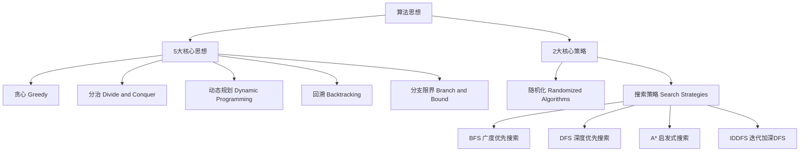

# AI时代下，程序员都应该是算法思想工程师

> AI 编程时代，AI写的代码又快又好。但面对具体业务场景，如果不能清晰地描述需求和定义边界，并从算法角度理解和建模问题，那么AI也无所适从。因此，在 AI 时代，程序员既需要深入理解业务和确定技术架构，更需要熟练掌握核心算法思想，并用算法思想来指导AI生成代码。
>
> 只有这样，才能真正利用 AI 工具进行创新，并解决实际问题。因此，在 AI 时代，程序员的价值并不会消失，而是逐渐从“编写代码”转向“理解问题、设计方案和指导 AI”。只有具备扎实的数据结构基础和算法思想，才能更有效地利用 AI 进行算法设计与问题求解，从而解决真实世界中的复杂问题。

---

## 目录

1. [算法与算法思想概述](#一算法与算法思想概述)
2. [算法要解决什么问题](#二算法要解决什么问题)
3. [算法思想有什么作用](#三算法思想有什么作用)
4. [算法思想的大全与学习指南](#四算法思想的大全与学习指南)
5. [常见算法分类及实战应用](#五常见算法分类及实战应用)
6. [AI时代下如何学习算法思想](#六ai时代下如何学习算法思想)
7. [利用算法思想指导AI编程实战](#七利用算法思想指导ai编程实战)

---

## 一、算法与算法思想概述

### 什么是算法？

**算法**是计算机解决问题的一步步的方法和步骤。它是一个确定的、有限的、有效的计算过程，包括：

- **输入**：问题的数据
- **输出**：问题的解
- **清晰的指令**：一系列确定的步骤

**工程师视角**：计算机程序=算法+数据结构，算法是代码的灵魂。同样的功能，不同算法的性能差异可能是数个数量级。

### 什么是算法思想？

**算法思想**是指解决问题的通用的、系统的方法和理念。它是：

- 对多个具体算法的**抽象和总结**
- 一种**思考问题、分析问题、设计算法的思维方式**
- 不依赖于特定编程语言的**通用方法论**

**关键区别**：

- **算法思想** ← 抽象、通用、可复用 ← **黑盒思维**
- **具体算法** ← 实现、特定、一次性 ← **白盒实现**

### 为什么程序员必须学算法思想？

#### 传统时代 vs AI时代

| 维度 | 传统编程时代 | AI编程时代 |
|------|-----------|---------|
| **代码来源** | 手写 | AI生成 |
| **算法实现** | 自己写 | AI写 |
| **核心能力** | 编码能力 | 设计能力 |
| **关键价值** | 实现算法 | 指导AI设计 |
| **学习重点** | 掌握语法和算法 | 理解思想和原理 |

#### AI时代程序员的职责转变

```
传统时代：需求 → 设计算法 → 手写代码 → 测试 → 上线
                    ↑自己写

AI时代：  需求 → 理解问题 → 指导AI → 验证算法 → 上线
                    ↑用思想指导AI

结论：从"如何编码"到"如何设计"的升级
```

### AI时代为什么还要学算法思想？

**核心理由：**

1. **指导AI生成正确算法** - AI需要清晰的设计指导，而不是模糊的需求
2. **验证AI生成代码** - 知道算法思想才能判断AI代码的正确性和最优性
3. **性能优化决策** - 在多个方案中选择最优方案，需要理解复杂度和权衡
4. **解决创新问题** - 没有现成案例的新问题，需要用基础思想创意组合
5. **理解系统底层** - 数据库索引、缓存策略、分布式算法都基于基础思想
6. **面试和职业发展** - 算法思想是工程师能力的核心指标，拥有良好的算法思想是职业需要

---

## 二、算法要解决什么问题？

### 问题分类

#### 1. **计算问题** - 求值问题
```
特点：给定输入，计算输出值
例子：
- 数学计算：阶乘、斐波那契数列、最大公约数
- 统计计算：平均值、标准差、相关系数
- 工程应用：利息计算、贷款摊销、财务预测
```

#### 2. **搜索问题** - 查找问题
```
特点：在数据集中找到符合条件的元素或位置
例子：
- 线性搜索：顺序查找
- 二分搜索：排序数组中的查找
- 工程应用：数据库查询、日志检索、倒排索引
```

#### 3. **排序问题** - 整序问题
```
特点：将数据按特定顺序排列
例子：
- 冒泡排序：适合小数据集
- 快速排序：通用高效排序
- 归并排序：稳定排序、外存排序
- 工程应用：数据库索引、缓存淘汰、队列优先级
```

#### 4. **优化问题** - 最优化问题
```
特点：在众多可能的解中找到最优解
例子：
- 背包问题：有限资源下的最大收益
- 旅行商问题：最短路径
- 资源分配：成本最小化
- 工程应用：任务调度、负载均衡、缓存策略
```

#### 5. **组合问题** - 枚举问题
```
特点：生成或枚举所有可能的组合或排列
例子：
- 全排列：所有可能的顺序
- 组合生成：从n个元素中选择k个
- 子集生成：所有的子集
- 工程应用：权限组合、配置生成、测试用例生成
```

#### 6. **图论问题** - 关系问题
```
特点：处理元素之间的关系和网络结构
例子：
- 最短路径：Dijkstra、Bellman-Ford
- 最小生成树：Prim、Kruskal
- 拓扑排序：DAG排序
- 工程应用：路由协议、社交网络、推荐系统、知识图谱
```

### 工程师常见的问题映射

| 实际问题 | 对应的算法问题类型 | 适用思想 |
|---------|-----------------|--------|
| 缓存淘汰策略 | 优化问题 | 动态规划、贪心 |
| 搜索引擎排序 | 排序 + 优化 | 多重排序、动态规划 |
| 负载均衡 | 优化问题 | 贪心、动态规划 |
| 权限树遍历 | 搜索问题 | 递归、回溯 |
| 数据库查询 | 搜索问题 | 二分查找、索引 |
| 推荐系统 | 优化问题 | 动态规划、贪心 |
| 分布式一致性 | 图论问题 | 最小生成树、拓扑排序 |

---

## 三、算法思想有什么作用？

### 对程序员的核心价值有以下几种

#### 1. **快速问题识别与方案选择**
```
场景：接到一个新需求，如何快速设计方案？

算法思想的作用：
✓ 识别问题属于哪一类（搜索/优化/排序）
✓ 快速关联到对应的思想（贪心/DP/分治）
✓ 预估解决方案的复杂度
✓ 选择最优的设计方案

实例：
需求：设计一个LRU缓存
识别：这是一个优化问题（在有限空间内最大化命中率）
思想：贪心算法（每次淘汰最久未使用的）
实现：HashMap + DoublyLinkedList
```

#### 2. **代码性能优化**
```
案例：用户反馈系统慢

算法思想帮助：
❌ 原始方案：O(n²) 的嵌套查询
→ 分析：这是搜索问题，应该用二分查找
→ 优化：O(n log n) 的排序 + 二分查询

性能提升：1000万条数据，从几分钟到几秒
```

#### 3. **系统架构理解**
```
为什么理解算法思想很重要？

数据库索引 ← 二分查找的应用
缓存淘汰 ← 贪心算法
分布式共识 ← 图论和贪心
操作系统调度 ← 动态规划和贪心
编译器优化 ← 动态规划
网络协议 ← 图论和贪心

了解思想 = 理解系统内核
```

#### 4. **AI编程时代的核心竞争力**
```
AI生成代码的问题：
❌ 可能生成的不是最优算法
❌ 可能有逻辑漏洞
❌ 可能不适合你的具体场景

解决方案：
✓ 用算法思想指导AI："使用分治思想设计这个搜索功能"
✓ 用算法思想验证AI："这个方案的复杂度是多少？"
✓ 用算法思想优化AI："试试用动态规划优化这部分"

结论：AI时代，算法思想是程序员的"操纵杆"
```

#### 5. **职业发展的区分器**
```
初级工程师：能实现给定算法
中级工程师：能根据需求选择算法
高级工程师：能根据问题设计创新算法

所有阶段都需要算法思想，但层次不同。
```

#### 6. **面试和技术评估**
```
面试官关注的顺序：
1. 能否识别问题类型？（算法思想）
2. 选择的方案是否最优？（复杂度分析）
3. 实现代码是否正确？（编码能力）

结论：算法思想决定了60%的评分
```

#### 7. **建立通用的解题框架**
```
有了算法思想：
✓ 面对新问题有章可循
✓ 知道什么时候用什么方法
✓ 能够组合多个思想解决复杂问题
✓ 持续积累可复用的模式

这是从"学生思维"到"工程师思维"的升级
```

---

## 四、算法思想的5大思想与2大策略详解

### 算法思想全景图



---

## #1 贪心算法 (Greedy)

### 核心思想
每一步都选择当前状态下的最优选择，期望得到全局最优解。

### 算法特征
- **贪心选择性**：全局最优解可以通过一系列局部最优的贪心选择得到
- **最优子结构**：某个问题的最优解包含其子问题的最优解
- **无后效性**：前面的选择不影响后面的决策

### 伪代码模板
```
function greedy_algorithm(items):
    result = empty_set
    sort items by greedy_criteria  # 按贪心标准排序
    
    for item in items:
        if item is feasible(result):  # 检查是否可行
            add item to result       # 贪心选择
            
    return result
```

### 经典算法实现

#### 1. 活动选择问题
```python
def activity_selection(activities):
    """
    贪心解决活动选择问题
    选择最多互不重叠的活动
    """
    # 按结束时间排序（贪心标准）
    activities.sort(key=lambda x: x.end_time)
    
    selected = []
    last_end = -infinity
    
    for activity in activities:
        if activity.start_time >= last_end:  # 可行性检查
            selected.append(activity)         # 贪心选择
            last_end = activity.end_time      # 更新状态
    
    return selected
```

#### 2. 哈夫曼编码
```python
def huffman_encoding(characters):
    """
    贪心构建最优前缀码
    每次选择频率最低的两个节点合并
    """
    import heapq
    
    # 初始化优先队列
    heap = []
    for char, freq in characters.items():
        heapq.heappush(heap, (freq, char))
    
    while len(heap) > 1:
        # 贪心选择：频率最低的两个节点
        freq1, char1 = heapq.heappop(heap)
        freq2, char2 = heapq.heappop(heap)
        
        # 合并节点
        merged_freq = freq1 + freq2
        merged_char = f"({char1}+{char2})"
        heapq.heappush(heap, (merged_freq, merged_char))
    
    return heap[0]  # 哈夫曼树根节点
```

### 项目实践：LRU缓存系统
```python
class LRUCache:
    """贪心算法应用：LRU缓存淘汰策略"""
    
    def __init__(self, capacity):
        self.capacity = capacity
        self.cache = {}      # 哈希表：O(1)查找
        self.order = []      # 双向链表：维护访问顺序
    
    def get(self, key):
        if key not in self.cache:
            return -1
        
        # 贪心：标记为最近使用
        self.order.remove(key)
        self.order.append(key)
        return self.cache[key]
    
    def put(self, key, value):
        if key in self.cache:
            # 更新现有值
            self.cache[key] = value
            self.order.remove(key)
            self.order.append(key)
        else:
            # 添加新值
            self.cache[key] = value
            self.order.append(key)
            
            # 贪心淘汰：移除最久未使用的
            if len(self.cache) > self.capacity:
                oldest = self.order.pop(0)
                del self.cache[oldest]
```

### 适用场景
- ✅ 最小生成树（Prim、Kruskal）
- ✅ 单源最短路径（Dijkstra）
- ✅ 数据压缩（哈夫曼编码）
- ✅ 任务调度、资源分配
- ✅ 缓存淘汰策略

---

## #2 分治算法 (Divide and Conquer)

### 核心思想
分解问题 → 递归求解子问题 → 合并子问题的结果

### 三个阶段
1. **Divide**：把问题分解成若干个规模较小的相同问题
2. **Conquer**：递归求解这些子问题
3. **Combine**：合并子问题的解成原问题的解

### 伪代码模板
```
function divide_and_conquer(problem):
    if problem is small enough:
        return solve_directly(problem)  # 基础情况
    
    # Divide：分解问题
    subproblems = divide(problem)
    
    # Conquer：递归求解子问题
    results = []
    for subproblem in subproblems:
        results.append(divide_and_conquer(subproblem))
    
    # Combine：合并结果
    return combine(results)
```

### 经典算法实现

#### 1. 归并排序
```python
def merge_sort(arr):
    """分治排序：分 → 治 → 合"""
    if len(arr) <= 1:
        return arr  # 基础情况
    
    # Divide：分解
    mid = len(arr) // 2
    left = merge_sort(arr[:mid])      # 递归排序左半
    right = merge_sort(arr[mid:])     # 递归排序右半
    
    # Combine：合并
    return merge(left, right)

def merge(left, right):
    """合并两个有序数组"""
    result = []
    i = j = 0
    
    # 合并过程
    while i < len(left) and j < len(right):
        if left[i] <= right[j]:
            result.append(left[i])
            i += 1
        else:
            result.append(right[j])
            j += 1
    
    # 处理剩余元素
    result.extend(left[i:])
    result.extend(right[j:])
    return result
```

#### 2. 快速排序
```python
def quick_sort(arr, low, high):
    """分治快速排序"""
    if low < high:
        # Divide：分区操作
        pivot_index = partition(arr, low, high)
        
        # Conquer：递归排序子数组
        quick_sort(arr, low, pivot_index - 1)
        quick_sort(arr, pivot_index + 1, high)

def partition(arr, low, high):
    """分区：选择基准，重新排列数组"""
    pivot = arr[high]  # 选择最后一个元素作为基准
    i = low - 1        # 小于基准的元素的边界
    
    for j in range(low, high):
        if arr[j] <= pivot:      # 当前元素小于等于基准
            i += 1
            arr[i], arr[j] = arr[j], arr[i]  # 交换
    
    # 将基准放到正确位置
    arr[i + 1], arr[high] = arr[high], arr[i + 1]
    return i + 1
```

### 项目实践：分布式数据处理
```python
class DistributedProcessor:
    """分治思想：大数据分布式处理"""
    
    def process_large_dataset(self, data, num_workers):
        """分治处理大数据集"""
        # Divide：数据分片
        chunks = self.split_data(data, num_workers)
        
        # Conquer：并行处理
        results = []
        for chunk in chunks:
            result = self.process_chunk_async(chunk)
            results.append(result)
        
        # Combine：合并结果
        final_result = self.merge_results(results)
        return final_result
    
    def split_data(self, data, num_chunks):
        """数据分片"""
        chunk_size = len(data) // num_chunks
        return [data[i:i+chunk_size] for i in range(0, len(data), chunk_size)]
    
    def merge_results(self, results):
        """合并处理结果"""
        # 根据具体需求实现合并逻辑
        merged = {}
        for result in results:
            merged.update(result)
        return merged
```

### 适用场景
- ✅ 排序算法（归并排序、快速排序）
- ✅ 搜索算法（二分查找）
- ✅ 大数运算（快速幂）
- ✅ 图算法（最近公共祖先）
- ✅ 分布式计算、并行处理

---

## #3 动态规划 (Dynamic Programming)

### 核心思想
以空间换时间，用记忆化消除重复计算

### 必要条件
- **最优子结构**：大问题的最优解 = 子问题最优解的组合
- **重叠子问题**：不同的子问题有重复计算

### 两种实现方式
1. **自顶向下**（记忆化递归）
2. **自底向上**（递推表格）

### 伪代码模板
```
# 自底向上实现
function dynamic_programming(problem):
    # 初始化DP表
    dp = create_table(problem_size)
    
    # 填充基础情况
    dp[0] = base_case_value
    
    # 递推计算
    for i from 1 to problem_size:
        dp[i] = compute_optimal(dp, i)
    
    return dp[problem_size]

# 自顶向下实现
function memoization(problem):
    memo = {}  # 记忆化缓存
    
    def solve(subproblem):
        if subproblem in memo:
            return memo[subproblem]
        
        if subproblem is base_case:
            return base_value
        
        result = recurrence(solve, subproblem)
        memo[subproblem] = result
        return result
    
    return solve(problem)
```

### 经典算法实现

#### 1. 背包问题
```python
def knapsack_01(weights, values, capacity):
    """0-1背包问题：动态规划求解"""
    n = len(weights)
    dp = [[0] * (capacity + 1) for _ in range(n + 1)]
    
    # 填充DP表
    for i in range(1, n + 1):
        for w in range(capacity + 1):
            if weights[i-1] <= w:
                # 选择第i个物品或不选择
                dp[i][w] = max(
                    values[i-1] + dp[i-1][w - weights[i-1]],  # 选择
                    dp[i-1][w]  # 不选择
                )
            else:
                dp[i][w] = dp[i-1][w]  # 不能选择
    
    return dp[n][capacity]  # 最大价值
```

#### 2. 编辑距离
```python
def edit_distance(word1, word2):
    """编辑距离：Levenshtein距离"""
    m, n = len(word1), len(word2)
    dp = [[0] * (n + 1) for _ in range(m + 1)]
    
    # 基础情况
    for i in range(m + 1):
        dp[i][0] = i  # 删除所有字符
    for j in range(n + 1):
        dp[0][j] = j  # 插入所有字符
    
    # 递推计算
    for i in range(1, m + 1):
        for j in range(1, n + 1):
            if word1[i-1] == word2[j-1]:
                dp[i][j] = dp[i-1][j-1]  # 字符相同，无需操作
            else:
                dp[i][j] = 1 + min(
                    dp[i-1][j],    # 删除
                    dp[i][j-1],    # 插入
                    dp[i-1][j-1]   # 替换
                )
    
    return dp[m][n]  # 最小编辑距离
```

### 项目实践：推荐系统优化
```python
class RecommendationOptimizer:
    """动态规划优化推荐系统"""
    
    def optimize_recommendations(self, items, constraints):
        """
        动态规划优化推荐结果
        在满足约束条件下最大化推荐效果
        """
        n = len(items)
        max_time = constraints['max_time']
        max_memory = constraints['max_memory']
        
        # 3维DP表：[物品数][时间][内存]
        dp = [[[0] * (max_memory + 1) for _ in range(max_time + 1)] 
             for _ in range(n + 1)]
        
        # 填充DP表
        for i in range(1, n + 1):
            item = items[i-1]
            for t in range(max_time + 1):
                for m in range(max_memory + 1):
                    # 不选择当前物品
                    dp[i][t][m] = dp[i-1][t][m]
                    
                    # 选择当前物品（如果满足约束）
                    if (item.time <= t and item.memory <= m):
                        dp[i][t][m] = max(
                            dp[i][t][m],
                            item.value + dp[i-1][t-item.time][m-item.memory]
                        )
        
        # 回溯找到最优推荐
        return self.backtrack_solution(dp, items, constraints)
    
    def backtrack_solution(self, dp, items, constraints):
        """回溯找到最优解"""
        solution = []
        i, t, m = len(items), constraints['max_time'], constraints['max_memory']
        
        while i > 0 and (t > 0 or m > 0):
            if dp[i][t][m] != dp[i-1][t][m]:
                # 选择了第i个物品
                item = items[i-1]
                solution.append(item)
                t -= item.time
                m -= item.memory
            i -= 1
        
        return list(reversed(solution))
```

### 适用场景
- ✅ 资源分配问题
- ✅ 路径规划问题
- ✅ 序列匹配问题
- ✅ 优化决策问题
- ✅ 机器学习算法

---

## #4 回溯算法 (Backtracking)

### 核心思想
尝试 → 探索 → 回退，系统地尝试所有可能性直到找到解

### 本质
带约束的深度优先搜索（DFS）

### 关键步骤
1. 做出选择
2. 在这个选择上进行递归
3. 撤销选择（回退）
4. 尝试其他选择

### 伪代码模板
```
function backtrack(current_state, path):
    if is_solution(current_state):
        add path to solutions
        return
    
    for choice in available_choices(current_state):
        if is_valid(choice):
            # 做出选择
            make_choice(current_state, choice)
            path.append(choice)
            
            # 递归探索
            backtrack(current_state, path)
            
            # 撤销选择（回退）
            undo_choice(current_state, choice)
            path.pop()
```

### 经典算法实现

#### 1. N皇后问题
```python
def solve_n_queens(n):
    """回溯解决N皇后问题"""
    solutions = []
    board = [[0] * n for _ in range(n)]
    
    def backtrack(row):
        if row == n:
            # 找到一个解
            solutions.append([row[:] for row in board])
            return
        
        for col in range(n):
            if is_safe(board, row, col):
                # 做出选择
                board[row][col] = 1
                
                # 递归探索
                backtrack(row + 1)
                
                # 撤销选择（回退）
                board[row][col] = 0
    
    backtrack(0)
    return solutions

def is_safe(board, row, col):
    """检查在(row, col)放置皇后是否安全"""
    n = len(board)
    
    # 检查列
    for i in range(row):
        if board[i][col] == 1:
            return False
    
    # 检查左对角线
    for i, j in zip(range(row-1, -1, -1), range(col-1, -1, -1)):
        if board[i][j] == 1:
            return False
    
    # 检查右对角线
    for i, j in zip(range(row-1, -1, -1), range(col+1, n)):
        if board[i][j] == 1:
            return False
    
    return True
```

#### 2. 全排列生成
```python
def generate_permutations(nums):
    """回溯生成全排列"""
    permutations = []
    used = [False] * len(nums)
    current = []
    
    def backtrack():
        if len(current) == len(nums):
            permutations.append(current.copy())
            return
        
        for i in range(len(nums)):
            if not used[i]:
                # 做出选择
                used[i] = True
                current.append(nums[i])
                
                # 递归探索
                backtrack()
                
                # 撤销选择（回退）
                used[i] = False
                current.pop()
    
    backtrack()
    return permutations
```

### 项目实践：权限系统配置
```python
class PermissionConfigurator:
    """回溯生成权限配置方案"""
    
    def generate_permission_schemes(self, roles, permissions, constraints):
        """回溯生成满足约束的权限配置"""
        schemes = []
        current_scheme = {}
        
        def backtrack(role_index):
            if role_index == len(roles):
                # 检查方案是否满足所有约束
                if self.validate_scheme(current_scheme, constraints):
                    schemes.append(current_scheme.copy())
                return
            
            role = roles[role_index]
            # 为当前角色生成可能的权限组合
            possible_perms = self.generate_permission_combinations(
                role, permissions, constraints
            )
            
            for perm_set in possible_perms:
                # 做出选择：为角色分配权限
                current_scheme[role] = perm_set
                
                # 递归探索下一个角色
                backtrack(role_index + 1)
                
                # 撤销选择（回退）
                del current_scheme[role]
        
        backtrack(0)
        return schemes
    
    def generate_permission_combinations(self, role, permissions, constraints):
        """为角色生成可能的权限组合"""
        combinations = []
        
        def generate_perms(index, current_perms):
            if index == len(permissions):
                if self.validate_role_permissions(role, current_perms, constraints):
                    combinations.append(set(current_perms))
                return
            
            perm = permissions[index]
            
            # 选择不包含该权限
            generate_perms(index + 1, current_perms)
            
            # 选择包含该权限
            current_perms.append(perm)
            generate_perms(index + 1, current_perms)
            current_perms.pop()
        
        generate_perms(0, [])
        return combinations
```

### 适用场景
- ✅ 约束满足问题
- ✅ 组合优化问题
- ✅ 路径查找问题
- ✅ 游戏AI算法
- ✅ 配置生成问题

---

## #5 分支限界算法 (Branch and Bound)

### 核心思想
通过剪枝来减少搜索空间，在回溯的基础上加入界限函数

### 算法特点
- **分支**：将问题分解为子问题
- **限界**：计算子问题的界限，剪枝不可能产生最优解的分支
- **剪枝**：提前终止不可能产生最优解的搜索路径

### 伪代码模板
```
function branch_and_bound(problem):
    best_solution = None
    best_value = -infinity
    
    # 优先队列（按界限值排序）
    queue = PriorityQueue()
    queue.push(initial_state, calculate_bound(initial_state))
    
    while not queue.is_empty():
        current_state = queue.pop()
        current_bound = current_state.bound
        
        # 剪枝：如果界限不如当前最优解
        if current_bound <= best_value:
            continue
        
        if is_solution(current_state):
            if current_state.value > best_value:
                best_solution = current_state
                best_value = current_state.value
        else:
            # 分支：生成子状态
            for child_state in branch(current_state):
                child_bound = calculate_bound(child_state)
                if child_bound > best_value:
                    queue.push(child_state, child_bound)
    
    return best_solution
```

### 经典算法实现

#### 1. 0-1背包问题（分支限界）
```python
import heapq

class Item:
    def __init__(self, weight, value, index):
        self.weight = weight
        self.value = value
        self.ratio = value / weight
        self.index = index

class Node:
    def __init__(self, level, value, weight, bound):
        self.level = level      # 当前考虑的物品索引
        self.value = value      # 当前价值
        self.weight = weight    # 当前重量
        self.bound = bound      # 界限值
    
    def __lt__(self, other):
        return self.bound > other.bound  # 最大堆

def knapsack_branch_and_bound(weights, values, capacity):
    """分支限界解决0-1背包问题"""
    items = [Item(weights[i], values[i], i) for i in range(len(weights))]
    items.sort(key=lambda x: x.ratio, reverse=True)  # 按价值重量比排序
    
    max_value = 0
    root = Node(-1, 0, 0, 0)
    root.bound = calculate_bound(root, items, capacity)
    
    # 最大堆
    heap = []
    heapq.heappush(heap, root)
    
    while heap:
        node = heapq.heappop(heap)
        
        # 剪枝
        if node.bound <= max_value:
            continue
        
        # 考虑下一个物品
        level = node.level + 1
        
        # 不包含当前物品的分支
        excluded = Node(level, node.value, node.weight, 0)
        excluded.bound = calculate_bound(excluded, items, capacity)
        if excluded.bound > max_value:
            heapq.heappush(heap, excluded)
        
        # 包含当前物品的分支
        if node.weight + items[level].weight <= capacity:
            included = Node(level, 
                           node.value + items[level].value,
                           node.weight + items[level].weight,
                           0)
            
            if included.weight <= capacity and included.value > max_value:
                max_value = included.value
            
            included.bound = calculate_bound(included, items, capacity)
            if included.bound > max_value:
                heapq.heappush(heap, included)
    
    return max_value

def calculate_bound(node, items, capacity):
    """计算界限值（贪心上界）"""
    if node.weight >= capacity:
        return 0
    
    bound = node.value
    j = node.level + 1
    total_weight = node.weight
    
    # 贪心添加剩余物品
    while j < len(items) and total_weight + items[j].weight <= capacity:
        bound += items[j].value
        total_weight += items[j].weight
        j += 1
    
    # 添加部分物品
    if j < len(items):
        bound += (capacity - total_weight) * items[j].ratio
    
    return bound
```

### 项目实践：任务调度优化
```python
class TaskScheduler:
    """分支限界优化任务调度"""
    
    def __init__(self, tasks, processors, time_limit):
        self.tasks = tasks
        self.processors = processors
        self.time_limit = time_limit
        self.best_schedule = None
        self.best_makespan = float('inf')
    
    def optimize_schedule(self):
        """分支限界优化任务调度"""
        import heapq
        
        # 初始状态
        initial_state = ScheduleState(
            task_index=0,
            processor_times=[0] * self.processors,
            assigned_tasks=[],
            current_makespan=0
        )
        
        # 计算初始界限
        initial_state.bound = self.calculate_lower_bound(initial_state)
        
        # 优先队列（最小堆，按makespan排序）
        heap = []
        heapq.heappush(heap, initial_state)
        
        while heap:
            state = heapq.heappop(heap)
            
            # 剪枝
            if state.bound >= self.best_makespan:
                continue
            
            # 所有任务已分配
            if state.task_index == len(self.tasks):
                if state.current_makespan < self.best_makespan:
                    self.best_makespan = state.current_makespan
                    self.best_schedule = state.assigned_tasks.copy()
                continue
            
            # 分支：为当前任务分配到每个处理器
            for processor in range(self.processors):
                new_state = self.assign_task(state, processor)
                new_state.bound = self.calculate_lower_bound(new_state)
                
                if new_state.bound < self.best_makespan:
                    heapq.heappush(heap, new_state)
        
        return self.best_schedule, self.best_makespan
    
    def assign_task(self, state, processor):
        """为任务分配处理器"""
        new_state = ScheduleState(
            task_index=state.task_index + 1,
            processor_times=state.processor_times.copy(),
            assigned_tasks=state.assigned_tasks + [(processor, state.task_index)],
            current_makespan=0
        )
        
        # 更新处理器时间
        new_state.processor_times[processor] += self.tasks[state.task_index].duration
        new_state.current_makespan = max(new_state.processor_times)
        
        return new_state
    
    def calculate_lower_bound(self, state):
        """计算下界（乐观估计）"""
        if state.task_index == len(self.tasks):
            return state.current_makespan
        
        # 当前最大处理器时间
        current_max = max(state.processor_times)
        
        # 剩余任务的最小可能时间
        remaining_time = sum(
            task.duration for task in self.tasks[state.task_index:]
        )
        
        # 负载均衡的理想情况
        ideal_balance = (current_max + remaining_time) / self.processors
        
        return max(current_max, ideal_balance)

class ScheduleState:
    def __init__(self, task_index, processor_times, assigned_tasks, current_makespan):
        self.task_index = task_index
        self.processor_times = processor_times
        self.assigned_tasks = assigned_tasks
        self.current_makespan = current_makespan
        self.bound = 0
    
    def __lt__(self, other):
        return self.bound < other.bound
```

### 适用场景
- ✅ 组合优化问题
- ✅ 资源分配问题
- ✅ 调度问题
- ✅ 路径优化问题
- ✅ 整数规划问题

---

## #6 随机化算法 (Randomized Algorithms)

### 核心思想
利用随机性来简化算法设计、提高性能或解决确定性算法难以处理的问题

### 算法类型
1. **拉斯维加斯算法**：总是给出正确答案，但运行时间随机
2. **蒙特卡洛算法**：运行时间确定，但可能给出错误答案

### 伪代码模板
```
# 拉斯维加斯算法
function las_vegas_algorithm(input):
    while True:
        random_choice = make_random_choice()
        result = process_choice(random_choice)
        
        if is_valid_result(result):
            return result
        # 否则继续尝试

# 蒙特卡洛算法
function monte_carlo_algorithm(input, error_probability):
    for i in range(num_trials):
        random_choice = make_random_choice()
        result = process_choice(random_choice)
        
        if confidence_in_result(result) > (1 - error_probability):
            return result
    
    return best_result_found
```

### 经典算法实现

#### 1. 快速选择（随机化版本）
```python
import random

def quick_select_randomized(arr, k):
    """随机化快速选择算法"""
    if len(arr) == 1:
        return arr[0]
    
    # 随机选择基准
    pivot = random.choice(arr)
    
    # 分区
    less = [x for x in arr if x < pivot]
    equal = [x for x in arr if x == pivot]
    greater = [x for x in arr if x > pivot]
    
    # 递归查找
    if k < len(less):
        return quick_select_randomized(less, k)
    elif k < len(less) + len(equal):
        return pivot
    else:
        return quick_select_randomized(greater, k - len(less) - len(equal))
```

#### 2. 随机化最小生成树
```python
import random

def randomized_mst(graph):
    """随机化最小生成树算法"""
    vertices = list(graph.keys())
    edges = []
    
    # 随机化顶点顺序
    random.shuffle(vertices)
    
    # Prim算法的随机化版本
    visited = {vertices[0]}
    mst_edges = []
    
    while len(visited) < len(vertices):
        # 随机选择一条连接已访问和未访问顶点的边
        candidate_edges = []
        
        for v in visited:
            for neighbor, weight in graph[v]:
                if neighbor not in visited:
                    candidate_edges.append((weight, v, neighbor))
        
        # 随机选择（实际应用中会选择最小权重边）
        weight, u, v = random.choice(candidate_edges)
        
        visited.add(v)
        mst_edges.append((u, v, weight))
    
    return mst_edges
```

### 项目实践：负载均衡随机化
```python
class RandomizedLoadBalancer:
    """随机化负载均衡器"""
    
    def __init__(self, servers):
        self.servers = servers
        self.server_weights = {server: 1.0 for server in servers}
        self.response_times = {server: [] for server in servers}
    
    def assign_task_randomized(self, task):
        """随机化任务分配"""
        # 权重随机选择
        total_weight = sum(self.server_weights.values())
        rand_val = random.uniform(0, total_weight)
        
        current_weight = 0
        selected_server = None
        
        for server, weight in self.server_weights.items():
            current_weight += weight
            if rand_val <= current_weight:
                selected_server = server
                break
        
        return selected_server
    
    def update_weights(self):
        """基于响应时间更新权重"""
        for server in self.servers:
            if self.response_times[server]:
                avg_response = sum(self.response_times[server]) / len(self.response_times[server])
                # 响应时间越短，权重越高
                self.server_weights[server] = 1.0 / (avg_response + 1)
        
        # 归一化权重
        total_weight = sum(self.server_weights.values())
        for server in self.servers:
            self.server_weights[server] /= total_weight
    
    def simulate_randomized_routing(self, tasks):
        """模拟随机化路由"""
        assignments = []
        
        for task in tasks:
            server = self.assign_task_randomized(task)
            assignments.append((task, server))
            
            # 模拟响应时间（随机化）
            response_time = random.expovariate(1.0 / self.server_weights[server])
            self.response_times[server].append(response_time)
        
        return assignments
```

### 适用场景
- ✅ 快速选择和排序
- ✅ 图算法优化
- ✅ 负载均衡
- ✅ 密码学算法
- ✅ 机器学习算法

---

## #7 搜索策略 (Search Strategies)

### 核心思想
系统性地在解空间中搜索目标，不同的策略适用于不同类型的问题

### 搜索策略分类
1. **BFS**：广度优先搜索，逐层扩展
2. **DFS**：深度优先搜索，一条路走到底
3. **A***：启发式搜索，结合代价和启发
4. **IDDFS**：迭代加深DFS，结合BFS和DFS优点

### 伪代码模板

#### BFS模板
```
function bfs(start, goal):
    queue = Queue()
    queue.enqueue(start)
    visited = {start}
    
    while not queue.is_empty():
        current = queue.dequeue()
        
        if current == goal:
            return reconstruct_path(current)
        
        for neighbor in get_neighbors(current):
            if neighbor not in visited:
                visited.add(neighbor)
                queue.enqueue(neighbor)
    
    return None  # 未找到
```

#### DFS模板
```
function dfs(current, goal, visited):
    if current == goal:
        return [current]
    
    visited.add(current)
    
    for neighbor in get_neighbors(current):
        if neighbor not in visited:
            path = dfs(neighbor, goal, visited)
            if path is not None:
                return [current] + path
    
    return None  # 未找到
```

#### A*模板
```
function a_star(start, goal):
    open_set = PriorityQueue()
    open_set.put(start, heuristic(start, goal))
    
    g_score = {start: 0}
    f_score = {start: heuristic(start, goal)}
    
    while not open_set.is_empty():
        current = open_set.get()
        
        if current == goal:
            return reconstruct_path(current)
        
        for neighbor in get_neighbors(current):
            tentative_g = g_score[current] + cost(current, neighbor)
            
            if neighbor not in g_score or tentative_g < g_score[neighbor]:
                g_score[neighbor] = tentative_g
                f_score[neighbor] = tentative_g + heuristic(neighbor, goal)
                open_set.put(neighbor, f_score[neighbor])
    
    return None  # 未找到
```

### 经典算法实现

#### 1. BFS最短路径
```python
from collections import deque

def bfs_shortest_path(graph, start, goal):
    """BFS寻找无权图最短路径"""
    queue = deque([(start, [start])])
    visited = {start}
    
    while queue:
        current, path = queue.popleft()
        
        if current == goal:
            return path
        
        for neighbor in graph[current]:
            if neighbor not in visited:
                visited.add(neighbor)
                queue.append((neighbor, path + [neighbor]))
    
    return None  # 未找到路径
```

#### 2. A*寻路算法
```python
import heapq

def a_star_search(grid, start, goal):
    """A*算法寻找最短路径"""
    def heuristic(a, b):
        return abs(a[0] - b[0]) + abs(a[1] - b[1])  # 曼哈顿距离
    
    def get_neighbors(pos):
        x, y = pos
        neighbors = []
        for dx, dy in [(0, 1), (1, 0), (0, -1), (-1, 0)]:
            nx, ny = x + dx, y + dy
            if (0 <= nx < len(grid) and 0 <= ny < len(grid[0]) and 
                grid[nx][ny] != 1):  # 1表示障碍物
                neighbors.append((nx, ny))
        return neighbors
    
    open_set = []
    heapq.heappush(open_set, (0, start))
    
    g_score = {start: 0}
    f_score = {start: heuristic(start, goal)}
    
    came_from = {}
    
    while open_set:
        current = heapq.heappop(open_set)[1]
        
        if current == goal:
            # 重构路径
            path = []
            while current in came_from:
                path.append(current)
                current = came_from[current]
            path.append(start)
            return list(reversed(path))
        
        for neighbor in get_neighbors(current):
            tentative_g = g_score[current] + 1  # 假设每步成本为1
            
            if neighbor not in g_score or tentative_g < g_score[neighbor]:
                came_from[neighbor] = current
                g_score[neighbor] = tentative_g
                f_score[neighbor] = tentative_g + heuristic(neighbor, goal)
                heapq.heappush(open_set, (f_score[neighbor], neighbor))
    
    return None  # 未找到路径
```

#### 3. IDDFS迭代加深
```python
def iddfs_search(graph, start, goal, max_depth):
    """迭代加深深度优先搜索"""
    def dls(current, goal, depth, path):
        if depth == 0:
            return current == goal, path
        elif depth > 0:
            for neighbor in graph[current]:
                found, result_path = dls(neighbor, goal, depth - 1, path + [neighbor])
                if found:
                    return True, result_path
        return False, None
    
    for depth in range(max_depth + 1):
        found, path = dls(start, goal, depth, [start])
        if found:
            return path
    
    return None  # 未找到
```

### 项目实践：游戏AI寻路系统
```python
class GamePathfinder:
    """游戏AI寻路系统"""
    
    def __init__(self, game_map):
        self.map = game_map
        self.width = len(game_map[0])
        self.height = len(game_map)
    
    def find_path(self, start, goal, algorithm='a_star'):
        """统一寻路接口"""
        if algorithm == 'bfs':
            return self.bfs_pathfind(start, goal)
        elif algorithm == 'dfs':
            return self.dfs_pathfind(start, goal)
        elif algorithm == 'a_star':
            return self.a_star_pathfind(start, goal)
        elif algorithm == 'iddfs':
            return self.iddfs_pathfind(start, goal)
        else:
            raise ValueError(f"Unknown algorithm: {algorithm}")
    
    def bfs_pathfind(self, start, goal):
        """BFS寻路（保证最短路径）"""
        from collections import deque
        
        queue = deque([(start, [start])])
        visited = {start}
        
        while queue:
            current, path = queue.popleft()
            
            if current == goal:
                return path
            
            for neighbor in self.get_walkable_neighbors(current):
                if neighbor not in visited:
                    visited.add(neighbor)
                    queue.append((neighbor, path + [neighbor]))
        
        return None
    
    def a_star_pathfind(self, start, goal):
        """A*寻路（启发式优化）"""
        import heapq
        
        def heuristic(pos1, pos2):
            return abs(pos1[0] - pos2[0]) + abs(pos1[1] - pos2[1])
        
        open_set = [(0, start)]
        g_score = {start: 0}
        f_score = {start: heuristic(start, goal)}
        came_from = {}
        
        while open_set:
            current = heapq.heappop(open_set)[1]
            
            if current == goal:
                return self.reconstruct_path(came_from, current)
            
            for neighbor in self.get_walkable_neighbors(current):
                tentative_g = g_score[current] + 1
                
                if neighbor not in g_score or tentative_g < g_score[neighbor]:
                    came_from[neighbor] = current
                    g_score[neighbor] = tentative_g
                    f_score[neighbor] = tentative_g + heuristic(neighbor, goal)
                    heapq.heappush(open_set, (f_score[neighbor], neighbor))
        
        return None
    
    def iddfs_pathfind(self, start, goal, max_depth=100):
        """IDDFS寻路（内存友好）"""
        def dls(current, goal, depth, path, visited):
            if depth == 0:
                return current == goal, path
            elif depth > 0:
                visited.add(current)
                for neighbor in self.get_walkable_neighbors(current):
                    if neighbor not in visited:
                        found, result_path = dls(neighbor, goal, depth - 1, 
                                                path + [neighbor], visited.copy())
                        if found:
                            return True, result_path
            return False, None
        
        for depth in range(max_depth + 1):
            found, path = dls(start, goal, depth, [start], set())
            if found:
                return path
        
        return None
    
    def get_walkable_neighbors(self, pos):
        """获取可走通的邻居位置"""
        x, y = pos
        neighbors = []
        
        for dx, dy in [(0, 1), (1, 0), (0, -1), (-1, 0)]:
            nx, ny = x + dx, y + dy
            if (0 <= nx < self.height and 0 <= ny < self.width and 
                self.map[nx][ny] == 0):  # 0表示可走通
                neighbors.append((nx, ny))
        
        return neighbors
    
    def reconstruct_path(self, came_from, current):
        """重构路径"""
        path = [current]
        while current in came_from:
            current = came_from[current]
            path.append(current)
        return list(reversed(path))
```

### 适用场景对比

| 策略 | 适用场景 | 时间复杂度 | 空间复杂度 | 特点 |
|------|----------|------------|------------|------|
| **BFS** | 无权图最短路径 | O(b^d) | O(b^d) | 保证最优，内存消耗大 |
| **DFS** | 深度搜索、拓扑排序 | O(b^d) | O(d) | 内存友好，可能很深 |
| **A*** | 加权图最短路径 | O(b^d) | O(b^d) | 启发式，效率高 |
| **IDDFS** | 深度限制搜索 | O(b^d) | O(d) | 结合BFS和DFS优点 |

---

## 算法思想选择指南

### 问题类型 → 算法思想映射

| 问题类型 | 推荐思想 | 备选方案 | 选择标准 |
|----------|----------|----------|----------|
| **优化问题** | 动态规划 | 贪心、分支限界 | 是否有重叠子问题 |
| **搜索问题** | 分治 | BFS/DFS | 是否可以分解 |
| **组合问题** | 回溯 | 分支限界 | 是否需要所有解 |
| **排序问题** | 分治 | 贪心 | 是否需要稳定排序 |
| **图问题** | 搜索策略 | 分治 | 图的结构特点 |
| **随机问题** | 随机化 | 确定性算法 | 是否允许概率性 |

### 思想组合策略

```python
# 复杂问题往往需要多种思想组合
def complex_problem_solver(problem):
    """
    示例：推荐系统 = 贪心 + 动态规划 + 搜索策略
    """
    
    # 1. 贪心：快速筛选候选
    candidates = greedy_filter(problem.items, problem.criteria)
    
    # 2. 动态规划：优化组合
    optimal_combination = dp_optimize(candidates, problem.constraints)
    
    # 3. 搜索策略：精细调整
    final_solution = a_star_refine(optimal_combination, problem.goal)
    
    return final_solution
```

### AI时代应用策略

在AI编程时代，掌握这些算法思想的价值在于：

1. **指导AI生成代码**：用正确的思想指导AI
2. **验证AI解决方案**：判断AI代码是否使用了合适的思想
3. **优化AI生成结果**：基于思想对AI代码进行改进
4. **组合思想解决新问题**：用多个思想的组合解决复杂问题

这些算法思想是AI时代程序员的核心竞争力，是从"编码者"升级为"设计者"的关键。

### 完整算法速查表

| # | 算法名称 | 所属思想 | 复杂度 | 应用领域 | 难度 | 工程实践 |
|---|---------|---------|--------|---------|------|--------|
| 1 | **阶乘** | 递归 | O(n) | 数学计算 | ⭐ | 基础 |
| 2 | **斐波那契** | 递归/DP | O(n) | 数列、递推 | ⭐ | 教学 |
| 3 | **汉诺塔** | 递归 | O(2^n) | 经典问题 | ⭐⭐ | 教学 |
| 4 | **树遍历** (DFS/BFS) | 递归/分治 | O(n) | 树图遍历 | ⭐⭐ | 高频 |
| 5 | **二分查找** | 分治 | O(log n) | 搜索 | ⭐ | 高频 |
| 6 | **归并排序** | 分治 | O(n log n) | 排序、外存 | ⭐⭐ | 中频 |
| 7 | **快速排序** | 分治/贪心 | O(n log n) | 排序 | ⭐⭐ | 高频 |
| 8 | **最大子数组** | 分治 | O(n log n) | 优化问题 | ⭐⭐ | 低频 |
| 9 | **背包问题** | 动态规划 | O(nw) | 资源分配 | ⭐⭐⭐ | 中频 |
| 10 | **编辑距离** | 动态规划 | O(mn) | 字符串比较 | ⭐⭐ | 中频 |
| 11 | **最长递增子序列** | 动态规划 | O(n log n) | 序列分析 | ⭐⭐ | 中频 |
| 12 | **硬币兑换** | 动态规划 | O(nk) | 组合优化 | ⭐⭐ | 低频 |
| 13 | **活动选择** | 贪心 | O(n log n) | 调度问题 | ⭐⭐ | 中频 |
| 14 | **哈夫曼编码** | 贪心 | O(n log n) | 数据压缩 | ⭐⭐⭐ | 低频 |
| 15 | **最小生成树** | 贪心/图论 | O(n²)/O(m log m) | 网络设计 | ⭐⭐⭐ | 中频 |
| 16 | **跳跃游戏** | 贪心 | O(n) | 游戏/优化 | ⭐⭐ | 中频 |
| 17 | **N皇后** | 回溯 | O(n!) | 约束满足 | ⭐⭐⭐ | 教学 |
| 18 | **全排列** | 回溯 | O(n!) | 组合问题 | ⭐⭐ | 中频 |
| 19 | **组合生成** | 回溯 | O(C(n,k)) | 组合问题 | ⭐⭐ | 中频 |
| 20 | **迷宫求解** | 回溯 | O(n*m) | 路径规划 | ⭐⭐ | 中频 |
| 21 | **子集生成** | 回溯 | O(2^n) | 枚举问题 | ⭐⭐ | 低频 |
| 22 | **2的幂检查** | 位运算 | O(1) | 优化计算 | ⭐ | 高频 |
| 23 | **位计数** | 位运算 | O(log n) | 计数问题 | ⭐⭐ | 中频 |
| 24 | **单独的数字** | 位运算 | O(n) | 查找问题 | ⭐⭐ | 中频 |

### 工程应用场景映射

#### **后端系统常见应用**

```
缓存系统
  ├─ LRU淘汰     ← 动态规划 + 贪心
  ├─ 热点检测    ← 堆、优先队列
  └─ 预热策略    ← 贪心、动态规划

数据库
  ├─ B树索引     ← 多路平衡搜索树
  ├─ 查询优化    ← 分治、动态规划
  ├─ 事务调度    ← 贪心、图论
  └─ 备份恢复    ← 位运算、堆

搜索引擎
  ├─ 倒排索引    ← 散列、树
  ├─ 排序        ← 多重排序、堆排
  ├─ 去重        ← 位集合、哈希
  └─ 相关性      ← 动态规划

推荐系统
  ├─ 召回        ← 相似度计算、贪心
  ├─ 排序        ← 动态规划、学习排序
  ├─ 多样性      ← 贪心、回溯
  └─ 实时性      ← 增量算法、堆
```

#### **前端开发应用**

```
性能优化
  ├─ 虚拟滚动    ← 二分查找定位
  ├─ 懒加载      ← 贪心加载
  ├─ 缓存策略    ← 位运算标记、LRU
  └─ 路由优化    ← 图论最短路

交互设计
  ├─ 排序/过滤   ← 各种排序算法
  ├─ 搜索建议    ← 前缀树、动态规划
  ├─ 表单验证    ← 回溯、正则
  └─ 动画        ← 贝塞尔曲线、分治

状态管理
  ├─ 撤销/重做   ← 栈、回溯
  ├─ 变更检测    ← 位运算、哈希
  └─ 选择器优化  ← 动态规划
```

#### **系统设计应用**

```
分布式系统
  ├─ 一致性哈希   ← 贪心、位运算
  ├─ 负载均衡     ← 贪心、堆
  ├─ 共识算法     ← 图论、贪心
  └─ 数据分片     ← 哈希、位运算

微服务架构
  ├─ 服务路由     ← 图论、动态规划
  ├─ 限流降级     ← 贪心、队列
  ├─ 服务发现     ← 搜索、图论
  └─ 链路追踪     ← 树遍历、位运算
```

---

## 六、AI时代下如何学习算法思想？

### 从"阅读和模仿"到"指导和验证"的转变

#### 传统学习方式的局限

```
❌ 传统方式：看书 → 看教程 → 看代码 → 手写代码 → 学会
   问题：
   - 耗时长（可能要花数周学一个算法）
   - 被动学习（照搬代码）
   - 容易遗忘（没有实际应用）
   - 难以创新（思维被固化）
```

#### AI时代的高效学习方式

```
✓ AI辅助方式：理解思想 → 指导AI → 验证结果 → 应用创新
  优势：
  - 快速验证（几秒生成代码）
  - 主动学习（指导而不是模仿）
  - 边用边学（实际项目中学习）
  - 易于创新（用思想组合解决新问题）
```

### AI学习的5个阶段

#### **第1阶段：理论理解（10%工作量，但最关键）**

用AI来加速理解算法思想本身：

```
Prompt示例：
"用白板视角解释分治算法，用递归排序的例子说明，
要求用图表表示执行流程，最后说明时间复杂度为什么是O(n log n)"

优势：
✓ AI解释更清晰
✓ 可以从多个角度理解
✓ 可以快速生成图表和示例
```

#### **第2阶段：代码生成（30%工作量）**

用AI根据你的设计指导生成代码：

```
Prompt示例：
"使用分治思想，设计一个函数来找数组中最大的子数组和。
要求：
1. 用分治思想而不是动态规划
2. 详细注释解释分治的三个步骤
3. 提供O(n)的最优实现对比"

关键：
✓ 清晰的需求描述（用算法思想描述）
✓ 明确的约束条件
✓ 验证标准（时间复杂度、边界情况）
```

#### **第3阶段：验证优化（30%工作量）**

用AI来验证和优化实现：

```
Prompt示例：
"这个背包问题的实现用的是什么思想？
时间空间复杂度各是多少？
如果要优化空间复杂度，应该怎么改进？"

关键：
✓ 能够看懂代码
✓ 能够判断是否符合预期
✓ 能够指出优化方向
```

#### **第4阶段：应用实践（20%工作量）**

用AI辅助应用到实际项目：

```
Prompt示例：
"我们的推荐系统需要从100个候选中挑选10个最相关的推荐。
目前用快速排序是O(n log n)，能不能用贪心算法优化到O(n)？
请用堆的贪心思想设计方案"

关键：
✓ 识别问题的算法本质
✓ 选择合适的思想
✓ 指导AI进行设计和优化
```

#### **第5阶段：创新设计（10%工作量，但最有价值）**

用多种思想组合解决新问题：

```
Prompt示例：
"设计一个系统，支持：
1. 快速查询（需要搜索算法）
2. 排序结果（需要排序算法）
3. 实时更新（需要增量算法）
4. 空间约束（需要优化）

用什么算法思想的组合来设计？"

关键：
✓ 理解多个思想
✓ 能够权衡和组合
✓ 能够指导创新设计
```

### AI时代的学习工具和方法

#### 1. **LLM作为算法导师**

```
最佳实践：
✓ 提供背景和约束
✓ 让AI给出多个方案
✓ 对比各方案的优缺点
✓ 选择最适合的方案
✓ 深入理解细节

示例对话流程：
你：  "我需要设计一个搜索功能，支持模糊匹配和排序"
AI：  "可以用：1)前缀树+排序，2)B树，3)倒排索引"
你：  "对比这三个方案"
AI：  "方案1查询快但内存多，方案2平衡，方案3最快最省内存"
你：  "用方案3，并给出实现和复杂度分析"
AI：  "倒排索引实现... 时间O(k log k)..."
```

#### 2. **代码生成+验证的闭环**

```
工作流程：
1. 定义问题（用算法思想）
   └─ "用动态规划解决这个背包问题"

2. 让AI生成代码
   └─ "生成详细注释的Python代码"

3. 自己分析和验证
   └─ 验证复杂度、边界情况、正确性

4. 提出改进需求
   └─ "能否优化空间复杂度？"

5. 迭代优化
   └─ 直到满足要求

这样的过程比直接手写快10倍，但理解深度不变
```

#### 3. **多语言学习**

AI时代的优势：不用学语言的细节，专注算法思想

```
伪代码 → 多个语言实现：
你只需要：
1. 用伪代码理解算法
2. 用自己擅长的语言实现一次
3. 让AI生成其他语言版本
4. 理解跨语言的思想通用性

节省时间：从 5个语言 × 10小时 = 50小时
优化到：     1个语言 × 10小时 + AI生成 = 15小时
```

---

## 七、利用算法思想指导AI编程实战

### 核心理念：Vibe Coding的本质

**Vibe Coding不是「甩锅给AI」，而是「用思想指导AI」**

```
❌ 错误理解：
   "写个搜索功能吧" → AI → 代码
   问题：可能不最优、不符合预期、无法优化

✓ 正确理解：
   "用二分查找设计搜索功能" → AI → 代码
   优势：方向明确、易于验证、便于优化
```

### 7个实战案例

#### **案例1：缓存系统设计（贪心 + 动态规划）**

**问题描述**：设计一个LRU缓存，支持快速读写和淘汰

**用算法思想指导AI**：

```c
# Prompt给AI的指导
prompt = """
设计一个LRU缓存实现，要求：

算法思想：
1. 缓存淘汰策略：贪心算法（每次淘汰最久未使用）
2. 快速访问：哈希表O(1)查找
3. 顺序维护：双向链表维护LRU顺序

实现要求：
- get(key): O(1)
- put(key, value): O(1)
- 支持容量限制
- 访问时要更新"最近使用"标记

请提供：
1. 完整的C实现
2. 时间空间复杂度分析
3. 测试用例
"""

// AI会生成的C实现（简化示意）:
// typedef struct { ... } LRUCache;  // 缓存结构
// 
// LRUCache* create_cache(int capacity) {
//     // 初始化：分配内存、设置容量
//     // O(1) 时间复杂度
// }
// 
// int get(LRUCache* cache, int key) {
//     if (key not in cache) return -1;  // 缓存未命中
//     // 更新最近使用（核心是贪心：每次使用都标记）
//     // 移动节点到链表末尾
//     return cache->values[key];  // O(1) 时间
// }
// 
// void put(LRUCache* cache, int key, int value) {
//     if (key in cache) {
//         update value;  // 更新值
//         move_to_end(cache, key);  // 标记为最近使用
//     } else {
//         create new node;  // 创建新节点
//         add to tail;  // 添加到链表末尾
//         cache->size++;
//         if (cache->size > cache->capacity) {
//             // 贪心淘汰：移除最久未使用的（链表头）
//             remove_head(cache);  // O(1) 摊销时间
//         }
//     }
// }
```

**你的职责**：
✓ 理解为什么用贪心而不是其他思想
✓ 验证实现是否正确
✓ 在实际项目中应用（Redis、内存缓存）

---

#### **案例2：搜索引擎排序（分治 + 动态规划）**

**问题描述**：设计搜索结果排序，考虑相关性、热度、时新性等多个因子

**用算法思想指导AI**：

```c
# Prompt思路
prompt = """
设计搜索结果排序算法，要求：

算法思想：
1. 相关性排序：分治思想，分别计算各维度得分再合并
2. 热度排序：贪心思想，选择热度最高的在前
3. 时新性：贪心思想，新的内容优先
4. 多维排序：动态规划处理维度间的权重平衡

核心是处理多个优化目标的权衡：
- 相关性 vs 热度 vs 时新性
- 用动态规划学习最优权重组合

实现要求：
1. 支持多个排序字段
2. 支持权重动态调整
3. 支持快速更新
4. 复杂度在O(n log n)以内

请提供：
1. 排序函数
2. 权重学习模型
3. 性能优化建议
"""

```c
// 搜索结果排序（伪代码）
// 思想：分治 + 动态规划 + 贪心
void sort_search_results(SearchResult* results, int count, double* weights, Model* model) {
    // 分治：分别计算各维度得分
    for (int i = 0; i < count; i++) {
        results[i].relevance_score = calculate_relevance(results[i]);  // 计算相关性得分
        results[i].popularity_score = get_popularity(results[i]);      // 获取热度得分
        results[i].freshness_score = calculate_freshness(results[i]);  // 计算时新性得分
    }

    // 动态规划：用学习模型调整权重
    double* optimal_weights = model_predict(model, weights, results, count);  // 学习最优权重

    // 贪心：用最优权重排序
    // 计算综合得分 = w1*相关性 + w2*热度 + w3*时新性
    for (int i = 0; i < count; i++) {
        results[i].final_score = optimal_weights[0] * results[i].relevance_score +  // 相关性权重
                                 optimal_weights[1] * results[i].popularity_score +  // 热度权重
                                 optimal_weights[2] * results[i].freshness_score;    // 时新性权重
    }
    
    // 按综合得分从高到低排序
    qsort(results, count, sizeof(SearchResult), compare_by_final_score);  // 排序
}
```

**你的职责**：
✓ 理解为什么用这三个思想的组合
✓ 在实际搜索系统中调试权重
✓ 监控和优化排序效果

---

#### **案例3：负载均衡（贪心 + 图论）**

**问题描述**：设计一个负载均衡器，均匀分配任务到多个服务器

**用算法思想指导AI**：

```c
# Prompt思路
prompt = """
设计负载均衡算法，要求：

算法思想：
1. 贪心思想：每次选择当前负载最低的服务器
2. 图论思想：建模为最小成本路由问题
3. 状态维护：用优先队列维护服务器负载排序

实现要求：
1. assign(task) -> server: O(log n)
2. 支持动态添加/移除服务器
3. 支持不同的负载度量（CPU、内存、连接数）
4. 支持会话亲和性（同一用户总是分到同一服务器）

请提供：
1. 基础的轮询实现
2. 加权轮询实现
3. 最少连接实现（贪心）
4. 一致性哈希实现（处理服务器变化）
"""

// 核心实现（贪心）
// 使用最小堆维护服务器负载，实现O(log n)的快速分配
typedef struct {
    Server** servers;
    int server_count;
    // 注：简化实现，实际使用优先队列
} LoadBalancerHeap;

LoadBalancerHeap* create_load_balancer_heap(Server** servers, int count) {
    LoadBalancerHeap* lb = (LoadBalancerHeap*)malloc(sizeof(LoadBalancerHeap));
    lb->servers = servers;  // 存储服务器列表
    lb->server_count = count;  // 记录服务器数量
    // 初始化堆（省略堆化过程）
    return lb;
}

// 分配任务：贪心选择负载最低的服务器
Server* assign_task_heap(LoadBalancerHeap* lb, int task) {
    int best_idx = 0;  // 记录最优服务器索引
    
    // 找到负载最低的服务器
    for (int i = 1; i < lb->server_count; i++) {
        if (lb->servers[i]->current_load < lb->servers[best_idx]->current_load) {
            best_idx = i;  // 更新最优服务器
        }
    }
    
    lb->servers[best_idx]->current_load += task;  // 分配任务，增加负载
    // 更新堆（将该服务器的负载上升，重新堆化）
    return lb->servers[best_idx];  // 返回选中的服务器
}

// 移除任务
void remove_task_heap(LoadBalancerHeap* lb, Server* server, int task) {
    server->current_load -= task;  // 减少服务器负载
    // 重建堆（可优化为延迟更新以提高性能）
    // heapify(lb); // 实际需要调用堆化函数
}
```

**你的职责**：
✓ 理解贪心策略的局限性（局部最优）
✓ 在实际系统中验证效果
✓ 根据指标调整贪心策略

---

#### **案例4：推荐系统（回溯 + 动态规划）**

**问题描述**：从候选池中选择推荐项目，考虑相关性和多样性

**用算法思想指导AI**：

```c
# Prompt思路
prompt = """
设计推荐系统的召回和排序，要求：

算法思想：
1. 多路召回：分治思想，分别从协同过滤、内容推荐等多路获取候选
2. 多样性优化：贪心思想，逐步选择最优且不相似的项目
3. 排序优化：动态规划思想，学习最优的相关性权重
4. 实时性：增量算法，快速响应用户行为

核心问题：相关性 vs 多样性的权衡

实现要求：
1. 召回速度 < 100ms
2. 排序速度 < 50ms
3. 支持个性化权重
4. 支持A/B测试

请提供完整的推荐链路
"""

```c
// 推荐系统（伪代码）
// 思想：分治 + 贪心 + 动态规划

#define MAX_CANDIDATES 100
#define MAX_SELECTED 10

typedef struct {
    int item_id;
    double score;
} Item;

// 推荐函数：从候选池选择最优项目
void recommend(int user_id, Item* candidates, int cand_count, 
               Item* selected, int* selected_count, int target_count) {
    
    // 多路召回（分治：分别从协同过滤、内容推荐等获取候选）
    Item* cf_candidates = collaborative_filtering(user_id, 30);          // 协同过滤召回
    Item* content_candidates = content_based(user_id, 30);              // 内容推荐召回
    Item* trending_candidates = trending_items(20);                      // 趋势项目
    // candidates = cf_candidates + content_candidates + trending_candidates
    
    // 去重和基础排序
    int merged_count = merge_and_deduplicate(cf_candidates, content_candidates, 
                                            trending_candidates, candidates);  // 合并并去重
    
    // 多样性优化（贪心：选最优且不相似的项目）
    *selected_count = 0;
    for (int i = 0; i < target_count && i < merged_count; i++) {
        // 贪心：选择综合得分最高的项目（相关性 - 多样性惩罚）
        int best_idx = 0;
        double best_score = score(candidates[0], user_id) - 
                           diversity_penalty(candidates[0], selected, *selected_count);
        
        for (int j = 1; j < merged_count; j++) {
            double curr_score = score(candidates[j], user_id) - 
                               diversity_penalty(candidates[j], selected, *selected_count);
            if (curr_score > best_score) {  // 比较综合得分
                best_score = curr_score;    // 更新最高得分
                best_idx = j;               // 更新最优项目索引
            }
        }
        
        selected[*selected_count] = candidates[best_idx];  // 选中该项目
        (*selected_count)++;                               // 增加选中计数
        // 从候选集中移除该项目
        remove_item(candidates, &merged_count, best_idx);  // 移除已选项目
    }
}
```

**你的职责**：
✓ 理解多路召回的必要性
✓ 调整相关性和多样性的权衡
✓ 监控推荐效果（点击率、转化率）

---

#### **案例5：数据库查询优化（分治 + 动态规划）**

**问题描述**：优化复杂SQL查询，选择最优的执行计划

**用算法思想指导AI**：

```c
# Prompt思路
prompt = """
设计数据库查询优化器，要求：

算法思想：
1. 分治思想：将复杂查询分解为多个子查询
2. 动态规划思想：在所有可能的执行计划中找最优的

SELECT * FROM users u
JOIN orders o ON u.id = o.user_id
JOIN products p ON o.product_id = p.id
WHERE u.country = 'CN' AND o.total > 100
ORDER BY o.created_at DESC

可能的执行计划：
1. users -> orders -> products（先用国家过滤用户）
2. orders -> users -> products（先用金额过滤订单）
3. products -> orders -> users（不太可能是最优）

动态规划：评估每个计划的成本（IO + CPU）

实现要求：
1. 支持多表JOIN优化
2. 支持索引选择优化
3. 支持谓词下推优化
4. 估算执行成本

请提供：
1. 执行计划生成器
2. 成本评估函数
3. 最优计划选择算法
"""
```

**你的职责**：
✓ 理解查询优化的复杂性
✓ 分析慢查询的执行计划
✓ 根据数据量调整优化策略

---

#### **案例6：权限系统（回溯 + 位运算）**

**问题描述**：设计灵活的权限管理系统

**用算法思想指导AI**：

```c
# Prompt思路
prompt = """
设计权限系统，要求：

算法思想：
1. 权限树遍历：递归思想，递归遍历权限树
2. 权限组合：回溯思想，生成所有可能的权限组合
3. 权限检查：位运算思想，用位标志快速检查

数据结构：
- 权限树：user -> role -> permission
- 位标志：READ=1, WRITE=2, DELETE=4, ADMIN=8

实现要求：
1. 支持权限继承
2. 支持角色组合
3. 快速权限检查 O(1)
4. 支持权限淘汰缓存

请提供：
1. 权限树遍历
2. 权限位操作
3. 权限缓存策略
"""

// C实现示意：
typedef struct {
    int user_id;
    int* role_ids;  // role_id数组
    int role_count;  // 角色数量
    int perm_bits;   // 缓存的权限位
    int cache_valid; // 缓存是否有效
} UserRoles;

typedef struct {
    UserRoles* users;
    int user_count;
    int* role_perms;  // role_id -> permission_bits 映射
    int role_count;
} PermissionSystem;

// 授予角色
void grant_role(PermissionSystem* sys, int user_id, int role_id) {
    for (int i = 0; i < sys->user_count; i++) {
        if (sys->users[i].user_id == user_id) {
            // 添加角色到用户角色列表
            sys->users[i].role_ids[sys->users[i].role_count++] = role_id;
            sys->users[i].cache_valid = 0;  // 清除缓存标记
            return;
        }
    }
}

// 获取权限位
int get_permissions(PermissionSystem* sys, int user_id) {
    for (int i = 0; i < sys->user_count; i++) {
        if (sys->users[i].user_id == user_id) {
            // 缓存：检查是否已计算
            if (sys->users[i].cache_valid) {
                return sys->users[i].perm_bits;  // 返回缓存值
            }
            
            // 递归收集所有权限（递归思想）
            int perms = 0;
            for (int j = 0; j < sys->users[i].role_count; j++) {
                int role_id = sys->users[i].role_ids[j];
                perms |= sys->role_perms[role_id];  // 位OR合并权限
            }
            
            // 缓存计算结果
            sys->users[i].perm_bits = perms;     // 存储权限位
            sys->users[i].cache_valid = 1;       // 标记缓存有效
            return perms;
        }
    }
    return 0;
}

// 快速权限检查（O(1)）
int has_permission(PermissionSystem* sys, int user_id, int perm) {
    int user_perms = get_permissions(sys, user_id);  // 获取用户权限
    return (user_perms & perm) != 0;  // 位AND检查权限
}
```

**你的职责**：
✓ 理解位运算的高效性
✓ 设计权限树结构
✓ 管理权限缓存的更新

---

#### **案例7：实时数据处理（流算法 + 动态规划）**

**问题描述**：处理实时数据流，计算滑动窗口内的统计信息

**用算法思想指导AI**：

```c
# Prompt思路
prompt = """
设计流处理系统，计算滑动窗口统计，要求：

算法思想：
1. 流算法：处理无限数据流，空间有限
2. 动态规划：维护窗口内的增量信息
3. 分治思想：分别处理加入和移除操作

问题：给定数据流，计算最近1小时内的统计
- 最大值
- 最小值
- 平均值
- P99分位数

约束：
- 不能存储所有数据
- 需要O(log n)查询时间
- 内存开销要控制

实现要求：
1. 支持O(1)添加元素
2. 支持O(log n)查询统计
3. 自动清理过期数据
4. 支持多个时间窗口

请提供：
1. 数据结构设计
2. 增量更新算法
3. 查询算法
"""

# 实现
from collections import deque
import heapq

class SlidingWindowStats:
    def __init__(self, window_size):
        self.window = deque()  # 存储(timestamp, value)
        self.window_size = window_size
        self.sum = 0
        self.min_heap = []  # 最小堆（用于第K小）
        self.max_heap = []  # 最大堆（用于第K大）

    def add(self, value, timestamp):
        # 移除过期元素
        while self.window and self.window[0][0] < timestamp - self.window_size:
            _, old_val = self.window.popleft()
            self.sum -= old_val

        # 添加新元素
        self.window.append((timestamp, value))
        self.sum += value
        heapq.heappush(self.min_heap, value)
        heapq.heappush(self.max_heap, -value)

    def get_stats(self):
        return {
            'sum': self.sum,
            'avg': self.sum / len(self.window) if self.window else 0,
            'max': -self.max_heap[0] if self.max_heap else None,
            'min': self.min_heap[0] if self.min_heap else None,
            'count': len(self.window)
        }
```

**你的职责**：
✓ 理解流算法的约束
✓ 选择合适的数据结构
✓ 优化性能和内存

---

### Vibe Coding的黄金法则

#### **Rule 1: 用思想而不是需求来指导AI**

```
❌ 弱：
Prompt: "给我一个搜索函数"

✓ 强：
Prompt: "用二分查找设计一个搜索函数，
         支持O(log n)查询，
         要求处理不存在的情况"
```

#### **Rule 2: 验证AI的结果**

```
生成代码后的检查清单：
□ 时间复杂度是否符合预期？
□ 空间复杂度是否可接受？
□ 边界情况是否处理完整？
□ 是否用了算法思想描述的方法？
□ 是否有更优的方案？
```

#### **Rule 3: 理解权衡，而不是盲目求最优**

```
没有完美的算法，只有权衡：
- 时间 vs 空间
- 复杂度 vs 可维护性
- 最优 vs 足够好
- 通用 vs 特化

你的职责：根据具体场景做出正确的权衡
```

#### **Rule 4: 保持对AI代码的怀疑**

```
AI可能出错的地方：
□ 复杂度分析错误
□ 边界情况遗漏
□ 逻辑漏洞（看不出来的bug）
□ 性能瓶颈（代码正确但慢）
□ 不符合业务逻辑

永远要自己验证关键代码
```

#### **Rule 5: 用小问题积累大智慧**

```
学习循环：
1. 用一个小问题测试某个算法思想
2. 让AI生成代码 + 解释
3. 自己分析验证
4. 迁移到大问题中
5. 重复

这样可以快速建立对思想的深度理解
```

---

## 总结与实战路线

### 核心要点回顾

```
为什么学算法思想？
1. AI时代的核心竞争力 ← 指导AI的能力
2. 系统设计的基础 ← 理解系统内核
3. 性能优化的关键 ← 选择最优方案
4. 职业发展的区分器 ← 能力的体现

怎么学算法思想？
1. 理论理解 ← 用AI加速
2. 代码实现 ← 用AI生成 + 自己验证
3. 实战应用 ← 用思想指导AI
4. 创新设计 ← 组合思想解决新问题

何时用算法思想？
1. 系统设计时 ← 选择合适的思想
2. 性能优化时 ← 找到更优的思想
3. 问题遇到瓶颈时 ← 考虑是否用错思想
4. 指导AI设计时 ← 清晰表达你的想法
```

## 参考资源

### 推荐书籍
- 《算法导论》- 深度理论
- 《编程珠玑》- 实战角度
- 《算法设计手册》- 问题导向

### 在线资源
- LeetCode - 算法题库
- Algorithm Visualizer - 可视化学习
- Coding Game - 趣味学习

### AI工具
- ChatGPT - 解释和生成代码
- Claude - 深度分析
- GitHub Copilot - IDE集成

---

**记住：AI时代，算法思想比算法实现更重要。掌握思想，让AI为你服务。**

