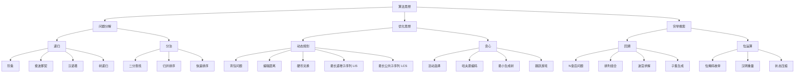

# AI时代下，程序员都应该是算法思想工程师

> AI 编程时代，AI写的代码又快又好。但面对具体业务场景，如果不能清晰地描述需求和定义边界，并从算法角度理解和建模问题，那么AI也无所适从。因此，在 AI 时代，程序员既需要深入理解业务和确定技术架构，更需要熟练掌握核心算法思想，并用算法思想来指导AI生成代码。
>
> 只有这样，才能真正利用 AI 工具进行创新，并解决实际问题。因此，在 AI 时代，程序员的价值并不会消失，而是逐渐从“编写代码”转向“理解问题、设计方案和指导 AI”。只有具备扎实的数据结构基础和算法思想，才能更有效地利用 AI 进行算法设计与问题求解，从而解决真实世界中的复杂问题。

---

## 目录

1. [算法与算法思想概述](#一算法与算法思想概述)
2. [算法要解决什么问题](#二算法要解决什么问题)
3. [算法思想有什么作用](#三算法思想有什么作用)
4. [算法思想的大全与学习指南](#四算法思想的大全与学习指南)
5. [常见算法分类及实战应用](#五常见算法分类及实战应用)
6. [AI时代下如何学习算法思想](#六ai时代下如何学习算法思想)
7. [利用算法思想指导AI编程实战](#七利用算法思想指导ai编程实战)

---

## 一、算法与算法思想概述

### 什么是算法？

**算法**是计算机解决问题的一步步的方法和步骤。它是一个确定的、有限的、有效的计算过程，包括：

- **输入**：问题的数据
- **输出**：问题的解
- **清晰的指令**：一系列确定的步骤

**工程师视角**：计算机程序=算法+数据结构，算法是代码的灵魂。同样的功能，不同算法的性能差异可能是数个数量级。

### 什么是算法思想？

**算法思想**是指解决问题的通用的、系统的方法和理念。它是：

- 对多个具体算法的**抽象和总结**
- 一种**思考问题、分析问题、设计算法的思维方式**
- 不依赖于特定编程语言的**通用方法论**

**关键区别**：

- **算法思想** ← 抽象、通用、可复用 ← **黑盒思维**
- **具体算法** ← 实现、特定、一次性 ← **白盒实现**

### 为什么程序员必须学算法思想？

#### 传统时代 vs AI时代

| 维度 | 传统编程时代 | AI编程时代 |
|------|-----------|---------|
| **代码来源** | 手写 | AI生成 |
| **算法实现** | 自己写 | AI写 |
| **核心能力** | 编码能力 | 设计能力 |
| **关键价值** | 实现算法 | 指导AI设计 |
| **学习重点** | 掌握语法和算法 | 理解思想和原理 |

#### AI时代程序员的职责转变

```
传统时代：需求 → 设计算法 → 手写代码 → 测试 → 上线
                    ↑自己写

AI时代：  需求 → 理解问题 → 指导AI → 验证算法 → 上线
                    ↑用思想指导AI

结论：从"如何编码"到"如何设计"的升级
```

### AI时代为什么还要学算法思想？

**核心理由：**

1. **指导AI生成正确算法** - AI需要清晰的设计指导，而不是模糊的需求
2. **验证AI生成代码** - 知道算法思想才能判断AI代码的正确性和最优性
3. **性能优化决策** - 在多个方案中选择最优方案，需要理解复杂度和权衡
4. **解决创新问题** - 没有现成案例的新问题，需要用基础思想创意组合
5. **理解系统底层** - 数据库索引、缓存策略、分布式算法都基于基础思想
6. **面试和职业发展** - 算法思想是工程师能力的核心指标，拥有良好的算法思想是职业需要

---

## 二、算法要解决什么问题？

### 问题分类

#### 1. **计算问题** - 求值问题
```
特点：给定输入，计算输出值
例子：
- 数学计算：阶乘、斐波那契数列、最大公约数
- 统计计算：平均值、标准差、相关系数
- 工程应用：利息计算、贷款摊销、财务预测
```

#### 2. **搜索问题** - 查找问题
```
特点：在数据集中找到符合条件的元素或位置
例子：
- 线性搜索：顺序查找
- 二分搜索：排序数组中的查找
- 工程应用：数据库查询、日志检索、倒排索引
```

#### 3. **排序问题** - 整序问题
```
特点：将数据按特定顺序排列
例子：
- 冒泡排序：适合小数据集
- 快速排序：通用高效排序
- 归并排序：稳定排序、外存排序
- 工程应用：数据库索引、缓存淘汰、队列优先级
```

#### 4. **优化问题** - 最优化问题
```
特点：在众多可能的解中找到最优解
例子：
- 背包问题：有限资源下的最大收益
- 旅行商问题：最短路径
- 资源分配：成本最小化
- 工程应用：任务调度、负载均衡、缓存策略
```

#### 5. **组合问题** - 枚举问题
```
特点：生成或枚举所有可能的组合或排列
例子：
- 全排列：所有可能的顺序
- 组合生成：从n个元素中选择k个
- 子集生成：所有的子集
- 工程应用：权限组合、配置生成、测试用例生成
```

#### 6. **图论问题** - 关系问题
```
特点：处理元素之间的关系和网络结构
例子：
- 最短路径：Dijkstra、Bellman-Ford
- 最小生成树：Prim、Kruskal
- 拓扑排序：DAG排序
- 工程应用：路由协议、社交网络、推荐系统、知识图谱
```

### 工程师常见的问题映射

| 实际问题 | 对应的算法问题类型 | 适用思想 |
|---------|-----------------|--------|
| 缓存淘汰策略 | 优化问题 | 动态规划、贪心 |
| 搜索引擎排序 | 排序 + 优化 | 多重排序、动态规划 |
| 负载均衡 | 优化问题 | 贪心、动态规划 |
| 权限树遍历 | 搜索问题 | 递归、回溯 |
| 数据库查询 | 搜索问题 | 二分查找、索引 |
| 推荐系统 | 优化问题 | 动态规划、贪心 |
| 分布式一致性 | 图论问题 | 最小生成树、拓扑排序 |

---

## 三、算法思想有什么作用？

### 对程序员的核心价值

#### 1. **快速问题识别与方案选择**
```
场景：接到一个新需求，如何快速设计方案？

算法思想的作用：
✓ 识别问题属于哪一类（搜索/优化/排序）
✓ 快速关联到对应的思想（贪心/DP/分治）
✓ 预估解决方案的复杂度
✓ 选择最优的设计方案

实例：
需求：设计一个LRU缓存
识别：这是一个优化问题（在有限空间内最大化命中率）
思想：贪心算法（每次淘汰最久未使用的）
实现：HashMap + DoublyLinkedList
```

#### 2. **代码性能优化**
```
案例：用户反馈系统慢

算法思想帮助：
❌ 原始方案：O(n²) 的嵌套查询
→ 分析：这是搜索问题，应该用二分查找
→ 优化：O(n log n) 的排序 + 二分查询

性能提升：1000万条数据，从几分钟到几秒
```

#### 3. **系统架构理解**
```
为什么理解算法思想很重要？

数据库索引 ← 二分查找的应用
缓存淘汰 ← 贪心算法
分布式共识 ← 图论和贪心
操作系统调度 ← 动态规划和贪心
编译器优化 ← 动态规划
网络协议 ← 图论和贪心

了解思想 = 理解系统内核
```

#### 4. **AI编程时代的核心竞争力**
```
AI生成代码的问题：
❌ 可能生成的不是最优算法
❌ 可能有逻辑漏洞
❌ 可能不适合你的具体场景

解决方案：
✓ 用算法思想指导AI："使用分治思想设计这个搜索功能"
✓ 用算法思想验证AI："这个方案的复杂度是多少？"
✓ 用算法思想优化AI："试试用动态规划优化这部分"

结论：AI时代，算法思想是程序员的"操纵杆"
```

#### 5. **职业发展的区分器**
```
初级工程师：能实现给定算法
中级工程师：能根据需求选择算法
高级工程师：能根据问题设计创新算法

所有阶段都需要算法思想，但层次不同。
```

#### 6. **面试和技术评估**
```
面试官关注的顺序：
1. 能否识别问题类型？（算法思想）
2. 选择的方案是否最优？（复杂度分析）
3. 实现代码是否正确？（编码能力）

结论：算法思想决定了60%的评分
```

#### 7. **建立通用的解题框架**
```
有了算法思想：
✓ 面对新问题有章可循
✓ 知道什么时候用什么方法
✓ 能够组合多个思想解决复杂问题
✓ 持续积累可复用的模式

这是从"学生思维"到"工程师思维"的升级
```

---

## 四、算法思想的大全与学习指南

### 算法思想全景图

<!--
```
算法思想
├── 问题分解
│   ├── 递归
│   │   ├── 阶乘
│   │   ├── 斐波那契
│   │   ├── 汉诺塔
│   │   └── 树递归
│   └── 分治
│       ├── 二分查找
│       ├── 归并排序
│       └── 快速排序
├── 优化思想
│   ├── 动态规划
│   │   ├── 背包问题
│   │   ├── 编辑距离
│   │   ├── 硬币兑换
│   │   ├── 最长递增子序列 LIS
│   │   └── 最长公共子序列 LCS
│   └── 贪心
│       ├── 活动选择
│       ├── 哈夫曼编码
│       ├── 最小生成树
│       └── 跳跃游戏
└── 穷举搜索
    ├── 回溯
    │   ├── N皇后问题
    │   ├── 排列组合
    │   ├── 迷宫求解
    │   └── 子集生成
    └── 位运算
        ├── 位掩码枚举
        ├── 汉明重量
        └── 状态压缩
```
-->



### 核心算法思想详解

#### **1. 递归 (Recursion) - 问题分解的基础**

**核心思想**：把大问题分解成相同的小问题，通过函数自身调用来解决

**三要素**：基本情况 + 递归关系 + 向基本情况发展

**典型特征**：
- 自相似性：大问题和小问题的结构完全相同
- 递归深度可控：要有明确的递推终止条件
- 调用栈可用：不能深度太大（栈溢出）

**适用场景**：
```
✓ 树和图的遍历（天然递归结构）
✓ 分治法的基础（很多分治都用递归实现）
✓ 动态规划的初始版本（记忆化递归）
✓ 回溯算法的核心（递归 + 回退）
```

**经典算法**：
- 阶乘、斐波那契数列
- 汉诺塔、树的遍历（DFS）
- 快速排序、归并排序

**工程应用**：
```python
class TreeNode:
    def __init__(self, id, name):
        self.id = id
        self.name = name
        self.children = []

def traverse_permission_tree(node, user_perms):
    """递归遍历权限树，收集用户权限"""
    if not node:
        return
    
    if node.id in user_perms:
        print(f"User has permission: {node.name}")
    
    # 递归遍历子节点
    for child in node.children:
        traverse_permission_tree(child, user_perms)

# 使用示例
root = TreeNode(1, "系统管理")
root.children = [
    TreeNode(2, "用户管理"),
    TreeNode(3, "数据管理")
]
user_permissions = {1, 2, 3}
traverse_permission_tree(root, user_permissions)
```

---

#### **2. 分治法 (Divide & Conquer) - 大问题的分解**

**核心思想**：分解问题 → 递归求解子问题 → 合并子问题的结果

**三个阶段**：
1. **Divide**：把问题分解成若干个规模较小的相同问题
2. **Conquer**：递归求解这些子问题
3. **Combine**：合并子问题的解成原问题的解

**适用条件**：
- 问题具有最优子结构（子问题的最优解 = 整体最优解的组成部分）
- 子问题相互独立（解决一个不影响另一个）
- 可以有效地合并结果

**典型复杂度**：O(n log n)

**经典算法**：
- 二分查找、三分查找
- 归并排序、快速排序
- 最大子数组问题（Maximum Subarray）
- 快速幂运算

**工程应用**：
```python
def merge(arr, left, mid, right):
    """合并两个已排序的数组"""
    left_part = arr[left:mid+1]
    right_part = arr[mid+1:right+1]
    
    i = j = 0
    k = left
    
    # 合并两个有序数组
    while i < len(left_part) and j < len(right_part):
        if left_part[i] <= right_part[j]:
            arr[k] = left_part[i]
            i += 1
        else:
            arr[k] = right_part[j]
            j += 1
        k += 1
    
    # 复制剩余元素
    while i < len(left_part):
        arr[k] = left_part[i]
        i += 1
        k += 1
    
    while j < len(right_part):
        arr[k] = right_part[j]
        j += 1
        k += 1

def merge_sort(arr, left, right):
    """分治法排序：分 → 治 → 合"""
    if left >= right:
        return
    
    # Divide：分解
    mid = (left + right) // 2
    merge_sort(arr, left, mid)        # 排序左半部分
    merge_sort(arr, mid + 1, right)   # 排序右半部分
    
    # Combine：合并
    merge(arr, left, mid, right)

# 使用示例
arr = [64, 34, 25, 12, 22, 11, 90]
merge_sort(arr, 0, len(arr) - 1)
print(f"排序结果: {arr}")
```

---

#### **3. 动态规划 (Dynamic Programming) - 优化递归**

**核心思想**：自底向上或自顶向下，用前面的计算结果来优化后面的计算

**本质**：以空间换时间，用记忆化消除重复计算

**必要条件**：
- **最优子结构**：大问题的最优解 = 子问题最优解的组合
- **重叠子问题**：不同的子问题有重复计算（否则分治就够了）

**两种实现方式**：
1. **自顶向下**（记忆化递归）：从大问题递归到小问题，用缓存存储
2. **自底向上**（递推表格）：从小问题开始，迭代计算到大问题

**典型复杂度**：从指数级O(2^n) 优化到多项式级O(n) 或 O(n²)

**经典算法**：
- 背包问题（0/1背包、完全背包、多重背包）
- 最长递增子序列（LIS）、最长公共子序列（LCS）
- 编辑距离（Edit Distance）
- 硬币兑换、爬楼梯

**工程应用**：
```python
class LRUCache:
    """LRU缓存实现 - 贪心算法应用"""
    
    def __init__(self, capacity):
        self.capacity = capacity
        self.cache = {}  # 哈希表存储键值对
        self.order = []  # 列表维护使用顺序
    
    def get(self, key):
        """获取缓存值，O(1)时间复杂度"""
        if key not in self.cache:
            return -1
        
        # 移动到末尾（标记为最近使用）
        self.order.remove(key)
        self.order.append(key)
        return self.cache[key]
    
    def put(self, key, value):
        """放入缓存值，O(1)时间复杂度"""
        if key in self.cache:
            # 更新现有值
            self.cache[key] = value
            # 移动到末尾
            self.order.remove(key)
            self.order.append(key)
        else:
            # 添加新值
            self.cache[key] = value
            self.order.append(key)
            
            # 贪心淘汰：移除最久未使用的
            if len(self.cache) > self.capacity:
                oldest = self.order.pop(0)
                del self.cache[oldest]

# 使用示例
lru = LRUCache(3)
lru.put(1, "A")
lru.put(2, "B")
lru.put(3, "C")
print(lru.get(2))  # 输出: B
lru.put(4, "D")    # 淘汰A
print(lru.get(1))  # 输出: -1 (已被淘汰)
```

---

#### **4. 贪心算法 (Greedy) - 局部最优的艺术**

**核心思想**：每一步都选择当前状态下的最优选择，期望得到全局最优解

**关键特征**：
- **贪心选择性**：全局最优解可以通过一系列局部最优的贪心选择得到
- **最优子结构**：某个问题的最优解包含其子问题的最优解
- **无后效性**：前面的选择不影响后面的决策

**适用与不适用**：
```
✓ 适用：有贪心选择性质的问题
  - 最小生成树
  - 哈夫曼编码
  - 活动选择问题

❌ 不适用：需要全局权衡的问题
  - 背包问题（需要DP）
  - TSP旅行商问题（需要更复杂的方法）
```

**经典算法**：
- 活动选择问题（Activity Selection）
- 哈夫曼编码（数据压缩）
- 最小生成树（Prim、Kruskal算法）
- 跳跃游戏（Jump Game）
- Dijkstra最短路径

**工程应用**：
```python
class Server:
    def __init__(self, id, current_load=0):
        self.id = id
        self.current_load = current_load

class LoadBalancer:
    def __init__(self, servers):
        self.servers = servers
    
    def assign_task(self, task_load):
        """贪心选择：选择负载最低的服务器"""
        best_server = min(self.servers, key=lambda s: s.current_load)
        best_server.current_load += task_load
        return best_server
    
    def balance_tasks(self, tasks):
        """为所有任务分配服务器"""
        assigned_servers = []
        for task in tasks:
            server = self.assign_task(task)
            assigned_servers.append(server)
        return assigned_servers

# 使用示例
servers = [Server(i, 0) for i in range(3)]
balancer = LoadBalancer(servers)
tasks = [5, 3, 8, 2, 7]

assigned = balancer.balance_tasks(tasks)
print(f"分配结果: {[s.id for s in assigned]}")
print(f"服务器负载: {[s.current_load for s in servers]}")
```

---

#### **5. 回溯算法 (Backtracking) - 穷举的艺术**

**核心思想**：尝试 → 探索 → 回退，系统地尝试所有可能性直到找到解

**本质**：带约束的深度优先搜索（DFS）

**关键步骤**：
1. 做出选择
2. 在这个选择上进行递归
3. 撤销选择（回退）
4. 尝试其他选择

**适用场景**：
```
✓ 求所有解的问题
✓ 约束满足问题（CSP）
✓ 组合问题（排列、组合、子集）
✓ 路径查找问题
✓ 游戏AI（象棋、围棋）
```

**经典算法**：
- N皇后问题
- 全排列、组合生成、子集生成
- 迷宫求解、岛屿问题
- 电话号码字母组合
- 单词搜索

**工程应用**：
```python
def generate_permission_combinations(permissions, target_count):
    """回溯生成权限组合"""
    results = []
    current_combo = []
    
    def backtrack(start):
        # 找到一个完整解
        if len(current_combo) == target_count:
            results.append(current_combo.copy())
            return
        
        # 尝试选择每个权限
        for i in range(start, len(permissions)):
            # 选择
            current_combo.append(permissions[i])
            # 递归
            backtrack(i + 1)
            # 回退
            current_combo.pop()
    
    backtrack(0)
    return results

# 使用示例
permissions = [1, 2, 3, 4, 5]  # 权限ID列表
combinations = generate_permission_combinations(permissions, 3)
print(f"生成的权限组合数量: {len(combinations)}")
print(f"前5个组合: {combinations[:5]}")
```

---

#### **6. 位运算 (Bit Manipulation) - 底层优化的秘密**

**核心思想**：利用二进制位操作进行高效计算和优化

**常见操作**：
```
& (AND)    ：与运算，取交集
| (OR)     ：或运算，取并集
^ (XOR)    ：异或运算，找不同
<< (左移)  ：乘以2的幂
>> (右移)  ：除以2的幂
~ (取反)   ：所有位反转
```

**性质和技巧**：
```
a ^ a = 0          # 相同数的XOR为0
a ^ 0 = a          # 与0的XOR为原值
a & (a-1) = 0      # 消除最后一个1
(a & -a)           # 提取最后一个1
n & 1              # 检查是否为奇数
```

**经典算法**：
- 检查2的幂次（Power of Two）
- 位计数（Count Bits/Population Count）
- 单独的数字（Single Number）
- 汉明距离（Hamming Distance）

**工程应用**：
```python
# 权限定义（用位表示）
READ = 1 << 0     # 001
WRITE = 1 << 1    # 010
EXECUTE = 1 << 2  # 100

class PermissionManager:
    def __init__(self):
        self.users = {}  # user_id -> permissions
    
    def grant_permission(self, user_id, perm):
        """授予权限 - 位OR操作"""
        if user_id not in self.users:
            self.users[user_id] = 0
        self.users[user_id] |= perm  # 位OR：添加权限位
    
    def revoke_permission(self, user_id, perm):
        """撤销权限 - 位AND操作"""
        if user_id in self.users:
            self.users[user_id] &= ~perm  # 位AND：移除权限位
    
    def has_permission(self, user_id, perm):
        """检查权限 - 位AND检查"""
        return (self.users.get(user_id, 0) & perm) != 0
    
    def has_all_permissions(self, user_id, perms):
        """检查权限集合"""
        return (self.users.get(user_id, 0) & perms) == perms

# 使用示例
pm = PermissionManager()
pm.grant_permission(1, READ | WRITE)  # 用户1获得读写权限
pm.grant_permission(1, EXECUTE)         # 用户1获得执行权限

print(f"用户1有读权限: {pm.has_permission(1, READ)}")      # True
print(f"用户1有写权限: {pm.has_permission(1, WRITE)}")      # True
print(f"用户1有执行权限: {pm.has_permission(1, EXECUTE)}")  # True
print(f"用户1有管理员权限: {pm.has_permission(1, READ | WRITE | EXECUTE)}")  # True

pm.revoke_permission(1, WRITE)  # 撤销写权限
print(f"撤销后用户1有写权限: {pm.has_permission(1, WRITE)}")  # False
```

### 学习路径与方法

#### 推荐学习顺序

```
第1层：基础认知
  1. 递归        ← 必须掌握函数调用栈
  2. 分治法      ← 递归的升级应用

第2层：优化思想
  3. 动态规划    ← 优化递归，引入记忆化
  4. 贪心算法    ← 不同的优化思路

第3层：高级应用
  5. 回溯算法    ← 穷举搜索，组合问题
  6. 位运算      ← 底层优化，性能升级
```

## 五、常见算法分类及实战应用

### 完整算法速查表

| # | 算法名称 | 所属思想 | 复杂度 | 应用领域 | 难度 | 工程实践 |
|---|---------|---------|--------|---------|------|--------|
| 1 | **阶乘** | 递归 | O(n) | 数学计算 | ⭐ | 基础 |
| 2 | **斐波那契** | 递归/DP | O(n) | 数列、递推 | ⭐ | 教学 |
| 3 | **汉诺塔** | 递归 | O(2^n) | 经典问题 | ⭐⭐ | 教学 |
| 4 | **树遍历** (DFS/BFS) | 递归/分治 | O(n) | 树图遍历 | ⭐⭐ | 高频 |
| 5 | **二分查找** | 分治 | O(log n) | 搜索 | ⭐ | 高频 |
| 6 | **归并排序** | 分治 | O(n log n) | 排序、外存 | ⭐⭐ | 中频 |
| 7 | **快速排序** | 分治/贪心 | O(n log n) | 排序 | ⭐⭐ | 高频 |
| 8 | **最大子数组** | 分治 | O(n log n) | 优化问题 | ⭐⭐ | 低频 |
| 9 | **背包问题** | 动态规划 | O(nw) | 资源分配 | ⭐⭐⭐ | 中频 |
| 10 | **编辑距离** | 动态规划 | O(mn) | 字符串比较 | ⭐⭐ | 中频 |
| 11 | **最长递增子序列** | 动态规划 | O(n log n) | 序列分析 | ⭐⭐ | 中频 |
| 12 | **硬币兑换** | 动态规划 | O(nk) | 组合优化 | ⭐⭐ | 低频 |
| 13 | **活动选择** | 贪心 | O(n log n) | 调度问题 | ⭐⭐ | 中频 |
| 14 | **哈夫曼编码** | 贪心 | O(n log n) | 数据压缩 | ⭐⭐⭐ | 低频 |
| 15 | **最小生成树** | 贪心/图论 | O(n²)/O(m log m) | 网络设计 | ⭐⭐⭐ | 中频 |
| 16 | **跳跃游戏** | 贪心 | O(n) | 游戏/优化 | ⭐⭐ | 中频 |
| 17 | **N皇后** | 回溯 | O(n!) | 约束满足 | ⭐⭐⭐ | 教学 |
| 18 | **全排列** | 回溯 | O(n!) | 组合问题 | ⭐⭐ | 中频 |
| 19 | **组合生成** | 回溯 | O(C(n,k)) | 组合问题 | ⭐⭐ | 中频 |
| 20 | **迷宫求解** | 回溯 | O(n*m) | 路径规划 | ⭐⭐ | 中频 |
| 21 | **子集生成** | 回溯 | O(2^n) | 枚举问题 | ⭐⭐ | 低频 |
| 22 | **2的幂检查** | 位运算 | O(1) | 优化计算 | ⭐ | 高频 |
| 23 | **位计数** | 位运算 | O(log n) | 计数问题 | ⭐⭐ | 中频 |
| 24 | **单独的数字** | 位运算 | O(n) | 查找问题 | ⭐⭐ | 中频 |

### 工程应用场景映射

#### **后端系统常见应用**

```
缓存系统
  ├─ LRU淘汰     ← 动态规划 + 贪心
  ├─ 热点检测    ← 堆、优先队列
  └─ 预热策略    ← 贪心、动态规划

数据库
  ├─ B树索引     ← 多路平衡搜索树
  ├─ 查询优化    ← 分治、动态规划
  ├─ 事务调度    ← 贪心、图论
  └─ 备份恢复    ← 位运算、堆

搜索引擎
  ├─ 倒排索引    ← 散列、树
  ├─ 排序        ← 多重排序、堆排
  ├─ 去重        ← 位集合、哈希
  └─ 相关性      ← 动态规划

推荐系统
  ├─ 召回        ← 相似度计算、贪心
  ├─ 排序        ← 动态规划、学习排序
  ├─ 多样性      ← 贪心、回溯
  └─ 实时性      ← 增量算法、堆
```

#### **前端开发应用**

```
性能优化
  ├─ 虚拟滚动    ← 二分查找定位
  ├─ 懒加载      ← 贪心加载
  ├─ 缓存策略    ← 位运算标记、LRU
  └─ 路由优化    ← 图论最短路

交互设计
  ├─ 排序/过滤   ← 各种排序算法
  ├─ 搜索建议    ← 前缀树、动态规划
  ├─ 表单验证    ← 回溯、正则
  └─ 动画        ← 贝塞尔曲线、分治

状态管理
  ├─ 撤销/重做   ← 栈、回溯
  ├─ 变更检测    ← 位运算、哈希
  └─ 选择器优化  ← 动态规划
```

#### **系统设计应用**

```
分布式系统
  ├─ 一致性哈希   ← 贪心、位运算
  ├─ 负载均衡     ← 贪心、堆
  ├─ 共识算法     ← 图论、贪心
  └─ 数据分片     ← 哈希、位运算

微服务架构
  ├─ 服务路由     ← 图论、动态规划
  ├─ 限流降级     ← 贪心、队列
  ├─ 服务发现     ← 搜索、图论
  └─ 链路追踪     ← 树遍历、位运算
```

---

## 六、AI时代下如何学习算法思想？

### 从"阅读和模仿"到"指导和验证"的转变

#### 传统学习方式的局限

```
❌ 传统方式：看书 → 看教程 → 看代码 → 手写代码 → 学会
   问题：
   - 耗时长（可能要花数周学一个算法）
   - 被动学习（照搬代码）
   - 容易遗忘（没有实际应用）
   - 难以创新（思维被固化）
```

#### AI时代的高效学习方式

```
✓ AI辅助方式：理解思想 → 指导AI → 验证结果 → 应用创新
  优势：
  - 快速验证（几秒生成代码）
  - 主动学习（指导而不是模仿）
  - 边用边学（实际项目中学习）
  - 易于创新（用思想组合解决新问题）
```

### AI学习的5个阶段

#### **第1阶段：理论理解（10%工作量，但最关键）**

用AI来加速理解算法思想本身：

```
Prompt示例：
"用白板视角解释分治算法，用递归排序的例子说明，
要求用图表表示执行流程，最后说明时间复杂度为什么是O(n log n)"

优势：
✓ AI解释更清晰
✓ 可以从多个角度理解
✓ 可以快速生成图表和示例
```

#### **第2阶段：代码生成（30%工作量）**

用AI根据你的设计指导生成代码：

```
Prompt示例：
"使用分治思想，设计一个函数来找数组中最大的子数组和。
要求：
1. 用分治思想而不是动态规划
2. 详细注释解释分治的三个步骤
3. 提供O(n)的最优实现对比"

关键：
✓ 清晰的需求描述（用算法思想描述）
✓ 明确的约束条件
✓ 验证标准（时间复杂度、边界情况）
```

#### **第3阶段：验证优化（30%工作量）**

用AI来验证和优化实现：

```
Prompt示例：
"这个背包问题的实现用的是什么思想？
时间空间复杂度各是多少？
如果要优化空间复杂度，应该怎么改进？"

关键：
✓ 能够看懂代码
✓ 能够判断是否符合预期
✓ 能够指出优化方向
```

#### **第4阶段：应用实践（20%工作量）**

用AI辅助应用到实际项目：

```
Prompt示例：
"我们的推荐系统需要从100个候选中挑选10个最相关的推荐。
目前用快速排序是O(n log n)，能不能用贪心算法优化到O(n)？
请用堆的贪心思想设计方案"

关键：
✓ 识别问题的算法本质
✓ 选择合适的思想
✓ 指导AI进行设计和优化
```

#### **第5阶段：创新设计（10%工作量，但最有价值）**

用多种思想组合解决新问题：

```
Prompt示例：
"设计一个系统，支持：
1. 快速查询（需要搜索算法）
2. 排序结果（需要排序算法）
3. 实时更新（需要增量算法）
4. 空间约束（需要优化）

用什么算法思想的组合来设计？"

关键：
✓ 理解多个思想
✓ 能够权衡和组合
✓ 能够指导创新设计
```

### AI时代的学习工具和方法

#### 1. **LLM作为算法导师**

```
最佳实践：
✓ 提供背景和约束
✓ 让AI给出多个方案
✓ 对比各方案的优缺点
✓ 选择最适合的方案
✓ 深入理解细节

示例对话流程：
你：  "我需要设计一个搜索功能，支持模糊匹配和排序"
AI：  "可以用：1)前缀树+排序，2)B树，3)倒排索引"
你：  "对比这三个方案"
AI：  "方案1查询快但内存多，方案2平衡，方案3最快最省内存"
你：  "用方案3，并给出实现和复杂度分析"
AI：  "倒排索引实现... 时间O(k log k)..."
```

#### 2. **代码生成+验证的闭环**

```
工作流程：
1. 定义问题（用算法思想）
   └─ "用动态规划解决这个背包问题"

2. 让AI生成代码
   └─ "生成详细注释的Python代码"

3. 自己分析和验证
   └─ 验证复杂度、边界情况、正确性

4. 提出改进需求
   └─ "能否优化空间复杂度？"

5. 迭代优化
   └─ 直到满足要求

这样的过程比直接手写快10倍，但理解深度不变
```

#### 3. **多语言学习**

AI时代的优势：不用学语言的细节，专注算法思想

```
伪代码 → 多个语言实现：
你只需要：
1. 用伪代码理解算法
2. 用自己擅长的语言实现一次
3. 让AI生成其他语言版本
4. 理解跨语言的思想通用性

节省时间：从 5个语言 × 10小时 = 50小时
优化到：     1个语言 × 10小时 + AI生成 = 15小时
```

---

## 七、利用算法思想指导AI编程实战

### 核心理念：Vibe Coding的本质

**Vibe Coding不是「甩锅给AI」，而是「用思想指导AI」**

```
❌ 错误理解：
   "写个搜索功能吧" → AI → 代码
   问题：可能不最优、不符合预期、无法优化

✓ 正确理解：
   "用二分查找设计搜索功能" → AI → 代码
   优势：方向明确、易于验证、便于优化
```

### 7个实战案例

#### **案例1：缓存系统设计（贪心 + 动态规划）**

**问题描述**：设计一个LRU缓存，支持快速读写和淘汰

**用算法思想指导AI**：

```c
# Prompt给AI的指导
prompt = """
设计一个LRU缓存实现，要求：

算法思想：
1. 缓存淘汰策略：贪心算法（每次淘汰最久未使用）
2. 快速访问：哈希表O(1)查找
3. 顺序维护：双向链表维护LRU顺序

实现要求：
- get(key): O(1)
- put(key, value): O(1)
- 支持容量限制
- 访问时要更新"最近使用"标记

请提供：
1. 完整的C实现
2. 时间空间复杂度分析
3. 测试用例
"""

// AI会生成的C实现（简化示意）:
// typedef struct { ... } LRUCache;  // 缓存结构
// 
// LRUCache* create_cache(int capacity) {
//     // 初始化：分配内存、设置容量
//     // O(1) 时间复杂度
// }
// 
// int get(LRUCache* cache, int key) {
//     if (key not in cache) return -1;  // 缓存未命中
//     // 更新最近使用（核心是贪心：每次使用都标记）
//     // 移动节点到链表末尾
//     return cache->values[key];  // O(1) 时间
// }
// 
// void put(LRUCache* cache, int key, int value) {
//     if (key in cache) {
//         update value;  // 更新值
//         move_to_end(cache, key);  // 标记为最近使用
//     } else {
//         create new node;  // 创建新节点
//         add to tail;  // 添加到链表末尾
//         cache->size++;
//         if (cache->size > cache->capacity) {
//             // 贪心淘汰：移除最久未使用的（链表头）
//             remove_head(cache);  // O(1) 摊销时间
//         }
//     }
// }
```

**你的职责**：
✓ 理解为什么用贪心而不是其他思想
✓ 验证实现是否正确
✓ 在实际项目中应用（Redis、内存缓存）

---

#### **案例2：搜索引擎排序（分治 + 动态规划）**

**问题描述**：设计搜索结果排序，考虑相关性、热度、时新性等多个因子

**用算法思想指导AI**：

```c
# Prompt思路
prompt = """
设计搜索结果排序算法，要求：

算法思想：
1. 相关性排序：分治思想，分别计算各维度得分再合并
2. 热度排序：贪心思想，选择热度最高的在前
3. 时新性：贪心思想，新的内容优先
4. 多维排序：动态规划处理维度间的权重平衡

核心是处理多个优化目标的权衡：
- 相关性 vs 热度 vs 时新性
- 用动态规划学习最优权重组合

实现要求：
1. 支持多个排序字段
2. 支持权重动态调整
3. 支持快速更新
4. 复杂度在O(n log n)以内

请提供：
1. 排序函数
2. 权重学习模型
3. 性能优化建议
"""

```c
// 搜索结果排序（伪代码）
// 思想：分治 + 动态规划 + 贪心
void sort_search_results(SearchResult* results, int count, double* weights, Model* model) {
    // 分治：分别计算各维度得分
    for (int i = 0; i < count; i++) {
        results[i].relevance_score = calculate_relevance(results[i]);  // 计算相关性得分
        results[i].popularity_score = get_popularity(results[i]);      // 获取热度得分
        results[i].freshness_score = calculate_freshness(results[i]);  // 计算时新性得分
    }

    // 动态规划：用学习模型调整权重
    double* optimal_weights = model_predict(model, weights, results, count);  // 学习最优权重

    // 贪心：用最优权重排序
    // 计算综合得分 = w1*相关性 + w2*热度 + w3*时新性
    for (int i = 0; i < count; i++) {
        results[i].final_score = optimal_weights[0] * results[i].relevance_score +  // 相关性权重
                                 optimal_weights[1] * results[i].popularity_score +  // 热度权重
                                 optimal_weights[2] * results[i].freshness_score;    // 时新性权重
    }
    
    // 按综合得分从高到低排序
    qsort(results, count, sizeof(SearchResult), compare_by_final_score);  // 排序
}
```

**你的职责**：
✓ 理解为什么用这三个思想的组合
✓ 在实际搜索系统中调试权重
✓ 监控和优化排序效果

---

#### **案例3：负载均衡（贪心 + 图论）**

**问题描述**：设计一个负载均衡器，均匀分配任务到多个服务器

**用算法思想指导AI**：

```c
# Prompt思路
prompt = """
设计负载均衡算法，要求：

算法思想：
1. 贪心思想：每次选择当前负载最低的服务器
2. 图论思想：建模为最小成本路由问题
3. 状态维护：用优先队列维护服务器负载排序

实现要求：
1. assign(task) -> server: O(log n)
2. 支持动态添加/移除服务器
3. 支持不同的负载度量（CPU、内存、连接数）
4. 支持会话亲和性（同一用户总是分到同一服务器）

请提供：
1. 基础的轮询实现
2. 加权轮询实现
3. 最少连接实现（贪心）
4. 一致性哈希实现（处理服务器变化）
"""

// 核心实现（贪心）
// 使用最小堆维护服务器负载，实现O(log n)的快速分配
typedef struct {
    Server** servers;
    int server_count;
    // 注：简化实现，实际使用优先队列
} LoadBalancerHeap;

LoadBalancerHeap* create_load_balancer_heap(Server** servers, int count) {
    LoadBalancerHeap* lb = (LoadBalancerHeap*)malloc(sizeof(LoadBalancerHeap));
    lb->servers = servers;  // 存储服务器列表
    lb->server_count = count;  // 记录服务器数量
    // 初始化堆（省略堆化过程）
    return lb;
}

// 分配任务：贪心选择负载最低的服务器
Server* assign_task_heap(LoadBalancerHeap* lb, int task) {
    int best_idx = 0;  // 记录最优服务器索引
    
    // 找到负载最低的服务器
    for (int i = 1; i < lb->server_count; i++) {
        if (lb->servers[i]->current_load < lb->servers[best_idx]->current_load) {
            best_idx = i;  // 更新最优服务器
        }
    }
    
    lb->servers[best_idx]->current_load += task;  // 分配任务，增加负载
    // 更新堆（将该服务器的负载上升，重新堆化）
    return lb->servers[best_idx];  // 返回选中的服务器
}

// 移除任务
void remove_task_heap(LoadBalancerHeap* lb, Server* server, int task) {
    server->current_load -= task;  // 减少服务器负载
    // 重建堆（可优化为延迟更新以提高性能）
    // heapify(lb); // 实际需要调用堆化函数
}
```

**你的职责**：
✓ 理解贪心策略的局限性（局部最优）
✓ 在实际系统中验证效果
✓ 根据指标调整贪心策略

---

#### **案例4：推荐系统（回溯 + 动态规划）**

**问题描述**：从候选池中选择推荐项目，考虑相关性和多样性

**用算法思想指导AI**：

```c
# Prompt思路
prompt = """
设计推荐系统的召回和排序，要求：

算法思想：
1. 多路召回：分治思想，分别从协同过滤、内容推荐等多路获取候选
2. 多样性优化：贪心思想，逐步选择最优且不相似的项目
3. 排序优化：动态规划思想，学习最优的相关性权重
4. 实时性：增量算法，快速响应用户行为

核心问题：相关性 vs 多样性的权衡

实现要求：
1. 召回速度 < 100ms
2. 排序速度 < 50ms
3. 支持个性化权重
4. 支持A/B测试

请提供完整的推荐链路
"""

```c
// 推荐系统（伪代码）
// 思想：分治 + 贪心 + 动态规划

#define MAX_CANDIDATES 100
#define MAX_SELECTED 10

typedef struct {
    int item_id;
    double score;
} Item;

// 推荐函数：从候选池选择最优项目
void recommend(int user_id, Item* candidates, int cand_count, 
               Item* selected, int* selected_count, int target_count) {
    
    // 多路召回（分治：分别从协同过滤、内容推荐等获取候选）
    Item* cf_candidates = collaborative_filtering(user_id, 30);          // 协同过滤召回
    Item* content_candidates = content_based(user_id, 30);              // 内容推荐召回
    Item* trending_candidates = trending_items(20);                      // 趋势项目
    // candidates = cf_candidates + content_candidates + trending_candidates
    
    // 去重和基础排序
    int merged_count = merge_and_deduplicate(cf_candidates, content_candidates, 
                                            trending_candidates, candidates);  // 合并并去重
    
    // 多样性优化（贪心：选最优且不相似的项目）
    *selected_count = 0;
    for (int i = 0; i < target_count && i < merged_count; i++) {
        // 贪心：选择综合得分最高的项目（相关性 - 多样性惩罚）
        int best_idx = 0;
        double best_score = score(candidates[0], user_id) - 
                           diversity_penalty(candidates[0], selected, *selected_count);
        
        for (int j = 1; j < merged_count; j++) {
            double curr_score = score(candidates[j], user_id) - 
                               diversity_penalty(candidates[j], selected, *selected_count);
            if (curr_score > best_score) {  // 比较综合得分
                best_score = curr_score;    // 更新最高得分
                best_idx = j;               // 更新最优项目索引
            }
        }
        
        selected[*selected_count] = candidates[best_idx];  // 选中该项目
        (*selected_count)++;                               // 增加选中计数
        // 从候选集中移除该项目
        remove_item(candidates, &merged_count, best_idx);  // 移除已选项目
    }
}
```

**你的职责**：
✓ 理解多路召回的必要性
✓ 调整相关性和多样性的权衡
✓ 监控推荐效果（点击率、转化率）

---

#### **案例5：数据库查询优化（分治 + 动态规划）**

**问题描述**：优化复杂SQL查询，选择最优的执行计划

**用算法思想指导AI**：

```c
# Prompt思路
prompt = """
设计数据库查询优化器，要求：

算法思想：
1. 分治思想：将复杂查询分解为多个子查询
2. 动态规划思想：在所有可能的执行计划中找最优的

SELECT * FROM users u
JOIN orders o ON u.id = o.user_id
JOIN products p ON o.product_id = p.id
WHERE u.country = 'CN' AND o.total > 100
ORDER BY o.created_at DESC

可能的执行计划：
1. users -> orders -> products（先用国家过滤用户）
2. orders -> users -> products（先用金额过滤订单）
3. products -> orders -> users（不太可能是最优）

动态规划：评估每个计划的成本（IO + CPU）

实现要求：
1. 支持多表JOIN优化
2. 支持索引选择优化
3. 支持谓词下推优化
4. 估算执行成本

请提供：
1. 执行计划生成器
2. 成本评估函数
3. 最优计划选择算法
"""
```

**你的职责**：
✓ 理解查询优化的复杂性
✓ 分析慢查询的执行计划
✓ 根据数据量调整优化策略

---

#### **案例6：权限系统（回溯 + 位运算）**

**问题描述**：设计灵活的权限管理系统

**用算法思想指导AI**：

```c
# Prompt思路
prompt = """
设计权限系统，要求：

算法思想：
1. 权限树遍历：递归思想，递归遍历权限树
2. 权限组合：回溯思想，生成所有可能的权限组合
3. 权限检查：位运算思想，用位标志快速检查

数据结构：
- 权限树：user -> role -> permission
- 位标志：READ=1, WRITE=2, DELETE=4, ADMIN=8

实现要求：
1. 支持权限继承
2. 支持角色组合
3. 快速权限检查 O(1)
4. 支持权限淘汰缓存

请提供：
1. 权限树遍历
2. 权限位操作
3. 权限缓存策略
"""

// C实现示意：
typedef struct {
    int user_id;
    int* role_ids;  // role_id数组
    int role_count;  // 角色数量
    int perm_bits;   // 缓存的权限位
    int cache_valid; // 缓存是否有效
} UserRoles;

typedef struct {
    UserRoles* users;
    int user_count;
    int* role_perms;  // role_id -> permission_bits 映射
    int role_count;
} PermissionSystem;

// 授予角色
void grant_role(PermissionSystem* sys, int user_id, int role_id) {
    for (int i = 0; i < sys->user_count; i++) {
        if (sys->users[i].user_id == user_id) {
            // 添加角色到用户角色列表
            sys->users[i].role_ids[sys->users[i].role_count++] = role_id;
            sys->users[i].cache_valid = 0;  // 清除缓存标记
            return;
        }
    }
}

// 获取权限位
int get_permissions(PermissionSystem* sys, int user_id) {
    for (int i = 0; i < sys->user_count; i++) {
        if (sys->users[i].user_id == user_id) {
            // 缓存：检查是否已计算
            if (sys->users[i].cache_valid) {
                return sys->users[i].perm_bits;  // 返回缓存值
            }
            
            // 递归收集所有权限（递归思想）
            int perms = 0;
            for (int j = 0; j < sys->users[i].role_count; j++) {
                int role_id = sys->users[i].role_ids[j];
                perms |= sys->role_perms[role_id];  // 位OR合并权限
            }
            
            // 缓存计算结果
            sys->users[i].perm_bits = perms;     // 存储权限位
            sys->users[i].cache_valid = 1;       // 标记缓存有效
            return perms;
        }
    }
    return 0;
}

// 快速权限检查（O(1)）
int has_permission(PermissionSystem* sys, int user_id, int perm) {
    int user_perms = get_permissions(sys, user_id);  // 获取用户权限
    return (user_perms & perm) != 0;  // 位AND检查权限
}
```

**你的职责**：
✓ 理解位运算的高效性
✓ 设计权限树结构
✓ 管理权限缓存的更新

---

#### **案例7：实时数据处理（流算法 + 动态规划）**

**问题描述**：处理实时数据流，计算滑动窗口内的统计信息

**用算法思想指导AI**：

```c
# Prompt思路
prompt = """
设计流处理系统，计算滑动窗口统计，要求：

算法思想：
1. 流算法：处理无限数据流，空间有限
2. 动态规划：维护窗口内的增量信息
3. 分治思想：分别处理加入和移除操作

问题：给定数据流，计算最近1小时内的统计
- 最大值
- 最小值
- 平均值
- P99分位数

约束：
- 不能存储所有数据
- 需要O(log n)查询时间
- 内存开销要控制

实现要求：
1. 支持O(1)添加元素
2. 支持O(log n)查询统计
3. 自动清理过期数据
4. 支持多个时间窗口

请提供：
1. 数据结构设计
2. 增量更新算法
3. 查询算法
"""

# 实现
from collections import deque
import heapq

class SlidingWindowStats:
    def __init__(self, window_size):
        self.window = deque()  # 存储(timestamp, value)
        self.window_size = window_size
        self.sum = 0
        self.min_heap = []  # 最小堆（用于第K小）
        self.max_heap = []  # 最大堆（用于第K大）

    def add(self, value, timestamp):
        # 移除过期元素
        while self.window and self.window[0][0] < timestamp - self.window_size:
            _, old_val = self.window.popleft()
            self.sum -= old_val

        # 添加新元素
        self.window.append((timestamp, value))
        self.sum += value
        heapq.heappush(self.min_heap, value)
        heapq.heappush(self.max_heap, -value)

    def get_stats(self):
        return {
            'sum': self.sum,
            'avg': self.sum / len(self.window) if self.window else 0,
            'max': -self.max_heap[0] if self.max_heap else None,
            'min': self.min_heap[0] if self.min_heap else None,
            'count': len(self.window)
        }
```

**你的职责**：
✓ 理解流算法的约束
✓ 选择合适的数据结构
✓ 优化性能和内存

---

### Vibe Coding的黄金法则

#### **Rule 1: 用思想而不是需求来指导AI**

```
❌ 弱：
Prompt: "给我一个搜索函数"

✓ 强：
Prompt: "用二分查找设计一个搜索函数，
         支持O(log n)查询，
         要求处理不存在的情况"
```

#### **Rule 2: 验证AI的结果**

```
生成代码后的检查清单：
□ 时间复杂度是否符合预期？
□ 空间复杂度是否可接受？
□ 边界情况是否处理完整？
□ 是否用了算法思想描述的方法？
□ 是否有更优的方案？
```

#### **Rule 3: 理解权衡，而不是盲目求最优**

```
没有完美的算法，只有权衡：
- 时间 vs 空间
- 复杂度 vs 可维护性
- 最优 vs 足够好
- 通用 vs 特化

你的职责：根据具体场景做出正确的权衡
```

#### **Rule 4: 保持对AI代码的怀疑**

```
AI可能出错的地方：
□ 复杂度分析错误
□ 边界情况遗漏
□ 逻辑漏洞（看不出来的bug）
□ 性能瓶颈（代码正确但慢）
□ 不符合业务逻辑

永远要自己验证关键代码
```

#### **Rule 5: 用小问题积累大智慧**

```
学习循环：
1. 用一个小问题测试某个算法思想
2. 让AI生成代码 + 解释
3. 自己分析验证
4. 迁移到大问题中
5. 重复

这样可以快速建立对思想的深度理解
```

---

## 总结与实战路线

### 核心要点回顾

```
为什么学算法思想？
1. AI时代的核心竞争力 ← 指导AI的能力
2. 系统设计的基础 ← 理解系统内核
3. 性能优化的关键 ← 选择最优方案
4. 职业发展的区分器 ← 能力的体现

怎么学算法思想？
1. 理论理解 ← 用AI加速
2. 代码实现 ← 用AI生成 + 自己验证
3. 实战应用 ← 用思想指导AI
4. 创新设计 ← 组合思想解决新问题

何时用算法思想？
1. 系统设计时 ← 选择合适的思想
2. 性能优化时 ← 找到更优的思想
3. 问题遇到瓶颈时 ← 考虑是否用错思想
4. 指导AI设计时 ← 清晰表达你的想法
```

## 参考资源

### 推荐书籍
- 《算法导论》- 深度理论
- 《编程珠玑》- 实战角度
- 《算法设计手册》- 问题导向

### 在线资源
- LeetCode - 算法题库
- Algorithm Visualizer - 可视化学习
- Coding Game - 趣味学习

### AI工具
- ChatGPT - 解释和生成代码
- Claude - 深度分析
- GitHub Copilot - IDE集成

---

**记住：AI时代，算法思想比算法实现更重要。掌握思想，让AI为你服务。**

